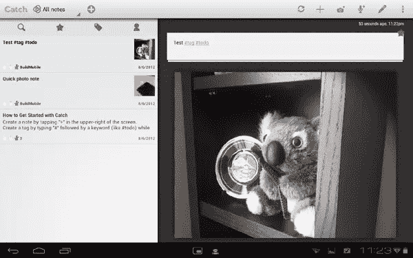
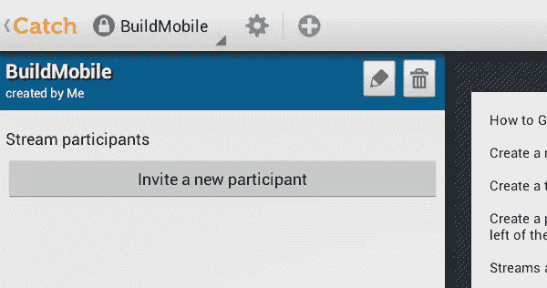

# Android 的捕捉笔记帮助你捕捉你的想法

> 原文：<https://www.sitepoint.com/catch-notes-notepad-for-android-helps-you-captures-your-ideas/>

我想再读的那本书的书名是什么？我在火车上想到的那个绝妙的博文想法是什么？我发现的买新微波炉的好东西在哪里？我们都有一些需要记住的小想法和小信息，但我们经常努力寻找一种好的方法来记住它们。

“老学校”的方法是随身携带一个便笺簿和一支笔，在需要时记下笔记，但我们现在生活在数字时代。谷歌 Android 平台上有很多记事本应用程序，其中一个是 Catch Notes，它可以与你在 Catch 上的在线账户同步。在某些方面，它并没有完全重新发明轮子，但它确实提供了一些功能，可能比许多其他笔记应用程序更适合您。

### 从不错过一个想法

这是一个熟悉的概念。捕捉笔记是一个数字记事本。每当你有什么想要记住的事情，你只需打开应用程序，写下一个笔记。笔记保存在本地，但像其他一些类似的应用程序(如 Evernote)一样，它也保存在云中，以便在其他地方访问网络。这包括通过您计算机上基于网络的界面，以及通过您的其他移动设备。

笔记本身可以被认为是独立的页面，但它们不仅限于文本。你还可以在每张便条上附上语音信息和图像，这在比较购物等任务中尤其方便。有时候，说点什么或者拍张照片比花时间写下来更容易——尤其是在键盘有限的智能手机上。此外，您可以在任何便笺上附加多个图像和语音记录。

正如您在上面的屏幕截图中看到的，Catch Notes 可以在兼容设备的双窗格布局中工作，允许您同时查看笔记列表以及单个笔记中的信息。在这种情况下，我用一张照片和一段简短的文字描述做了一个样本笔记。您还会注意到，有一个为笔记“加星”的选项，突出显示它以便以后发现。

### 组织的流和内嵌标记

当然，有一长串杂乱无章的笔记可能比什么笔记都没有更糟糕。你需要一种方法来管理它们，而捕捉笔记也是如此。

首先，有一种东西叫做“流”。在许多方面，你可以把这些“流”看作你笔记的类别。所以，你可以建立一个叫做“购物清单”的流和另一个叫做“工作项目”的流这真的取决于你，当然，你可以创建一大堆流来更好地对你要做的笔记进行分类。

“捕捉笔记”也使用标签。如果你在 Twitter 上，那么你会对这个系统感到非常舒服，因为它的工作方式和标签完全一样。你不用在文章上附加标签，而是用“#”符号内联。如果我们使用上面的“购物清单”流的例子，您可以使用#杂货、#衣服和#技术的内嵌标签。所以，你可能有一张纸条，上面写着，“两磅史密斯奶奶苹果#杂货。”

当你点击这些标签中的任何一个，就会显示出包含该标签的所有商品。再说一次，这在很多方面感觉就像 Twitter，除了它与你的私人笔记有关。您也可以按时间顺序和优先级进行过滤。为了进一步保护您的隐私，还可以添加一个四位数的密码来增加安全性。

### 共享空间协作

你的笔记大多是个人的东西，起到提醒的作用，但是如果你想和你的朋友、同事和家人分享这些笔记呢？“接住音符”也是如此。

默认情况下，您的每个“流”都被设置为私有，这样只有您可以查看和编辑保存在其中的项目。然而，您也可以邀请“流程参与者”在该流程上进行协作。这仍然是安全的，只有那些被邀请的人才能参与流。例如，你可以和你的另一半分享你的购物清单，这样你们就不会都去买那两磅苹果了。例如，你也可以和同事分享一个项目流，这样你们就可以一起研究你自己即将推出的 Android 应用程序的细节。

### 一款高级笔记应用

当谈到记事本应用程序时，你有大量的选择。其中一些就像只存在你手机上的数字便利贴一样简单。其他人可能允许一些手指涂鸦或图像附件。就功能而言，Catch Notes 可能是更强大的产品之一。

用户界面在很大程度上取决于个人偏好，一些人已经非常喜欢 Evernote 这样的环境，所以做出改变可能并不理想。由于 Catch 不是一家知名的公司，你可能不会对它的网络存储有太多的信心，但你可以在线和离线查看你的笔记，这很好。我也喜欢受 Twitter 启发的内嵌标签。

考虑到 Catch Notes 通过谷歌 Play 商店是免费的，尝试一下也没什么损失。您可以在没有 Catch 帐户的情况下使用它，但是您无法获得同步功能。或者，您可以创建一个 Catch 帐户，或者将其连接到您的谷歌或脸书。如果您愿意，还可以升级到 Catch Pro(最多 10 个空间，最多 1GB 的每月上传和 PDF/Office 附件支持)和 Catch Premier(最多 50 个空间和 5GB 的每月新内容)。Catch is [也适用于 iPhone 和 iPad](http://itunes.apple.com/us/app/catch-notes/id355424047?mt=8) ，面向所有观众。

## 分享这篇文章