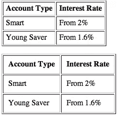

# 单元格填充(HTML 属性)

> 原文：<https://www.sitepoint.com/cellpadding-html-attribute/>

### 描述

使用 cellpadding 属性在表格单元格的内容周围创建一些空间(在`th`和`td`元素中)。这个属性的应用效果不会很明显，除非您也为表设置了一个`border`属性，如图 1 所示。

cellpadding 属性类似于`cellspacing`属性，用于在表格单元格之间和之外创建空间。



两个表格，单元格填充值分别为 5 和 10 个像素

### 例子

此`table`的`cellpadding`被设置为`"5"`像素:

```
<table border="1" *cellpadding="5"*>
  <tr>
    <th>Account Type</th>
    <th>Interest Rate</th>
  </tr>
  <tr>
    <td>Smart</td>
    <td>From 2%</td>
  </tr>
  <tr>
    <td>Young Saver</td>
    <td>From 1.6%</td>
  </tr>
</table>
```

### 价值

该属性采用一个数值，它反映了像素度量。

## 分享这篇文章