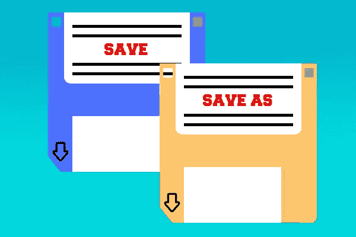
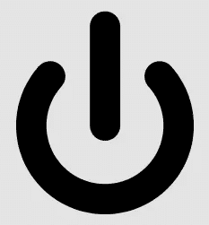
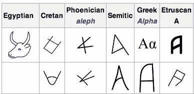

# 挑战:软盘和“保存”图标

> 原文：<https://www.sitepoint.com/challenge-redesigning-save-icon/>

*亲爱的软盘，*

我不知道你是否注意到了，但有些人希望你离开。有些人仍然爱着你和其他人，你还没有造成问题，所以仍然欢迎你不时地过来。

老实说，我不知道几年后你会怎么样。我想没有人知道，但如果这是我们最后几次谈话的其中一次，我只想说谢谢你一次又一次地救了我。

*永远感恩，*

*A .用户*

上面的信可能听起来有点戏剧性，但几年来，软盘图标因被用于封装“保存文件”的想法而受到抨击。

这是多年来的一个讨论点，我们再次讨论它，希望我们的读者可以对这个问题提供一些见解甚至建议。

虽然我没有发起拯救软盘的运动，但我肯定也不会抓起最近的干草叉和火炬在上面行进。

## 软盘假设

核心假设似乎是，那些出生在 21 世纪的人没有使用软盘的实际经验，因此无法从使用软盘的图标上解读任何含义。

虽然这确实有些道理——我们知道 iTunes 出于类似的原因不再使用 CD 图标——但我并不认为 90 后没有聪明到意识到软盘意味着“保存文件”。

## 软盘的图像

图标本身通常是一个简单的蓝色 3.5 软盘设计。对于大多数看到图标的人来说，他们很容易知道这是“保存”或“另存为”的符号。

不管你喜不喜欢，记住软盘图标是图标是有用的，图标——不管逻辑如何——在它们最初的意义消退后通常可以持续很长时间。

但是让我们明确一点:我并不是说因为软盘是标志性的，它就不能被改变。事情变了。这是不可避免的，但在你着手改变事情之前，我们必须从更大的角度看待事情，而不仅仅是一代人的问题。

保存…文件？号码

目前似乎没有任何不言而喻的解决软盘困境的办法。一些人已经尝试了新的解决方案，但是到目前为止，没有一个方案的意义明显更清晰。

## 让我们来唱反调吧

现在你可能会问自己:“如果需要解释，图标有什么用？”。图标的目的肯定是将含义编码到图形中吗？

答案是，是的，理想情况下这是一个目标，但这并不总是可能的。

### 问:这是什么意思？

如果你在笔记本电脑、电脑显示器或手机上阅读这篇文章，你可能几乎不需要移动眼睛就能看到这个图标。Xboxes。硬盘录像机。它在科技领域无处不在。

我们都明白这意味着什么，但如何理解呢？

很难完全从符号中得出它的意思:[顶部被一条线](http://en.wikipedia.org/wiki/Power_symbol "Wikipedia: The power icon")打断的圆。事实上，你 ***可以*** 争辩说，一个完整的圆圈*应该*表示‘开’——就像完成电路一样——而一个断开的圆圈应该表示‘关’——或者断开电路。

但事实并非如此。我们都知道它的意思是“开”，因为它是一个符号，我们都知道并且都同意它的意思。

也许对于 90 后的人来说，软盘也是如此。

我们现代字母 A 的古代祖先。

让我们深入一点，谈谈字母表。

每一个现代字母都是以不同于我们习惯的形状开始的。字母“A”就是一个很好的例子。

历史告诉我们，腓尼基字母表的第一个字母是“aleph”。Aleph 是我们已知的字母“A”的最早祖先之一，被认为是基于一个腓尼基牛头象形图。

大概有一段时间‘腓尼基牛’的知识有助于解释 aleph，但这并没有使‘A’在今天变得不那么有用。

## 软盘图标会比“保存文件”的概念更长久吗？

也许有一种观点认为“保存文件”图标的时代正在结束。你不会在 Gmail 用户界面上看到软盘图标，因为谷歌已经放弃了手动保存文件的想法。

在 Git、源代码控制和自动备份的时代，你可能会认为手动保存离散的、独立的文件的想法正在消失。

也许你的孙子会问你“爷爷，在过去你真的必须保存你自己的文件吗？”

## 挑战#1

那么是时候告别软盘图标了吗？

是时候让你这个读者站出来迎接这个设计挑战了。我们感兴趣的是你会如何图形处理这个问题。向我们展示你最好的设计，甚至是一对可以替代软驱图标的夫妇。

你的设计可以是软盘的重新组合/简化，或者是完全新的东西。给我们惊喜。我们很想知道你要做什么。

也让我们知道你是否爱，恨或与软盘保持目前的漠不关心。

## 分享这篇文章