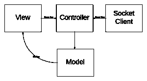

# 一个使用 Socket 的聊天应用。超正析象管(Image Orthicon)

> 原文：<https://www.sitepoint.com/chat-application-using-socket-io/>

在本文中，我们将使用 [Socket 构建一个简单的聊天应用程序。IO](http://socket.io) 和 [Backbone.js](http://backbonejs.org) 。插座。IO 的目标是那些想要开始开发高度交互式、实时 web 应用程序的开发人员，比如聊天系统或多人游戏。Backbone.js 将把 structucture 添加到我们的客户端代码中，使管理和分离应用程序中的问题变得容易。

读者应该熟悉 [Node.js](http://nodejs.org/) 和 [Express](http://expressjs.com/) 。熟悉 Backbone 以及用于基本模板的[下划线. js](http://underscorejs.org/) 更佳。

## 介绍

下图展示了我们的客户端代码的结构。中间是控制器，它充当套接字客户机和视图之间的桥梁。控制器从套接字客户端获取更新，并更改模型。使用主干绑定将更新反映在视图中。



## 客户端

我们将从查看客户端代码开始。所有聊天互动都在`HomeView`中处理。让我们从定义`/public/js/models/main.js`中的`HomeModel`开始。

```
var HomeModel = Backbone.Model.extend({
  defaults: {
    // Backbone collection for users
    onlineUsers: new UserCollection(),

    // Backbone collection for user chats, initialized with a predefined chat model
    userChats: new ChatCollection([
      new ChatModel({sender: '', message: 'Chat Server v.1'})
    ])
  },

  // method for adding a new user to onlineUsers collection
  addUser: function(username) {
    this.get('onlineUsers').add(new UserModel({name: username}));
  },

  // method for removing a user from onlineUsers collection
  removeUser: function(username) {
    var onlineUsers = this.get('onlineUsers');
    var u = onlineUsers.find(function(item) {
          return item.get('name') == username;
        });

    if (u) {
      onlineUsers.remove(u);
    }
  },

  // method for adding new chat to userChats collection
  addChat: function(chat) {
    this.get('userChats').add(new ChatModel({sender: chat.sender, message: chat.message}));
  },
});
```

我们使用主干集合来监听集合上的变化。我们的视图会自动反映集合的更新。

接下来，我们在`/public/index.html`中定义我们的 home 模板。

```
<script type="text/template" id="home-template">
  <div class="row">
    <div class="col-md-10">
      <div class="panel panel-default">
        <div class="panel-heading">Lobby</div>
        <div class="panel-body">
          <div class="nano">
            <div class="content">
              <div class="list-group" id="chatList"></div>
            </div>
          </div>
          <form>
            <input class="form-control" type="text" id="chatInput"></input>
          </form>
        </div>
      </div>
    </div>
    <div class="col-md-2">
      <div class="panel panel-default">
        <div class="panel-heading">
          <h3 class="panel-title">Online Users <span class="badge pull-right" id="userCount"></span></h3>
        </div>
        <div class="panel-body">
          <div class="nano">
            <div class="content">
              <div class="list-group" id="userList"></div>
            </div>
          </div>
        </div>
      </div>
    </div>
  </div>
</script>
```

`HomeView`位于`/public/js/views/main.js`内。文件比较长，所以留给读者自己去探索。

### 聊天客户端

接下来，让我们定义我们的套接字。IO 聊天客户端。它通过向服务器发送消息和监听通知来与服务器通信。这些通知触发事件总线上的事件，以便与控制器通信。以下代码在`/public/js/socketclient.js`中。

```
var ChatClient = function(options) {
  // redefine this to avoid conflicts
  var self = this;

  // app event bus
  self.vent = options.vent;

  // server hostname replace with your server's hostname eg: http://localhost
  self.hostname = 'http://chatfree.herokuapp.com';

  // connects to the server
  self.connect = function() {
    // connect to the host
    self.socket = io.connect(self.hostname);

    // set responseListeners on the socket
    self.setResponseListeners(self.socket);
  }

  // send login message
  self.login = function(name) {
    self.socket.emit('login', name);
  }

  // send chat message
  self.chat = function(chat) {
    self.socket.emit('chat', chat);
  }

  self.setResponseListeners = function(socket) {
    // handle messages from the server
    socket.on('welcome', function(data) {
      // request server info
      socket.emit('onlineUsers');

      self.vent.trigger('loginDone', data);
    });

    socket.on('loginNameExists', function(data) {
      self.vent.trigger('loginNameExists', data);
    });

    socket.on('loginNameBad', function(data) {
      self.vent.trigger('loginNameBad', data);
    });

    socket.on('onlineUsers', function(data) {
      console.log(data);
      self.vent.trigger('usersInfo', data);
    });

    socket.on('userJoined', function(data) {
      self.vent.trigger('userJoined', data);
    });

    socket.on('userLeft', function(data) {
      self.vent.trigger('userLeft', data);
    });

    socket.on('chat', function(data) {
      self.vent.trigger('chatReceived', data);
    });
  }
}
```

插座。IO 确实使得在客户机和服务器之间发送/接收消息变得很容易。这里，我们使用两种方法:

*   `socket.emit(message, [callback])`–用于向服务器发送消息。
*   `socket.on(message, callback)`–用于接收来自服务器的消息。接收时调用`callback`。

下图显示了我们的聊天协议:


### 主控制器

对于客户端的最后一部分，我们有控制器，在视图、模型和套接字客户端之间进行编排。将此放入`/public/js/main.js`

```
var MainController = function() {
  var self = this;

  // Event Bus for socket client
  self.appEventBus = _.extend({}, Backbone.Events);
  // Event Bus for Backbone Views
  self.viewEventBus = _.extend({}, Backbone.Events);

  // initialize function
  self.init = function() {
    // create a chat client and connect
    self.chatClient = new ChatClient({vent: self.appEventBus});
    self.chatClient.connect();

    // create our views, place login view inside container first.
    self.loginModel = new LoginModel();
    self.containerModel = new ContainerModel({
      viewState: new LoginView({
        vent: self.viewEventBus,
        model: self.loginModel
      })
    });
    self.containerView = new ContainerView({model: self.containerModel});
    self.containerView.render();
  };

  // View Event Bus Message Handlers
  self.viewEventBus.on('login', function(name) {
    // socketio login
    self.chatClient.login(name);
  });

  self.viewEventBus.on('chat', function(chat) {
    // socketio chat
    self.chatClient.chat(chat);
  });

  // Socket Client Event Bus Message Handlers

  // triggered when login success
  self.appEventBus.on('loginDone', function() {
    self.homeModel = new HomeModel();
    self.homeView  = new HomeView({vent: self.viewEventBus, model: self.homeModel});

    // set viewstate to homeview
    self.containerModel.set('viewState', self.homeView);
  });

  // triggered when login error due to bad name
  self.appEventBus.on('loginNameBad', function(name) {
    self.loginModel.set('error', 'Invalid Name');
  });

  // triggered when login error due to already existing name
  self.appEventBus.on('loginNameExists', function(name) {
    self.loginModel.set('error', 'Name already exists');
  });

  // triggered when client requests users info
  // responds with an array of online users.
  self.appEventBus.on('usersInfo', function(data) {
    var onlineUsers = self.homeModel.get('onlineUsers');
    var users = _.map(data, function(item) {
      return new UserModel({name: item});
    });

    onlineUsers.reset(users);
  });

  // triggered when a client joins the server
  self.appEventBus.on('userJoined', function(username) {
    self.homeModel.addUser(username);
    self.homeModel.addChat({sender: '', message: username + ' joined room.'});
  });

  // triggered when a client leaves the server
  self.appEventBus.on('userLeft', function(username) {
    self.homeModel.removeUser(username);
    self.homeModel.addChat({sender: '', message: username + ' left room.'});
  });

  // triggered when chat receieved
  self.appEventBus.on('chatReceived', function(chat) {
    self.homeModel.addChat(chat);
  });
}
```

为了引导一切，我们简单地创建了一个`MainController`并在`/public/js/main.js`中调用它的`init`方法:

```
$(document).ready(function() {
  var mainController = new MainController();

  mainController.init();
});
```

客户端到此为止。如果你遇到任何错误，Chrome 有优秀的调试工具。使用它的“网络”选项卡来查看消息是否真的交换了。

## 服务器端

接下来，我们将转向在 Node.js、Express 和 Socket.IO 中实现的服务器端。

```
// requirements
var express = require('express');
var http = require('http');
var socketio = require('socket.io');
var path = require('path');

// routes
var routes = require('../routes/index.js');

var app = express();

// routes middleware
app.use(app.router);
// serve public folder
app.use(express.static(path.join(__dirname, '../public')));

// serve index.html for every path 
app.use(routes.index);

// this is how you use socket io with express
var server = http.createServer(app);
var io = socketio.listen(server);

var port = process.env.PORT || 8080;

server.listen(port, function() {
  console.log(' - listening on ' + port+ ' ' + __dirname);
});

// require our chatserver
var ChatServer = require('./chatserver');

// initialize a new chat server.
new ChatServer({io: io}).init();
```

### 聊天服务器

我们应用程序的最后一部分是聊天服务器。它负责保存在线用户列表，并广播聊天消息。我们的服务器将在新的客户机连接上接收的第一个事件被恰当地命名为`connection`。`connection`事件处理程序，沿着刚刚建立的`socket`传递。`socket`处理以下事件:

*   `socket.on(message, callback)`–`callback`在收到新消息时被调用。`message`可以是任何类型的数据，具体取决于发送的内容。
*   `socket.on('disconnect', callback)`–`callback`在套接字断开连接时被调用。
*   `socket.emit(message, args)`–通过插座发送`message`。
*   `socket.broadcast.send(message, args)`–向除发送方之外的所有套接字广播`message`。

现在我们已经看到了如何处理套接字，让我们在`/scripts/chatserver.js`中定义一个用户模型:

```
// User Model
var User = function(args) {
  var self = this;

  // Socket field
  self.socket = args.socket;
  // username field
  self.user = args.user;
}
```

最后，我们的聊天服务器进入`/scripts/chatserver.js`:

```
var Server = function(options) {
  var self = this;

  self.io = options.io;

  // users array
  self.users = [];

  // initialize function
  self.init = function() {
    // Fired upon a connection
    self.io.on('connection', function(socket) {
      self.handleConnection(socket);
    });
  }

  // socket handler for an incoming socket
  self.handleConnection = function(socket) {
    // wait for a login message
    socket.on('login', function(username) {
      var nameBad = !username || username.length < 3 || username.length > 10;

      // check for badname
      if (nameBad) {
        socket.emit('loginNameBad', username);
        return;
      }

      var nameExists = _.some(self.users, function(item) {
        return item.user == username;
      });

      // check for already existing name
      if (nameExists) {
        socket.emit('loginNameExists', username);
      } else {
        // create a new user model
        var newUser = new User({ user: username, socket: socket });
        // push to users array
        self.users.push(newUser);
        // set response listeners for the new user
        self.setResponseListeners(newUser);
        // send welcome message to user
        socket.emit('welcome');
        // send user joined message to all users
        self.io.sockets.emit('userJoined', newUser.user);
      }
    });
  }

  // method to set response listeners
  self.setResponseListeners = function(user) {
    // triggered when a socket disconnects
    user.socket.on('disconnect', function() {
      // remove the user and send user left message to all sockets
      self.users.splice(self.users.indexOf(user), 1);
      self.io.sockets.emit('userLeft', user.user);
    });
    // triggered when socket requests online users
    user.socket.on('onlineUsers', function() {
      var users = _.map(self.users, function(item) {
        return item.user;
      });

      user.socket.emit('onlineUsers', users);
    });

    // triggered when socket send a chat message
    user.socket.on('chat', function(chat) {
      if (chat) {
        self.io.sockets.emit('chat', { sender: user.user, message: chat });
      }
    });
  }
}
```

## 结论

我们已经看到了如何使用 Backbone 和 Socket.IO 构建一个简单的聊天应用程序。本文中没有涉及的 IO 特性，比如房间和名称空间。插座。IO 使得在客户机和服务器之间交换消息变得非常容易。我们在服务器端通过 Socket 使用了 Node.js。IO 有许多其他平台的库。有关更多信息和资源，请查看 [Socket。IO wiki](https://github.com/learnboost/socket.io/wiki) 。

你可以在 [GitHub](http://github.com/eguneys/chat-socketio) 上找到这篇文章的源代码。在 [Heroku](http://chatfree.herokuapp.com) 上也有现场演示。

## 分享这篇文章