# 如何选择正确的图标

> 原文：<https://www.sitepoint.com/choose-right-icons/>

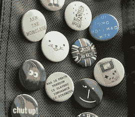

照片:[【滑移 JC】](http://www.flickr.com/photos/slipstreamjc/1018308309/)

图标对于网页设计来说并不新鲜，但这并不意味着选择合适的图标是一件容易的事情。

就像其他任何涉及到你的网站的事情一样，需要仔细的思考来决定每个组件的用途和需求。虽然用装饰图标点缀你的页面可能会给你的网站一种独特的感觉，但这很少是最明智的选择。

在今天的文章中，我们将看看选择图标集时需要记住的一些提示，然后我们将浏览一些我当前最喜欢的列表。

### 普遍的象征和形状

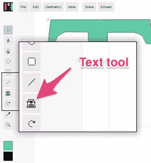

Mondrian.io 使用打字机图标来表示文本工具

首先，也是最重要的，你的图标需要容易被立即识别。不要试图变得太聪明。

有时，人们很容易被一组特别漂亮的图标所吸引——尽管事实上可用的图标可能并不适合你想要传达的信息。

其他时候，在你的图标选择上尝试特别新颖或者聪明是很有诱惑力的。为什么不把提交按钮做成火箭呢？

经验法则:如果你不得不考虑选择，你很可能做了一个糟糕的决定。

Mondrian.io 是一个原始的、开源的、基于浏览器的矢量应用程序，看起来很有前途——但我认为它很好地说明了这种图标选择的困境。

蒙德里安的当前版本使用打字机图标来表示文本工具(见图表)。

乍一看，这似乎不是一个不合理的选择。毕竟打字机 ***是*** 现实世界的文字工具吧？

然而，问问你自己:

*   你知道有多少人真正拥有一台打字机？
*   普通的小学生能认出一个吗？
*   除了电影，你最后一次看电影是什么时候？

30 年来，打字机一直是写作、技术和现代办公室的象征，但它对我们来说已经逐渐失去了意义，而且这种情况每天都在继续。

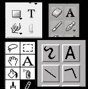

Fireworks、
MacPaint、Freehand 和 Photoshop 中的文本工具图标

幸运的是，图形应用程序使用大写字母“T”或“A”作为文本工具图标已经有很长的历史了——可以追溯到最早的 80 年代的图形用户界面。从使用 MS Word 的秘书，到使用 Autocad 的建筑师，再到高端 3d 建模师，每个人都理解这个想法。

简而言之:如果你得到了一个“免费搭乘”既定想法的机会，不要骄傲地拒绝。

就像糟糕的颜色决策一样，糟糕的图标会毁掉你的网站。但是请注意，有些图标在不同的上下文中可能有不止一种含义。

如果你不确定你的选择，不要害怕测试它:向朋友和家人寻求反馈，如果所有其他方法都失败了，包括文字来告诉访问者他们看到了什么。

记住，图标的唯一目的是通过它的意象来传达它的意思。

### 选择尺寸和位置

当你选择图标插入你的项目时，图标的大小是一个重要的因素。通常在网页设计中，你会希望通过调整网页元素的大小来建立一个视觉层次，从最大到最小，以使可读性更好。

对于标识和标题，这有助于创造平衡与和谐。

然而，对于你的图标来说，保持与你的尺寸一致是很重要的，这样才不会让你的页面看起来杂乱无章。

总体规模也是一个重要的决策。太大的图标会让你的页面拥挤不堪，干扰阅读流程，而太小的图标则难以解读。用户测试你的规模，找到一个可行的中间地带。

最终，这将确保观看者的眼睛从一个元素流到另一个元素，而不必停顿。适当的尺寸选择可以防止眼睛疲劳，并提高浏览者理解每个图标的速度。

### 颜色和稠度

作为设计师，我们都很清楚颜色有多重要。

颜色通常用来唤起情感，你的图标也是如此。如果你的图标需要引起紧迫感或激发行动，那么确保你的颜色支持这项任务。

还要记住，图标的用途与插图或图表截然不同——它们是交流的“视觉速记”,而不是指导性的图像或装饰性的修饰。

这意味着无论是细节还是色彩的准确性都不是你优先考虑的。

认真思考一下你需要多少种颜色来实现你的目标——或者，你是否真的需要颜色。一个好的图标是一个视觉笔记，而不是一幅画。

所以，现在我们已经看了如何选择你的图标，这里有十个我最喜欢的(和免费的)图标集供你下载。

### 50 个字形图标

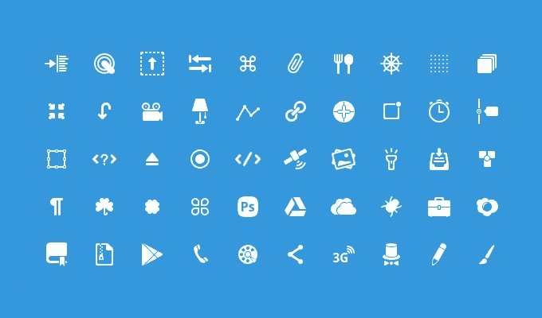

http://365psd.com/day/4-188/

### Metro UI 图标集

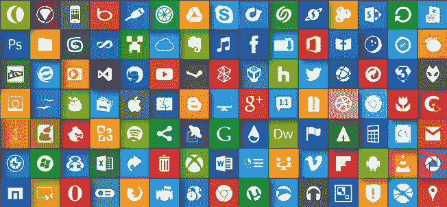

[http://dakirby 309 . deviantart . com/art/Metro-UI-Icon-Set-725-Icons-280724102](http://dakirby309.deviantart.com/art/Metro-UI-Icon-Set-725-Icons-280724102)

### 扁平红色图标

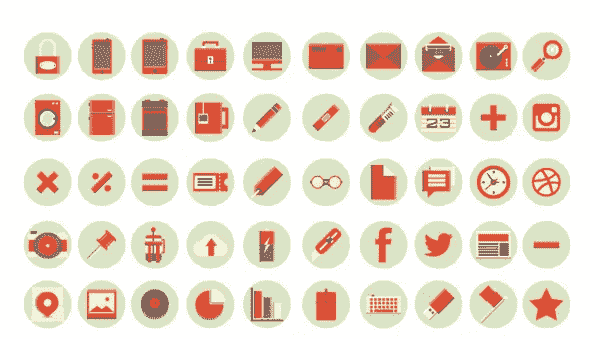

http://kemal-sanli.com/download/

### 108 个单声道图标

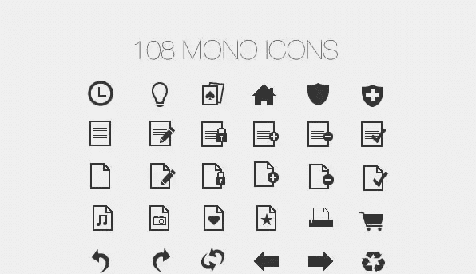

[http://www . tutorial 9 . net/downloads/108-mono-icons-huge-set-of-minimal-icons/](http://www.tutorial9.net/downloads/108-mono-icons-huge-set-of-minimal-icons/)

### 胜利迷你

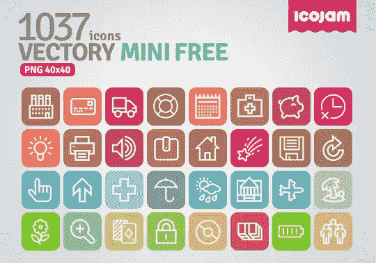

[http://www.icojam.com/blog/?p=589](http://www.icojam.com/blog/?p=589)

### 社交网站

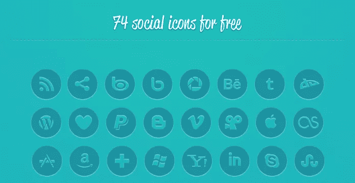

[http://fontfabric.com/social-media-icons-pack/](http://fontfabric.com/social-media-icons-pack/)

### 单色社交图标字体

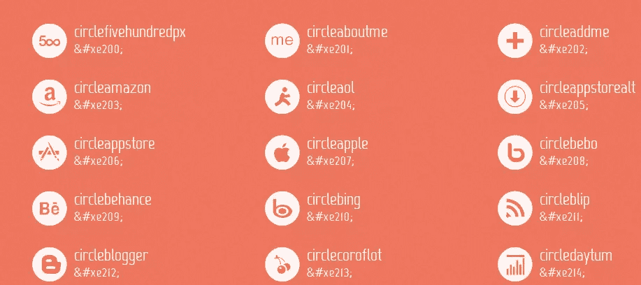

[http://drinchev.github.io/monosocialiconsfont/](http://drinchev.github.io/monosocialiconsfont/)

### 矩形图标

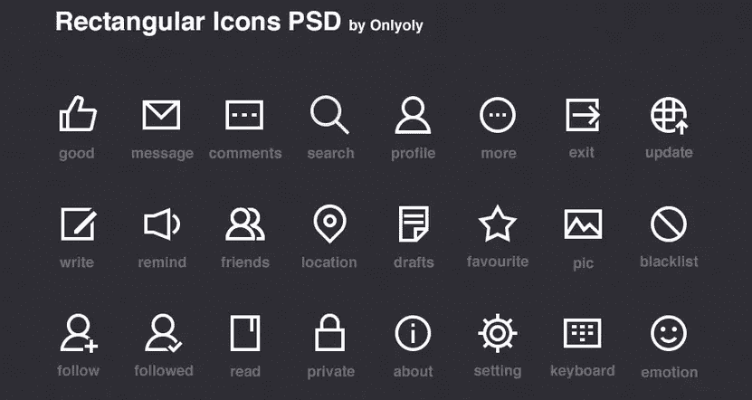

[http://dribbble . com/shots/1169454-rectangle-Icons-PSD/attachments/152774](http://dribbble.com/shots/1169454-Rectangular-Icons-PSD/attachments/152774)

### 柔弱的人

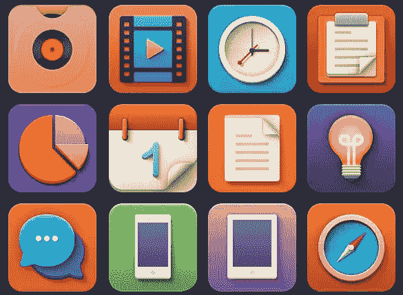

[http://www . elegantt themes . com/blog/freebie-of-the-week/colorful-playful-softies-icons](http://www.elegantthemes.com/blog/freebie-of-the-week/colorful-playful-softies-icons)

### 60 个搜索引擎优化服务图标

[http://simpleicon.com/set/60-seo-services-icons/](http://simpleicon.com/set/60-seo-services-icons/)

## 分享这篇文章