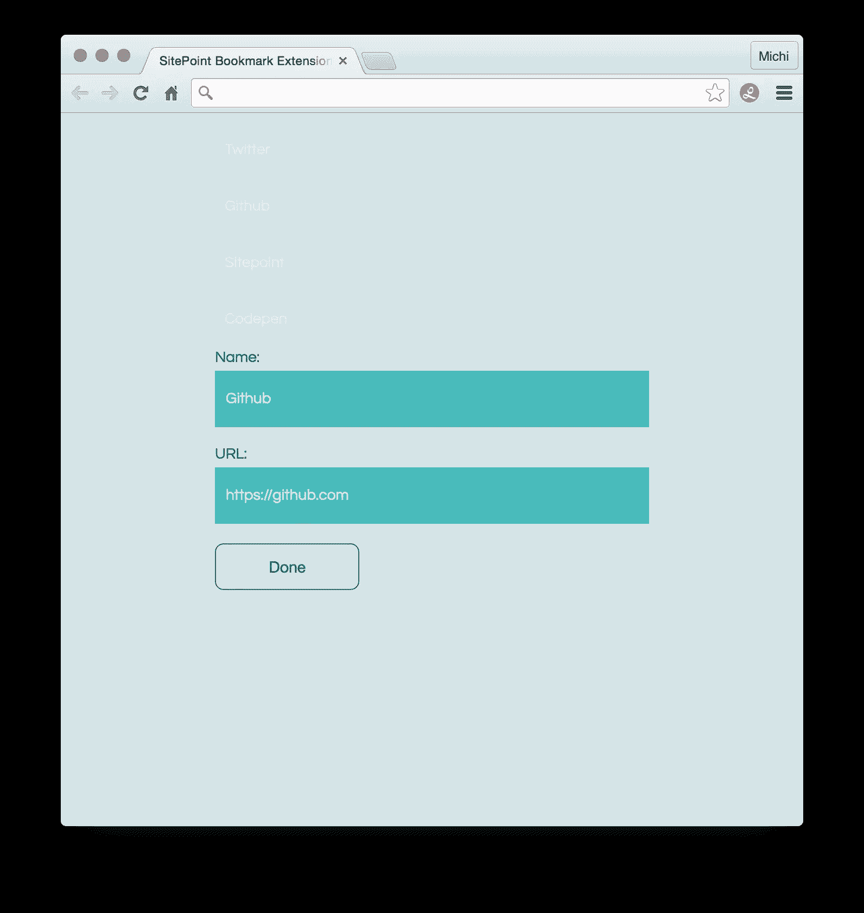
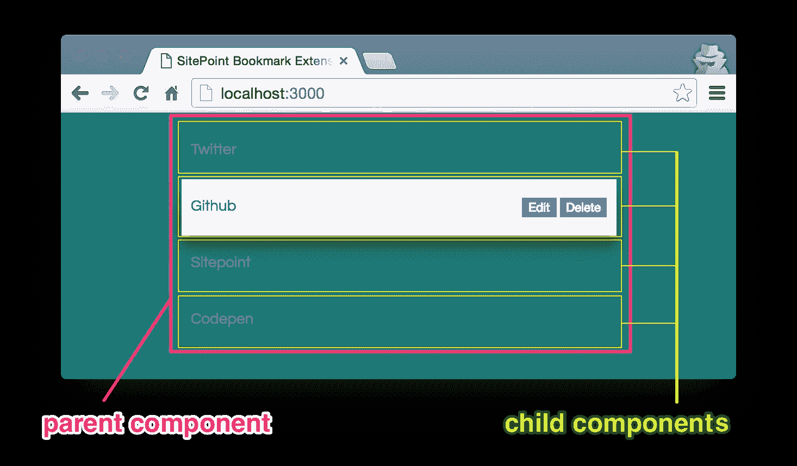
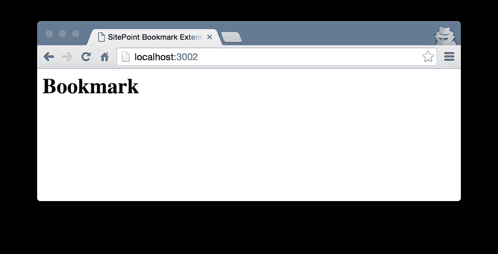
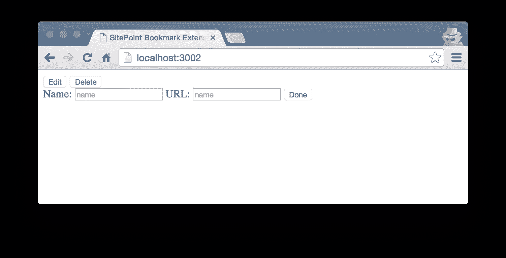
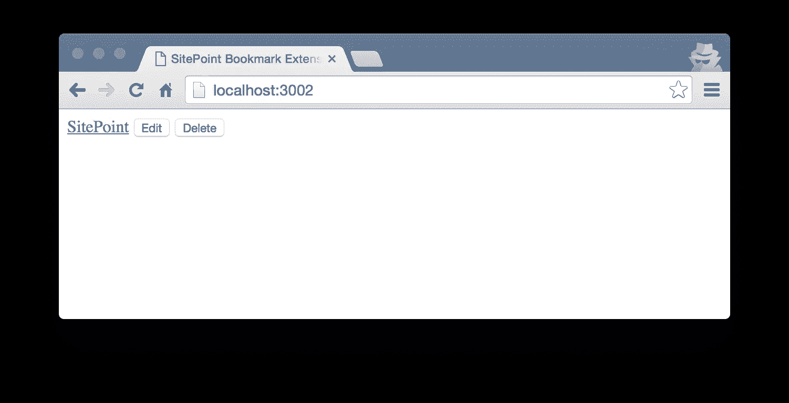
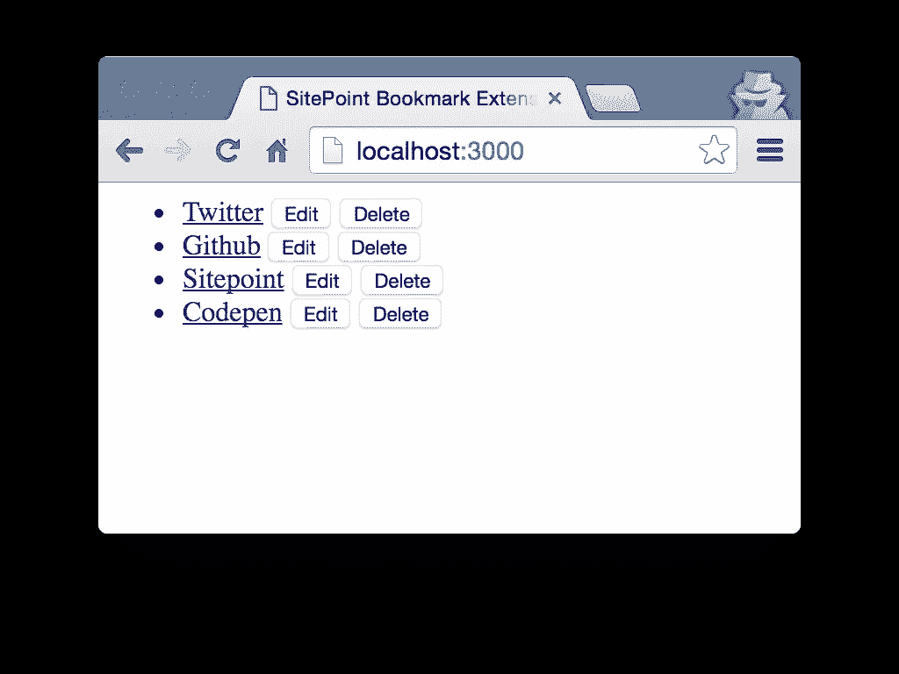

# 使用 Angular 2 & TypeScript 构建自己的 Chrome 扩展

> 原文：<https://www.sitepoint.com/chrome-extension-angular-2/>

*本文由[丹王子](https://www.sitepoint.com/author/dprince)同行评审。感谢 SitePoint 的所有同行评审员使 SitePoint 的内容尽可能做到最好！*

Chrome 扩展是小型网络应用程序，为谷歌 Chrome 浏览器增加了一些功能。他们可以扩展和定制浏览器行为、开发者工具或新标签页。扩展可以从 Chrome 网上商店下载。

在本教程中，我们将创建一个 Chrome 扩展，让我们保存网站的 URL，并在每个新标签页上显示它们。当然，也有原生的 Chrome 书签，但我们希望将书签直接集成到新标签的页面中，并控制它们的视觉外观。

你可以在 GitHub 库[这里](https://github.com/sitepoint-editors/sitepoint_projectcode_chrome-extension-angular-typescript/tree/master/Project_Files)找到完整的项目代码，也可以随意安装一个[运行版本的扩展](https://chrome.google.com/webstore/detail/lisht/ecdnbioigfhkjnaimnokimcbibenolbp)(多了几个特性)。

## 我们正在建造的东西

让我们先简单概述一下我们想要开发的内容。屏幕截图显示，我们将创建一个由不同数量的书签项目组成的列表。书签是单击时打开相应 URL 的链接。


每个书签都需要两条信息:标题和 URL。将有一个选项来编辑这些信息，另一个删除书签。要编辑书签，我们需要一个有两个输入字段和一个提交按钮的表单。



为了处理用户输入和呈现列表，我们将使用 Angular 2 和 [TypeScript](http://www.typescriptlang.org/) 。Angular 2 非常适合构建客户端应用程序，它与 TypeScript(一种类型化的 JavaScript 超集)配合得很好。如果你想从 Angular 2 和 TypeScript 的介绍开始，我推荐[这篇文章](https://www.sitepoint.com/getting-started-with-angular-2-using-typescript/)。

遵循本教程，您只需要一个文本编辑器和节点包管理器(npm)。然而，发布一个扩展需要一个 Google 开发者账户，可以在这里创建[。](https://chrome.google.com/webstore/developer/dashboard)

## 设置和结构

是时候使用实际的应用程序了，所以让我们创建一个新的项目文件夹:

```
mkdir sitepoint-extension && cd sitepoint-extension 
```

### 类型脚本配置

接下来，我们将向项目文件夹添加一个`tsconfig.json`文件。这个文件指示 TypeScript 编译器如何编译我们的`.ts`文件。

```
{
  "compilerOptions": {
    "target": "ES5",
    "module": "system",
    "moduleResolution": "node",
    "sourceMap": true,
    "emitDecoratorMetadata": true,
    "experimentalDecorators": true,
    "removeComments": false,
    "noImplicitAny": false
  },
  "exclude": [
    "node_modules"
  ]
} 
```

重要的设置是`compilerOptions`。在这里，我们指定 ECMAScript 目标版本应该是`ES5`，模块代码生成应该使用 SystemJS ( `"module": "system"`)。

用`"sourceMap": true`将生成源地图文件。这些`.map`文件非常适合调试，因为有了它们，浏览器可以将编译好的 ES5 代码映射到 TypeScript 代码上。

对于本教程，我们不需要了解更多关于`tsconfig.json`文件的知识。完整的文档可以在这里找到[。](http://www.typescriptlang.org/docs/handbook/tsconfig.json.html)

### Package.json

我们使用 npm 来安装我们需要的包，使用 npm 脚本来创建一些开发和构建任务。为此，我们在主目录中添加了一个`package.json`。

Angular 2 目前处于测试阶段。对于本教程，我使用的是 beta 7 版本。当然，你可以使用一个新版本，但是我不能保证一切都能顺利运行，因为框架可能仍然会改变。

```
{
  "name": "SitePointBookmarkExtension",
  "description": "A Chrome Extension for Bookmarks",
  "version": "1.0.0",
  "scripts": {
    "lite": "lite-server",
    "tsc": "tsc",
    "tsc:w": "tsc -w",
    "start": "concurrently \"npm run tsc:w\" \"npm run lite\""
  },
  "dependencies": {
    "angular2": "2.0.0-beta.7",
    "systemjs": "0.19.22",
    "es6-promise": "^3.0.2",
    "es6-shim": "^0.33.3",
    "reflect-metadata": "0.1.2",
    "rxjs": "5.0.0-beta.2",
    "zone.js": "0.5.15"
  },
  "devDependencies": {
    "concurrently": "^2.0.0",
    "lite-server": "^2.1.0",
    "typescript": "^1.7.5"
  }
} 
```

现在让我们用

```
npm install 
```

注意，这里包含了一些可以用`npm run [script name]`执行的准备好的 npm 脚本。目前，有四个脚本可以帮助我们编译 TypeScript 文件并创建一个开发服务器。

### Manifest.json

在我们创建应用程序之前，我们需要添加另一个`.json`文件，即`manifest.json`。这个文件对于每个 Chrome 扩展都是必需的，因为它指定了关于网络商店和浏览器应该如何处理扩展的信息。

我们稍后将完成该文件，但现在让我们只添加必需的和推荐的属性:

```
{
    "manifest_version": 2,
    "name": "SitePoint Bookmark Extension",
    "short_name": "Make the most of a new tab",
    "description": "This extension helps you save your favorite webpages.",
    "version": "1.0.0",
    "author": "Michaela Lehr @fischaelameer"
} 
```

## 书签组件

Angular 2 是一个基于组件的框架，我们的第一个组件是一个书签。该组件稍后将成为子组件，因为我们将创建一个父列表组件来包含书签。



让我们创建一个新文件夹`scripts`，并在其中创建一个名为`bookmark.component.ts`的文件。

```
// To create a component, we need Angular's "Component" function.
// It can be imported from the "angular2/core" module.
import { Component } from 'angular2/core';

// A component decorator tells Angular that the "BookmarkComponent" class
// is a component and adds its meta data: the selector and the template.
@Component({
    selector: 'sp-bookmark',
    template: '<h1>Bookmark</h1>'
})

// The "BookmarkComponent" module exports the "BookmarkComponent" class,
// because we will need it in other modules,
// e.g. to create the bookmark list.
export class BookmarkComponent { } 
```

为了引导`BookmarkComponent`组件，我们必须添加另一个文件，我们称之为`boot.ts`:

```
// We need to reference a type definition (or 'typings') file 
// to let TypeScript recognize the Angular "promise" function
// (we'll need this later on) otherwise we'll get compile errors.
/// <reference path="../node_modules/angular2/typings/browser.d.ts" />

// Angular's "bootstrap" function can be imported 
// from the angular2/platform/browser module.
// Since we want to bootstrap the "BookmarkComponent",
// we have to import it, too.
import { bootstrap }    from 'angular2/platform/browser'
import { BookmarkComponent } from './bookmark.component'

// We can now bootstrap the "BookmarkComponent" as the root component.
bootstrap( BookmarkComponent ); 
```

另一个新文件`system.config.js`配置 SystemJS 模块加载器。它将加载我们刚刚创建的`boot.ts`文件。

```
// SystemJS is the module loader for the application. 
// It loads the libraries and our modules and then catches and logs errors, 
// that may occur during the app launch.
System.config({
  packages: {
    scripts: {
      format: 'register',
      defaultExtension: 'js'
    }
  }
});
System.import('scripts/boot')
  .then(null, console.error.bind(console)); 
```

在我们可以在浏览器中看到任何东西之前，我们最不需要的是一个`index.html`文件。我们将文件放在项目目录的根目录下，与`.json`文件在同一层。

```
<html>
  <head>

    <title>SitePoint Bookmark Extension</title>
    <meta name="viewport" content="width=device-width, initial-scale=1">

    <!-- We load the libraries we need directly from the "node_modules" folder.
    In a more complex project, we would use a different approach here, 
    e.g. working with a build tool like gulp.js or Angular-CLI. -->
    <script src="node_modules/angular2/bundles/angular2-polyfills.js"></script>
    <script src="node_modules/systemjs/dist/system.src.js"></script>
    <script src="node_modules/rxjs/bundles/Rx.js"></script>
    <script src="node_modules/angular2/bundles/angular2.dev.js"></script>

    <!-- Load the SystemJS config -->
    <script src="scripts/system.config.js"></script>

  </head>

  <body>
    <!-- Here we are using the selector "sp-bookmark", 
    which we defined as component meta data in the "BookmarkComponent" decorator. 
    Everything inside the element tag will only be seen 
    until our application is loaded. -->
    <sp-bookmark>Loading bookmarks...</sp-bookmark>
  </body>

</html> 
```

让我们通过编译 TypeScript 文件并启动服务器来测试我们所做的工作:

```
npm run start 
```

如果一切正常，我们应该看到浏览器打开一个新的标签页，在显示我们的模板标题“书签”之前，显示一段“正在加载书签…”。



## 书签模板

目前，我们的书签模板只包含一个静态的标题，但这并不是我们真正想要的。为了显示书签的完整标记，我们将引用一个名为`bookmark.html`的单独的 html 模板。

让我们在我们的项目根目录中创建一个新文件夹`templates`，在其中，我们的新书签模板:

```
<div class="bookmark">
  <!-- We are using the interpolation template syntax 
  to bind the component properties "bookmark.name" 
  and "bookmark.url" to our template. -->
  <a href="{{bookmark.url}}" class="bookmark__link">{{bookmark.name}}</a>
  <!-- Every bookmark has two buttons, to let users edit and delete a bookmark.-->
  <span class="bookmark__button-wrapper">
    <!-- The edit button has an event binding "(click)", 
    which sets the component variable "submitted" to true. 
    It also has a property binding "[hidden]",
    which hides the button, when the variable "submitted" is true. -->
    <button class="bookmark__button" (click)="submitted=true" [hidden]="submitted">
      Edit
    </button>
    <!-- The delete button uses an event binding "(click)", 
    that calls the component function "onDelete()", 
    when a user clicks it. -->
    <button class="bookmark__button" (click)="onDelete(bookmark)">Delete</button>
  </span>
  <!-- To edit a bookmark, we show a form 
  if the value of the property "submitted" is false. -->
  <div class="bookmark__form-wrapper" [hidden]="!submitted">
    <!-- The form has a submit button, 
    which allows us to use the Angular directive "ngSubmit".
    It calls another component function "onSubmit()". -->
    <form class="bookmark__form" (ngSubmit)="onSubmit()">
      <label class="bookmark__form__label">Name: </label>
      <!-- There are two input fields for the two properties 
      "bookmark.name" and "bookmark.url". 
      Both use the two-way data binding template syntax, 
      to change the property values. -->
      <input class="bookmark__form__input" [(ngModel)]="bookmark.name" 
        placeholder="Name"/>
      <label class="bookmark__form__label">URL: </label>
      <input class="bookmark__form__input" [(ngModel)]="bookmark.url" 
        placeholder="URL"/>
      <button class="bookmark__form__button" type="submit">Done</button>
    </form>
  </div>
</div> 
```

模板引用`templateUrl`替换了`BookmarkComponent`装饰器中的`template`元数据:

```
@Component({
    selector: 'sp-bookmark',
    templateUrl: './templates/bookmark.html'
}) 
```



浏览器将*编辑*和*删除*两个按钮与表单一起显示。插值保持为空，因为属性`bookmark.name`和`bookmark.url`没有声明。

让我们将缺少的属性添加到`BookmarkComponent`中。我们可以稍后使用来自预置或`localStorage`的动态数据，但是现在，让我们坚持使用硬编码的书签。

```
import { Component } from 'angular2/core';

// We are using an interface to represent a bookmark.
// A single bookmark is now strongly typed:
// it has to have two properties "name" and "url",
// which both must be a string.
interface Bookmark {
  name : string,
  url : string
}

@Component({
    selector: 'sp-bookmark',
    templateUrl: './templates/bookmark.html'
})

export class BookmarkComponent {

  // The bookmark property is of the type "Bookmark",
  // defined in the interface above.
  bookmark : Bookmark = {
   name : 'SitePoint',
   url : 'https://sitepoint.com'
  }

  // Setting the default value for the "submitted" property.
  submitted = false;

} 
```

切换到浏览器，它应该向我们展示一个带有两个按钮的工作超链接。该表单当前是隐藏的，因为我们将属性`submitted`的值设置为 false。编辑和删除书签的功能还没有工作，因为我们还没有实现它。



## 书签列表

为了创建一个书签列表并用一些数据填充它，我们将创建父组件`list.component.ts`。

```
import { Component } from 'angular2/core';
import { Bookmark } from './bookmark.component';
import { BookmarkComponent } from './bookmark.component';

// The ListComponent metadata defines the component's selector,
// the url of the template and the directives used in this template.
@Component({
    selector: 'sp-list',
    templateUrl: './templates/list.html',
    directives: [ BookmarkComponent ]
})

export class ListComponent { } 
```

我们还需要更改在`boot.ts`文件中提到的组件和在`index.html`中使用的元素。我们希望我们的应用程序加载`ListComponent`，它将依次加载`BookmarkComponent`。

```
/// <reference path="../node_modules/angular2/typings/browser.d.ts" />

import { bootstrap }    from 'angular2/platform/browser';
import { ListComponent } from './list.component';

bootstrap( ListComponent ); 
```

```
<body>
  <sp-list>Loading bookmarks...</sp-list>
</body> 
```

### 默认数据

在这种状态下，新用户的书签列表将为空，因为缺省数据丢失。不过，第一次使用的用户应该会看到一些书签，所以我们将在一个名为`list.data.constant.ts`的新文件中创建一些默认的书签数据:

```
// We are using a constant here,
// because we do not want to change the default data.
export const BOOKMARKS = [
  { 'name': 'Twitter', 'url': 'https://twitter.com' },
  { 'name': 'Github', 'url': 'https://github.com' },
  { 'name': 'Sitepoint', 'url': 'https://sitepoint.com' },
  { 'name': 'Codepen', 'url': 'https://codepen.com' }
]; 
```

### 列表服务

我们不希望由`ListComponent`来决定是使用默认数据还是存储在`localStorage`中的数据，因此一个名为`list.service.ts`的新文件将处理数据导入。

```
import { BookmarkComponent } from './bookmark.component';
import { BOOKMARKS } from './list.data.constant';

// Importing the "Injectable" function from the angular2/core module
// and adding the "@Injectable" decorator lets us use dependency injection
// in this service.
import { Injectable } from 'angular2/core';

@Injectable()

export class ListService {

  // We create three variables: 
  // one for possible data in the localStorage,
  // one for our default data and
  // one for the data our service should return.
  bookmarksLocalStorage = JSON.parse(  localStorage.getItem('sp-bookmarklist') );
  bookmarksDefaultData = BOOKMARKS;
  bookmarksToReturn = this.bookmarksDefaultData;

  // The "getBookmarks()" function checks if there is data in the local storage.
  // If there is, we return this data,
  // if there isn't we return the default data.
  getBookmarks() {
    if ( this.bookmarksLocalStorage !== null ) {
      this.bookmarksToReturn = this.bookmarksLocalStorage;
    }
    return Promise.resolve( this.bookmarksToReturn );
  }

  // A "setBookmarks()" function saves new data in the local storage.
  setBookmarks( bookmarks : Object ) {
    localStorage.setItem( 'sp-bookmarklist', JSON.stringify( bookmarks ) );
  }

} 
```

现在让我们使用我们的`ListComponent`中的服务。我们必须导入服务，将其作为提供者添加到组件中，并通过将它传递给构造函数中的私有变量来注入它。

此外，我们必须添加`OnInit`生命周期挂钩，一旦`ListComponent`被激活，它就会被调用。这个函数将使用`ListService`来获取书签列表。因为我们将异步获取书签，所以我们使用 ES2015 承诺和[箭头功能](https://www.sitepoint.com/es6-arrow-functions-new-fat-concise-syntax-javascript/)。

```
import { Component } from 'angular2/core';
import { OnInit } from 'angular2/core';
import { Bookmark } from './bookmark.component';
import { BookmarkComponent } from './bookmark.component';
import { ListService } from './list.service';

@Component({
    selector: 'sp-list',
    templateUrl: './templates/list.html',
    directives: [ BookmarkComponent ],
    providers: [ ListService ]
})

export class ListComponent implements OnInit {

  public bookmarks : Object;

  constructor( private listService : ListService ) {}

  // The function "getBookmarkLists" requests the bookmarks asynchronously.
  // When the promise is resolved, the callback function assigns
  // the bookmarks to the component's bookmarks property.
  getBookmarkLists() {
    this.listService.getBookmarks().then( bookmarks => this.bookmarks = bookmarks );
  }

  // The "ngOnInit" function gets called, when the component gets activated.
  ngOnInit() {
    this.getBookmarkLists();
  }

} 
```

### 列表模板

现在缺的是一个`list.html`模板。所以让我们创建一个并把它放在`templates`文件夹中。该模板只包含一个带有无序列表的`<section>`元素。这个列表中的一个列表元素被 Angular 的内置结构指令`*ngFor`重复。在列表元素中使用了`BookmarkComponent`组件的选择器`<sp-bookmark>`。

```
<section class="bookmarklist-container bookmarklist-container--blue-dark">
  <ul class="bookmarklist__sublist">
    <!-- Angular's built-in structural directive "*ngFor" 
    instantiates a list element for each bookmark. 
    The hash prefix means, that the private variables 
    "bookmark" and "i" are created. 
    They can be used on the list element's child elements.-->
    <li *ngFor="#bookmark of bookmarks; #i = index">
      <!-- The template property binding "[bookmark]" 
      sets the value to the component property "bookmark". 
      In addition there are two custom component event bindings 
      "(bookmarkChanged)" and "(bookmarkDeleted)". 
      Whenever one of these events were raised, 
      their respective functions will be executed. -->
      <sp-bookmark [bookmark]="bookmark" (bookmarkChanged)="setBookmarks()" 
        (bookmarkDeleted)="deleteBookmark(bookmark, i)"></sp-bookmark>
    </li>
  </ul>
</section> 
```

为了让一切正常工作，我们必须在`bookmark.component.ts`文件中做一个小小的改变。我们使用模板属性绑定`[bookmark]`。所以这个属性必须在组件装饰器中声明为输入属性:

```
@Component({
    selector: 'sp-bookmark',
    templateUrl: './templates/bookmark.html',
    inputs : ['bookmark']
}) 
```

浏览器现在显示带有默认数据的列表。



### 事件

此时，我们只缺少编辑和删除书签的功能。编辑和删除书签的点击发生在子组件`bookmark`中，父组件应该对它们做出反应。我们需要的是一种让子组件与父组件对话的方式。这可以通过自定义事件来实现。

我们已经为`bookmark.html`模板中的两个按钮准备了点击处理程序，并为`list.html`模板中的两个事件添加了两个事件监听器`(bookmarkChanged)`和`(bookmarkDeleted)`。让我们给`bookmark.component.ts`添加一些事件发射器:

```
import { Component } from 'angular2/core';
import { Output } from 'angular2/core';
import { EventEmitter } from 'angular2/core';

// [...] I left some code out of the example to save space.

export class BookmarkComponent {

  bookmark : Bookmark;
  submitted = false;

  // Events flow outside the child component and therefor need an output decorator.
  @Output() bookmarkChanged : EventEmitter<any> = new EventEmitter();
  @Output() bookmarkDeleted : EventEmitter<any> = new EventEmitter();

  // Whenever a user clicks on "Done" after editing a bookmark,
  // an event is fired, which indicates that the bookmark was changed.
  // To hide the form, the "submitted" property is set to false again.
  onSubmit( bookmark : Bookmark ) {
    this.submitted = false;
    this.bookmarkChanged.emit( bookmark );
  }

  // When the "Delete" button is clicked, the event "bookmarkDeleted" 
  // will be fired.
  onDelete( bookmark : Bookmark ) {
    this.bookmarkDeleted.emit( bookmark );
  }

} 
```

接下来，我们必须用两个函数`setList()`和`deleteBookmark()`对`ListComponent`中的这些事件做出反应:

```
// [...]

export class ListComponent implements OnInit {

  public bookmarks : Array< Object >;

  constructor( private listService : ListService ) {}

  getBookmarkLists() {
    this.listService.getBookmarks().then( bookmarks => this.bookmarks = bookmarks );
  }

  ngOnInit() {
    this.getBookmarkLists();
  }

  // setList uses the "ListService" to save the complete list.
  setList() {
    this.listService.setBookmarks( this.bookmarks );
  }

  // The function deletes the bookmark and saves the complete list.
  deleteBookmark( bookmark : Bookmark, i : number ) {
    this.bookmarks.splice( i, 1 );
    this.setList();
  }

} 
```

现在一切都正常了。通过编辑或删除书签来检查这两种功能。

## 式样

在添加扩展功能用 Chrome 扩展按钮创建新书签之前，我们将花几秒钟时间添加一些 CSS。因为我们已经用类准备好了标记，我们只需要在新的`CSS`文件夹中添加一个 CSS 文件，并在`index.html`中引用它。你可以在这里下载 CSS。

```
<html>
  <head>

    <title>SitePoint Bookmark Extension</title>
    <meta name="viewport" content="width=device-width, initial-scale=1">

    <link rel="stylesheet" href="css/main.css">

    <!-- [...] -->

</html> 
```

该应用程序现在看起来像这样:


## Chrome 扩展功能

我们准备添加一些 Chrome 扩展功能。我们想要做的是在 Chrome 浏览器工具栏中添加一个图标，当它被点击时，会将当前打开的页面保存到我们的书签列表中。此外，一个新的标签应该打开 Angular 2 书签列表，而不是 Chrome 的默认新页面。让我们首先使用 [Chrome JavaScript API](https://developer.chrome.com/extensions/api_index) 将当前打开的网页保存到我们的列表中。

### 活动页面

我们必须向`scripts`文件夹添加一个额外的脚本，当用户点击工具栏中的图标时，该脚本将被加载。因为我们在这个任务中使用了[事件页面](https://developer.chrome.com/extensions/event_pages)，我们将把这个新脚本称为`eventPage.ts`。当用户单击工具栏图标时，应该执行一些代码。所以我们使用了[chrome . browser action . onclicked 监听器](https://developer.chrome.com/extensions/browserAction)。要获取当前打开的标签的标题和 URL，需要使用 [Chrome.tabs API](https://developer.chrome.com/extensions/tabs) 。

```
///<reference path="chrome/chrome.d.ts" />

import { Injectable } from 'angular2/core';
import { ListService } from './list.service';

@Injectable()

export class EventPage {

  // The event listener should be set when the "EventPage" class is initialized.
  // Therefore we are using the constructor for adding it to the "Chrome.browserAction".
  // To set and get the bookmarkLists, we are using the "ListService".
  constructor ( listService : ListService ) {

    let bookmarkLists : Array< Object >;

    // The "Chrome.browserAction" object throws an error,
    // when it is not available in development mode.
    // This is why we are only logging a message,
    // if it is undefined.
    if (typeof chrome.browserAction !== 'undefined') {
      // The Chrome "browserAction" is responsible for the icon in the Chrome toolbar.
      // This is when we are get the latest list of bookmarks from the "ListService"
      // and call the function "getSelectedTab" after the promise is resolved.
      chrome.browserAction.onClicked.addListener( function ( tab ) {
        listService.getBookmarks().then( bookmarkLists => {
          bookmarkLists = bookmarkLists;
          getSelectedTab( bookmarkLists );
        });
      });
    } else {
      console.log( 'EventPage initialized' );
    }

    // The Chrome tabs API gives us access to the current tab,
    // its title, and its url, which we are using to add a new bookmark
    // and save the list of bookmarks again with the "ListService".
    function getSelectedTab( bookmarkLists ) {
      chrome.tabs.getSelected( null, function ( tab ) {
        let newBookmark : Object = {
          name : tab.title,
          url : tab.url
        };
        bookmarkLists.push( newBookmark );
        listService.setBookmarks( bookmarkLists );
      });
    }
  }

} 
```

第一行需要一些解释，因为我们需要更多的文件来编译脚本。为了在 TypeScript 中使用 Chrome JavaScript API 的特性，我们必须告诉 TypeScript 关于 API 的全局对象。为了实现这一点，我们必须将引用路径`///<reference path="chrome/chrome.d.ts" />`添加到脚本中，并将脚本定义文件(`.d.ts`)键入到我们项目的`script`文件夹中。我们需要的文件可以在这里下载[。](https://github.com/sitepoint-editors/sitepoint_projectcode_chrome-extension-angular-typescript/tree/master/Typings)

### Manifest.json

所有的东西都在`manifest.json`文件中。让我们一个接一个地添加必要的属性。首先，我们将使用工具提示添加对扩展图标和工具栏图标的引用:

```
"icons": {
    "19": "Icon-19.png",
    "38": "Icon-38.png",
    "48": "Icon-48.png",
    "128": "Icon-128.png"
},

"browser_action": {
    "default_icon": {
        "19": "Icon-19.png",
        "38": "Icon-38.png"
    },
    "default_title": "Open a new tab to view your bookmarks."
} 
```

每当用户打开一个新标签时，Chrome 覆盖页面将加载我们的 Angular 应用程序:

```
"chrome_url_overrides" : {
    "newtab": "index.html"
} 
```

带有`persistent: false`对象的`background`属性为事件页面脚本添加 Chrome 事件监听器:

```
"background": {
    "page": "index.html",
    "persistent": false
} 
```

接下来，我们必须为[内容安全策略(CSP)](https://developer.chrome.com/extensions/contentSecurityPolicy) 提供设置。`"manifest_version": 2`的默认内容安全策略是`script-src 'self'; object-src 'self'`。在我们的例子中，我们必须添加`unsafe-eval`,因为我们的一个库依赖于评估的 JavaScript。

```
"content_security_policy": "script-src 'self' 'unsafe-eval'; object-src 'self'" 
```

我们必须添加到`manifest.json`的最后一件事是一个`permissions`属性，它允许我们访问关于活动选项卡的信息。

```
"permissions": ["activeTab"] 
```

### 在 Chrome 中测试扩展

我们已经准备好测试这个扩展了。浏览 [`chrome://extensions/`](chrome://extensions/) 可以看到当前已安装的扩展的概述，还可以选择上传未打包的扩展。要上传一个扩展到 Chrome 网上商店，它必须被压缩为`.zip`。让我们再添加两个 npm 脚本，这将帮助我们把需要的模块复制到一个`lib`文件夹中，并压缩所有内容:

```
"copy-lib": "mkdir lib && cp node_modules/{angular2/bundles/angular2-polyfills.js,systemjs/dist/system.src.js,rxjs/bundles/Rx.js,angular2/bundles/angular2.dev.js} lib/",

"compress": "zip -r -X $npm_package_name-$npm_package_version.zip ./{templates/*,lib/*,css/*,scripts/*.js,*.html,manifest.json,*.png,*.ico}" 
```

不要忘记在`index.html`文件中更改对这些文件的引用:

```
<script src="lib/angular2-polyfills.js"></script>
<script src="lib/system.src.js"></script>
<script src="lib/Rx.js"></script>
<script src="lib/angular2.dev.js"></script> 
```

我们使用以下命令运行 npm 脚本

```
npm run copy-lib
npm run compress 
```

我们完了。要在 Chrome 中测试扩展，请访问 [`chrome://extensions/`](chrome://extensions/) ，激活开发者模式，并使用“加载解压缩的扩展”按钮上传解压缩的`zip`文件夹。一个新的标签应该显示我们的书签应用程序和*点击工具栏中另一个网站的新扩展图标*，应该会添加一个新的书签到这个列表。扩展的标签页必须被*刷新*，以使新的书签可见。

**注意**:为了调试`eventPage`脚本，我们可以*从 [`chrome://extensions/`](chrome://extensions/) 页面打开一个调试窗口*。背景页面有一个名为“检查视图”的超链接。

## 下一步做什么？

我们的书签应用绝对可以改进:

*   您还可以添加其他功能，如更改配色方案和书签导入。
*   UX 也有所改进，例如，用户成功添加新书签后会弹出一个反馈窗口。
*   我们可能想在我们的应用程序中添加单元测试或端到端测试。关于测试 Angular 2 应用的开发者指南可以在[这里](https://angular.io/docs/ts/latest/guide/testing.html)找到。
*   一个更好的构建过程和一些环境变量会很好。我们可以使用 [Angular-CLI](https://github.com/angular/angular-cli) 来代替 npm 脚本，它有更多关于搭建、本地开发服务器和端到端测试的选项。
*   当然，您可能希望将您的应用程序发布到网络商店。这可以通过 [Chrome 开发者仪表盘](https://chrome.google.com/webstore/developer/dashboard)来完成。

希望这篇教程已经给了你第一印象，也给了你一些用 Angular 2 和 TypeScript 开发 Chrome 扩展的灵感。如果您想深入了解这些主题，我可以推荐以下资源:

*   Angular 2 的 [API 预览](https://angular.io/docs/ts/latest/api/)和官方[食谱](https://angular.io/docs/ts/latest/cookbook/)
*   [打字手册](http://www.typescriptlang.org/Handbook)
*   [Chrome 平台 API 文档](https://developer.chrome.com/extensions/api_index)

## 分享这篇文章