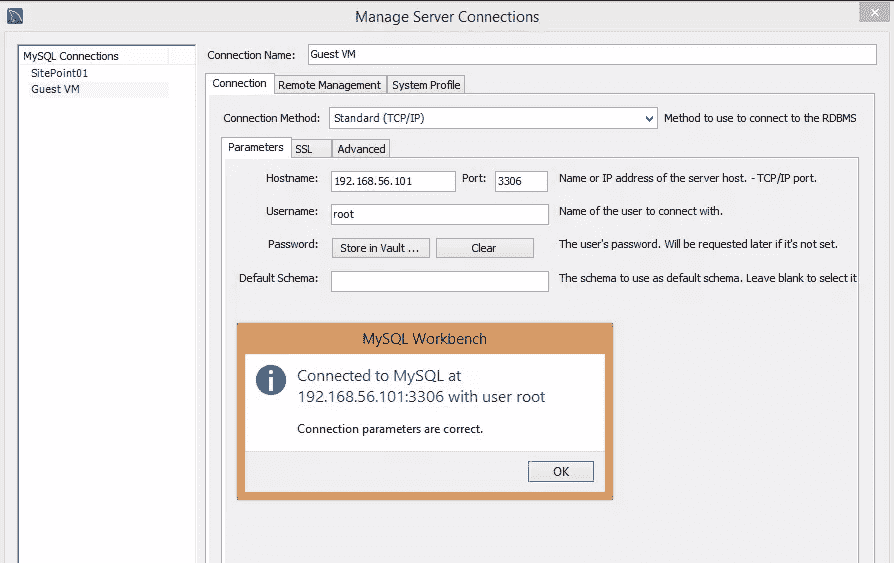
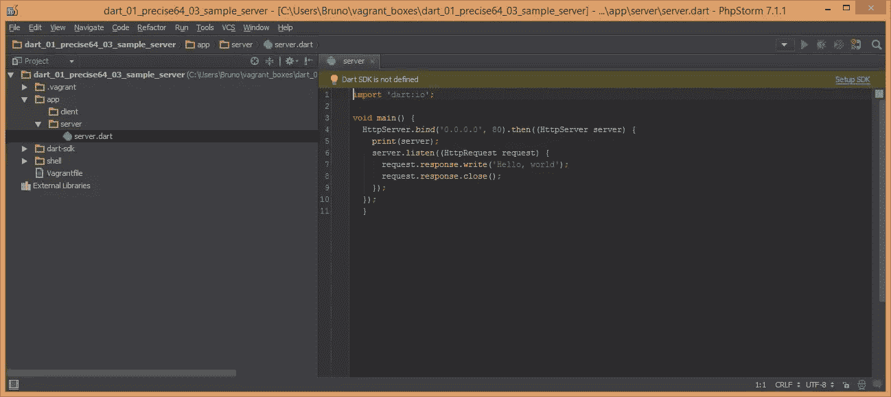
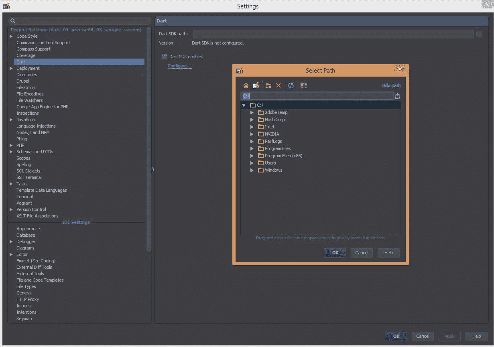
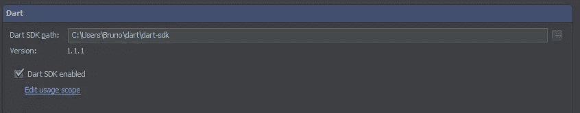
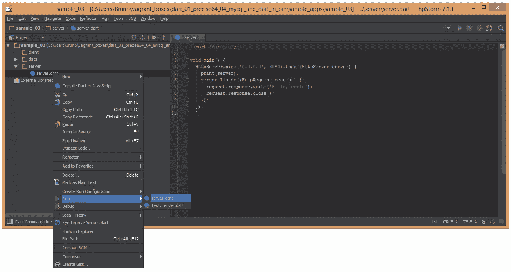
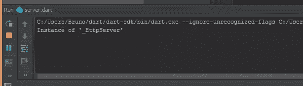
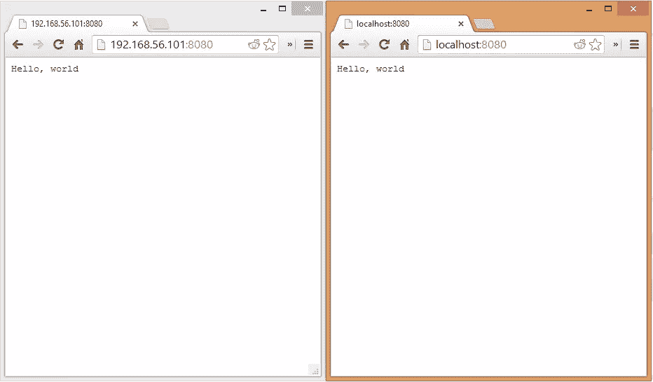

# 从头开始的客户端-服务器 Dart 应用程序:入门

> 原文：<https://www.sitepoint.com/client-server-dart-app-getting-started/>

Dart 是谷歌的一种雄心勃勃的新编程语言。对这种语言的介绍已经写满了整个网络，在这里重复别人的内容是没有意义的。无论如何，没有比他们的主页更好的入门资源了！然而，在本系列文章中，我们将从头开始构建一个服务器+客户机的 Dart 应用程序。

## 服务器+客户端

“等等，什么？”，你可能会疑惑。服务器和客户端？事实上，Dart 可以在 Dart VM 中的服务器上运行，或者在编译为 JS 时在浏览器中运行，甚至直接在 Dartium 浏览器中作为 Dart 运行(Chromium 内置 Dart VM)。

我们将在服务器上构建一个轻量级 API，它将被 Dart 的客户端版本使用。我们将使用[聚合物](https://www.dartlang.org/polymer-dart/)作为前端框架，由[基金会](http://foundation.zurb.com/)设计，我们将使用 MySQL 作为数据库来存储我们应用程序的数据。

## 环境

对于开发，我将使用一个带有我配置的浮动文件的浮动 VM 来自动下载和安装 Dart SDK 和 MySQL。它还将包括一个示例 web 应用程序，该应用程序查询已安装的数据库(填充了一些示例值)，以证明在我们开始入侵之前它都工作正常。

我的 IDE 将是带有 Dart 插件的 PHPStorm，基于 Eclipse 的 Dart 编辑器——我更喜欢它的特性和性能(Eclipse 即使在空闲时也会毫无理由地使用 1GB 以上的 RAM)。不幸的是，我们不能使用安装在虚拟机中的 SDK 作为我们在主机上使用的 IDE 背后的主要驱动程序，所以我们需要妥协，在主机和客户机上都安装 SDK。但是，一旦按照我将在下面描述的方式进行安装，您的 Dart 环境将随时可以在任何操作系统上进行编码，并且将执行完全相同的操作。

## 瓦德雷特

我建立了一个叫做 [VaDart](http://github.com/Swader/VaDart) 的流浪设置。如果你不熟悉流浪者，我推荐阅读 [Matthew Setter 的 PuPHPet 文章](https://www.sitepoint.com/build-virtual-machines-easily-puphpet/)，它用非常简单的术语介绍了它，并提供了一个 GUI 来做这件事(面向 PHP，但仍然有用)。如果您想直接跳到逐步安装说明，请转到下一节。如果你对 VaDart 实际上做什么感兴趣，请继续阅读。

VaDart 基于 64 位 Ubuntu Precise。我的 install-dart-sdk 脚本应该也可以在基于 CentOS 的 Linux 发行版上运行，但是我还没有测试过，随着我对需要做的事情越来越熟悉，并且从更有能力的人那里得到一些拉请求，这个脚本可能会发生变化。我在通过逆向工程 [Vaprobash](https://github.com/fideloper/Vaprobash) 和 [PuPHPet](http://puphpet.com) 所学到的东西之后，对 VaDart 的一部分进行了建模。

VaDart 自动安装最新稳定的 Dart SDK。如果你想使用 Dev 通道，进入`/shell/install-dart-sdk.sh`并取消 Dev 行的注释，同时注释 Stable 行。其他一切都是自动的——只要确保运行`vagrant destroy`，然后运行`vagrant up`，从头开始重新配置。

VaDart 还会安装 MySQL，用户名/密码组合为“root”，“root”(在`/shell/install-mysql.sh`中随意更改)，还会将数据库暴露给主机，这样即使在主机上开发，你也可以连接到它上面进行测试。这有一个额外的好处，那就是你不必因为不必要的安装而污染你的主机。

除了安装所需的软件，VaDart 还将克隆一些示例应用程序:基于混合使用[这种](https://www.dartlang.org/dart-by-example/#http-server)和[这种](http://blog.sethladd.com/2013/09/forms-http-servers-and-polymer-with-dart.html)、[服务器和客户端 web 应用程序](https://github.com/Swader/dart_sample_02)的纯[服务器专用应用程序](https://github.com/Swader/dart_sample_01)，由 Foundation 提供支持(只显示 Foundation 索引页面)，以及从 MySQL 读取数据并在浏览器中显示的[服务器应用程序。样本数据将在应用程序的 repo 中的一个](https://github.com/Swader/dart_sample_03) [SQL 脚本](https://github.com/Swader/dart_sample_03/blob/master/bin/data/startup.sql)中。

示例应用程序将分别放入各自的文件夹中，这些文件夹位于`sample_apps`父文件夹下:`sample01`、`sample02`、`/vagrant`中的`sample03`，也就是 VaDart 的根文件夹。不幸的是，由于符号链接和 pub install(Dart 包管理器)使用它们来链接 Dart 项目中的包，但不能通过网络驱动器这样做[的一个众所周知的问题](https://groups.google.com/a/dartlang.org/forum/#!topic/misc/JqKdsm5Xwqk)，我们需要创新。由于我们的应用程序存储在可由我们主机上的 IDE 访问的浮动根文件夹中，所以 pub 安装过程在 VM 中不起作用(任何没有外部包的应用程序都可以，但 pub 安装本身不起作用)。

然而，如果我们将应用程序的源代码移动到虚拟机内部的一个文件夹中——比如说，移动用户的主文件夹——一切都会好的。然而，这复制了我们的源，我们需要一种方法来保持宿主材料与客体材料同步。这就是为什么 VaDart 附带了一个您可以配置的同步脚本。参见`shell/dartsync.sh`下的内容。这个脚本每分钟自动运行一次(通过 cron)，但是您也可以通过 SSH-ing 进入 VM 并执行“dartsync”来手动运行它，这是我为此设置的一个别名。目前没有简单的方法来跟踪 Linux 上 NTFS 或网络驱动器中的变化，所以 cron+manual 将不得不做。我希望这个过程会随着时间的推移而改进——如果有人知道如何让它在每次文件改变时同步(记住我们处理的是“网络”驱动器),请告诉我。

## 逐步地

1.  在这里克隆/下载我准备的[流浪设置。我把它叫做 VaDart，因为它比“流浪设置”更容易写。](http://github.com/Swader/VaDart)
2.  确保你至少安装了[流浪者](http://vagrantup.com) 1.4.1 和 [VirtualBox](https://www.virtualbox.org/%E2%80%8E) 4.3.2(这些是我用的版本，可以保证 VaDart 在上面工作)。
3.  进入克隆的 VaDart 的文件夹，并在您的终端或命令行中执行命令“vagrant up ”,而不考虑操作系统。

现在应该已经安装了 DartSDK、MySQL 和三个示例应用程序。

要运行任何一个示例应用程序，`vagrant ssh`进入虚拟机，cd 进入包含应用程序的文件夹(默认为`/home/vagrant/dartapps`)，然后进入所需应用程序的文件夹，运行`sudo pub install`，然后运行`sudo dart bin/server.dart`。如果`dartapp`文件夹还不存在，你太快了，cron 还没有时间触发——运行`dartsync`就行了。从主机访问 IP `192.168.56.101:8080`应该会产生应用程序的有效输出，与使用 IDE 从主机运行应用程序并在浏览器中访问`localhost:8080`的输出相同。

该数据库是主机公开的，因此您可以通过虚拟机的 IP 端口 3306(MySQL 默认端口)从主机连接到它(用于使用 MySQL Workbench 或您的 IDE 并设置数据源)。下面是一个用 MySQL Workbench 设置它的例子:

要在您的主机上设置 SDK，请遵循[DartLang.org](http://dartlang.org)上的说明。完成后，进入您选择的 IDE，并按照进一步的说明(如果有)进行操作。默认情况下，Dart 编辑器应该配置为使用 SDK。PHPStorm 将需要一些帮助:

1.  安装 Dart 插件(从 IDE 的配置屏幕中浏览插件存储库)
2.  打开应用程序的目录，现在显示在您的来宾虚拟机的文件夹中，您应该会收到一条关于 SDK 未配置的警告:

    

3.  单击警告，在打开的窗口中，浏览到 SDK 的位置(解压缩从 Dart 主页下载的文件夹的位置):

    

4.  选择 SDK 后，单击 apply 并查看版本更改。如果勾选了“Dart SDK Enabled”选项，并且版本号发生变化，您就会知道它成功了:

    

我使用 Windows 作为我的主要操作系统，因为在浮动虚拟机中进行 Linux 开发非常容易，同时仍然保持 Windows 在*nix 桌面环境上的稳定性、多媒体功能和驱动程序支持。然而，这个过程在每个操作系统中都是相同的——PHPStorm(及其父 WebStorm)是基于 Java 的多平台 ide，无论您使用什么操作系统，它们的行为都完全相同。

完成此配置后，右键单击`server.dart`文件并选择下图中的运行方式。

您应该得到与此类似的控制台输出，表明一切正常(图片来自运行 Sample01):

现在，您应该能够在浏览器中访问`http://localhost:8080`，并获得与从虚拟机运行时完全相同的结果，甚至可以同时运行它们:

现在，您拥有了一个全功能的 Dart 服务器+客户端开发环境，在主机和来宾虚拟机上双重使用。现在让我们看看这个组合让我们变得多么强大。

## 结论

在本教程中，我们正确设置了我们的环境，确保我们有最新的 SDK，并讨论了一些 Dart 基础知识。在未来的教程中，我们将描述和规划我们的应用程序。

如果你想了解 Dart 的最新消息和发展，欢迎加入 [Dartisans Google+社区](https://plus.google.com/u/0/communities/114566943291919232850)并在那里结识一些 Dart 爱好者，或者在 [Twitter](http://twitter.com/bitfalls) 或 [Google+](http://google.com/+BrunoSkvorc) 上关注我——从现在起我会发布更多关于 Dart 的信息。

## 分享这篇文章