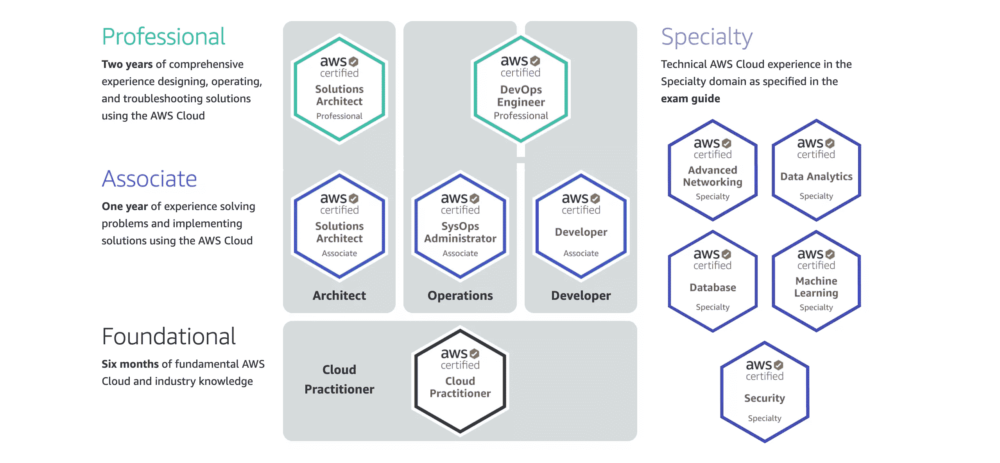
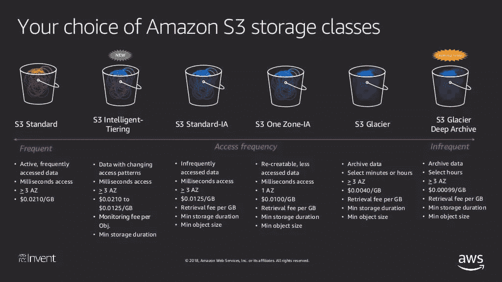
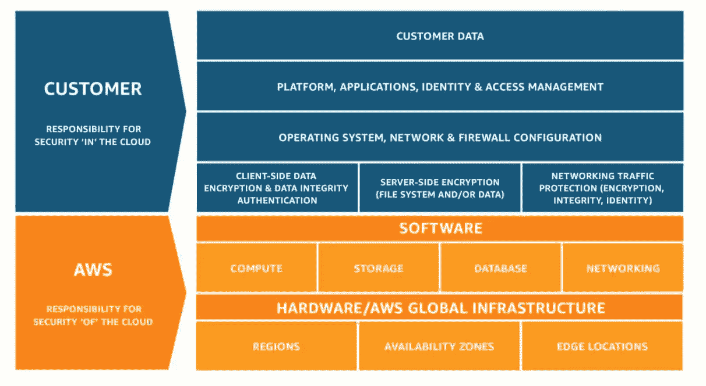

# 云计算和 AWS 认证简介

> 原文：<https://www.sitepoint.com/cloud-computing-aws-certification/>

在本文中，我们将了解什么是云计算，云计算的不同类型，什么是云提供商，以及为什么您可能想要使用云提供商。我们还将调查最佳的云提供商，并深入探讨 AWS 服务以及云认证的意义。

## 云计算入门

当你开始云计算生涯时，首先要做的一件事就是选择云提供商。使用该云提供商的服务，您将能够了解各种云计算概念，并开始实践您的技能。

### 什么是云提供商？

云提供商是通过互联网向您提供计算服务的公司。简单来说，它允许你在别人的电脑上存储和运行你的应用程序。

实际上，您可以通过云提供商做更多的事情，您将在本文中对此有所了解！

### 为什么要使用云提供商？

您可以使用云提供商，而不是购买设备、设置基础设施并进行维护。

这样，您可以专注于构建和维护您的应用程序，而不必担心物理基础设施。

## 使用哪家云提供商？

有许多可用的云提供商，在选择一个时没有正确或错误的答案。一些最受欢迎的云服务提供商包括:

*   亚马逊网络服务(AWS)
*   微软 Azure
*   谷歌云
*   国际商用机器公司
*   神谕

亚马逊网络服务是最大和最受欢迎的云提供商。AWS 的另一个优势是它的认证程序。亚马逊的认证是 IT 行业薪酬最高的认证之一。

因此，本文将重点放在 AWS 上，为您介绍云计算。AWS 云从业者证书是亚马逊的基础课程，教授云计算和 AWS 的基础知识。

## AWS 认证

亚马逊网络服务提供 11 种认证，分为四类。

AWS 认证

**基础级**只有一个认证， [AWS 认证云从业者](https://www.sitepoint.com/premium/courses/aws-certified-cloud-practitioner-2020-3110)证书。它涵盖的主题包括:

*   云计算的基础
*   基本 AWS 信息
*   关键的 AWS 服务
*   计费和定价
*   安全

云从业者证书适合和推荐给刚入门云计算和 AWS 的人。为了让您轻松进入云世界，本文回顾了云计算和 AWS 基础知识。可以作为云从业者证书的前提条件。

下一级是**助理级**，有三个认证:

*   解决方案架构师
*   系统操作管理员
*   开发人员助理

这些认证比基础级别更复杂，它们教会您如何使用 AWS 基础设施实现解决方案。通过“助理级别”证书，您可以深入了解服务，而不是对服务有一个总体了解。

您选择的证书取决于您想要遵循的路径。AWS 解决方案架构师证书帮助您获得一般的 AWS 专业知识。因为它使你能够获得一般的 AWS 专业知识，你可以用它作为你以后证书的基础。

获得 [AWS 认证云从业者](https://www.sitepoint.com/premium/courses/aws-certified-cloud-practitioner-2020-3110)证书后，你可以向解决方案架构师一号迈进。

以下级别，**专业级别**和**专业**，是最难的认证。你现在不用担心他们。

## 什么是云计算

让我们从一些关于云概念的基础信息开始。你可能会问自己的第一个问题是“什么是云计算？”

通俗地说，云计算简直就像用别人的电脑。您没有自己的服务器，而是从 AWS 这样的公司租用服务器。

用更复杂的术语来说，云计算是在按需付费的基础上通过互联网按需交付 IT 资源。

## 云计算的优势

谈到云计算，有六大优势:

*   **可变费用与资本费用**。这意味着您只需在使用资源时付费，而不像本地资源那样需要预先投入大量资金。
*   **无容量猜测**。您可以避免资源利用不足或过度利用。这意味着您不必为未充分利用的资源付费，也不必让您的应用程序因资源过度利用而停机。云计算使您能够快速扩大或缩小规模，以响应不断变化的业务需求。
*   **提高速度和敏捷性**。云计算允许您在几分钟内创建或终止资源。您不必让您的 it 团队等待数周时间来实施本地解决方案。
*   **受益于大规模经济**。你与其他客户分摊费用，以获得可观的折扣。
*   **走向全球**。以最少的工作量将您的应用程序部署到世界各地。
*   **花钱运营和维护数据中心**。避免与基础设施开发相关的麻烦、成本、时间和其他资源。让别人去处理它，专注于你的应用。

现在你知道什么是云计算，以及它的六大好处。下一步是熟悉各种类型的云计算。

## 云计算的类型

云计算有三种类型:

*   **IaaS** ( **基础设施即服务**——面向管理员)。您负责管理您的服务器(物理或虚拟)。
*   **PaaS** ( **平台即服务**——面向开发者)。您不需要管理底层架构。您只关心应用程序的部署和运行。Heroku 就是一个例子(在那里部署和运行 web 应用程序)。
*   **SaaS** ( **软件即服务**——面向客户)。这是服务提供商运行和管理的最终产品。谷歌的 Gmail 就是一个例子。除了使用服务之外，你不必担心任何事情。

## 云计算部署

除了三个云计算服务，还有四个云计算部署。这些是:

*   **公有**:充分利用云计算。比如 AWS、GCP、Azure、IBM、阿里巴巴等等。
*   **混合**:混合使用公共和私有部署。敏感和关键信息可能存储在“私有”云中，而其他信息存储在“公共”云中。
*   **私有**:内部部署资源，使用虚拟化和资源管理工具。
*   **多云**:多云架构使用各种云服务提供商。例如，你可以混合使用 AWS 和谷歌云。

## AWS 基础设施

在撰写本文时，亚马逊在 *25+地理区域*内拥有 *81+可用区域*。共有 230 多个*存在点*，具体如下:

*   超过 218 个边缘位置
*   超过 12 个区域边缘缓存

**区域**是一个地理区域，它由至少两个可用区域(AZs)组成。至少有两个 az 的原因是为了防止其中一个数据中心出现故障。例如，一个地区是**欧盟-西方-1(爱尔兰)**。每个地区都是相互独立的，**美东**是最大的地区。因此，几乎所有服务都首先在该地区提供。

一个**可用性区域**是一个数据中心(包含许多物理服务器的建筑)。一个可用性区域可能由几个数据中心组成，但它们被算作一个 AZ，因为它们彼此靠近。

**接入点**是位于网络边缘的数据中心。

**边缘位置**是用于缓存内容的 AWS 端点。这是典型的 CloudFront，即 AWS 的内容交付网络。这些边缘位置的目的是为终端用户提供低延迟。

有一个独特的区域不是每个人都能去的。这个区域被称为 **GovCloud** ，只对美国公司和美国公民开放。你还必须通过一个筛选过程。 *GovCloud 允许用户托管敏感的受控非机密信息，如军事信息。*

## AWS 技术

这一部分包括不同的 AWS 技术，如计算服务、存储服务、日志服务等等。

### 身份访问管理

身份访问管理(IAM)是 AWS 中的基本工具之一。IAM 是*全局*的，也就是说你不必选择特定的区域来使用它。

一家公司有几个部门，这意味着他们需要不同类型的访问权限。您可以使用 IAM 为每个部门定义特定的权限。IAM 允许您创建用户、组和角色。它还允许您应用密码策略。密码策略指定密码需要包含的内容，例如数字、字符等等。*所有创建的用户和组都是全局创建的*。

根据 AWS 最佳实践，您永远不应该使用或授予任何人 root 访问权限。当某人获得 root 帐户的访问权限时，他们就完全控制了该帐户。您还应该打开多因素身份验证(MFA)。

### AWS 组织和客户

AWS 组织是一种帐户管理服务，允许用户将各种 AWS 帐户整合到一个组织中。它使您能够跨 AWS 帐户管理计费、访问、安全性、合规性和资源共享。例如，您可以通过为所有 AWS 帐户设置一次付款来简化计费。

**组织单元**是组织内可以包含其他组织单元的组。AWS 组织允许您隔离公司中的不同部门——例如，将开发人员与人力资源分开。

为您的团队创建组织的目标是为每个团队单独附加策略和控制访问。**服务控制政策**定义每个组织单位的规则，确保您的帐户遵循您所在部门制定的指导方针。

### AWS 计算服务

有几种 AWS 计算服务。然而，这次考试我们只看 EC2、ECS、Elastic Beanstalk、Fargate、EKS、Lambda 和 Batch。

#### EC2(弹性计算云)

EC2 代表弹性计算云，即云中的虚拟服务器。EC2 可以根据您的需求变化，轻松地扩展或缩小规模。

EC2 实例有不同类型的定价。它们如下:

*   **按需**
    *   它更便宜、更灵活，因为它不需要预付或长期承诺。
    *   按使用时间支付固定金额。
    *   适合具有短期、峰值和不可预测工作负载且无法中断的应用程序。
*   **光点**
    *   价格一直在变动，你必须出价。当您的出价超过现货价格时，您的实例运行。
    *   这种定价对于没有设定开始或结束时间的应用程序来说是理想的。它适用于数据分析、批处理、后台处理和可选任务。
*   **保留**
    *   从长远来看，这是最具成本效益的解决方案。
    *   你被合同束缚住了。你可以选择签一年或三年的合同。
    *   合同越长，你预付的钱越多，它就越便宜。
    *   它使您能够转售未使用的保留实例。
    *   它适用于具有可预测的使用和稳定状态的应用程序。
    *   您可以预先支付所有费用、部分预先支付费用和不预先支付费用。
*   **专用**
    *   所有这些定价模型中最贵的。
    *   这些是专门为您提供的物理 Amazon EC2 服务器。
    *   可以按需购买(按小时计算)或作为预订实例购买，最高可享受按需价格 70%的折扣。
    *   当法规要求可能不支持多租户虚拟化时，或者对于不支持租赁云部署的许可而言，非常有用。
*   **储蓄计划**
    *   如果你承诺一年或三年一定量的使用，它提供了一个低价格。使用量以每小时美元计算。
    *   因此，您可以通过致力于特定的用途来节省资金。

如果亚马逊关闭了你的 EC2 实例，你将不会被收取剩余时间的费用。但是，如果您终止 EC2 实例，您将为实例运行的任何时间付费。

#### 弹性块存储

EBS 只是一个连接到 EC2 实例的虚拟硬盘。一旦 EBS 附加到 EC2 实例，您就可以像使用 HDD 一样使用它。EC2 实例需要与 EBS 位于同一个可用性区域。EBS 有两种类型:固态硬盘和磁性硬盘。

#### ELB(弹性负载平衡)

AWS ELB 用于平衡您的资源之间的流量。例如，如果一个 EC2 实例关闭，流量将被重定向到另一个实例，或者创建另一个 EC2 实例。如果您的一个资源过载，也会发生同样的情况。这意味着您的应用程序始终对用户可用，而不是“关闭”。有三种类型的负载平衡器:

*   **传统负载均衡器，**即将被淘汰。这对开发/测试环境很有帮助。
*   **应用负载平衡器**
*   **网络负载平衡器**

这些弹性负载平衡器之间的关键区别在于，应用程序负载平衡器可以“观察”您的代码，并基于此做出决策。相反，当您需要极高的性能和静态 IP 地址时，可以使用网络负载平衡器。

#### 弹性集装箱服务

ECS 是一个高度可伸缩、高性能的容器编排服务，支持 Docker 容器。它使您能够在 AWS 上部署和运行容器化的应用程序。您必须选择所需的 ECS 实例的类型，这是 Docker 预先配置的。

您可以快速启动或停止应用程序，并访问其他服务和资源，如 IAM、CloudFormation 模板、负载平衡器、CloudTrail 日志或 CloudWatch 事件。您必须为 ECS 使用的 EC2 实例付费。

#### Fargate

当你想到 Fargate 时，我希望你想到短语**无服务器容器**。Fargate 使您能够运行容器，而无需管理服务器或集群。本质上，您可以部署应用程序，而不必担心基础设施。您不再需要选择服务器类型或决定如何以及何时扩展集群。

ECS 有两个发射选项:**法盖特**和 **EC2** 。对于 Fargate 启动类型，您只需将应用程序打包到一个容器中，指定 CPU 和内存，并定义网络和 IAM 策略。之后，您的应用程序就可以部署了。

Fargate 按任务和 CPU 使用率收费。您不必为 EC2 实例付费。Fargate 最适合 Docker 容器化的具有一致工作负载的应用程序。

#### EKS (Elastic Kubernetes Service)

EKS 还跨多个 AWS 可用性区域管理您的 Kubernetes 管理基础架构。这样做的原因是为了消除单点故障。

最后，EKS 比 ECS 更适合具有数千个容器的架构，ECS 更适合更简单的架构。

#### 希腊字母的第 11 个

这些只是无服务器的函数，在你上传代码后，它们会处理所有的事情。AWS Lambda 允许您在不提供或管理服务器的情况下运行代码。

你为你消耗的计算时间付费。Lambda 不运行时不收费。Lambda 函数的用例将是不可预测和不一致的工作负载。

#### 弹性豆茎

AWS Elastic Beanstalk 是一种在 AWS 上部署应用程序的快速而简单的方法。该服务自动处理容量供应、负载平衡、自动扩展和运行状况监控。

Elastic Beanstalk 将在“AWS 供应服务”一节中详细介绍。

#### AWS 批次

AWS Batch 允许您计划、管理和执行批处理作业。该服务跨整个 AWS 计算服务组合(包括 EC2 和 spot 实例)规划、管理和运行批处理工作负载。

### AWS 存储服务

我们还需要将数据存储在某个地方，对吗？不要担心，因为 AWS 允许我们通过广泛的服务做到这一点。

#### S3(简单存储服务)

第一个排队的是最古老和最基础的 AWS 服务之一— [亚马逊简单存储服务(S3)](https://catalins.tech/aws-s3-all-you-need-to-know-about-this-service) 。

S3 允许用户在世界任何地方存储和检索任何数量的数据。它提供了高度可伸缩、安全和持久的对象存储。简而言之，S3 是一个安全的地方，你可以在那里存放你的平面物品(比如视频和图像)。我说的“平淡”是指内容不变。(例如，您不能在 S3 存储数据库，因为它会不断变化。)如果发生故障，来自 S3 存储桶的数据将分布在多个设施和设备上。

但是等等，你说的“对象存储”是什么意思？数据存储在桶中，每个桶由**键-值**对组成。*键代表文件的名称，而值代表文件的内容*。

关于 S3 的一些要点如下:

*   它是基于对象的
*   文件大小从 0 字节到 5TB 不等
*   你有无限的存储空间
*   文件存储在桶中
*   bucket*必须*有唯一的名字，因为 S3 命名空间是通用的——这意味着世界上不能有两个同名的 bucket。
*   当一个对象成功上传到 bucket 中时，它返回状态代码 200

S3 服务的*特色*有哪些？

*   **可用的分层存储**:针对不同使用情形的不同存储类型。
*   **版本化**:表示为同一个文件保留多个版本。这允许在出现故障或意外的用户操作时恢复文件。
*   **生命周期管理**:表示一组规则，决定如何处理存储的数据。例如，您可以定义何时将一组对象转移到另一个存储类，例如用于归档数据，或者设置一个规则在文件过期后删除它们。
*   **加密**:允许你为你的 S3 桶设置必要的加密行为。例如，在文件上传前加密，下载后解密。
*   您通过**访问控制列表**(基于单个文件)和**存储桶策略**(应用于整个存储桶)来保护您的数据。

S3 *数据一致性*也至关重要。但是，那又怎么样呢？

*   **新** **对象**put 的写后读一致性。这意味着一旦数据上传，您就可以访问上传到 S3 存储桶的数据。您可以立即访问和查看新文件。
*   **覆盖删除和上传的最终一致性**。这意味着在删除一个文件后，你仍然可以在一段时间内访问它。这也意味着当您更新一个现有的文件时，如果您试图在更新后直接访问它，您可能会得到旧的文件。这是为什么呢？传播更改需要时间。正如我们在上面看到的，S3 桶中的数据分布在多个设备和设施上。

S3 *怎么收你*？S3 指控你的依据是:

*   储存；储备
*   要求
*   存储管理定价
*   数据转移定价
*   转移加速度
*   跨区域复制

剩下的最后一件事是查看不同的 **S3 存储类别**。它们如下:

*   **S3 标准**该存储级别具有 99.99%的可用性和 99.999999999%的耐用性。数据存储在跨多个设施的多个系统上，以承受同时失去两个设施的情况。
*   S3 IA(不常访问)。此类存储适用于不常访问但需要快速访问的数据。尽管它比标准存储便宜，但每次文件检索都要收费。
*   **S3 一区 IA** 。基本上，它与 S3 IA 是一样的，唯一的区别是您的数据只存储在一个地方—没有多个 az。
*   **S3 智能分层**。此存储类别会自动将您的数据移动到最经济高效的存储层。例如，它可以将您的数据从 S3 标准推到 S3 One Zone IA 以降低成本。它不会影响性能。
*   S3 冰川。S3 冰川适用于数据存档，检索时间在几分钟到几小时之间是可以接受的。这是成本第二低的存储类别。
*   **S3 冰川深处档案**。基本上，它和 S3 一样，有一个显著的不同:数据检索需要 12 个小时。它也是成本最低的存储类别。

下图比较了 S3 存储类别。

[来源:AWS 重塑](https://image.slidesharecdn.com/deep-dive-on-amazon-s3-storage-6c838def-e103-4146-be1d-dc46a04bb6ed-1657834313-181130064200/95/deep-dive-on-amazon-s3-storage-classes-creating-cost-efficiencies-across-your-s3-resources-stg398r1-aws-reinvent-2018-13-1024.jpg?cb=1543560153)

### AWS 数据库服务

有多种数据库服务，但它们被分成两部分。有 **NoSQL** 和 **SQL(关系型)**数据库。AWS 上可用的 **NoSQL** 数据库有:

*   dynamo db——AWS 的旗舰数据库
*   DocumentDB

**SQL(关系型)**数据库是:

*   aurora——亚马逊的产品(比 MySQL 快 5 倍)
*   关系型数据库
*   一种数据库系统
*   MariaDB
*   神谕
*   Microsoft SQL Server

关系数据库有两个关键特性:

*   **多 AZ** 。它们部署在多个可用性区域，用于灾难恢复。
*   **读取副本**。数据是从副本中读取的，而不是从数据库本身读取的。向数据库写入数据，但数据是从副本中读取的。

### AWS 供应服务

供应是指为客户创建资源和服务。这是为 AWS 资源创建资源的一种方式。AWS 预配资源包括:

*   **云的形成**
*   **弹性豆茎**
*   **OpsWorks**
*   **AWS 快速入门**
*   **AWS 市场**

让我们从 **CloudFormation** 开始，它是 AWS 中最强大、最有用的工具之一。

CloudFormation 是一个 JSON 或 YAML 模板，它把你的基础设施变成代码，由栈组成。“将基础设施转化为代码”意味着以编程方式指定应用程序所需的所有资源，之后它们将被自动创建。这意味着您不必在 AWS 控制台中手动创建资源，然后将它们链接在一起。

请看一个 CloudFormation 模板的例子，它创建了一个 EC2 实例，这里有安全组(这是 YAML 格式)。

**弹性豆茎**允许你上传你的应用代码。它会自动为您创建所有资源(只需点击一个按钮，即可提供您的 EC2 实例、您的安全组、您的应用程序负载平衡器)。它自动处理容量供应、负载平衡、扩展和应用程序监控的细节。

Elastic Beanstalk 是一个优秀的服务，可以在云中快速部署和管理应用程序，如果您不熟悉 AWS，就不必担心基础设施。它为你自动化一切。如果你想把这项服务与更熟悉的东西联系起来，Elastic Beanstalk 就是 AWS 自己的 Heroku。

**[AWS 快速入门](https://aws.amazon.com/quickstart/)** 允许您使用专家构建的现有 CloudFormation 模板在云中快速部署应用程序。假设您想在 AWS 上部署一个 WordPress 博客。您可以访问 AWS 快速入门网站，使用一个模板来完成这项工作，这样您就不必自己构建了。

亚马逊这样描述 **[AWS Marketplace](https://aws.amazon.com/marketplace)** :

> AWS Marketplace 是一个数字目录，包含来自独立软件供应商的数千个软件列表，可以轻松查找、测试、购买和部署运行在 AWS 上的软件。

你可以使用 AWS Marketplace 为你的 WordPress 博客购买一个预配置的 EC2 实例。

最后， **OpsWorks** 是一个配置管理服务，允许您管理 Chef 和 Puppet 的实例。它使您能够使用代码来自动配置您的服务器。更多 OpsWorks 信息可以在[这里](https://aws.amazon.com/opsworks/)找到。

### AWS 日志服务

我们需要涉及的一个重要领域是伐木。如果你的服务中断了，你肯定想知道为什么会这样。因此，AWS 提供了两个日志服务来帮助您:

*   **AWS CloudTrail** 。CloudTrail 是一项服务，它监控 AWS 平台上的所有 API 调用。弄清楚谁做了什么很有帮助。例如，我们可以使用这个服务来确定谁终止了 EC2 实例，或者谁创建了新的 S3 存储桶。
*   **AWS 云手表**。CloudWatch 是一项监控 AWS 和内部资源及应用的服务。例如，它可以跟踪 CPU、内存和网络消耗。您可以使用 CloudWatch 来监控您的环境、设置警报、可视化日志和分析、自动执行操作、解决问题以及深入了解您的应用。

这两种服务很容易混淆，所以如果你感兴趣，你可以阅读更多关于 AWS CloudTrail 和 AWS Cloudwatch 的区别。

**AWS CloudFront** 是亚马逊的内容交付网络(CDN)。CDN 是全球分布式服务器系统，根据用户的地理位置和网页来源向用户提供 web 内容。

*   **原点**:表示 CDN 分发的所有文件的原点。起点可以是 S3 桶、EC2、弹性负载平衡器或 Route53。
*   **分布**:由边缘位置集合组成的 CDN 的名称。
*   **边缘位置**:边缘位置是缓存内容的位置。
*   文件在 TTL(生存时间)指定的时间段内被缓存(通常为 48 小时)。你可以清除缓存的对象，但是要付费。

有两种类型的 CloudFront 发行版:

*   **网络分发**:针对网站
*   **RMTP** :用于流媒体

## 计费和定价

这是一个重要的部分。原因是你不想产生任何不必要的费用(用 AWS 相对容易做到)，这也是考试至关重要的组成部分。

### 支付原则

你必须记住 AWS 支付原则。这些措施如下:

*   按需付费(降低供应不足或供应过度的风险)。
*   预订时，您支付的费用更少。
*   通过使用更多的服务/资源，您支付的单位成本甚至更低。
*   随着 AWS 的发展，您需要支付的费用甚至会更少。

此外，在 AWS 上，您还需要支付:

*   计算容量
*   储存；储备
*   出站数据

AWS 很聪明。为了吸引你使用他们的服务，他们不会向你收取迁移数据的费用。然而，当你从他们的云中传输数据时，他们会向你收费。

你应该知道的另外两个重要术语是**资本支出**和 **OPEX** 。CAPEX 代表资本支出，意思是预付。这是固定成本。OPEX 代表运营支出，它意味着只为你使用的东西付费。

### 关键定价原则

有四个基本的定价原则。这些是:

*   **了解定价的基本原理**。这基本上就是我们之前讨论的内容。如前所述，我们为 AWS 中的计算能力、存储能力和出站数据付费。
*   **早点开始成本优化**。所有这些策略意味着，您应该在环境变得庞大之前建立成本控制。因此，随着基础架构的增加，云投资管理不会成为一个问题。
*   **最大化灵活性的力量**。从本质上来说，该政策规定，因为您是按需付费，所以您可以关注环境而不是基础设施。通过仅在需要时使用您的环境，您可以最大限度地发挥灵活性的威力。一个显著的优势是，当您的资源不在使用中时，您不需要为它们付费，这样您就可以节省成本。
*   **为工作**使用正确的定价模式。根据产品的不同，AWS 提供了几种定价模式。定价模式如下:
    *   **按需**
    *   **专用实例**
    *   **斑点实例**
    *   **保留实例**

这些是重要的定价政策，您可以在此阅读更多相关信息[。](https://d0.awsstatic.com/whitepapers/aws_pricing_overview.pdf)

## 预算和计费警报

AWS 的一个缺点是很容易产生巨额账单。如果你不注意，不充分利用预算和账单警报，你可能会积累几千美元甚至更多的账单。

*账单提醒使您能够设置金额限制，以确保您不会超支。*当您达到某个阈值并且接近超过设定的限制时，您会收到警告。

[了解如何在 AWS 上设定预算](https://catalins.tech/how-to-setup-a-budget-on-aws)

### AWS 免费服务

让我们轻松享受 AWS 的免费服务。免费 AWS 服务如下:

*   OpsWorks
*   InternationalAssociationofMachinists 国际机械师协会
*   组织和合并计费
*   VPC
*   弹性豆茎
*   云的形成
*   自动缩放
*   AWS 成本浏览器

然而，有一个问题。*这些服务是免费的，但它们使用/创造的资源不是*。尽管 CloudFormation 是免费的，但它生成的资源却不是免费的。您将为 EC2 实例以及它创建/使用的任何东西付费。任何时候都要记住这一点。

### AWS 支持计划

目前有四个具有不同功能的支持计划。不同的 AWS 支持计划是**基础**、**开发者**、**业务**和**企业**。让我们看看他们有什么不同，他们提供什么。

#### 基本支持计划

这是最基本的计划，实际上没有支持(呵呵)。该计划可用于测试 AWS 或非常小的应用程序。

*   **费用**:免费。
*   技术支持:无。你必须只使用论坛，如 AWS 论坛。
*   **谁开箱子**:没人。
*   **案例严重性/响应时间**:无，因为您无法打开案例。
*   **技术客户经理**:否

#### 开发者支持计划

有了开发者支持计划，事情会变得更好。我们有更多的福利，也就是说这个服务是有偿的。

*   **费用**:20 美元/月。
*   **技术支持**:工作时间通过电子邮件。
*   **谁开箱子**:只有一个人。可以无限开箱。
*   **案例严重性/响应时间**:24 小时内的一般指导。系统在不到 12 个工作小时内受损。
*   **技术客户经理**:否

这项服务比基本计划好。

#### 业务支持计划

这个扶持计划更好。

*   **费用**:100 美元/月。
*   **技术支持** : 24/7 电子邮件&聊天&电话。
*   **谁开箱子**:不限人/不限箱。
*   **案例严重性/响应时间**:24 小时内的一般指导。系统在不到 12 个工作小时内受损。不到一小时生产系统就瘫痪了。
*   **技术客户经理**:否

该支持计划的响应时间非常短。如果您的生产系统出现故障，您会在不到一个小时内得到答案。这是令人钦佩的。

#### 企业支持计划

这个计划是最好的支援计划。然而，它的价格不菲。

*   **费用**:15000 美元/月。
*   **技术支持** : 24/7 电子邮件&聊天&电话。
*   **谁开箱子**:不限人/不限箱。
*   **案例严重性/响应时间**:24 小时内的一般指导。系统在不到 12 个工作小时内受损。不到一小时生产系统就瘫痪了。关键业务系统在不到 15 分钟内停机。
*   **技术客户经理**:是的。

此支持计划的主要好处是，您将被指派一名技术客户经理。这是一名亚马逊员工，他全权负责你的账户。

AWS 支持计划的主要关键要点是记住案例严重性和响应时间。此外，请记住您获得技术客户经理的支持计划。在考试中，你得到一个场景，你必须选择一个支持方案。

### AWS 市场

例如，你可以去市场上购买一个运行在 AWS 上的预先配置好的 WordPress 博客。您可以购买 CloudFormation 模板、Amazon 机器映像、AWS Web 应用程序防火墙规则和其他项目。

请注意，虽然市场服务可能是免费的，但您购买的软件可能需要支付额外的费用。AWS 会在向供应商付款前从您的帐户中扣除费用。

### AWS 合并计费

AWS 允许您创建一个支付帐户，以汇总您所有 AWS 帐户的付款。换句话说，你可以从一个账户支付所有的账单。

请记住，付款帐户与所有其他帐户是分开的，不能访问它们的资源。

使用这项服务有什么好处？

*   一张账单给你所有的账户
*   它提供了一种管理费用的简单方法
*   它提供批量定价优惠(使用越多，支付越少)
*   使用它不需要额外付费

### AWS 预算与 AWS 成本浏览器

在本节中，我们将浏览 AWS 预算和 AWS 成本浏览器。

**AWS Budgets** 允许您建立自定义预算，在您即将超出预算限额或超出限额时发出警告。

**AWS Cost Explorer** 是一款用于检查和管理您的 AWS 支出的工具。

它们之间的区别在于，AWS Budgets 使您能够在收费前调查成本，而 AWS Cost Explorer 可用于在收费后调查成本。

### AWS TCO 计算器

TCO 代表总拥有成本，它可以帮助您比较 AWS 云基础架构的成本和内部基础架构的成本。

AWS TCO 表明从内部迁移到 AWS 云可以节省多少成本。这只是一个估计，所以实际费用可能会有所不同。

### AWS 值得信赖的顾问

AWS Trusted Advisor 是一种工具，通过实施它提供的建议，帮助用户降低成本、提高性能和增加安全性。换句话说，可信赖的顾问为用户提供关于成本优化、性能、安全性、容错和服务限制的建议。它还通过提供实时指导，确保用户遵循 AWS 最佳实践。

有三种类型的值得信赖的顾问:免费的，和商业/企业。使用免费的可信顾问，您可以获得七次可信顾问检查，而使用业务/企业顾问，您可以获得所有可信顾问检查。

### 资源组和标记

标签是元数据(关于数据的信息),表示为键值对。这些标记与 AWS 资源相关联，可以包含 EC2 公共和私有地址、ELB 端口配置或 RDS 数据库引擎等信息。

资源组允许您根据分配给资源的标签对资源进行分类。它们可能包括区域、名称或部门等信息。

简单地说，标签和资源组允许您组织您的资源。

### 定价由什么决定

最后一个阶段是调查影响各种服务成本的因素，如 EC2、Lambda、S3 等。

#### EC2 价格由什么决定

*   服务器时间的时钟小时数
*   实例类型
*   实例数量
*   负载平衡
*   详细监控
*   自动缩放
*   弹性 IP 地址
*   批准

#### 是什么决定了 lambda 价格

*   计算时间(持续时间)
*   调用次数(请求)
*   如果使用其他 AWS 服务或传输数据，将收取额外费用

#### 是什么决定了 ebs 的价格

*   卷(每 GB)
*   快照(每 GB)
*   数据传送

#### 是什么决定了 S3 价格

*   存储类
*   储存；储备
*   请求数量
*   请求类型
*   数据传送

#### 是什么决定了冰川的价格

*   存储的数据量
*   数据检索时间

#### 是什么决定了雪球的价格

*   每项工作的服务费(50TB–200 美元，80TB–250 美元)
*   每日收费(10 天免费，然后每天 15 美元)
*   数据传输(向 AWS 传输数据是免费的，向外传输数据是收费的)

#### 是什么决定了 cloudfront 的价格

*   请求数量
*   出站数据
*   交通分布

#### 是什么决定了 dynamodb 的价格

*   写入次数
*   阅读次数
*   索引数据存储

#### 是什么决定了 rds 的价格

*   服务器时间的时钟小时数
*   数据库特征
*   数据库购买类型
*   数据库实例的数量
*   调配的存储
*   附加存储
*   请求数量
*   部署类型
*   数据传送

## 云中的安全性

安全性是一个重要的话题，尤其是在云中。

### 分担责任模式

根据共担责任模式，亚马逊 AWS 负责云端的安全*，而客户负责*云端的安全*。*

他们所说的“云的安全性”到底是什么意思？他们声称 AWS 负责服务运行的基础设施。物理服务器、它们的存储位置、网络以及运行 AWS 云服务的设施都是基础设施的一部分。

他们所说的“云中的安全性”是什么意思？客户负责修补他们的 EC2 实例、保护他们的客户数据、确保符合各种法规，以及采用 IAM(身份访问管理)解决方案等。客户的责任由他们使用的 AWS 服务决定。您直接对放在 AWS 上的数据和启用监控工具负责。

[AWS 共享责任模式](https://d1.awsstatic.com/security-center/Shared_Responsibility_Model_V2.59d1eccec334b366627e9295b304202faf7b899b.jpg)

上图说明了客户和 AWS 之间的共同责任。

### AWS 合规计划:AWS 工件

首先，我们来定义一下什么是合规计划。合规计划是公司遵守法律法规的一套内部政策和程序。

例如，如果你是一家使用 AWS 服务的医院，你必须遵守 HIPAA。另一个例子是当您接受信用卡支付并且必须符合 PCI DSS 时。我们有 AWS 工件来确保您遵守法规。

**AWS 工件**是一项服务，提供对 AWS 合规计划的访问。AWS 工件允许您查找、接受和管理组织内单个帐户或所有帐户的 AWS 协议。如果不再需要，它还允许您取消任何以前接受的协议。

### 亚马逊检查员

AWS Inspector 是一种自动化的安全服务，可评估 AWS 上托管的应用程序，以提高其安全性和合规性。

AWS Inspector 检查您的应用程序，看它们是否偏离了现有的最佳实践，是否包含任何安全缺陷。评估完成后，它将生成一份报告，其中包含按严重性级别组织的所有调查结果。

它的目标是消除尽可能多的安全缺陷。

### 网络应用防火墙

我相信您已经听说过像 SQL 注入、跨站点脚本(XSS)和敏感数据泄露等 web 攻击。AWS WAF 服务的目的是保护您的应用程序免受类似的常见网络攻击，以及许多其他攻击。

此服务允许您根据 HTTP 请求的内容过滤流量。也就是说，根据传入 HTTP 请求的内容，您可以*拒绝*或*允许*流量进入您的应用程序。您还可以使用 AWS WAF 规则市场中预先存在的规则集。

AWS WAF 可以连接到 CloudFront、您的应用程序负载平衡器或 Amazon API 网关。

AWS WAF 的成本取决于*您部署的规则数量*和*您的应用程序收到的请求数量*。

### AWS 屏蔽

AWS WAF 不能保护您的应用程序免受所有攻击和利用。还必须保护应用程序免受 DDoS 攻击。DDoS 攻击是试图通过向应用程序发送大量请求来使其无响应。服务器无法处理所有请求，应用程序会中断。因此，用户无法再访问该应用程序。

这就是 **AWS 盾**派上用场的地方。AWS Shield 是一项安全服务，保护 AWS 托管的应用程序。它总是打开，并积极扫描应用程序。它的目标是通过保护您的应用免受 DDoS 攻击来减少停机时间和延迟。当你通过 Route53 或 CloudFront 发送流量时，你会自动使用 AWS Shield。

AWS 盾有两种版本——**基础版**和**高级版**。基本版是免费的，默认使用。高级版每月要花费你 3000 美元，但是物有所值。原因是你*没有被指控在 DDoS 攻击中发生的费用。如果你的资源在攻击中被刷爆了也没关系；你不会付出任何代价。基本服务就不是这样了，DDoS 攻击会导致巨额费用。*

AWS Shield 保护应用程序免受三层攻击:

*   第 3 层:网络层
*   第 4 层:传输层
*   第 7 层:应用层

### AWS 公园税

AWS GuardDuty 是一种威胁检测服务，可持续监控 AWS 托管的应用程序是否存在恶意和可疑活动以及未经授权的行为。

该服务使用机器学习、异常检测和集成威胁情报来扫描 CloudTrail、VPC 和 DNS 日志。如果发现任何问题，它会自动通知您。

### 你有亚马逊

亚马逊 Macie 是一项安全服务，它使用机器学习和自然语言处理专门扫描 S3 桶中的敏感信息。例如，敏感信息包括诸如信用卡号之类的信息。

当它检测到异常时，会生成详细的警报供您查看。

### AWS 雅典娜

AWS Athena 允许您使用 SQL 查询 S3 存储桶中的数据。这是一种无服务器服务。因此，不需要设置。不需要设置复杂的提取/转换/加载操作。

AWS Athena 按查询或 TB 扫描收费。

### AWS VPN

AWS VPN 使您能够创建到 AWS 网络的安全和专用连接。有两种类型的 VPN:

*   **AWS 站对站 VPN** 。它允许您将本地服务连接到 AWS 云。
*   **AWS 客户端 VPN** 。它允许您将您的机器(例如用户)连接到 AWS 云。

### 安全组与 NACLs

**安全组**充当实例级的防火墙，它隐式拒绝所有流量。您可以创建*允许*规则来允许流量到达您的 EC2 实例。例如，您可以通过添加一个特定的规则来启用通过端口 80 到 EC2 实例的 HTTP 流量。

**NaCl**(网络访问控制列表)充当子网级别的防火墙。您可以为子网创建*允许*和*拒绝*规则。那是什么意思？例如，您可以限制对已知滥用的特定 IP 地址的访问。

## 结论

祝贺您朝着云计算之旅迈出了第一步！

了解了基本的云概念和 AWS 基础知识后，您就可以开始学习 [AWS 认证云从业者](https://www.sitepoint.com/premium/courses/aws-certified-cloud-practitioner-2020-3110)证书了。

## 分享这篇文章