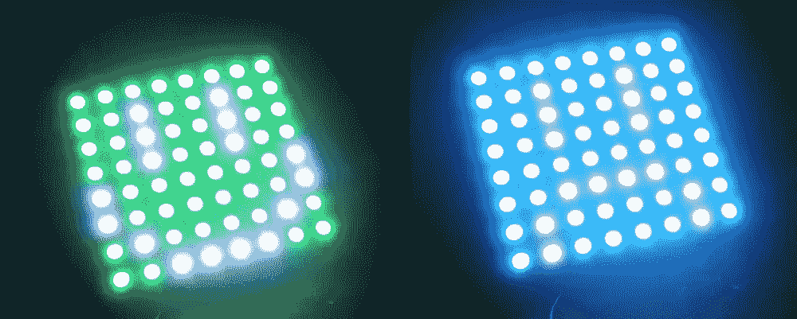

# 使用粒子核心的云连接新像素

> 原文：<https://www.sitepoint.com/cloud-connected-neopixels-using-the-particle-core/>

NeoPixels 是一种明亮而丰富多彩的方式，可以吸引人们对可穿戴服装、Arduino 驱动的机器人等的注意。所有这些可能性听起来都很棒，但有一件事我一直想尝试。我一直想通过使用粒子核心(以前称为“火花核心”)的云来控制我的新像素。

粒子核心是微控制器，与 Arduino Nano 非常相似，但是它们内置 Wi-Fi，并提供基于云的服务，可以轻松地远程控制您的核心。你可以在粒子网站上找到更多信息。目前有两种新版本的设备可供预订，粒子光子和粒子电子。光子具有更好的可靠性，总体来说是对核心更快更好的升级。Electron 更进一步，通过全球订阅服务在 100 多个国家提供 2G/3G 连接。它将连接提升到了一个全新的激动人心的水平！

如果你想开始，而你目前还没有粒子设备，尝试预先订购一个新的选项。截至发稿时，粒子核现已全部售罄！假设 NeoPixel 库与 Photon 没有任何兼容性问题，下面的演示应该仍然可以在较新的设备上工作。我的光子还在邮寄中，所以我现在还不能检查！

NeoPixels 是 Adafruit 的一个非常棒的 LED 面板品牌，可以以许多不同的方式(超级多彩)连接在一起。我将使用的 NeoPixel 网格是一个 8×8 的 NeoMatrix 网格。

## 我们正在建造的东西

在这个演示中，我们将展示一个笑脸，它将根据发送到我们的粒子核心的情绪而变化。如果我们给它发送快乐的情绪，它就会微笑。如果我们送它一个悲伤的，它会皱眉。我们将通过非常简单的 POST 请求将这些情绪直接发送给它(您可以通过创建一个表单、AJAX 站点或服务器来启动它们，我们将通过不在本文中定义一种特定类型的 POST 请求方法来保持它的简单、简短和甜蜜)。

本演示的代码和说明假定您熟悉您的粒子核心，已经在您的本地 Wi-Fi 网络上设置了它，并且熟悉如何通过粒子构建 IDE 在其上刷新代码。如果你是粒子核心的新手，还没有尝试过任何东西，先去粒子文档，通读一下关于 flash 应用的[解释。尝试闪烁一个简单的 LED 闪烁应用程序，以确保您已经设置好并准备就绪。假设您的 Wi-Fi 连接非常好，这应该是一个非常顺利的过程。](http://docs.particle.io/core/build/)

## 演示

想跳过来看看最后的代码吗？这些都可以在 GitHub 上找到。

## 素描

我们的云连接粒子动力 NeoPixel 草图如下所示:


整理上述草图时有几个要点:

*   我们有一个 4700μF、10V 的电容(Adafruit 建议至少 1000 μF、6.3V 或更高)。我用的是 [AdaFruit](http://www.adafruit.com/products/1589?&main_page=product_info&products_id=1589) 的。他们强烈建议在连接电源之前，在您的设置**中放置一个。**
*   在数据输出引脚和 NeoPixel 的输入端之间还有一个 330 欧姆的电阻(Adafruit 建议使用 300 至 500 欧姆的电阻)。虽然没有它也可以工作，但是包含它是最安全的！
*   Adafruit 也强烈反对将新像素连接到带电电路。至少，总是先接地，接 5V，再接 data。断开时——按相反顺序断开。
*   我们通过电池为新像素供电，因为粒子核心本身不能提供新像素点亮所需的 5V 电源。在这种情况下，Adafruit 建议您在为粒子核心供电之前，先为像素供电。
*   如果你没有电池组，但知道如何使用逻辑电平移位器使其达到 5V，你可以这样做。我没有逻辑移位器来尝试这个！
*   我肯定不是电子专家，强烈建议在将上述草图组合在一起之前，通过 [NeoPixel Uberguide](https://learn.adafruit.com/adafruit-neopixel-uberguide) 阅读 NeoPixel。新像素很容易损坏，所以要小心！我能自信地说的是，我做的上述草图没有损坏我自己的 NeoPixels，理论上应该没问题。在家里尝试之前，先做出自己的判断。

## 代码

我们将创建的一切都将在[粒子构建网络 IDE](https://build.particle.io) 中编码，我们用它通过 Wi-Fi 将代码闪存到我们的粒子设备上。它使用类似于 Arduino 的 C++简化版本，以及相同的软件库“Wiring ”,用于公共输入/输出功能。换句话说，如果你是 Arduino 的粉丝，你会以几乎完全相同的方式编码。

我们首先在构建 IDE 中创建新的应用程序，并向其中添加一个相当重要的库。要将预先存在的库添加到粒子应用程序，请选择左下角看起来有点像书签的库选项。

从出现的屏幕中，选择“社区库”下的“Neopixel”库，加载后单击“包含在应用程序中”按钮，将其添加到我们正在创建的应用程序中。

这将在您的应用程序中添加以下代码行:

```
// This #include statement was automatically added by the Spark IDE.
#include "neopixel/neopixel.h"
```

注意到上面提到了“火花”吗？我在文章的开头简单地提到了它，但是为了避免混淆，我想我应该再次指出这一点。名称“火花”将出现在整个代码中，因为它是“粒子”的旧名称。我想说这个名字将很快完全改变，但我的演示中仍然有旧的名字。我不太确定他们是否已经更新了 API 的内部工作方式。

之后，我们为我们的应用程序定义三个常量。我们定义 NeoPixel 网格所连接的引脚、网格中的像素数以及 NeoPixel 的类型。

```
#define PIXEL_PIN D7
#define PIXEL_COUNT 64
#define PIXEL_TYPE WS2812B
```

然后我们用这三个常量定义我们的`Adafruit_NeoPixel`对象。

```
Adafruit_NeoPixel strip = Adafruit_NeoPixel(PIXEL_COUNT, PIXEL_PIN, PIXEL_TYPE);
```

下一段代码是一系列 1 和 0 的数组，代表我们的 NeoPixel 网格将为每种情绪显示的面孔。例如，代表“等待”的第一个单词看起来是这样的:

```
int waiting[PIXEL_COUNT] = {
    0, 0, 0, 0, 0, 0, 0, 0,
    0, 0, 1, 0, 0, 1, 0, 0,
    0, 0, 1, 0, 0, 1, 0, 0,
    0, 0, 1, 0, 0, 1, 0, 0,
    0, 0, 0, 0, 0, 0, 0, 0,
    0, 0, 1, 0, 0, 0, 0, 0,
    0, 0, 0, 1, 1, 0, 0, 0,
    0, 0, 0, 0, 0, 1, 0, 0
};
```

我不会在这里详细讨论每一个，你可以查看每一个特定人脸的代码，如果你想冒险的话，可以添加更多的代码。也许在你做的时候加入“冒险”的情绪。

我们设置了一个名为`currentFace`的整数，它将保存一个关键值，该值代表我们当前显示的情绪。我选择只使用数字，而不是每种情绪的字符串进行比较，因为对于这种简单的演示来说，这要简单得多。如果您想做一些更复杂的事情，请随意扩展:

```
int currentFace = 0;
```

当我们的粒子核心准备好开始一些代码时,`setup()`函数运行。我们首先使用`strip.begin()`为我们的预期输出准备数据引脚，然后使用`strip.show()`将一组空数据推送到新像素，以在开始时清除它们。`show()`功能通常用于实际显示彩色新像素，但是在我们获得任何像素设置之前使用意味着我们清除显示。

```
void setup() {
  strip.begin();
  strip.show();
```

然后，我们定义一个名为`"setEmotion"`的可公开访问的粒子函数，并将其链接到我们代码中一个名为`setEmotion()`的实际函数。

```
Spark.function("setEmotion", setEmotion);
```

在我们的循环函数中，我们调用设置新像素输出颜色的函数。

```
void loop() {
  setPixels(20);
}
```

前面提到的`setPixels()`函数如下。它需要一个参数`wait`,这个参数设置了在我们再次循环和更新它之前的毫秒数。在这个函数中，我们从左到右迭代所有的新像素，并设置它们的颜色。然后，我们设置像素的亮度，设置它来显示变化，并使用我们的`wait`值以毫秒为单位延迟代码。

```
void setPixels(uint8_t wait) {
    uint16_t i;

    for (i=0; i<PIXEL_COUNT; i++) {
        // Our NeoPixel color definitions will be here
    }
    strip.setBrightness(30);
    strip.show();
    delay(wait);
}
```

为新像素着色的每个选项都以类似的模式编码。它只是改变了哪些像素将呈现白色，哪些将呈现特定的 RGB 颜色。总的来说，通过检查`currentFace`的值来选择每个模式。然后我们检查匹配情感数组中的像素位置是否包含 1。如果是这样，我们使用`setPixelColor(i, 255, 255, 255)`将像素颜色设置为白色。该函数采用四个参数，像素的索引、红色值、绿色值和蓝色值。如果数组中的索引不为 1，那么我们将其设置为该情感的特定颜色。我给了等待橙色。主要是因为我喜欢橙色。我不太清楚“等待”是什么颜色。

```
if (currentFace == 0) {
    if (waiting[i] == 1) {
        strip.setPixelColor(i, 255, 255, 255);
    } else {
        strip.setPixelColor(i, 255, 100, 0);
    }
}
```

快乐是绿色，悲伤是蓝色，困惑是紫色，愤怒是红色。

最重要的是，我们需要`setEmotion()`功能来远程设置新像素的情感！这会读入传递给它的情绪，并相应地设置`currentFace`索引:

```
int setEmotion(String emotion) {
    if (emotion == "happy") {
        currentFace = 1;
    } else if (emotion == "sad") {
        currentFace = 2;
    } else if (emotion == "confused") {
        currentFace = 3;
    } else if (emotion == "angry") {
        currentFace = 4;
    } else {
        currentFace = 0;
    }

    return currentFace;
}
```

这里有数字也有助于调试，因为粒子函数只返回数字。通过这种方式，您可以在最终的 HTTP 响应中看到它打算使用哪种情感。

## 在活动

为了尝试这一点，将该代码闪现到您的粒子核心上，并使用您最喜欢的发送 HTTP 请求的方法。对于这个演示，我使用了 [SublimeHttpRequester](https://github.com/braindamageinc/SublimeHttpRequester) ，这是一个用于 Sublime Text 的 HTTP 客户端插件。它让我在 Sublime 文本编辑器中写入一个 HTTP 请求，突出显示它，右键单击并执行该操作。您可以使用任意数量的其他方法来发送 POST 请求。你甚至可以将它链接到 IFTTT，并在该服务上的规则被触发后运行请求，就像在[我以前关于 IFTTT 的一篇文章](https://www.sitepoint.com/connecting-the-iot-and-node-js-to-ifttt/)中那样。

运行以下 POST 请求来更新您的粒子的情感，为您想要发送的任何情感切换出参数“happy ”,并包括您自己的设备 id 和访问令牌:

```
POST https://api.particle.io/v1/devices/{yourdeviceidhere}/setEmotion?access_token={youraccesstokenhere}
Content-type: application/x-www-form-urlencoded
POST_BODY:
params=happy
```

*不确定在哪里可以找到您的设备 ID 或访问令牌？设备 ID 位于粒子构建 IDE 的“设备”部分。这是带有十字图标的部分。您的访问令牌在设置中，即齿轮图标。*

如果所有运行成功，你的新像素应该通过网络改变！



## 结论

你现在应该准备好连接一个新像素网格到一个粒子核心，并通过你自己古怪的想法通过 POST 请求来控制它们。将此构建到一个 web 应用程序中，该应用程序具有响应用户操作的 POST 请求。将它们连接到您的日志，并根据您的站点或服务的状态改变它们的颜色。使用 IFTTT、您的 Pebble 手表或任何其他能够输出 POST 请求以显示在 NeoPixel 网格上的技术！物联网的强大之处在于，你几乎可以连接任何东西。

如果你真的基于这段代码做出了一些有趣而闪亮的东西，请在评论中留言并分享，我很乐意看到它！

## 分享这篇文章