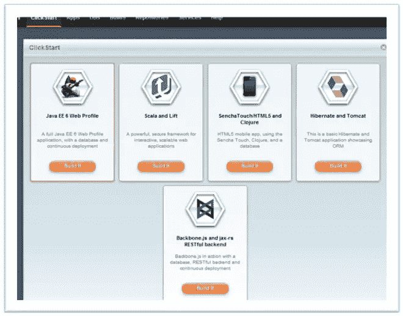
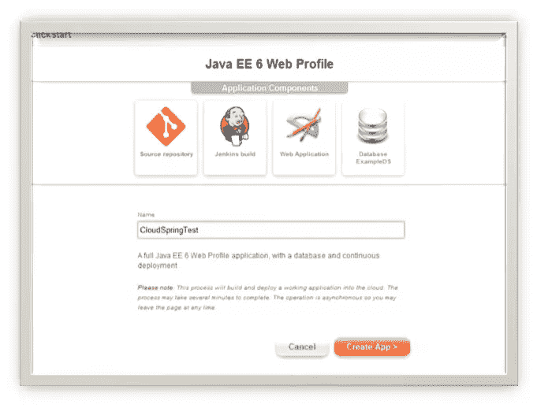
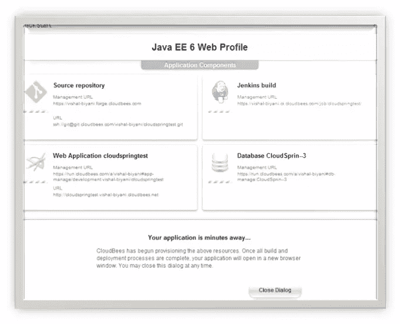

# 赢取 CloudBees 礼品…并查看点击开始！

> 原文：<https://www.sitepoint.com/cloudbees-clickstart-tutorial-and-giveaway/>

6 秒内从零加速到 60 英里每小时！这是超级马力自行车广告中的典型承诺，对吗？最近，随着技术变革的步伐，我开始想知道同样的承诺是否可能出现在我看到到处涌现的许多语言和框架中。然后我的愿望实现了 CloudBees 点击开始。

## 单击开始:单击并试驾

本教程将展示如何使用点击开始创建一个 Java EE 6 应用程序。在后台，单击开始将创建源代码库、示例 web 应用程序、数据库，并为应用程序设置 Jenkins build。

在控制台中使用 CloudBees 帐户登录后，您将看到创建 ClickStart 的选项，这将为您提供几个选择:



我们选择了“Java EE 6 web Profile ”,并给它起了个名字。下一个屏幕显示了将要创建的内容的详细信息。



事物正在被创造:



几分钟后，一切都设置好了，我们可以通过访问主页来检查应用程序。默认应用程序是一个简单的 Java EE 6 web 应用程序，由 maven 原型为 JBoss 创建。我们还可以将测试应用程序推送到存储库，Jenkins 将自动构建和部署应用程序。


## 在后台

让我们看看后台发生了什么:基于下面代码片段中的 JSON 描述符，CloudBees 获取了 WAR 文件并为您提供了整个应用程序堆栈！基于键值对，在运行时做出某些决定。例如，应用程序的运行时由 type key 的值定义为 jboss，而 Jenkins 构建类型被确定为 maven。语法由 CloudBees 定义，但理解和阅读起来相当简单。关于语法的更多细节[在这里](http://blog.cloudbees.com/2012/08/clickstarts-building-your-own-from.html)

```
{
 "id": "jboss-db-example",
 "name": "Java EE 6 Web Profile",
 "source": "git://github.com/CloudBees-community/jboss-db-example.git",
 "description" : "A full Java EE 6 Web Profile application, with a database and continuous deployment",
 "doc-url" : "https://github.com/CloudBees-community/jboss-db-example/blob/master/readme.md",
 "icon" : "https://raw.github.com/CloudBees-community/jboss-db-example/master/icon.png",
 "app-package" : "https://s3.amazonaws.com/cloudbees-downloads/clickstart/jboss-db-example.war",
 "runtime": {
 "type": "jboss"
 },
 "databases": [
 {
 "type": "mysql",
 "alias": "ExampleDS"
 }
 ],
 "build-with-jenkins": {
 "template": {
 "type": "maven",
 "options": {
 }
 }
 }
}
```

几秒钟之内，整个应用程序堆栈就已经部署完毕并开始运行。尽管我们尝试的应用程序相当简单，但还有一些可能性:

*   从点击开始试用“Scala and Lift”应用程序或“HTML5 with Clojure”应用程序。测试应用程序并检查代码，看看它是如何工作的。
*   构建您自己的定制“点击开始”并回馈社区。

## 赢得酷酷的 CloudBees 的东西！

CloudBees 是作为一个基于 Java 的 PaaS 平台而从头开始构建的，ClickStart 使技术/框架的测试只需点击一下。我们 CloudSpring 一直对新技术及其带来的好处感到兴奋。正是本着这种精神，CloudBees 与 CloudSpring 和 SitePoint 合作，正在分发 CloudBees T 恤、愤怒的小鸟糖果和 SitePoint 书籍的硬拷贝*在云中托管你的网站*。

也没有资格获得赠品

*   创建一个 CloudBees 帐户，测试点击开始，并在下面发表评论，说出您最喜欢的功能，或者
*   使用#cloudspring 和#cloudbees 这两个标签来发布这篇文章。

查看提供的大奖:

*   一等奖:一件 CloudBees T 恤和一份硬拷贝*在云中托管你的网站*
*   二等奖:一件 CloudBees T 恤和一家愤怒的小鸟糖果
*   三等奖:一份硬拷贝*在云中托管你的网站*

赠品将于 10 月 14 日结束。此后不久将选出三名获胜者。评论获奖者将收到电子邮件通知(请务必在联系表单中提供有效的电子邮件地址！)和 Twitter 获奖者的直接消息。

祝好运和快乐的点击开始！

## 分享这篇文章