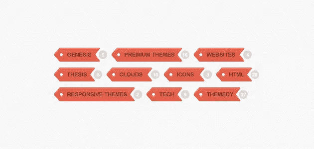
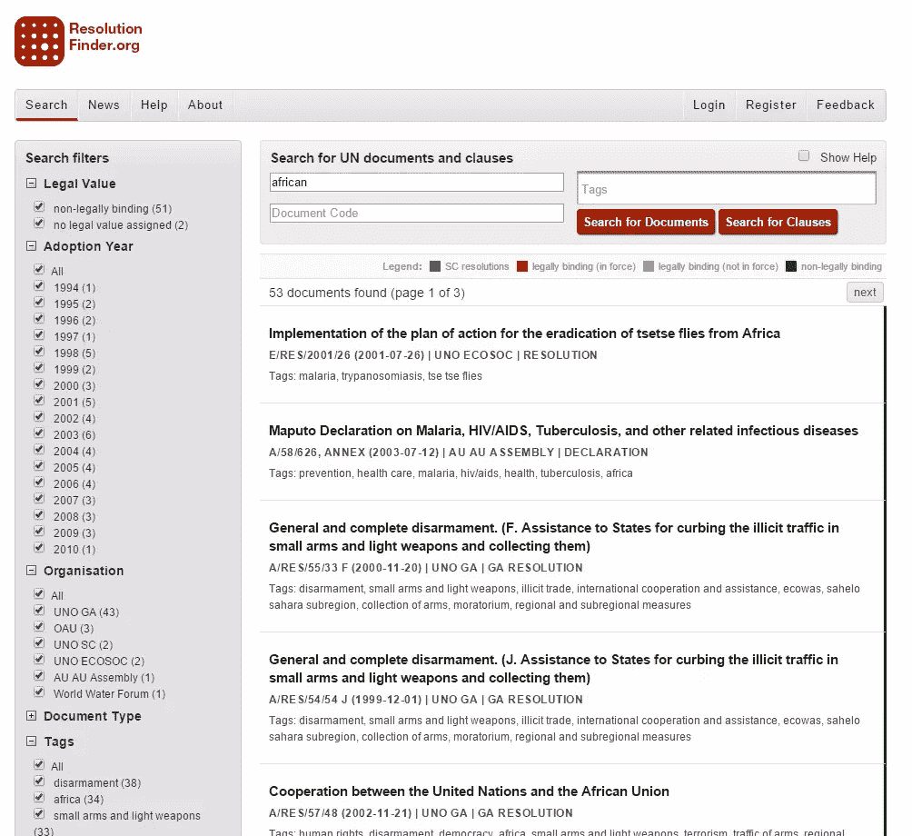
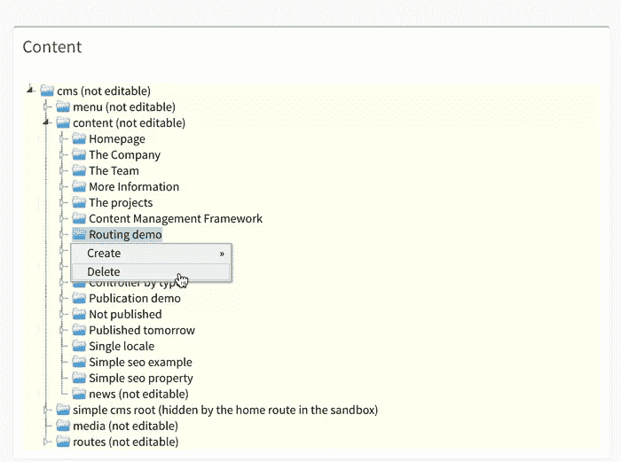

# CMS 内容组织结构:树 vs 刻面 vs 标签

> 原文：<https://www.sitepoint.com/cms-content-organization-structures-trees-vs-facets-vs-tags/>

本文讨论了在现代 CMS 中作为内容组织结构的树的状态，而不是其他方法。

*2015 年 2 月 18 日更新:这篇帖子得到了 Contentful 的回复，你可以在这里阅读[。](https://www.contentful.com/blog/2015/02/17/content-trees-tags-and-facets-in-contentful/)*

* * *

几年来，我一直对内容存储库感兴趣，它是现代 CMS 的一个重要方面。对于“现代”，我指的是不仅仅是“页面管理系统”的 CMS，而是实际管理内容的 CMS，从而使作者能够在不同的设备甚至不同的应用程序上重用他们的内容。这种兴趣最终导致了 [PHPCR](https://phpcr.github.io) 及其参考实现 [Jackalope](http://jackalope.github.io) 的诞生。本着这种精神，我对像 prismic.io 和 contentful.com 这样的服务非常感兴趣，它们本质上是提供内容存储库即服务。Prismic 的 UI 给我留下了特别深刻的印象。但是在评估这些系统时，我注意到一个令人惊讶的趋势:它们没有利用树，无论是作为原生存储概念还是可视化概念。相反，它们在很大程度上依赖于带有标签的扁平结构。我的直觉告诉我，这是一个错误，尤其是在管理较大的内容存储库时。与此同时，我在想:“我只是一只丢失了方舟的恐龙吗？”。

在去年秋天的一次会议上，我和 Ekke 讨论了这个话题，在简短的推特交流后，我们决定写下我们的想法。我在[大卫·温伯格](http://www.hyperorg.com/speaker/)的一篇[文章](http://hyperorg.com/blogger/misc/taxonomies_and_tags.html)中找到了额外的灵感，他帮助我将我的感受置于历史背景中，并解释了不同内容组织方法的优势，即:树、面和标签。此外，我还想提一下引用的概念，因为它们是由 Contentful 支持的。

## 介绍

树是上面提到的最古老的方法。原因很可能是它们在现实世界中工作得很好。好的旧纸质书，因为它们不需要复制内容。也就是说，每条信息都准确地放在一个地方。树木存在如此之久的事实也给了它们一个独特的优势:每个人都知道它们是如何工作的。然而，刻面和标签在很大程度上利用了数字时代的新可能性，因为内容可以很容易地同时存在于几个地方。但是仅仅因为树木早于数字时代并不意味着它们就是等待灭绝的恐龙。让我们首先来看看刻面和标记的一些优缺点。

## 标签

让我们从后者开始。标签很可能随着博客的出现而变得最受欢迎。从根本上说，博客是一个平面的，按时间顺序排列的内容列表。标签增加了一种有效的方式来表示给定文章的主要焦点主题，同时还提供了一个有用的过滤标准。通过在一个过滤器中组合多个标签，在许多情况下可以快速向下钻取。此外，由于每个标记本质上都是独立的，所以添加新的标记很简单。只要开始使用新标签，它就存在了。这比树形结构更简单，在树形结构中，需要决定一个新主题在树中的哪个位置最合适。

因为这样的标签对于允许众包分类也是有用的。但是在这里，我们也来到了标签的主要痛点:它固有的混乱。试图掌握无意中将内容放入不同“桶”中的同义词、缩写词和错别字，几乎需要与将主题放入树结构中一样多的工作，并且当标签后来被重命名/合并时，可能会导致混乱。当然，另一种方法可以是严格控制标签的创建，以防止这些问题的发生，但这样一来，人们就失去了很多标签有用的理由。此外，同音异义词给标注带来了很大的问题。例如，标签“苹果”可能与一种水果或电脑公司有关。一个常见的解决方案是引入像“苹果”这样的标签，但是这样标签就失去了它的优雅。这让我们回到为什么标签在博客上如此受欢迎。博客最初用于个人数字日记，从而降低不同作者的同义词导致同一主题重复标签的风险。此外，他们通常专注于一个特定的主题，从而减少了同音异义词的机会。

## 面状

方面在电子商务站点中变得特别流行，允许用户按照他们喜欢的顺序基于多个维度进行过滤。然而，它们基本上要求内容有一定的结构才能有效。虽然一本书的章节通常只是在大量文本之后提供一个标题，但是对于方面来说，应该进一步将文本分割成更多结构化的信息。然而，没有必要让所有内容都具有相同的结构。此外，就像使用标签一样，使用刻面可以在不同的地方找到相同的信息。

当很难预测某人将使用哪种策略来找到给定的内容时，方面特别有用。回到电子商务的例子——一个用户可能首先关注价格，然后关注颜色，然后关注面料，而下一个用户可能希望以完全不同的顺序深入了解。此外，方面也很棒，因为它们允许非领域专家用户在添加过滤器时，只需查看剩下的方面就可以发现相关的维度。作为内容提供商，通过简单地开始填充一些新的“方面”来提供新的方面也变得相当容易。也就是说，在搜索不同的内容类型时，也有可能遇到同音异义词的问题，但这种可能性比使用标签要小得多。例如，状态属性对于某些内容可能是一个数值，而对于其他内容可能是一个简单的标志。在这种情况下，通过一些额外的工作，甚至有可能动态地将标志转换为数值。

## 参考

参考文献也是由来已久。随着数字时代的到来，追踪参考文献变得更加容易。自前数字时代以来，它们就以脚注和索引的形式成为实体书的流行补充。在 web 上，只需点击一下鼠标，引用甚至可以被内联(例如，浏览器内联图像引用)。图像，或者更确切地说是一般的媒体内容，是许多 CMS 中使用的引用的一个很好的例子。

通常，文本内容和媒体内容保存在单独的存储容器中，这些容器通过引用连接在一起。这可能是因为创建媒体内容需要不同的技能和资源，同时还需要更多的存储，这意味着技术挑战也不一样。因此，媒体内容经常被重用，因此引用的使用是合乎逻辑的。引用是一个非常强大的工具，通过它不仅可以有效地构建树，还可以构建图结构。但是这种额外的能力也意味着，如果不主动遍历数据结构，就很难可视化和理解实际的数据结构。查询一个图结构往往需要专业知识，并且提供一个性能体验也是一个不小的挑战，只有非常专业的系统才能解决。

## 树

这又让我们回到了树木。在某种程度上，树的主要缺点也是它们最大的优点:将内容严格地分配到树中的一个位置。这需要仔细规划，并可能导致一个内容可能被放置在多个类别中的不确定情况。例如，一篇关于体育经济学的文章，可以放在“经济学”或“体育”下。这当然可以通过引用来解决，但是正如上面指出的，过度使用引用作为构建内容的手段会导致问题。

另一方面，这种僵化也让事情变得清晰了许多。最重要的是，树可以作为一种非常简单的继承建模方式，即使对于非开发人员来说也是可以理解的。这样，位置，即树中内容的上下文，提供了一条重要的信息。比如把一篇文章放在“运动”下面，表达了这篇文章是关于运动的。但除此之外，它还能表达多种事物。回到上面关于“体育经济学”文章的困境，将文章放在一个或另一个类别中也可以用来确定责任。也就是说，通过将它放在“体育”下，它还可以自动将权限分配给所有的体育编辑。有趣的是，它还可以帮助回到现实世界，例如，确定文章将出现在印刷版本的哪里。

可以说，树内的分类也支持面的加权。如果我在第一个维度中使用经济与体育，在第二个维度中使用出版日期，我会引导人们朝着探索内容的理想方式前进。内容的重点是给出特定日期的信息快照，还是特定的主题？显然在实践中，大多数树结构也支持引用，正如我之前所说，引用可以用来构建树结构本身。但是树结构的真正力量在于它们提供的上下文和自然的可视化。迫使尽可能多的内容保持在树的限制内确保了这种隐喻仍然有用，而过度使用引用将意味着它变得无效，需要更复杂的图形可视化。

## TL；dr；

总之，很明显，所有上述系统都有其优点。

标签非常适合管理符合以下一项或所有标准的内容结构:

*   专注于一个特定的主题
*   小型数据集
*   分类可以在内容创建之后进行

分面主要用于具有以下属性的内容:

*   从某种意义上说，内容是“结构化的”,内容的不同方面可以被合理地分开，并被赋予属性名称
*   不存在期望用户探索内容的单一方式

在以下情况下，参考或图形是理想的选择:

*   内容创作非常独特
*   内容本身是高度相关的

最后，树木是理想的:

*   当大多数内容适合一个固定的结构时
*   当专家有足够的时间将内容放入结构中时

在实践中，我们当然会看到很多混合系统。也就是说，许多博客支持标签和类别(本质上是深度为 1 的树)。许多树存储系统也支持引用，这也有效地启用了图形。

## 结论

我个人的观点是，任何管理大量数据的 CMS 都需要支持树。其他任何事情都会导致不可收拾的烂摊子。然而，具有较小内容集的系统，尤其是具有较小作者群的系统，也可以摆脱标记。只有在存储高度结构化(至少基于每个节点类型)的内容的系统中，分面才真正起作用。本着这种精神，我认为作为服务提供商的存储库需要提供对树的全面支持，包括结构化和可视化内容，以便能够处理更大容量的数据。如果他们想在不仅仅是提供大块文本和媒体内容的情况下取得进展，也需要提供 Faceting。

我要感谢[埃克](http://www.coolscreen.de)和[大卫](http://davidbu.ch)审阅这篇文章并提出各种改进

## 分享这篇文章