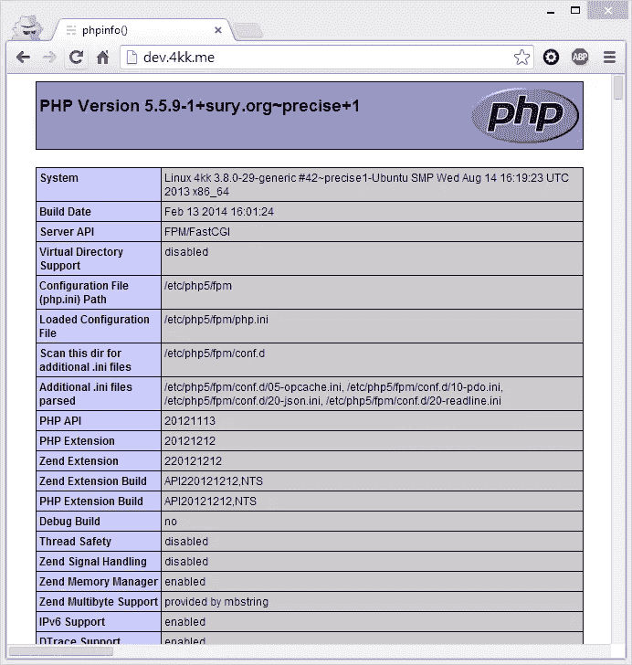

# CMS 对决:Nginx，Ghost，PHP 和 Phalcon

> 原文：<https://www.sitepoint.com/cms-showdown-nginx-ghost-php-phalcon/>

早在一月份，我就把为了健康步行 4000 公里作为我的新年决心之一。我已经在[幽灵](https://www.sitepoint.com/ghost-really-wordpress-killer/)部署的[博客](https://4kk.me)上记录了这个虚拟旅程(在 DIY 跑步机办公桌上进行)。

我的 Ghost 订阅已经过期，由于严重缺乏最基本的 CMS 功能，以及他们缺乏 PayPal 支持，我在 [DigitalOcean](https://www.digitalocean.com/?refcode=ccc3ee7d288d) 上重新部署了我自己的实例。你可能想知道为什么我在一个面向 PHP 的频道上写 Ghost——这个系列将是我能找到的各种基于 PHP 的 CMS 的摊牌，彼此对标，**对 Ghost** ，因为我在寻找下一个最好的选择。

### 设置

因为我的 DigitalOcean droplet 已经运行 Nginx 作为博客的反向代理，所以我也将把所有的 CMS 部署在同一个安装上，每个 CMS 都在自己的子域上。举例来说，如果我试用 WordPress(我不会——WP 是唯一一个我不会测试的)，它将可以在 [wp.4kk.me](http://wp.4kk.me) 上实时访问。默认的`www`子域仍将服务于基于 Ghost 的博客。

服务器也将启用 TLS，因为[它有意义](https://istlsfastyet.com/)。我将确保尽我所知优化所有的安装，并将听取每个人的意见，看看还能做些什么来充分利用他们所有的应用程序。使用像 NewRelic 和 AppDynamics 这样的应用程序性能监视器也不是不可能的，所有完成的集成都将接受[的性能审计](http://aerotwist.com/blog/my-performance-audit-workflow/)。我打算让这成为一项社区工作，并希望从尽可能多的来源获得提示和输入。

我将在 Ubuntu 12.04 上使用 Nginx，PHP 5.5。请注意，只要 PHP 更新到 5.6，环境就会更新——使用过时的软件是没有意义的。同样的，一旦 Ubuntu 14.04 发布，并且被有能力的人审查，我们将会转移到 LTS 版本而不是 12.04。升级程序将在适当的时候被完整记录。

实际的基准测试将在我的本地 SSD 驱动的机器上进行，在一个单独的实例中，每个安装都有一个相同的 travel box。这是因为每次测试都可以在相同的条件下在相同的服务器上进行。Apache Benchmark 将作为请求轰炸 app。当我们安装了至少 5 个 CMS 并在本地和现场运行时，第一个基准测试将会发生。

我还将为每个 CMS 的所有 4kk 帖子编写一个自定义数据导入程序，因此完整的数据就在那里，不需要伪造。这些导入器是开源的，你可以用它们将你的 Ghost 数据导出到我们这里提到的任何 CMS 中。

如果你想完全跟进你自己的 DigitalOcean droplet，请随时通过我的[推荐链接](https://www.digitalocean.com/?refcode=ccc3ee7d288d)开一个账户。然后，挑基本服务器用 Ubuntu 12.04。我选择了第二层的 droplet，它有 1GB 的 RAM，纯粹是因为我们将在一台服务器上运行如此多的应用程序。如果你不打算跟随每个 CMS，请随意选择最小的一个。

如果你也想安装 Ghost，你应该遵循这个教程。把它应用到最新版本的 Ghost 上，其他的都一样。

### 在 Nginx 上安装 PHP

在 Ubuntu 上，我们使用 ondrej PPA 来安装最新的 PHP，而不需要从源代码构建。Ondrej 的版本总是与最新版本相差最多一个次要版本(例如 5.5.9 对 5.5.10 ),并且安装起来比完全手动的过程简单得多。

```
sudo add-apt-repository ppa:ondrej/php5
sudo apt-get update
sudo apt-get upgrade
sudo apt-get install php5-fpm php5-dev
```

修改您的`php.ini`文件的时区，上传文件大小设置等。如果你像我一样使用 PHP 5.5+的话，不要忘记在 INI 文件的末尾激活 OpCache。在性能方面，它有着天壤之别。

现在让我们定义一个子域来测试我们的 PHP。我们将确保 URL `dev.4kk.me`输出`phpinfo();`。自然地，你应该用你自己的域名或者你的 droplet 的 IP 地址替换所有进一步的`4kk`实例，如果那是你用来测试的话。

### 在子域上设置虚拟主机

我为我的 droplet 创建了一个非根用户。DigitalOcean 使用 root 作为默认设置，但我倾向于在使用 SSH 时禁用 root 登录和所有密码登录，而是创建一个只有密钥的用户，通过它我可以在我的服务器上执行 sudo 命令。我假设你也会这样做——为了安全起见，你应该这样做。在您的服务器上创建一个新用户，并按照本教程进行操作，但是是针对该用户，而不是 root 用户。永远不要以 root 用户身份远程登录。

在我的例子中，这个用户被称为“swader ”,所以我将把我们将在本系列中构建的所有 PHP 应用程序放到`/home/swader/apps/php`父文件夹中。不存在就创建，再加一个子文件夹:`dev`。将您自己的用户名应用于以下所有示例中的路径。

`mkdir -p ~/apps/php/dev`

在这个文件夹中，创建标准的`phpinfo()`文件。称之为`index.php`:

```
<?php
    phpinfo();
```

现在我们需要为 Nginx 创建一个新的 virtualhost，在那个文件夹中查找 PHP 文件。这只是默认 Nginx Vhost 模板的一个副本，我们稍后会对 Nginx 进行微调。

```
server {
        listen   dev.4kk.me:80; ## listen for ipv4; this line is default and implied
        listen   [::]:80 default_server ipv6only=on; ## listen for ipv6

        root /home/swader/apps/php/dev;
        index index.php index.html index.htm;

        # Make site accessible from dev.4kk.me
        server_name dev.4kk.me;

        location / {
                # First attempt to serve request as file, then
                # as directory, then fall back to displaying a 404.
                try_files $uri $uri/ /index.html;
                # Uncomment to enable naxsi on this location
                # include /etc/nginx/naxsi.rules
        }

        #error_page 404 /404.html;

        # redirect server error pages to the static page /50x.html
        #
        error_page 500 502 503 504 /50x.html;
        location = /50x.html {
                root /home/swader/apps/php/dev;
        }

        # pass the PHP scripts to FastCGI server listening on 127.0.0.1:9000
        #
        location ~ \.php$ {
                try_files $uri =404;
                fastcgi_split_path_info ^(.+\.php)(/.+)$;
                # NOTE: You should have "cgi.fix_pathinfo = 0;" in php.ini

                # With php5-cgi alone:
                #fastcgi_pass 127.0.0.1:9000;
                # With php5-fpm:
                fastcgi_pass unix:/var/run/php5-fpm.sock;
                fastcgi_index index.php;
                include fastcgi_params;
        }

        # deny access to .htaccess files, if Apache's document root
        # concurs with nginx's one
        #
        location ~ /\.ht {
                deny all;
        }
}
```

访问 [http://dev.4kk.me](http://dev.4kk.me) 将会显示`phpinfo()`屏幕:



我们的主域现在显示 Ghost，我们的子域显示子域文件夹的 PHP 内容。

### 法尔孔

鉴于我们将要测试的 CMS 之一是 [PhalconEye](http://phalconeye.com/) ，我们也需要安装 Phalcon。最好马上把它处理掉。我们将在用户的主文件夹中创建一个`tools`目录，并从那里下载和安装:

```
mkdir ~/tools
cd ~/tools
```

然后，我们遵循标准安装程序。

```
git clone --depth=1 git://github.com/phalcon/cphalcon.git
cd cphalcon/build
sudo ./install
```

在您将行`extension=phalcon.so`添加到您的`php.ini`文件之后，不要忘记重启 php5-fpm，因为它在 Nginx 的情况下是作为一个单独的进程运行的，而不是作为 Apache 子模块运行的，Apache 子模块在 Apache 每次重启时都会重启:

```
sudo service php5-fpm restart
sudo service nginx restart
```

现在应该已经安装了 Phalcon，您应该能够在之前的`phpinfo`转储中找到它。

### 结论

在这一部分，我们配置了我们的 DigitalOcean droplet，链接了一些 Ghost 安装教程，安装了 PHP 和 Phalcon。我们还设置了一个子域来测试我们的初始 PHP 文件，以确保一切按预期运行。如果你想更深入地了解 HTTPS 是如何建立的，请在下面评论——我很乐意写一个专门的教程让 HTTPS 在 Nginx 上运行。在下一部分，我们将会看到我们的第一个 CMS 候选。

## 分享这篇文章