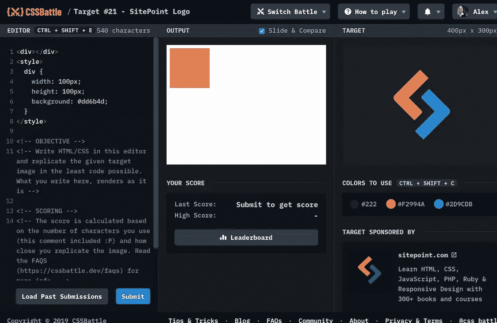

# 代码挑战#2:在 CSSBattle.dev 中获得高分的 4 个技巧

> 原文：<https://www.sitepoint.com/code-challenge-2-4-tips-for-higher-scores-in-cssbattle-dev/>

一个多星期前，你可能已经看到我们[发起了我们的第二次代码挑战](https://www.sitepoint.com/code-challenge-2-the-test-of-characters/)——与我们在 [CSSBattle.dev](https://cssbattle.dev/) 的朋友合作。CSS 之战是一个相对较新的概念——该网站于 4 月份推出——它们是如何工作的并不总是显而易见。



CSSbattle 中默认的输出和编辑器面板。

简单来说:

*   你的目标是只使用 HTML 和 CSS 创建一个“目标”图像的副本
*   你不能使用外部图像
*   您不能使用 SVG(甚至内联 SVG)或特殊字符
*   所有解决方案都会自动根据准确性和效率(字符数)进行评分
*   以最高分重新创建目标图像的玩家获胜

我必须承认，当我第一次看到这个想法时，我有点怀疑。怎么可能有人用不到一点点的 HTML 和 CSS 来创造这些设计呢？那是不可能的，是吗？

所以我尝试了，但大多都失败了——但我也学会了，并逐渐开始理解你需要的一些技巧。如果你好奇的话，我想我会介绍 4 个技巧来帮助你取得更高的分数。

**让我澄清一下**:当我写这篇文章的时候，我在这场战斗中排名第 24 位。到目前为止，我已经完成了所有的目标，[排名第 26 位](https://cssbattle.dev/player/alexmwalker)，所以毫无疑问，至少有二十几个玩家比我有更好的解决方案。然而，我很乐意分享我所知道的，并接受任何有更好想法的人的建议。

#### 提示#1:一个空的输出面板永远不会真的是空的

第一次加载任何目标时，你会看到类似上面的图片。您的编辑器总是预先填充了示例 HTML 和 CSS，提供了一个基本的开始位置。然而，即使你在你的编辑器中删除了**中的每一个字符**，你的输出面板仍然不会 ***严格来说*** 是空的。

为什么不呢？如果您检查输出面板的源代码(提示:现在关闭“滑动和比较”功能)，您会发现一个包含两个不可见元素的`<iframe>`——一个`<html>`和一个`<body>`元素。

正如你在下图中看到的，你可以看到他们用一行 CSS 呈现。当然，您可以完全自由地设计这两个 HTML 元素的样式，而不必花费任何字符来创建它们。


总是有一个 HTML 和一个 BODY 元素准备好了样式。

这并不意味着你从不添加你自己的 HTML 元素——`<DIV>`s，`<P>` s，`<I>` s，等等——但是总是尝试首先使用免费的'*内置元素*。

#### 提示 2:仔细选择你的测量单位

CSSBattle 的目标总是 400 像素宽，300 像素高，因此您可以正确地将中心点描述为`left:200px`(10 个字符)和`top:150px` (9 个字符)。然而，你可以像描述`left:50%` (8 个字符)和`top:50%` (7 个字符)一样简单地描述那个确切的位置。这相当于节省了 4 个字符。

虽然百分比并不总是*赢。位置`top:100px` (9 个字符)转化为`top:33.33%` (10 个字符)——一个倒退。要找到最合适的，需要反复试验。潜在有用的[测量单位](https://developer.mozilla.org/en-US/docs/Web/CSS/length)包括:*

*   像素:`px`
*   百分比:`%`
*   Rems: `rem`
*   Ems: `em`
*   英寸:`in`
*   毫米:`mm`
*   异食癖:`pc`
*   积分:`pt`
*   视口高度单位:v `h`
*   视口宽度单位:`vw`
*   四分之一毫米:`q`

最后一种单位类型——“q”——是一种相对鲜为人知的单位。但是因为它是一个单独的字符——我发现它在 CSS 战役中非常有用。我发现 50px 相当于 53 q。

还要注意，如果你没有明确声明一个单位类型，一些 CSS 属性会假设你指的是像素。换句话说，`width:80`的渲染与`width:80px`相同。高度和边距相同。另一方面，如果不声明度量单位，`box-shadow`就完全失败了。

#### 技巧 3: CSS 是一个级联——充分利用它。

CSS 真的很擅长‘继承’和‘专一’。继承允许子元素从它们的父元素获得样式。“特殊性”意味着宽泛的规则会被更仔细或最近声明的规则覆盖。

在 CSS 中最广泛的规则是`*`通配符，这意味着“*适用于所有元素*”。因此，以下规则将#222 背景应用于所有内容。如果我们不添加任何额外的 HTML，这是一个`<html>`和一个`<body>`。

```
*{background:#222}
```

如果我们遵循一个更具体的只针对`<body>`的规则，我们只需要设计`<html>`的样式，而不需要直接命名它——节省了 3 个字符。

```
*{background:#222}
body{background:#F2994A}
```

让我们更进一步。

在 CSS 中，只有当 X 是 Y (即`x>y{}`)的父代时，运算符“>”才意味着“*”。所以，如果我们写:*

```
*>*{...}
```

…我们说'*仅将此规则应用于任何其他元素*内的任何元素，换句话说，任何子元素。

因为 HTML 元素从来不是子元素，所以只有`<BODY>`得到第二个规则。我们救了另一个角色。

```
<style>
*{background:#222}
*>*{background:#F2994A}
</style>
```

#### 提示 4:浏览器很难用。让它们发挥作用。

一旦你得到了所有唾手可得的果实，就有一个点，那就是削减字符的唯一可行的方法是删除技术上需要但对最终渲染不是绝对关键的代码。你可能会说，现代浏览器会友好地看待你的简短和稍微不礼貌的代码。这包括但不限于:

*   删除结束语`</style>`
*   删除结束 HTML 标签(即`</p>`、`</div>`)
*   删除样式块的最后一个结尾`}`
*   删除大部分空格和回车。试错是你的朋友。

当然，在生产 CSS 中使用这种极端的优化是没有意义的。你会为了微不足道的节省而牺牲代码的可靠性。但是 CSSBattles 会教你更多关于浏览器是如何思考的，他们喜欢什么，不喜欢什么。

### 那么，CSSBattle 是在鼓励不良的编码习惯吗？

我听到一些人提到这是一个潜在的不利因素。事实上，CSS 元老 Eric Meyer 最近在 CSSBattle.dev Spectrum 反馈中提出了这个问题:

> 依赖利用解析器皱纹(特别是关于分隔空白)来获得较低的分数是有意的，还是副作用？
> –[埃里克·迈耶](https://spectrum.chat/css-battle/general/whitespace~5a1a4095-52ff-4f2f-bfa2-5a8cb173992e)

我不这么认为。对我来说，这是一种测试、试验并最终对 CSS 有更深理解的方式，而不是通过编写正常的、健壮的产品代码。

你可以拿日本俳句诗做一个很好的对比。俳句是一种建立在硬性限制之上的格式——3 行和 17 个音节的任意限制。

即使是世界上最伟大的俳句大师也不指望每天都用精心构思的俳句说话或写作。然而，这并不意味着当我们读(或写)俳句时，我们不能学到选词、节奏、平衡和美的重要课程。

写好的“CSS 战斗代码”并不等同于写好的“生产代码”——但是它会给你从别处得不到的教训。

## 分享这篇文章