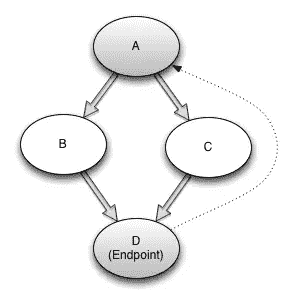
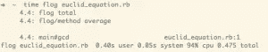
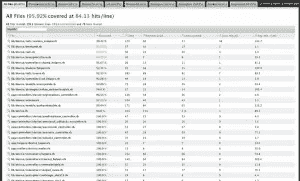

# 代码度量和你

> 原文：<https://www.sitepoint.com/code-metrics-and-you/>

今天，我想谈谈代码度量。花时间批判性地分析你的代码可以带来很多好处。它提供了一个视点，通过这个视点，您可以识别代码库中的问题区域。它可以给你信心，让你相信你正在达到你的目标，并在你挣扎的时候证实你的怀疑。然而，根据我的经验，使用代码度量的最大好处是深入了解您和您团队的编码风格。

既然我们已经建立了代码度量的一些好处，让我们来谈谈一些陷阱。不幸的是，像软件开发世界中的许多其他事情一样，代码度量并不是唯一的解决方案。用任何代码度量来衡量生产率都会导致程序员按照这个度量来编码。例如，如果度量标准是测试覆盖率，他们将编写一个针对每个文件运行断言的单一测试。这可能没有那么明显，但如果你围绕这些指标构建任何激励机制，它们就会被博弈。

另一个常见的陷阱是假设这些指标实际上意味着什么。度量可以为您提供洞察力，但是要使这种洞察力具有可操作性，您必须采取深思熟虑的步骤来确保确实存在问题。一旦你确定有问题，你需要看看这个问题是否值得修复。最后一件事，这些从来没有火灾和忘记工具。它们需要思考、时间和努力才能有用。

在本文中，我将介绍三种最常见的代码度量。我们将首先讨论圈复杂度，然后讨论 ABC 度量，最后我们将继续讨论测试覆盖率。对于其中的每一个，我将尽可能详细地解释它们是什么，并介绍一些您可以立即用来测试自己代码的工具。好的，我们开始吧…

## 圈复杂度

圈复杂度是程序正常流程中可能路径数量的图形化度量。 <sup>[ [1](#ccRef) ]</sup> 比如一个没有分支语句的程序，分值是 1。通过使用控制流图来计算方法的圈复杂度。这些图由节点和边组成。程序中的每个节点代表一个基本语句，每个边代表程序控制流的变化。这听起来很难理解，所以让我们看一个例子。

给定这块红宝石:

```
def cyclomatic_complexity_of_two(arg)
  if arg        # Node A
    puts "Foo"  # Node B
  else
    puts "Bar"  # Node C
  end
end             # Node D
```

我们将开始构建我们的图表。我们首先需要弄清楚我们有多少个节点、边和端点。我们只有一个端点，在方法的末尾。我们的`if arg`线代表一个节点，我们的`puts "Foo"`线和`puts "Bar"`线以及我们的端点也是如此。最后，我们的优势来自:

*   从 a 到 B
*   从 a 到 C
*   （back to back）背对背
*   c 到 D
*   我们的端点回到我们的入口点(虚拟边)

我们以四个节点、五条边和一个端点结束。一旦我们完成了所有这些，我们就可以通过取`Edges - Nodes + Endpoints` <sup>[ [2](#structRef) ]</sup> 来计算圈复杂度。上面方法的一个图看起来像这样:



如果你想了解更多关于圈复杂度的知识，请阅读这篇 Arthur Watson 和 Thomas McCabe 的论文。

### 优势

将这个数字保持在较低水平的优势是显而易见的。高圈复杂度表示代码可能难以理解。这也意味着代码更难测试和调试。保持较低的分数，可以确保您和您的团队能够更好地理解正在发生的事情并做出明智的决策。

### CC 入门

我们在红宝石之地的第一站是塞库洛。这是一个用来测量程序圈复杂度的程序。你可以在这里下载[，然后运行`ruby setup.rb all`。或者，您可以通过:`gem install atoulme-Saikuro`安装，它是主 Saikuro 存储库的克隆。我觉得后者更方便一点(也不像老派)。](http://Saikuro.Rubyforge.org/#install)

完成后，您可以使用以下命令运行您的第一个 Saikuro 报告。因为它会生成 html(或文本)报告，所以我建议为输出创建一个目录，并将其发送到那里。否则，默认情况下会将报告放在当前目录中。

```
~$ mkdir ./saikuro_output
~$ saikuro -c -o saikuro_output -p euclid_equation.rb
~$ open ./saikuro_output/index_cyclo.html
```

要查看选项 run `saikuro -h`，上面的命令告诉 Saikuro 创建一个报告:

*   圈复杂度(`-c`)
*   输出目录(`-o`)
*   并解析(`-p`)这个文件。

在 html 文件中，您会看到一份报告，其中给出了已解析文件的详细信息。

Saikuro 度量复杂性，但是我相信你知道，Ruby 是一种复杂的语言。Saikuro 在遇到(if，until，while，until，for，elsif，when)时会添加一个分支，但如果代码使用了块，也会添加一个分支。这里的合理性在于，在代码中使用块经常会改变控制流。

> 例如，如果数组不为空，调用带有块的数组的“each”方法只会遍历给定的块。<sup>[3](#saikRef)</sup>

Saikuro 还忽略了操作符`&&`和`and`，尽管在完美的世界中，这些会增加圈复杂度。

你可以让它递归地报告一个目录或者指向一个麻烦的类。如果你想更好地控制你对 Saikuro 的使用，你可以使用 gem 版本和:`SaikuroRunner.new.run(rb_files, output_dir)`。

现在你有了它，一个快速的报告工具，可以帮助你理解你的项目中哪里有多余的复杂性。一会儿，我们将看到这与另一个非常适合代码评估的项目——Flog 有多么相似。

## ABC 指标

幸运的是，在 ABC metric 上有几篇论文<sup>[4](#abcRef)</sup>已经被搜索得足够多，实际上已经可以用谷歌搜索了。无论如何，ABC 度量是另一种度量复杂性的方法，尽管它的创始人叫嚣着说它是对程序的**大小**的度量，类似于 LoC。无论哪种方式，这都是一种更好地理解您的代码可能存在问题的方法。

ABC 方法是一种收集每个组件(分配、分支和调用)的分数，然后计算出一个易于理解的分数的方法。公式是


并四舍五入到最接近的十分之一。分数以向量格式保存，看起来像`<a,b,c>`直到你想要总分，然后它被计算成标量格式。

### 优势

ABC 指标是一个简洁的衡量标准，因为它让您能够以一种非常容易理解的方式总结大量信息。因为这些信息很容易理解，所以很容易将其用于整个代码库。如果您理解这些数字是如何形成的，您可以使用它们来突出代码库中的问题区域。

让我们直接进入入门部分，因为我们要使用 Flog。

### ABC 入门

好了，我们要讨论的工具是 Flog。这是一个已经被广泛使用了很长时间的工具，所以你很可能听说过它，甚至可能使用过它。因此，我不会在安装上花太多时间，只要`gem install flog`你就可以开始比赛了。

关于 Flog，你需要知道的第一件事是，它是固执己见的。非常固执己见。评分是定制的，以应用普遍接受的 Ruby 设计模式。这样，我们需要认为 Flog 使用了一个修改过的 ABC 度量。例如，幽默地使用 inject(如果有点刻薄的话)可以让你[得两分](https://github.com/seattlerb/flog/blob/master/lib/flog.rb#L76)。

分支术语是`:and, :case, :else, :if, :or, :rescue, :until, :when, :while`。还有其他规则添加到分支总数中，但这是一个好的开始。作业很简单，每次作业分数加一。调用是将流带出当前范围的任何方法调用。

在 2008 年的一次演讲中，Jake Scruggs(metric _ fu 的作者)巧妙地总结了我在使用 Flog 时需要记住的经验法则:

1.  0-10 分–棒极了。但是它有什么作用吗？
2.  11-21–很好。
3.  21-40–可能需要重构。
4.  41-60–你可以证明代码的合理性。(即重构的成本阻止了行动)
5.  61-?–危险，尽可能进行调查。

好吧，那我们就用它吧。给定以下红宝石:

```
# euclids_equation.rb

def gcd(x, y)
  while y != 0
    r = x % y
    x = y
    y = r
  end
  x
end
```

我们可以用`flog ./euclids_equation.rb`对这段代码运行 Flog。我们得到了输出:



正如你所看到的，这个方法得到了 4.4 分。默认汇总还显示方法平均值；如果有更多的方法，这将反映每个方法的平均复杂性。Flog 有许多选项，包括对 1.8 和 1.9 语法的解析支持。如您所见，代码执行速度非常快，这使得它非常适合 githook。

检查代码复杂性并为任何高于 61 的分数返回非零值的预提交钩子工作得很好。而且既然你随时可以用`--no-verify`绕过，如果你不想麻烦的话，也不会妨碍你正常的工作流程。

现在你已经有了弗洛格的立足点，让我们来谈谈保险范围。

## 代码覆盖率

> 代码覆盖率是软件测试中使用的一种度量方法。它描述了一个程序的源代码被测试的程度。<sup>[6](#codeCovRef)</sup>

这似乎是一个简单的概念，但却有着惊人的深度。此外，用于描述覆盖类型的术语很难研究和消除歧义。在我们继续深入之前，我将描述几个术语，如果你想在你的项目中测量代码覆盖率，你应该知道这些术语。

*   C1 覆盖–这是基本语句覆盖(也是 simplecov 使用的)。最基本的测量之一。简单地测量每个语句通过测试被执行(或者至少被加载)。
*   C2 保险–这是分公司保险。测量流的每个边缘都有一个测试。

有许多其他类型的覆盖测量是有用的。如果你好奇，我推荐阅读这篇关于各种类型报道的[论文](http://www.bullseye.com/coverage.html)。我们将主要关注 C1 和 C2，所以我不再赘述。但是要知道有很多方法来定义测试覆盖率。

### 优势

跟踪代码测试覆盖率的优势是非常明显的。您将能够查看您的代码库中哪些区域是最安全的，哪些是最需要关注的。

一个警告:代码覆盖率如前所述，可以相对容易地进行游戏。确保这只是为了给你一个你所处位置的概念，而不是围绕它建立激励机制。与代码度量一样，当试图获得对程序的可操作的洞察力时，使用深思熟虑的判断力。

### 覆盖范围入门

如前所述，我们将使用`simplecov`。Simplecov 是一块宝石，可以很容易地集成到 Rails 应用程序或其他 Ruby 项目中，并提供一个时髦的小 html 页面来显示您的测试覆盖率。

安装比这里列出的前面的工具稍微复杂一点，但是仍然非常简单。将下面一行添加到您的 test/spec_helper 中，并运行您的测试。

```
require 'simplecov'
SimpleCov.start
```

然后打开`coverage/index.html`，你会看到类似这样的东西:


图片来自 simplecov 的 github 页面。<sup>[7](#simpleCovRef)</sup>

要查看突出显示的版本，其中红色显示未执行的行，您可以单击文件路径。基本上就是这样。

C1(语句覆盖率)是 simplecov 报告的内容，虽然您不能使用这些信息来量化您的程序到底有多健康，但是您可以使用这个概述来给你一个开始的地方。这对于遗留应用程序尤其有用，因为您可能还不知道问题出在哪里。

## 让我们回顾一下

我们看了这些:

1.  **圈复杂度**–一种通过程序正常流程的可能路径数量的图形化度量。
    *   sai kuro——分析圈复杂度并写一份很好的评估报告。
2.  **ABC metric**–一种收集每个组件(分配、分支和调用)分数的方法，然后计算出一个易于理解的分数。
    *   flog——一个自以为是的、健壮的命令行工具，运行 ABC 指标。
3.  代码覆盖率(Code Coverage)–软件测试中使用的一种方法，用来描述一个程序的源代码被测试的程度。
    *   simple cov——一个很好的测试覆盖报告工具，可以很容易地集成到 Rails 和其他 Ruby 项目中。

## 从哪里开始

上面讨论的所有工具都是开始的好方法。如果我今天开始使用代码度量，我会从 Flog 开始。有很好的资源可以提供如何使用它的信息，我相信它固执己见的本性会让你开始问一些你可能不会想到的问题。从使用 Jake Scruggs(见上文)提出的测量方法开始，这是一条经验法则，并认真思考复杂性从何而来。一旦您对 Flog 如何识别过于复杂的代码有所了解，就可以继续使用其他工具，并开始了解它们之间的关系。

首先构建一个包含代码度量的工作流。甚至不需要像 githook 一样复杂。也许在合并分支之前运行 Flog 成为一种习惯，或者在下一次代码评审之前运行一套度量标准。

希望这激起了您对代码信息兴趣。理解如何度量复杂性以及复杂性在代码中的位置对于开发来说是一个难以置信的优势。这篇文章甚至仅仅触及了代码度量的表面。真正聪明的人已经在这方面努力了几十年，它显示。有大量的资源可以探索这项研究的各个方面。去调查一下。哦，谢谢你的阅读。^_^

#### 参考

特别感谢 [@telemachus](https://twitter.com/telemachus) 和 [@pat_shaugnessy](https://twitter.com/pat_shaughnessy) 的编辑帮助。

1.  重新审视圈复杂度(infoq) ，Gavin Terrill，2008
2.  [“结构化测试:使用圈复杂度度量的测试方法学”](http://www.mccabe.com/iq_research_nist.htm)，亚瑟·沃森，托马斯·麦凯布，1996
3.  Saikuro 网站，Zev Blut，2005 年
4.  将 ABC 度量应用于 C、C++和 Java ，Jerry Fitzpatrick，1997
5.  使用度量来检查你的代码，Jake Scruggs，2008
6.  [维基百科代码覆盖率](http://en.wikipedia.org/wiki/Code_coverage)
7.  简单覆盖

## 分享这篇文章