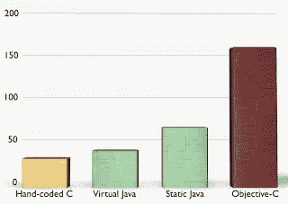
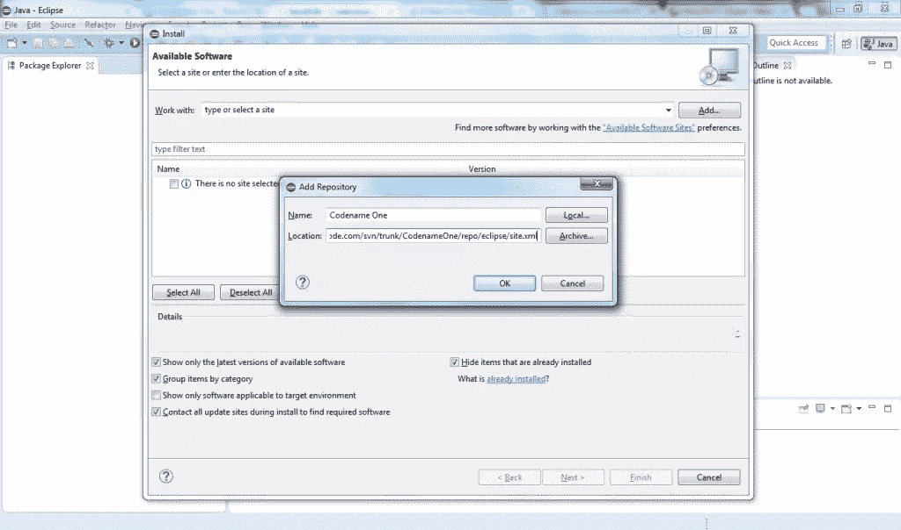
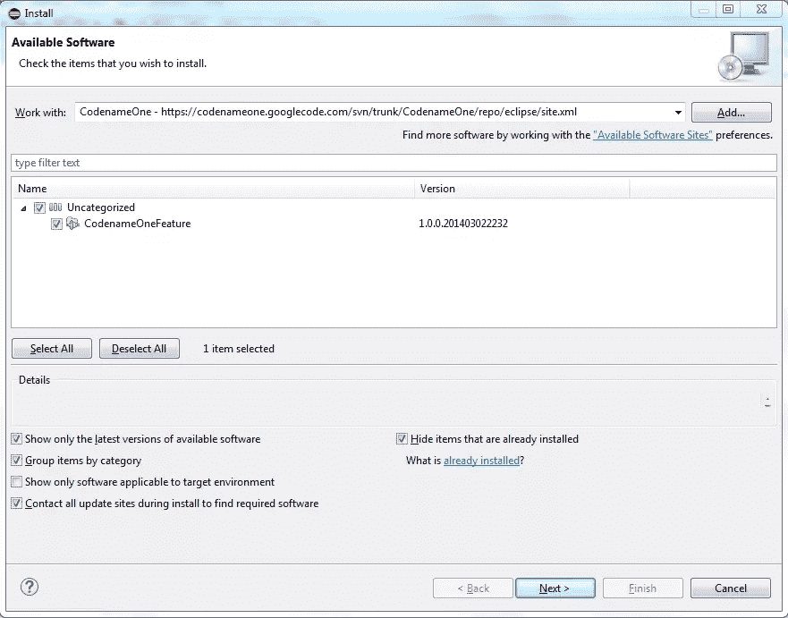
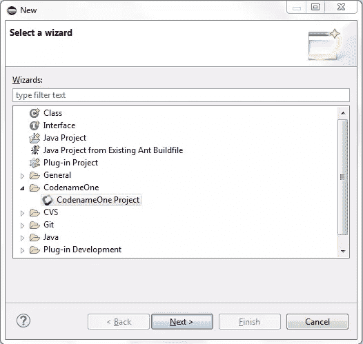
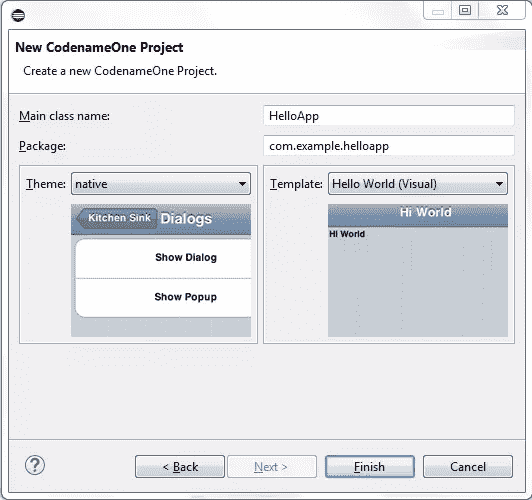
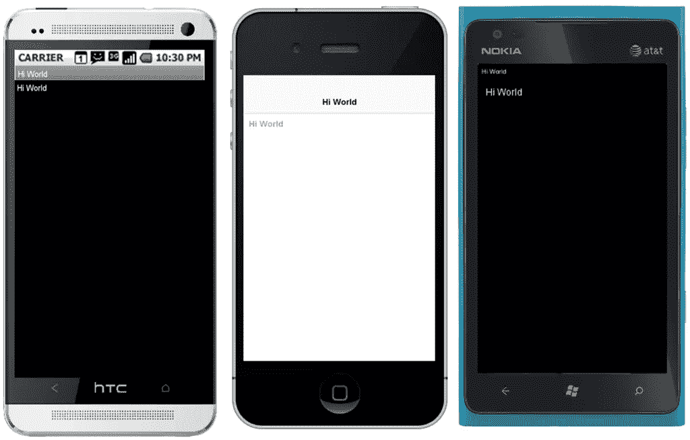
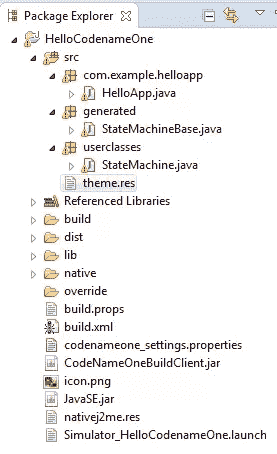
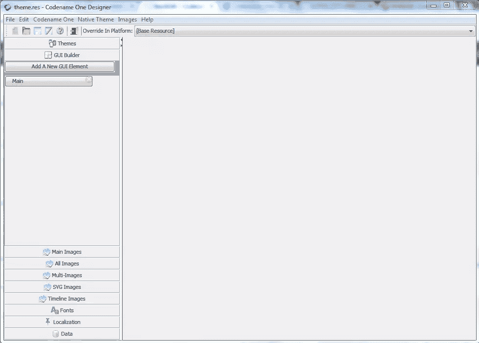
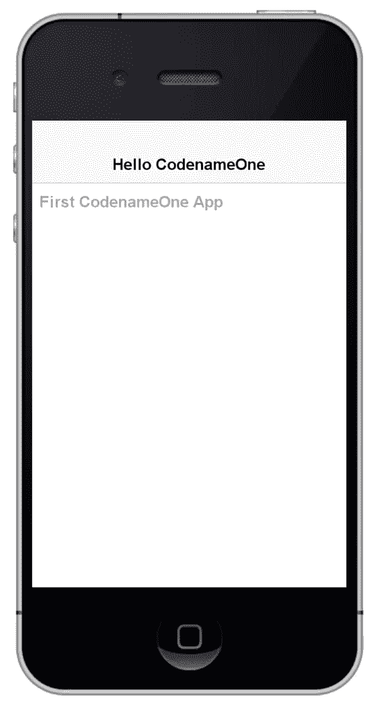

# 代号一，跨平台“原生”开发

> 原文：<https://www.sitepoint.com/codename-one-cross-platform-native-development/>

> “Java 已死”
> 
> “dotNET 杀死了 Java”

这些天我经常听到这样的话。但这是真的吗？Java **真的**死了吗？

与 JavaScript、Python 或 Ruby 等其他语言相比，Java 的学习曲线要陡峭得多。

人们不会简单地扼杀 900 万开发者选择的语言。一个人不能简单地杀死 Android 的[基础语言。最后，我们不能简单地取消](http://developer.android.com/training/index.html)*[跨移动平台语言](http://www.codenameone.com/index.html)。*

 *## 每个手机上都有 Java 等等，什么？

[Codename One](http://www.codenameone.com) 是一种使用相同的 Java 源代码为 Android、iOS、BlackBerry 和 Windows Phone 创建**原生**移动应用的方式。Android 原生应用使用 Java，而 iOS、黑莓和 Windows Phone 不使用。Codename One 将你的 Java 代码翻译成这些平台的本地代码，有时会产生比本地版本更快的*应用。*

代号一是[开源](http://www.codenameone.com/sources.html)用于商业和非商业用途。

## 代号一 vs 世界

还有其他平台也在做类似于 Codename One 的事情。使用 [Cordova](http://cordova.apache.org/) / [Phonegap](http://phonegap.com/) 你可以为任何设备开发混合的跨平台应用。Appcelerator 的 [Titanium](http://www.appcelerator.com/titanium/) 让你有可能使用在 Javascript 引擎中执行的 Javascript 创建几乎跨平台的应用程序(仅限 Android 和 iOS)。有 [Xamarin](http://xamarin.com/) 使用 C#进行跨平台开发，[但是你还是要写一些原生代码](http://xamarin.com/conteimg/pages/index/code-sharing.png)。

### 代号一和以上都不一样。

Codename One 拥有混合应用无法拥有的性能。本机应用没有 300 毫秒的延迟。用 CSS 和 JavaScript 创建应用程序可能很难调试，[许多这样的问题](http://www.excellentwebworld.com/common-problems-solution-for-windows-phone-8-phonegap/)在用 Codename One 开发时不会发生。

开发 iOS 应用不需要有 Mac，不需要任何原生 SDK。该应用程序构建在云中，使用一个[构建服务器](http://www.codenameone.com/codename-one-build-server.html)。构建完成后，应用程序可以下载到您的桌面上，或者直接下载到手机上。

Codename 一个人的构建服务器处理将 Java 代码转换为本机代码的工作，并且它产生令人惊讶的优化代码。使用 iOS，翻译后的 Java 代码比原生的 Objective-C 代码快 3 倍。唯一比这更快的是手工编码的 C，这不是一件容易的事。

## 装置

您可以在任何想要的 Java IDE 中安装 Codename One，比如 Eclipse、NetBeans 和 IntelliJ IDEA。但不是 Android Studio，因为它使用了不同的构建引擎。

你可以按照这些教程来学习 IntelliJ IDEA 和 NetBeans。我将展示如何安装 Eclipse。

在 Eclipse 中，打开*Help->Install New Software…*，然后 *Add…* 添加一个名为`Codename One`的存储库，位置如下:

`https://codenameone.googlecode.com/svn/trunk/CodenameOne/repo/eclipse/site.xml`

之后，选择所有项目并接受协议条款来安装 Codename One 插件。

重新启动 IDE 后，您可以通过按下 *CTRL/Cmd+N* 并从向导中选择 *CodenameOne 项目*来创建一个新的 Codename One 项目。

设置您的项目名称(我将它设置为`HelloCodenameOne`)。接下来，您可以设置主类名、包名，并选择主题和模板。

点击*完成*后，你会有一个基本的 Codename One 应用，在 IDE 中点击*运行*按钮即可运行。这启动了模拟器，代号一有很多。

## 如何 GUI？

每个开发人员都需要一个 GUI 构建者和设计者。代号 One 自带一个[设计师](http://www.codenameone.com/codename-one-designer.html)。

Codename One 将 UI 保存在一个资源文件中，可以在没有可用源文件的情况下进行设计。制作 GUI 不需要 Java，你只需要在屏幕上拖放元素。[代号一直播！](http://www.codenameone.com/codename-one-live.html)应用程序可以在您制作设计时实时预览您的设计。
你不必担心多重 dpi，因为设计者通过使用一种算法来缩放不同屏幕的图像，从而为你处理这些问题。

要打开设计器工具，在您的项目中搜索`theme.res`并双击它。

这将启动设计工具，您可以在其中定制您的主题，使用 GUI 生成器、字体、图像等等。

在 GUI 生成器选项卡中，单击*主*按钮。在屏幕的右侧，您将看到该应用程序的基本设计。您可以双击包含“Hi World”的标签来更改它们。我将一个设置为“Hello CodenameOne”，另一个设置为“第一个 CodenameOne 应用程序”。

保存并重新启动应用程序。您的新应用程序应该如下所示:

## 构建服务器

要将新的应用程序发送到构建服务器，右键单击项目并选择*codename one->Send { { platform-name } } build*。然后登录到您的 CodenameOne 帐户，应用程序被发送到构建服务器进行最后的添加，并可以下载。

## 结论

它使用世界上最常用的编程语言，最好和最流行的 ide，它速度快，并帮助您在任何地方部署本机。它是最好的 Java iOS 工具，保留了“一次编写，随处运行”(WORA)的原则。

**但是！**

当然，在这么多积极因素之后，肯定会有一些消极因素。代号一主要是成本。虽然上面讨论的许多功能都可以免费试用，但要将你的应用程序投入生产，你可能需要[一个他们的商业产品](http://www.codenameone.com/pricing.html)。权衡 WORA 与代号一的成本效益是你需要做出的决定。

## 分享这篇文章*