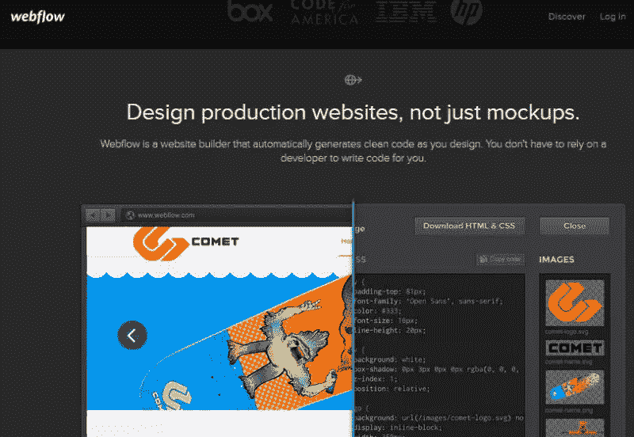
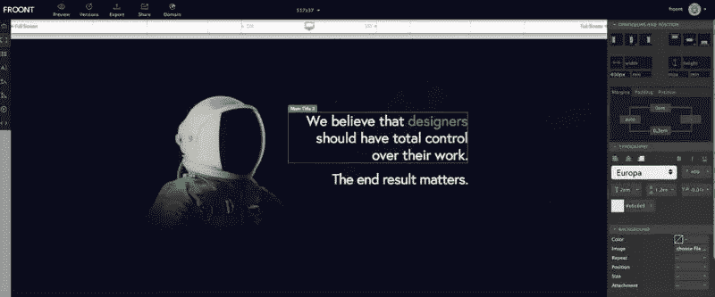

# 协同设计工具:是时候转换了吗？

> 原文：<https://www.sitepoint.com/codesign-tools-is-it-time-to-switch/>

当涉及到网页设计时，大多数实际的设计工作仍然是用像 PhotoShop 和 Illustrator 这样的工具来完成的，只是后来翻译成代码。

我们似乎被困在了时间隧道中——仍然使用图形设计工具进行网页设计。

网页设计完全是另一回事。细微之处不同于一般的平面设计。设计一个反应灵敏的布局，为转化而设计，为用户体验而设计都是游戏的一部分。

然而，我们仍然停留在使用上个世纪的工具来进行现代网页设计。难道现在不是我们转向更现代的工具的时候了吗？这些工具实际上是为网页设计而设计的。

在过去， [Wix](http://www.wix.com/) ，[weely](http://weebly.com)和其他网站建设者的主机击中现场，但在真正的设计自由和控制方面留下许多期望。总的来说，它们给人留下了如此糟糕的印象，以至于许多网页设计师甚至在今天都回避任何类型的网站“构建”工具。

但是我们知道技术会进步，软件会变得更好。也许是时候重新审视视觉网站建设者了？

在过去的几年里，出现了一批新的“网站创建”工具。像 [FROONT](http://froont.com/) 、 [Webflow](http://webflow.com) 、 [Macaw](http://macaw.co/) 和 [Webydo](http://webydo.com) 等专门为网页设计而打造的工具。Leigh Howells 称之为“*代码设计工具*”——让你为网络设计并在设计时为你创建网站(又名代码)的工具。

对一些人来说，这是一个激进的想法。我们对自己的工作方式如此根深蒂固，以至于很难理解另一种方法——用工具让你创建实时网站，而不仅仅是模型 ***和*** 在你进行的过程中为你生成代码。

虽然我对缩短开发周期和加快周转的前景感到兴奋，但让我们真正评估一下使用这些协同设计工具的利弊。

(在另一篇文章中，我将比较其中的一些工具，以便您可以更好地自己决定它们是否值得一试。与此同时，你可以在 [SmashingMagazine](http://www.smashingmagazine.com/2014/05/23/next-generation-responsive-web-design-tools-webflow-edge-reflow-macaw/) 和 [DavidWalsh](http://davidwalsh.name/website-builders-dont-suck) 获得一份精彩的摘要

## 使用协同设计工具的好处

**1。你在和真正的网络流打交道。不仅仅是创建网站的图片。**尽管许多工具模仿 PhotoShop 的用户界面，但在这里你不仅仅是在做静态设计。你必须实际创建元素和 div，并用真正的 CSS 对它们进行样式化——尽管是使用类似 PhotoShop 的界面，而不是编写代码。你是根据真正的 HTML 元素来设计的。

这迫使你去思考布局将如何流动，容器将如何放置，以及你的设计的整体复杂性。不用再想出复杂、扭曲的设计，也不用翻译成代码。所有这些都不需要实际编写一行代码。这对于渴望学习更多关于他们的技术和渴望做真正的网页设计的设计师来说是非常好的。

**2。不再炫耀模型。你可以演示现场网站！**你不再需要不停地给客户发送一堆 psd 文件，然后试着向他们解释在真正的网站上事情会是什么样子*只是有一点点不同*。

事实上，你也不用来回给开发者发一堆 psd 文件。不要再在演示前乞求快速修改代码。

这些新时代的工具会在你进行的过程中为你生成代码。也就是说，从第一天起，你就有了一个真正的网站，你可以向客户演示，你可以随时随地进行调整。这些变化几乎可以立即看到。

**3。更快、更高效的设计&开发周期:**虽然这直接来自于#1 和#2，但是需要明确地陈述。您能想象没有设计师和开发人员之间的多次反复，节省了多少时间吗？

虽然这些工具确实可以为您生成代码，但它可能并不完全兼容(Webflow 是唯一可以生成兼容代码的工具)，并且需要进行一些编辑，这意味着您仍然需要与开发人员合作，但编码周期将会更短、更快，设计人员和开发人员之间的迭代次数也将会减少。

**4。您的设计更符合您的愿景:**还记得您的开发人员告诉您，您包含的惊人功能无法编码吗？或者当现场直播的网站与你的设计相差甚远，让你想知道在从 psd 到代码的转换中出了什么问题？好吧，那都是历史了。有了这些协同设计工具，你实际上是在创建一个活的网站，代码等等。你会在最前面看到真正的网站——它从第一天开始就是有形的。你可以完全控制你的设计和你的网站。

**5。响应式只是 *waaay* 更简单:**我把最好的留到了最后。不再为不同尺寸的设备制作多个模型。当您试图向开发人员解释跨不同设备和视口大小的布局转换时，不再需要摸索。也不再纠结于媒体的询问。这些工具中的每一个都可以轻松地在正确的断点处构建布局过渡，只需点击几下鼠标。我不是说过这是最精彩的部分吗！

**6。不需要编码:**我没提到这些工具会为你生成代码吗？

## 何时避免它们

但这并不完全是小菜一碟。这些工具仍在开发中，在接管 PhotoShop 和 WordPress 之前还有一段路要走。如果您有以下需求或限制，您最好坚持使用当前的工具和工作流程。

**1。合规、兼容、优化的代码:**就像我之前提到的，Webflow 是唯一一个谈论合规代码和跨浏览器兼容性的。来自其他工具的代码通常很臃肿，并留下一些需要改进的地方。如果你需要符合标准的、兼容的、干净的和快速的代码——你可能需要一个开发人员来帮助你处理生成的代码。

**2。成熟的 CMS:** 如果你需要一个全功能的博客或 CMS，你需要考虑一下这个。Webydo 有自己的 CMS，不像 WordPress 那么广泛。Webflow 允许您导出设计，并将其作为后端与 WordPress 集成，但一旦导出，您就不能再在 Webflow 中编辑该设计。

**3。在不同的设计工具之间切换:**尽管这些工具中的大部分允许你导出代码，但是导入代码或设计的功能却非常有限，在某些情况下，甚至完全没有。

**4。你自己的主机:**这些工具中的大部分都有自己的专用服务器供你工作和托管你的站点。这意味着你和他们的主机绑定在一起，不是每个人都喜欢这样。当然，您可以导出代码，然后在任何您想要的地方托管它，但是请注意，这些工具没有导入选项。因此，一旦您导出代码，您几乎必须手工修改代码。

**5。其他高级功能:**同样，请记住这些工具仍然非常年轻，并且还在不断发展。如果你需要一个企业级的会员网站或一个成熟的商店，你可能需要三思而行——或者使用这些工具生成前端设计，并根据需要找出与其他后端框架集成的方法。

## 替代:站点 123

对于更简单的网站， [Site123](https://site123.com) 是一个网站建设者，有一个简单的定价系统，包括一个永远免费的计划，和一个 9.80 美元/月的计划，为那些需要自定义域名和更多存储和带宽的人。其突出的特点是其基于侧边栏的网站生成器，这使得布局页面比传统的拖放生成器更有效，并且它带有一系列精心设计的免费模板。

## 结束的

因此，虽然这些新的协同设计工具并不十分完美，但我相信它们确实给了设计师一种更新、更好的方式来创建网页设计——一种更明智、更符合网站结构、布局工作方式以及网站实际工作方式的方式——同时让设计师拥有更多控制权和权力。我真的很期待看到这些工具如何随着时间的推移而发展，以及它们被广泛采用的程度。

你试过这些协同设计工具吗？你的经历是怎样的？

如果你还没有尝试过，去试一试，让我们知道你的想法。

## 分享这篇文章