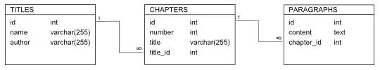

# 编码 Lorem Ipsum 替代方案

> 原文：<https://www.sitepoint.com/coding-a-lorem-ipsum-alternative/>

Lorem Ipsum 生成器是众所周知的，在网站开发期间用于生成文本副本。如果你想要一些比伪拉丁语更合你口味的东西，SitePoint 最近发表了一篇 Craig Buckler 的文章，介绍了十个经过实践检验的原创的最佳替代方案。

我们有大量的文本生成器可供选择，这很好，但是这些生成器到底是如何制造的呢？可以用 PHP 和 MySQL 自建吗？这正是我们在本文中要解决的问题。我们不会开发一个完全正常工作的网站；我们将涵盖的是建立一个网站，如 Fillerati 的基本要素。

## 来源和提取段落

这个项目被分成三个任务:获取文本内容，将其存储在数据库中，以及提供对内容的前端访问。我们将依次讨论这些问题，从寻找内容开始，从哪里开始比[古腾堡项目](http://www.gutenberg.org/)更好呢？古腾堡提供了数以千计的各种语言的公共领域文本，全部免费。

不幸的是，古腾堡的出版物中的 HTML 格式并不一致；这并不是对这个项目的批评，而是我们需要了解的使用他们的 HTML 的一个方面。一些段落元素根本不包含有用的文本——它们仅仅被用作段落之间的间隔。出于提供虚拟副本的目的，某些段落可能太长。这些是我们需要编码的细节。

如果格式不一致，为什么选择 HTML 而不是纯文本？简单:HTML 版本包含标识段落的标记，而段落是这个项目的核心。这不像扫描文本流中的`<p>`和`</p>`标签那么简单，但它给了我们一个良好的开端。

数据收集不会经常发生，所以我们可以将整个文件加载到内存中，这样更容易搜索标签和处理文本。我选择了由[查尔斯·达尔文](http://www.gutenberg.org/ebooks/search/?query=charles+darwin)撰写的关于物种起源的[的 HTML 版本。](http://www.gutenberg.org/files/1228/1228-h/1228-h.htm)

下载完 HTML 文件后，最好在编辑器中打开它，仔细阅读代码，看看我们遇到了什么。我们可以忽略第 426 行第一章标题之前的所有内容，我前面提到的空白应该被删除以使处理更容易。

以下是提取和清理文本的简单方法；它是一个循环调用的函数，用来扫描文件和提取段落。这样的循环不需要很复杂。

```
<?php
function extractContent($tag, $html) {
    $closeTag = substr($tag, 0, 1) . '/' . substr($tag, 1, 3);
    $startPos = strlen($tag);
    $endPos = strpos($html, $closeTag);
    $text = substr($html, $startPos, $endPos - $startPos);
    return array($closeTag, trim(preg_replace('/(\s){2,}/', ' ', $text)));
}

$html = file_get_contents($htmlFile);
$limits = array('min' => 200, 'max' => 2000);
$tag = '<p>';
$paragraphs = array();

$i = 0;
while (($pos = strpos($html, $tag, $i)) !== false) {
    list($closeTag, $text) = extractContent($tag, substr($html, $pos));
    // keep the content if it's a suitable size
    $len = strlen($text);
    if ($len >= $limits['min'] && $len <= $limits['max']) {
        $paragraphs[] = $text;
    }
    $i = $pos + strlen($tag) + strlen($text) + strlen($closeTag);
}
```

可以用最少的编码扫描整本书，寻找有用的段落。这包括对段落大小的简单检查，以消除任何太小或太大的内容。这个测试还有一个额外的好处，就是消除了用于间隔的标签。为了确保我们所拥有的是有用的，您可以在浏览器中显示一个示例，或者将其写入日志文件。

## 填充数据库

下一步是将这些段落存储在数据库中。请记住，我们正在构建 Lorem Ipsum 系统的准系统，因此不需要这样的数据库设计:



我们真正需要的是一张桌子:

```
CREATE TABLE paragraphs (
    id MEDIUMINT UNSIGNED NOT NULL AUTO_INCREMENT,
    content MEDIUMTEXT NOT NULL,
    PRIMARY KEY (id)
)
```

为了提高效率，我为`id`和`content`字段选择了大小合适的数据类型。对于存储许多出版物的大型全功能数据库，您可能希望使用`INTEGER`和`TEXT`数据类型。

现在我们可以将从 HTML 文件中提取的段落插入到数据库中。

```
<?php
$db = new PDO(DBDSN, DBUSER, DBPASS);

$query = $db->prepare('INSERT INTO paragraphs (content) VALUES (:content)');
$query->bindParam(':content', $content);
foreach ($paragraphs as $content) {
    $query->execute();
}
```

根据您为数据库选择的排序顺序，您可能需要对段落字符串进行转换。这是使用像 Gutenberg 这样的第三方数据源的一个小麻烦——不能保证文本使用与数据库相同的排序序列。查看 PHP 手册中可能需要的[字符串函数](http://php.net/manual/en/ref.strings.php)和[多字节字符串函数](http://www.php.net/manual/en/book.mbstring.php)。

## 简单的前端

最后一步是在浏览器中使用前端访问这些段落。前端应该如何提供对数据的访问只受到我们想象力的限制。例如，我们可以检索一定数量的段落，或者特定数量的文本，或者可能是四舍五入到最近段落的一些字符。我们可以选择连续的段落，或者我们也可以选择随机的段落。无论我们选择什么，我们都需要一个函数来读这个表。

```
<?php
function selectParagraph($db, $id) {
    $query = sprintf('SELECT content FROM paragraphs WHERE id = %d', $id);
    $result = $pdo->query($sql);
    $row = $result->fetch(PDO::FETCH_ASSOC);
    $result->closeCursor();
    return $row['content'];
}
```

出于演示的目的，我将介绍的算法使用一个简单的随机数生成器从数据库中选择段落。它需要知道段落记录的最大 ID 值，因此需要知道`$maxID`变量(假设 ID 值是连续的)。

```
<form method="post">
 <label for="slider">How many paragraphs do you want?</label>
 <input type="range" min="1" max="4" step="1" name="slider">
 <input type="submit" name="submit" value="Get Excerpt">
</form>
<?php
if (isset($_POST['slider'])) {
    $i = $_POST['slider'];
    while ($i--) {
        $id = rand(1, $maxID);
        $paragraph = selectParagraph($db, $id);
        echo '<p>' . $paragraph . '</p>';
    }
}
```

这就是这个项目的最后一部分！

## 摘要

在本文中，我们讨论了构建流行的 Lorem Ipsum 文本生成器的替代方案的基本方面。我们把它做得有多复杂，我们包括多少出版物和作者，我们把前端做得有多时尚，以及我们是否把我们的文本选择限制在一个特定的流派，完全取决于个人的选择。但是基本元素都与我们在这里讨论的相似，并且都是使用少量的 PHP 和 MySQL 构建的。轻松点。

本文附带的代码可以在 GitHub 上找到。你可以随意克隆它，并加以扩展。

<small>图片 via[Fotolia](http://us.fotolia.com/?utm_source=sitepoint&utm_medium=website_link&utm=campaign=sitepoint "Royalty Free Stock Photos at Fotolia.com")</small>

## 分享这篇文章