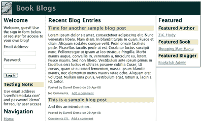
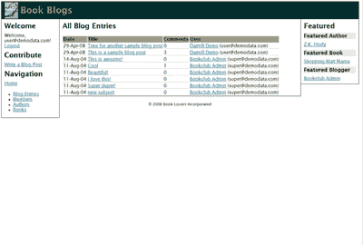
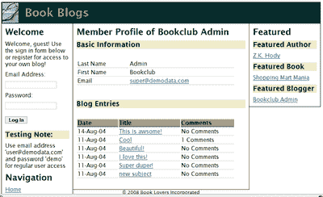

# 使用 ColdFusion 组件创建可扩展的应用程序

> 原文：<https://www.sitepoint.com/coldfusion-components/>

本文介绍了 ColdFusion 组件(CFC)。对于寻求将他们的技能提升到一个新水平的开发人员来说，CFC 是对工具包的一个无价的补充，它允许采用更专业的方法来开发 web 应用程序。

随着 ColdFusion MX 6 的推出，CFC 从此得到了开发人员社区的大力支持。如今，ColdFusion 8 对 CFC 的工作方式进行了重大和微妙的改进，其中包括主要的新功能，如紧密的 Ajax 集成，更不用说大大增强的性能了。

能够使用 CFC 进行开发使我们能够编写高度可维护和灵活的 ColdFusion 应用程序，并重用更多代码。更好的是，它还允许我们利用 ColdFusion 中新的和现有的强大功能，如自动 web 服务生成和强大的 Ajax 标记。

本文将涵盖以下主题:

*   什么是 CFC
*   为什么氟氯化碳是有用的，值得学习
*   如何撰写 CFC
*   如何以及从哪里开始在应用中使用 CFC
*   介绍 ColdFusion 中使用 CFC 的其他重要功能
*   给不熟悉 CFC 的开发人员的提示

##### 要求

***软件***

*   你可以在 Adobe ColdFusion 8 的试用版、开发者版、标准版或企业版之间进行选择——cold fusion 8 允许你在[购买](http://www.adobe.com/products/coldfusion/buy/)之前[试用](https://www.adobe.com/cfusion/tdrc/index.cfm?product=coldfusion)。)
*   你需要一个文本编辑器或者你选择的 IDE——Adobe Dreamweaver 和 T2 的 Eclipse/Adobe FlexBuilder 以及 T4 的 Adobe cold fusion Eclipse Extensions 是流行的选项，但是任何文本编辑器也可以使用。

***样本代码***

一组使用 CF8 附带的示例 BookClub 数据库的示例代码在这里可以找到[。](https://i2.sitepoint.com/examples/CFCs/cfc-book-blogs-demo.zip)

***必备知识***

假设用户熟悉基本的 ColdFusion 开发，包括用户定义的函数-如果您需要一般的复习或特定的提醒，请参考 [ColdFusion 文档](http://www.adobe.com/support/documentation/en/coldfusion/)。

##### 什么是 ColdFusion 组件？

ColdFusion 组件(CFC)是一种将相关函数和数据组合在一个文件中的方式，而不管它们在整个应用程序中的什么位置。一些 CFC 对特定的数据进行建模；其他的提供访问外部数据的功能。在本文中，我们将重点讨论后者。

当我们使用 ColdFusion 组件时，我们实际上是在使用一种面向对象编程(OOP)的形式。如果你以前没有参与过 OOP，不要感到害怕。为了阅读、理解和使用本文和 ColdFusion 组件，您不需要熟悉 ColdFusion 的面向对象功能。

##### ColdFusion 组件为什么有用？

不用组件也可以编写复杂的应用程序，但是在应用程序中使用 CFC 有助于使它们更易于维护和灵活，同时允许更多的代码重用。对于除一次性应用程序之外的任何应用程序，CFC 允许更好、更可靠、更可伸缩的应用程序。

这些优势源于将表示逻辑与业务规则和数据访问逻辑分离开来。生成直接输出的代码——比如普通的 HTML 标记和 ColdFusion 标签，比如`CFFORM`——往往会因页面而异。然而，业务和数据访问逻辑往往保持不变。

CFC 允许我们捕获这种业务和数据访问逻辑，并将其从页面标记中分离出来，实际上是在我们的应用程序中创建一个单独的表示层和业务层。改变表示层不太可能影响业务层，反之亦然。我们在任何地方做出的改变都可能会更小，因为我们不再重复不必要的重复。这是为我们的应用程序开发更好架构的良好开端。

作为一个额外的优势，在我们的应用程序中使用 ColdFusion 组件还允许我们利用 ColdFusion 的一些更强大的功能，如自动 web 服务生成、Ajax 控件和应用程序框架。

##### 示例应用程序

在本文的整个过程中，我们将使用一个示例应用程序来了解 CFC 如何用于应用程序中。使用这个 BookClub 数据库，我们将使用一个 web 应用程序，除了跟踪书籍和作者，还允许用户阅读和发布博客文章。让我们把我们的网站命名为“图书博客”

这个网站最初是一个传统的基于页面的 CFML 应用程序。几乎所有 ColdFusion 开发人员都是从这样的应用程序开始的。这张摘录自`bookblogs`、`members`和`blogs`文件夹的表格看起来应该很熟悉:

| `/bookblogs` | `/bookblogs/members` | `/bookblogs/blogs` |
| `application.cfm` | `memberList.cfm` | `blogEntryList.cfm` |
| `index.cfm` | `profile.cfm` | `blogEntry.cfm` |
|  | `editProfileForm.cfm` | `newBlogEntryForm.cfm` |
|  | `updateProfile.cfm` | `addBlogEntry.cfm/` |
|  | `register.cfm` |  |

应用程序中的其他文件夹具有类似的结构。除了单独的页眉和页脚包含文件(隐藏在`/bookblogs/layout`文件夹中)，我们的应用程序由用户可以访问的每个页面的 CFM 文件组成。每个 CFM 文件都包含了应用业务逻辑、访问数据库和输出结果所需的所有 CFML 代码。这可以通过检查`blogEntryList.cfm`文件的内容看出:

```
<cfset pageTitle = "Blogs" /> 

<cfinclude template="../layout/layoutQueries.cfm"> 

<cfinclude template="../layout/header.cfm"> 

<!--- Retrieve All Blog Entries ---> 

<cfquery datasource="#application.dsn#" name="blogEntries"> 

  SELECT * FROM BlogEntries 

  ORDER BY Posted DESC 

</cfquery> 

<h2>All Blog Entries</h2> 

<table width="90%"> 

  <tr> 

    <th>Date</th> 

    <th>User</th> 

    <th>Title</th> 

  </tr> 

  <cfoutput query="blogEntries"> 

    <tr> 

      <td>#dateFormat(posted)#</td> 

      <td>#username#</td> 

      <td>#title#</td> 

    </tr> 

  </cfoutput> 

</table> 

<cfinclude template="../layout/footer.cfm">
```

正如我们在下图中看到的，`blogEntryList.cfm`页面在数据库中查询博客文章的完整列表，并在一个简单的 HTML 表格中显示它们。这段代码没有什么挑战性，除了相同的 SQL 语句(以及业务规则)在应用程序的三个页面中略有不同。

首先，`blogEntryList.cfm`页面显示所有博客条目的列表，如图所示。



正如你对博客网站的期望，主页，或者更具体地说是我们的`index.cfm`页面，显示了最新博客条目的列表。



而`profile.cfm`页面显示特定作者的博客条目。



在开发过程中，在三个地方编写这样一个简单的`SELECT`语句可能看起来不太费力，但是通常是在源代码离开我们的手并且必须得到支持之后，问题才会出现。当我们回来修复一个 bug，或者添加一个批准特性，集成另一个数据源，或者简单地应用客户的最新请求时，我们发现我们需要修改和测试每个文件。如果没有好的文档和简单的代码库，甚至要记住我们需要更新哪些 CFM 文件都是有问题的。

自然，有一种更好的方法:定义一个`BlogManager` ColdFusion 组件来捕获所有与博客相关的业务规则和数据访问。这正是我们要做的。

##### 定义 CFC

将 ColdFusion 组件集成到现有应用程序中的第一步是定义它。每个 CFC 都应该清楚地了解自己的角色和职责。在我们的`BlogManager` CFC 的例子中，我们希望它捕获博客功能所需的所有业务规则和数据访问逻辑。

一旦做出了关于组件的重要决定，在 ColdFusion 中实现组件就很容易了。每个 CFC 都在一个文件中定义。文件名是组件的期望名称，扩展名为`.cfc`。在这种情况下，我们将在名为`BlogManager.cfc`的文件中定义组件。

我们的 CFC 几乎可以位于文件系统中的任何位置，但是如果它与使用它的代码不在同一个目录中，我们需要从 web 根目录或从 ColdFusion Administrator 中创建的映射中使用“点符号”语法来引用它。

在这种情况下，我们将把`BlogManager` CFC 放在主应用程序文件夹`bookblogs`下的一个名为`components`的子文件夹中，该文件夹直接位于 web 根目录下。因此，我们使用完整的组件名`bookblogs.components.BlogManager`来指代其他位置的组件。将 CFC 与 web 应用程序中的其他文件分开通常是一个好主意——它鼓励跨许多不同的页面重用，而不管它们在什么位置。

在我们的`.cfc`文件中，我们定义了我们的组件。我们的`BlogManager` CFC 最初看起来像这样:

```
<cfcomponent output="false" hint="Manages all Blog-related business rules  

    and data access">  

  <cfset this.dsn = application.dsn />  

  <cffunction name="getBlogEntries" access="public" returnType="query"   

      output="false"   

      hint="Returns a query containing all blog entries in  

            descending order by posted date">  

    <!--- Retrieve All Blog Entries --->  

    <cfquery datasource="#this.dsn#"     

        name="blogEntries">  

      SELECT * FROM BlogEntries  

      ORDER BY Posted DESC  

    </cfquery>              

    <cfreturn blogEntries />  

  </cffunction>  

</cfcomponent>
```

围绕组件中所有代码的是一组`<cfcomponent>`标签。在这些标签中，我们可以以独立语句和熟悉的用户定义函数(UDF)的形式编写普通的 CFML。我们在开始的`<cfcomponent>`标签上定义了两个属性:`output`和`hint`。尽管是可选的，但包含这两个属性被认为是一种良好的做法。

将`output`属性设置为`false`可以防止组件中的无关代码包含在页面输出中。`hint`属性允许您描述 CFC 的用途。这不会影响组件的操作，但会使其他开发人员更容易确定您为组件选择的角色和功能。

`<cfcomponent>`标签中的第一个元素是一个单独的`<cfset>`语句。组件中函数之外的任何代码——比如这个`<cfset>`——将在您第一次创建或调用它时被执行。这个特定的语句使用特殊的`this`范围存储数据库数据源的名称，供组件以后使用。随着您对 CFC 经验的增长，您会发现在组件中存储数据有很多用途。

在`<cfset>`语句之后是由`<cffunction>`标签定义的函数`getBlogEntries`。组件内部的函数通常被称为方法。除了必选的名称属性外，还定义了其他可选属性`returnType`、`output`、`hint`和`access`。`returnType`、`output`和`hint`是标准的`<cffunction>`属性，在这里与普通的 UDF 具有相同的含义。

属性指定了函数将返回的数据类型。您可以将其设置为简单或复杂的数据类型，例如`numeric`、`string`或`struct`。我们甚至可以使用组件名。如果我们提供此值，ColdFusion 将确保从函数返回的值与此数据类型匹配。输出和提示属性与`<cfcomponent>`标签上的相同属性相同。access 属性决定了哪些代码可以运行该函数，并在本文后面的“安全注意事项”中进行了全面讨论。包含这些属性是可选的，但被认为是最佳做法。

在`getBlogEntries`函数中，我们使用一个`<cfquery>`标签将一个 SQL 查询传递给数据库。注意我们如何访问这个`.dsn`变量来确定数据源名称。本例中的查询是固定的，但是您可以通过使用传递到方法中的参数轻松地动态生成查询。然后将查询结果返回给带有`<cfreturn>`标记的调用者。

这只是我们的新组件提供的可能性的开始。目前，它只能检索博客条目的列表。因为我们希望`BlogManager`组件处理与博客相关的所有业务逻辑和数据访问，所以我们还需要创建、读取、更新和删除博客条目的功能。虽然我们不会在本文中创建它们，但是这些方法可以在[源代码下载](https://i2.sitepoint.com/examples/CFCs/cfc-book-blogs-demo.zip)中找到。

然而，现在让我们看看如何在我们的应用程序中使用`BlogManager`组件和`getBlogEntries`函数。

##### 在 ColdFusion 应用中使用 CFC

在需要使用组件定义的功能的页面中，我们可以使用`<cfinvoke>`标签来执行该功能。`<cfinvoke>`标签是一个强大的标签，可以从它们的定义文件中创建组件并执行特定的功能。我们所需要做的就是指定组件、方法(记住，这只是函数的另一个名字)以及我们想要结果存储的位置。我们列出的所有可用的博客文章(`listBlogEntries.cfm`)可以更改为使用如下所示的组件:

```
<cfset pageTitle = "Blogs" />  

<cfinclude template="../layout/layoutQueries.cfm">  

<cfinclude template="../layout/header.cfm">  

<cfinvoke component="bookblogs.component.BlogManager"   

    method="getBlogEntries"   

    returnvariable="blogEntries" />  

<h2>All Blog Entries</h2>  

<table width="90%">  

  <tr>  

    <th>Date</th>  

    <th>User</th>  

    <th>Title</th>  

  </tr>  

  <cfoutput query="blogEntries">  

    <tr>  

      <td>#dateFormat(posted)#</td>  

      <td>#username#</td>  

      <td>#title#</td>  

    </tr>  

  </cfoutput>  

</table>  

<cfinclude template="../layout/footer.cfm">
```

如清单所示，我们已经完全移除了之前的`<cfquery>`并用`<cfinvoke>`标记代替了它。返回给我们用来构建 HTML 表格的`blogEntries`变量的查询是完全相同的。我们在页面中保存了几行代码，但更重要的是，我们的其他页面也可以使用这个功能，只需少量的修改。

我们的会员资料页面显示了该特定会员的博客条目列表，我们的主页仅显示有限数量的最新条目。如果我们给我们的`getBlogEntries`函数添加几个参数，我们可以使 SQL 动态化，并使该函数足够有用，可以从需要检索博客条目的所有页面中调用:

`<cffunction name="getBlogEntries" access="public" returnType="query"  
     output="false"  
     hint="Returns a query containing all blog entries,  
           optionally filtered by memberId and limited by to set  
           number of entries (supplied from the most recent) in  
           descending order by posted date">  
   <cfargument name="filterByMemberId" type="numeric" required="false"  
       default="0"  
       hint="If supplied, only blog entries by this member  
             are returned" />  
   <cfargument name="maxEntries" type="numeric" required="false"              
       default="9999"  
       hint="If supplied, limits the total number of blog entries  
             returned to this amount"  />  

   <!--- Retrieve Blog Entries, optionally filtered by member and  
         maximum number of rows returned --->  
   <cfquery datasource="#this.dsn#" name="blogEntries"  
       maxRows="#arguments.maxEntries#">  
     SELECT * FROM BlogEntries, Members  
     WHERE BlogEntries.username = members.email  
     <cfif arguments.memberId GT 0>  
       AND memberId = #arguments.filterByMemberId#  
     </cfif>  
     ORDER BY Posted DESC  
   </cfquery>              
   <cfreturn blogEntries />  
 </cffunction>`

这里我们使用可选的参数，使用`<cfargument>`标签定义，在每次调用方法时动态地改变我们的 SQL 语句。在查询中检查`filterByMemberId`参数；如果它不同于缺省值，一个额外的`WHERE`子句将应用于我们的 SQL 语句。另一方面，`maxEntries`参数总是应用于`<cfquery>`标签的`maxRows`属性，但是有一个非常大的默认值。

为了从我们的会员资料页面(`profile.cfm`)调用该函数，我们将对`<cfinvoke>`使用以下语法:

```
<cfinvoke component="bookblogs.components.BlogManager"  

    method="getBlogEntries"   

    returnvariable="theirBlogEntries">  

  <cfinvokeargument name="filterByMemberId" value="#url.memberId#" />  

</cfinvoke>
```

注意，我们现在使用嵌套标签`<cfinvokeargument>`，将成员 ID 传递给函数的`filterByMemberId`参数。类似地，在我们的主页(`index.cfm`)上，我们现在使用`maxEntries`参数调用组件函数来限制返回的结果:

```
<cfinvoke component="bookblogs.components.BlogManager"  

    method="getBlogEntries"   

    returnvariable="recentBlogEntries">  

  <cfinvokeargument name="maxEntries"  

      value="#application.numberOfBlogEntriesOnHomePage#" />  

</cfinvoke>
```

如果两个参数都没有提供，函数仍然像最初那样运行，这适合在博客条目列表页面上使用。

***注意:安全性考虑***
在本文前面我提到了出现在`<cffunction>`标签上的访问属性。该属性控制从哪里调用 CFC。ColdFusion 允许组件中的每个函数单独将该属性设置为下面解释的四个不同值之一:

*   `Private`:该功能只能从组件内部运行。
*   `Package`:该功能只能从组件内部运行，也可以从同一文件夹中的其他组件运行。
*   `Public`:该功能可以从服务器上的任何模板或组件运行。这是默认值。
*   `Remote`:可以从外部进程直接访问该函数，包括 Ajax 脚本、web 服务请求、Flex 和 Flash remoting，甚至可以直接在浏览器的地址栏中访问。

作为一般规则，您应该始终将访问级别设置为满足您要求的最低可能值。

##### 完成`BlogManager`

此时，将我们的业务和数据访问逻辑整合到单个组件中的优势应该开始变得明显。对底层数据或业务规则的任何更改都可以有效地对应用程序的其余部分隐藏起来。例如，如果我们被要求从所有页面中过滤掉未经批准的博客条目，我们只需简单地更改`getBlogEntries`函数的 SQL。同样，如果我们决定使用 RSS 整合来自独立书籍相关博客的新闻提要，这种改变不会影响其他应用程序页面。

为了完成`BlogManager`组件，我们需要添加创建、读取和更新博客条目的方法。我们还需要向博客条目添加评论的功能，并处理可用博客类别的列表。

BookBlogs 站点包含专门介绍书籍、作者和成员信息的页面。这些信息集中的每一组都有自己的业务和数据访问逻辑，这些逻辑可以从封装到 ColdFusion 组件(如`BookManager`和`MemberManager`)中获益。

整个网站，包括`BlogManager`、`BookManager`、`MemberManager`和其他 ColdFusion 组件的完整版本，可以在[源代码下载](https://i2.sitepoint.com/examples/CFCs/cfc-book-blogs-demo.zip)中找到。源代码还包含附加的提示和技巧作为注释。

到目前为止，我们已经在整个应用程序中集中了我们的业务逻辑和数据访问，并可能在未来的支持中节省了无数时间——但是现在是时候考虑更大的问题了！

##### 用含氯氟烃做更多事情

除了我们已经探索过的优势之外，CFC 的高度结构化特性允许 ColdFusion 与应用程序中的 CFC 定义紧密集成，从而不费吹灰之力就能提供令人印象深刻的功能。

使用氯氟化碳，我们可以:

*   通过将功能的访问级别更改为`remote`来自动发布 web 服务
*   将富 Ajax 控件直接绑定到 CFC
*   通过使用一个`application.cfc`文件来响应诸如应用程序启动、会话启动甚至丢失模板之类的事件
*   设计与外部服务和代理(如 JMS、SMS、Flex 消息传递和 Flash Remoting)通信的应用程序
*   有效地使用基于社区 CFC 的框架，自动化数据库代码等等

涵盖这些主题的基础知识将需要更多的文章！

##### 使用氯氟化碳的提示

ColdFusion 组件易于实现和使用。也许最困难的部分是决定如何、在哪里以及何时在应用程序中使用组件。本文展示了 CFC 在您的应用程序中的一个非常狭窄的用法，但是没有硬性的规则。以下是我个人关于如何有效使用含氯氟烃的建议:

*   其他形式的重用，如页面模板、自定义标签和单独的 UDF 仍然有它们的用途。CFC 真正闪光的地方是捕捉特定的业务规则和数据访问逻辑。另一方面，定制标记和 UDF 非常适合于不特定于任何业务需求的通用输出和数据操作任务。
*   围绕独立的相关数据和功能组织 CFC 非常重要。给你的 CFC 起一个反映具体目标、明确定义的业务概念甚至是职位的名字，可以帮助 CFC 专注于他们的职责。
*   使用`<cfcomponent>`和`<cffunction>`标签上的提示属性记录您的 CFC。这些提示虽然是可选的，但对于手动和通过组件资源管理器检查源代码都很有用。当其他人必须使用您的代码时，或者当您需要在开发之后能够理解它时，文档是很重要的。
*   了解更多。ColdFusion 组件是您更好地理解面向对象编程和利用 ColdFusion 最强大功能的门户。

##### 从这里去哪里

我推荐以下资源来了解 ColdFusion 组件的更多信息:

*   [Adobe ColdFusion CFML 语言参考、开发人员指南和一般文档](http://www.adobe.com/support/documentation/en/coldfusion/)
*   [Adobe ColdFusion 开发人员中心，ColdFusion 组件区](http://www.adobe.com/devnet/coldfusion/cfcs.html)

##### 结论

在本文中，我们发现了什么是 ColdFusion 组件，它们是如何定义的，以及如何设计其他页面来使用它们。虽然这足以让你开始，但我们仅仅触及了 CFC 的皮毛。

最终，CFC 帮助 ColdFusion 开发人员编写可维护且灵活的应用程序，这些应用程序可以随着时间的推移而增长和发展。更好的是，它们通过代码重用，以及稍后通过使用 ColdFusion 的高级功能(如 Ajax 控件和 web 服务生成)来节省您的工作。你会感谢自己花时间去了解他们！

请记住，您可以[下载本文中给出的示例的完整代码档案](https://i2.sitepoint.com/examples/CFCs/cfc-book-blogs-demo.zip)。

## 分享这篇文章