# 设计颜色:绿色

> 原文：<https://www.sitepoint.com/color-in-design-green/>

到目前为止，在这个系列中，我们已经看了蓝色和红色在设计中的应用。今天轮到绿色了。像蓝色一样，绿色与自然和成长密切相关。“四十度绿色”这个词当然是恰当的，当你想到许多绿色色调的名字时，你就会明白为什么:海绿色、祖母绿、草绿色、苹果绿、森林绿、树叶绿、鼠尾草绿、橄榄绿、豌豆绿、冷杉绿和苔藓绿等等。

仅仅考虑语言和常用短语就可以帮助设计师决定他们使用绿色传达什么样的感觉。绿色有许多好的内涵:获得绿灯，搬到更绿的牧场，赚一些美元。同样，绿色也有其黑暗或不吸引人的含义:绿眼睛的怪物，感觉周围都是绿色，仅仅是绿色，即没有经验。我不认为许多设计师想要表现出绿色，也不希望网站的访问者感到恶心。

**使用绿色**

有这么多的绿色色调，这是一个非常灵活的颜色。它可以在色轮的黄绿色侧是温暖的，在蓝绿色和海蓝宝石中是凉爽的。酸橙绿可以让设计流行起来，橄榄绿则柔和得多，而浅绿色可以给人一种清新的春天的感觉。绿色和蓝色的结合传达了水的感觉。加入米色或棕色会给人一种泥土气息。白色和绿色是清新和户外的，而紫色和绿色是高对比度的(需要小心处理)。

**绿色标志**

在以前关于设计中的颜色的文章中，很容易挑出大量非常著名的标志，但当谈到绿色时，我发现很难想到一些真正知名的以绿色为主色调的全球品牌。(虽然我确实想出了一些，但我必须感谢一些帮忙的 Twitter 朋友。)在大公司的世界里，绿色似乎没有红色或蓝色受欢迎。请随意添加到列表中。以下是一些例子:

[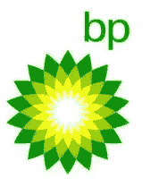 ](https://www.sitepoint.com/wp-content/uploads/2010/01/bplogo.png) [ 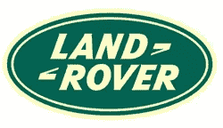](https://www.sitepoint.com/wp-content/uploads/2010/01/landrover.png)

[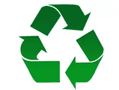 ](https://www.sitepoint.com/wp-content/uploads/2010/01/Recycle.png) 

[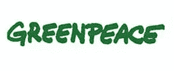](https://www.sitepoint.com/wp-content/uploads/2010/01/GreenPeace.jpg)

下面你会看到 10 个网站，根据它们的内容和受众，用不同深浅的绿色标出。你认为这些地方使用绿色怎么样？

[马来西亚鸟](http://www.bird-malaysia.com/)

[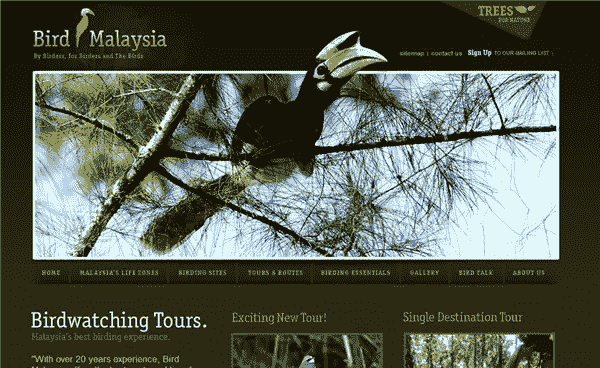](https://www.sitepoint.com/wp-content/uploads/2010/01/BirdMalaysia.png)

[叶片跨度](http://www.leafspan.com/)

[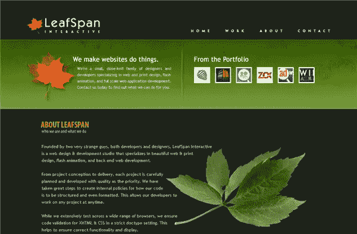](https://www.sitepoint.com/wp-content/uploads/2010/01/leafspan.png)

[侦察兵](http://www.scout.com.au/)

[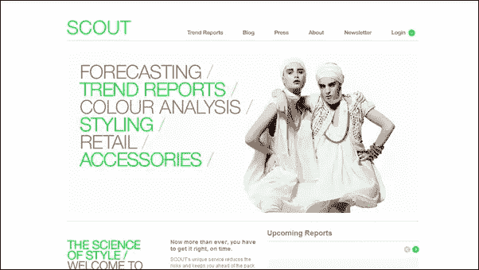](https://www.sitepoint.com/wp-content/uploads/2010/01/scout.png)

[I-Avion](http://www.i-avion.com/)

[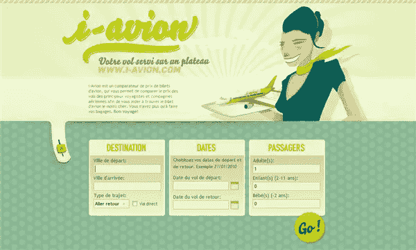](https://www.sitepoint.com/wp-content/uploads/2010/01/iavion.png)

[水果盒](http://www.thefruit-box.co.uk/)

[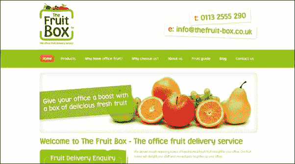](https://www.sitepoint.com/wp-content/uploads/2010/01/FruitBox.png)

托林戈

[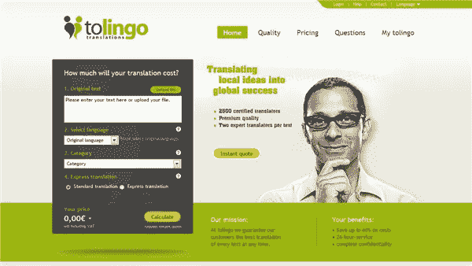](https://www.sitepoint.com/wp-content/uploads/2010/01/tolingo.png)

[Come2Play](http://www.come2play.com)

[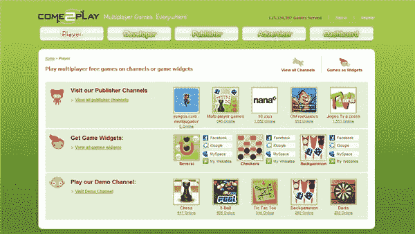](https://www.sitepoint.com/wp-content/uploads/2010/01/Come2Play.png)

[媒介](http://www.the-medium.net/)

[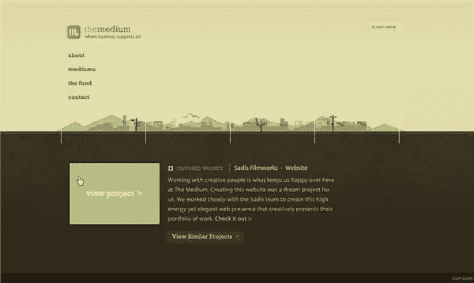](https://www.sitepoint.com/wp-content/uploads/2010/01/TheMedium.jpg)

[版本 App](http://www.versionsapp.com/)

[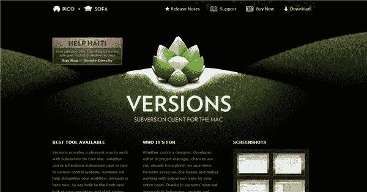](https://www.sitepoint.com/wp-content/uploads/2010/01/versions.png)

[银背鹦鹉](http://www.silverbackapp.com/)

[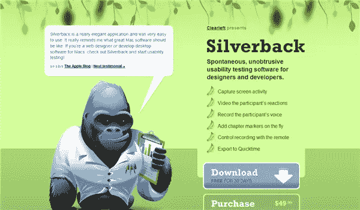](https://www.sitepoint.com/wp-content/uploads/2010/01/silverback.png)

你喜欢绿色吗？

## 分享这篇文章