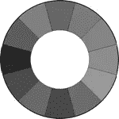
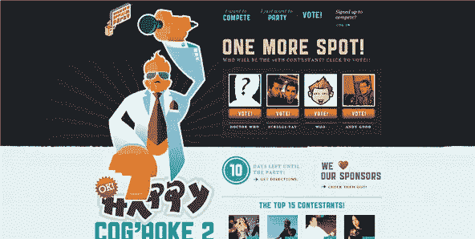
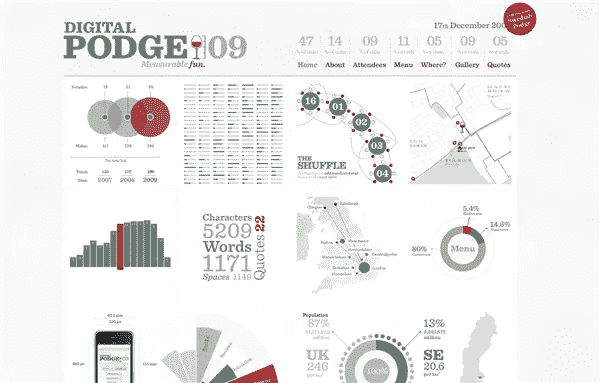
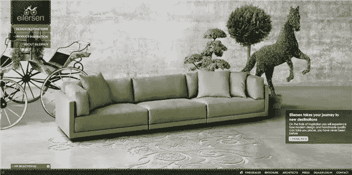
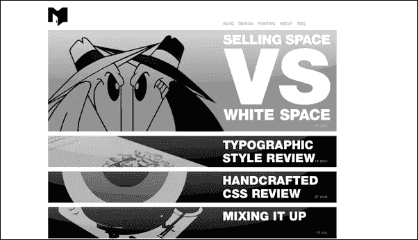
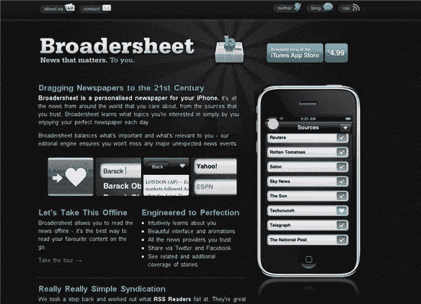
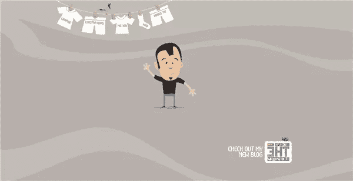
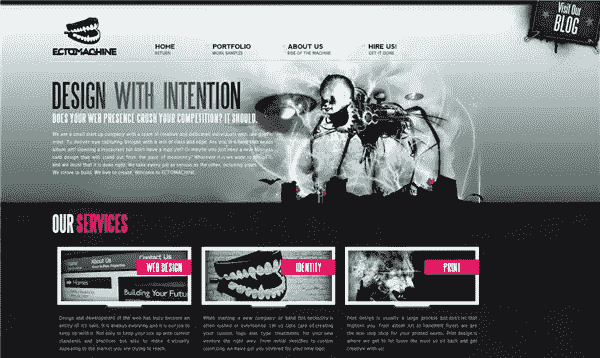
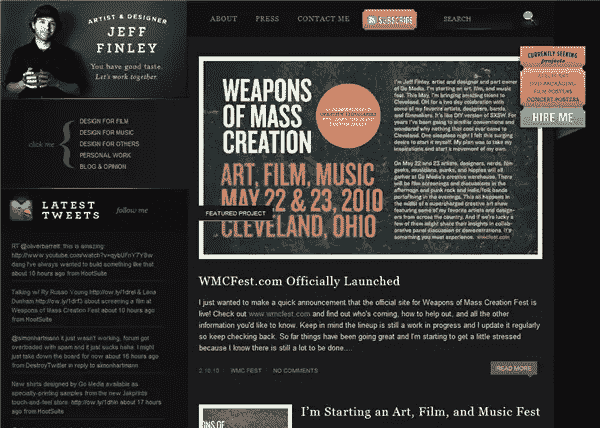
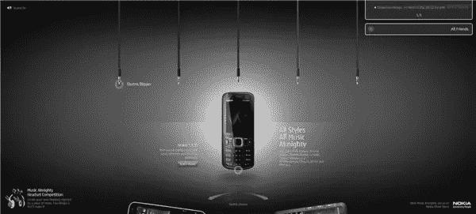

# 设计中的颜色:灰色

> 原文：<https://www.sitepoint.com/color-in-design-grey/>

 在这个系列中，我们已经看到了彩虹中几乎所有的颜色，以及它们在设计中的应用。在这篇文章中，我们几乎看不到颜色，因为今天，我写的是灰色。灰色是一种平衡的中性色，在网页设计中非常流行。它不会像红色、[、橙色](https://www.sitepoint.com/color-in-design-orange/)或[紫色](https://www.sitepoint.com/color-in-design-purple/)那样唤起特别强烈的情绪(也许除了坏情绪)。它不像黑色那么确定，但是一个非常深的灰色可以以几乎相同的方式完成任务。同样，非常浅的灰色不像白色那样鲜明，但它有时可以填补白色占据的空间。

灰色有积极和消极的含义。“灰质”是与智力和脑力联系在一起的，而“灰色”这个词本身是用来描述一些无聊乏味的东西。灰色西装是企业界的制服。灰色包括木炭色、青铜色、粉末色、灰色、铅色和石板色。

**灰色设计**

灰色很难走得太远。它似乎适合几乎所有的颜色。因为它是中性的，所以经常被用作背景色。它让其他颜色流行起来。如前所述，可以用浅灰色代替白色，用深灰色代替黑色。要获得更温暖的土灰色，使用灰褐色，这是一种灰褐色。

用灰色搭配柔和的粉色会产生一种女性化的感觉，而深色搭配灰色会产生一种男性化的感觉。深灰色搭配[红色](https://www.sitepoint.com/the-passionate-color-red/)或[橙色](https://www.sitepoint.com/color-in-design-orange/)是一个特别抢眼的组合。看看下面的电影海报。

灰色经常被用作投资组合的背景色(在线和离线)。它允许照片，插图或其他色彩元素出现在最前面，同时为投资组合提供一个坚实的支柱。将大部分版面设计成灰色几乎会使背景消失，但会使其他元素和颜色真正突出。

**网站使用灰色**

本周，找到大量设计精美的网站真的不难。灰色作为背景色以及标题和正文都非常受欢迎。这是十个做好事的灰色网站。

好吧，操阿科

[数字时代 2009](https://www.digitalpodge.co.uk/2009/)

[艾勒森](https://eilersen.eu/)

克里斯托弗·米克斯

[更宽的工作表](https://iphone.broadersheet.com/)

[【Ricardo gimmenes】](https://www.ricardogimenes.com/)

[外切机](https://www.ectomachine.com/)

杰夫·芬利

[诺基亚音乐全能](https://europe.nokia.com/microsites/music-almighty)

现在你知道了。你是灰色的粉丝吗？你还喜欢其他漂亮的网站使用这种中性色吗？

## 分享这篇文章