# 设计中的颜色:橙色

> 原文：<https://www.sitepoint.com/color-in-design-orange/>

 继上周通用的[绿色](https://www.sitepoint.com/color-in-design-green)之后，今天我们来看看颜色[橙色](https://www.sitepoint.com/color-in-design-green/)及其在网络和标识中的应用。橙色是红色和黄色的结合，是一种温暖而充满活力的颜色，象征着活力和华丽。它没有[红色](https://www.sitepoint.com/the-passionate-color-red/)那么强烈或咄咄逼人，但可以用类似的方式抓住注意力，突出设计的重要区域。

橙色设计通常传达一种友好的感觉，在合适的人手里可以保持严肃和专业。不好的一面是，橙色有时与廉价联系在一起，因为像 Easyjet 这样的公司把他们所有的产品和服务都涂上亮橙色。不过总的来说，这是一种吸引注意力的好颜色，不会冒犯或妨碍任何人。

作为一种柑橘类水果，橙子传达了夏天、阳光、维生素 C 和健康的信息。它也有秋天和变化的内涵；秋叶从绿色变成橙色再变成棕色。根据你的听众，你可能会选择非常明亮的黄橙色或更秋天的橙棕色。

**使用橙色**

如前所述，你可以用橙色作为前景色来突出重要的元素，或者作为主要的背景色来传达热情、活力和温暖的感觉。没有尖叫，橙色做了一个大声明。

 [ 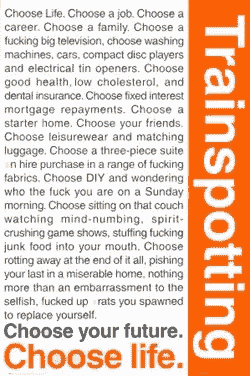](https://www.sitepoint.com/wp-content/uploads/2010/01/trainspottingposter_1.jpg)

红橙色充满活力和激情，而柔和的黄橙色则更舒缓，不那么张扬。黑色和橙色出现在自然界的南瓜中，与万圣节有着密切的联系。蓝色和橙色真的很配。绿色和橙色共同提供了一种热带风情，而紫色和橙色的互补色既醒目又不过分。

[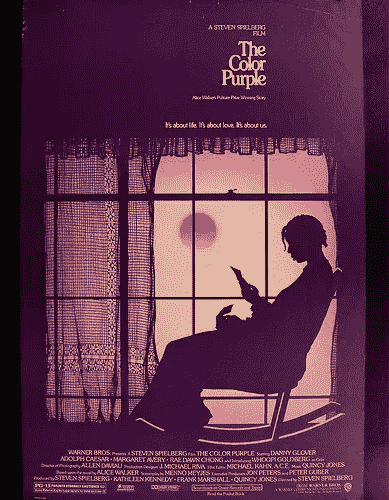](https://www.sitepoint.com/wp-content/uploads/2010/01/colorposter.jpg)

**标志设计中的橙色**

[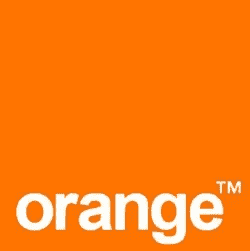 ](https://www.sitepoint.com/wp-content/uploads/2010/01/345_orange1.jpg) [ 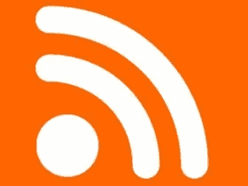](https://www.sitepoint.com/wp-content/uploads/2010/01/rsslogo.jpg)

 

让我们来看一些网站使用橙色作为主要背景色，或作为次要颜色来突出网站的重要区域，如导航。

[饱和](http://www.saturized.com/)

[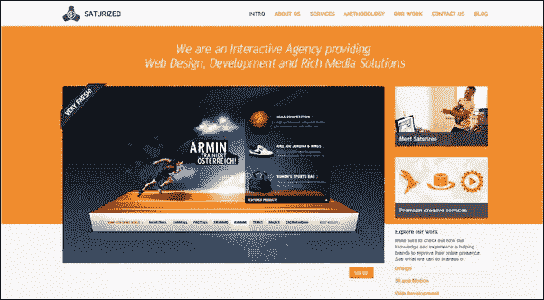](https://www.sitepoint.com/wp-content/uploads/2010/01/Saturized.png)

[易捷航空](http://www.easyjet.com/)

[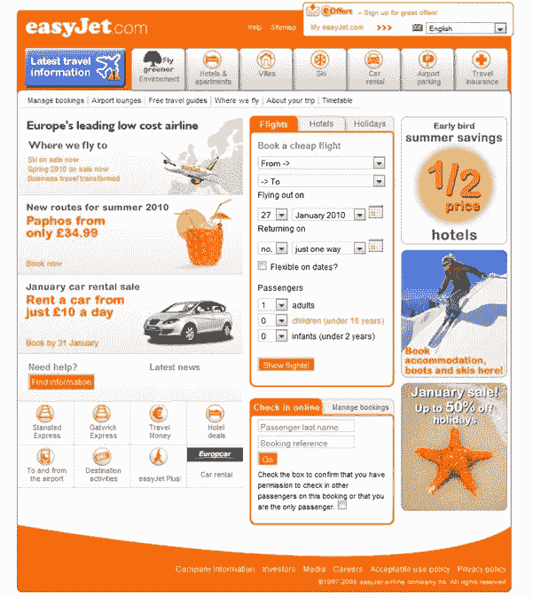](https://www.sitepoint.com/wp-content/uploads/2010/01/easyjetweb.png)

Lightway 软件

[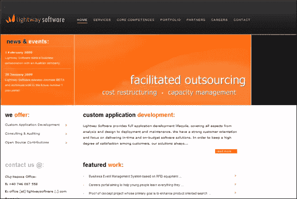](https://www.sitepoint.com/wp-content/uploads/2010/01/lightway.png)

[穆里通信](http://mulley.ie/)

[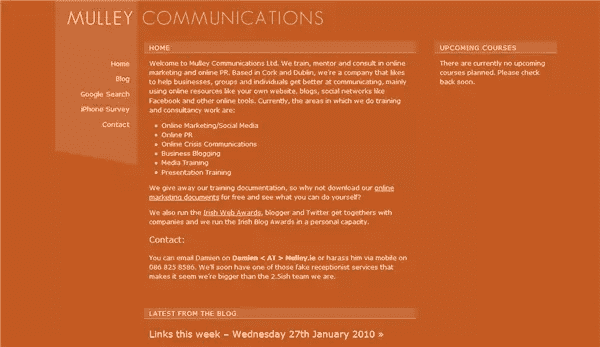](https://www.sitepoint.com/wp-content/uploads/2010/01/mulley.png)

[拉链 CMS](http://www.zippercms.com/)

[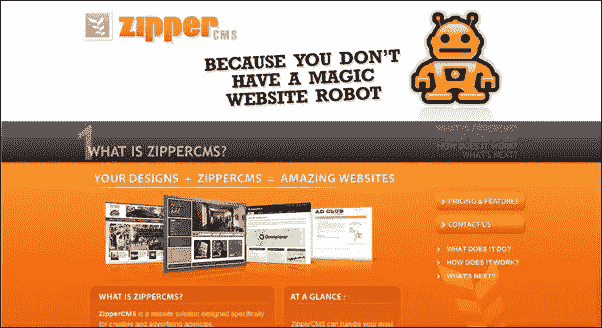](https://www.sitepoint.com/wp-content/uploads/2010/01/zippercms.png)

[导航咨询](http://www.navigantconsulting.com/)

[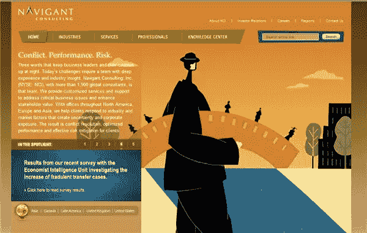](https://www.sitepoint.com/wp-content/uploads/2010/01/Navigant.png)

[车手奖励](http://www.bikerrewards.com/)

[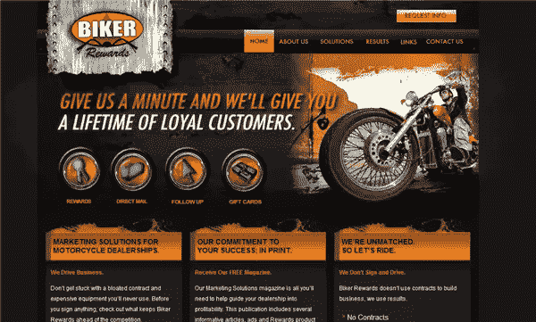](https://www.sitepoint.com/wp-content/uploads/2010/01/Biker.png)

[蜡笔人生](http://www.crayonslife.com/my_blog)

[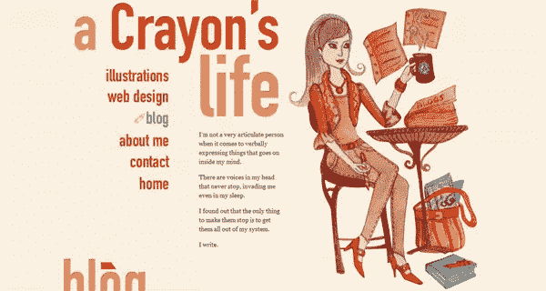](https://www.sitepoint.com/wp-content/uploads/2010/01/Crayon.png)

[南澳导盲犬](http://www.guidedogs.org.au/)

[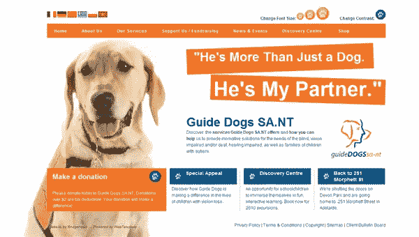](https://www.sitepoint.com/wp-content/uploads/2010/01/guidedog.png)

qodo

[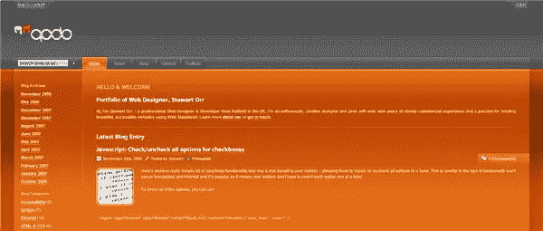](https://www.sitepoint.com/wp-content/uploads/2010/01/qodo.png)

单线

[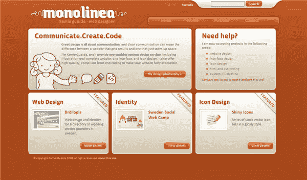](https://www.sitepoint.com/wp-content/uploads/2010/01/monolinea.png)

现在你知道了。**你如何看待网页和标志设计中的橙色？你有没有看到自己特别喜欢的橙色？**

## 分享这篇文章