# 设计颜色:黄色

> 原文：<https://www.sitepoint.com/color-in-design-yellow/>

上周，我们看了一下设计中温暖而充满活力的橙色。今天我们和[黄色](https://www.sitepoint.com/color-in-design-orange)呆在色轮的同一边。就像橙色和红色一样，黄色是暖色。它代表着自然、阳光和春天，通常被认为是快乐和充满希望的颜色。话虽如此，它可能是一种很难处理的颜色，而且在网页设计中似乎不像我们所看到的其他颜色那样受欢迎。

黄色是一种能见度很高的颜色，因此用于健康和安全设备以及危险标志。这种高能见度显然是引人注目的，但可能在屏幕上太引人注目了。黄色坐在白色背景上非常难看。如上所述，黄色有许多积极的含义，但它也确实与怯懦和欺骗、“胆小如鼠”和“黄色新闻”联系在一起。

**使用黄色**

黄色有几种色调，从奶油色到柠檬色到金黄色。黄色是深色的绝佳搭配。它可以极大地照亮一个黑暗的设计，在吸引眼球而又不那么大胆方面，它可以产生类似于红色和橙色的效果。黄色和蓝色是一种受欢迎的组合，黄色使更柔和的蓝色活跃起来，并产生高对比度。紫色是黄色的补色，也是高对比度的组合。更大地配色方案，混合黄色与棕色和苔藓和橄榄绿。结合浅绿色和橙色，黄色创造了柑橘或水果的调色板。黑色和黄色可以结合在一起，营造出一种工业感。

**标志设计中的黄色**

以下是一些国际公认的黄色标志设计:

[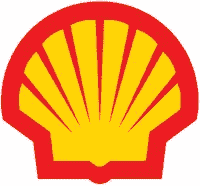](https://www.sitepoint.com/wp-content/uploads/2010/02/image15.png)[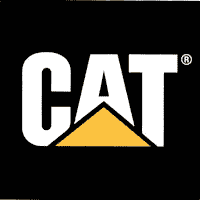](https://www.sitepoint.com/wp-content/uploads/2010/02/image16.png)[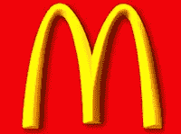](https://www.sitepoint.com/wp-content/uploads/2010/02/image17.png)

[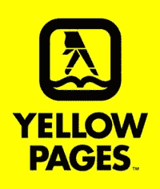](https://www.sitepoint.com/wp-content/uploads/2010/02/image18.png)[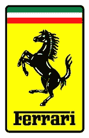](https://www.sitepoint.com/wp-content/uploads/2010/02/image19.png)[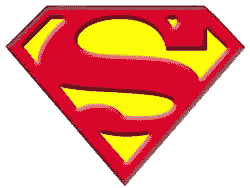](https://www.sitepoint.com/wp-content/uploads/2010/02/image20.png)

**网页设计中的黄色**

下面你会发现一些网站使用黄色作为主要背景色或者突出网站的特定区域。

加雷斯·迪基

[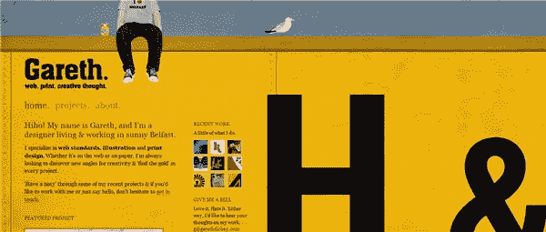](https://www.sitepoint.com/wp-content/uploads/2010/02/image21.png)

[I-amonline.com](http://www.i-amonline.com/)

[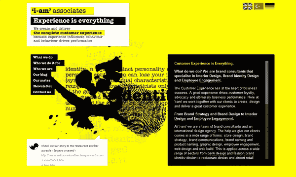](https://www.sitepoint.com/wp-content/uploads/2010/02/image22.png)

[创意火花](http://www.creativespark.co.uk)

[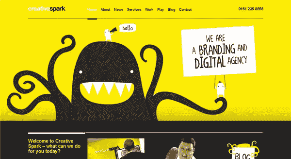](https://www.sitepoint.com/wp-content/uploads/2010/02/image23.png)

[Helveticons](http://helveticons.ch/)

[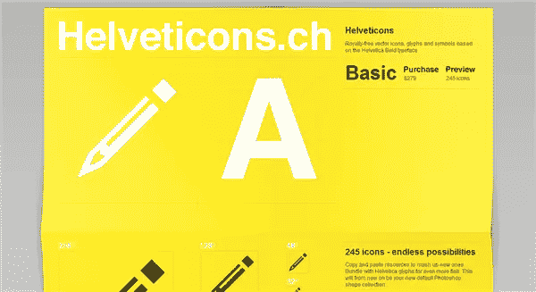](https://www.sitepoint.com/wp-content/uploads/2010/02/image24.png)

[洛克赛德大道 4-5 号](http://www.4-5lochsideavenue.co.uk/)

[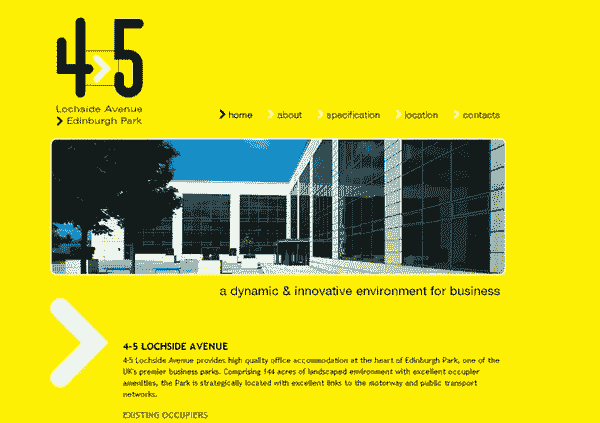](https://www.sitepoint.com/wp-content/uploads/2010/02/image25.png)

[陌生的土著](http://strangenative.com/)

[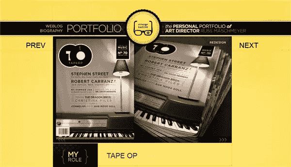](https://www.sitepoint.com/wp-content/uploads/2010/02/image26.png)

[代理 89](http://www.agent89.com/)

[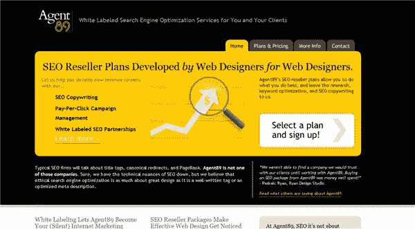](https://www.sitepoint.com/wp-content/uploads/2010/02/image27.png)

[扭转系统](http://www.twistsystems.co.uk/design.aspx)

[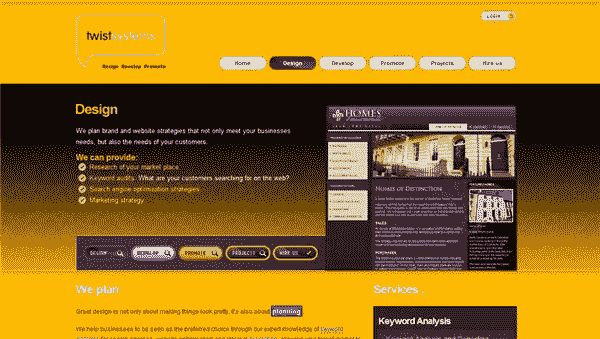](https://www.sitepoint.com/wp-content/uploads/2010/02/image28.png)

[病房设计](http://wardesign.com.au/)

[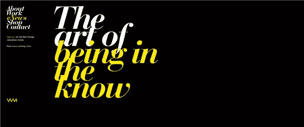](https://www.sitepoint.com/wp-content/uploads/2010/02/image29.png)

[设计图表](http://designcharts.com/)

[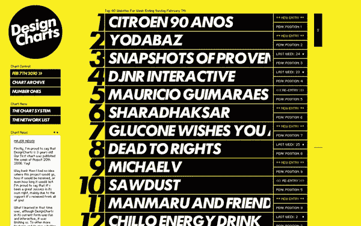](https://www.sitepoint.com/wp-content/uploads/2010/02/image30.png) 
**你对设计中的黄色有什么看法？这是你喜欢还是回避的颜色？你有没有看到过自己真正喜欢的设计良好的黄色网站？**

## 分享这篇文章