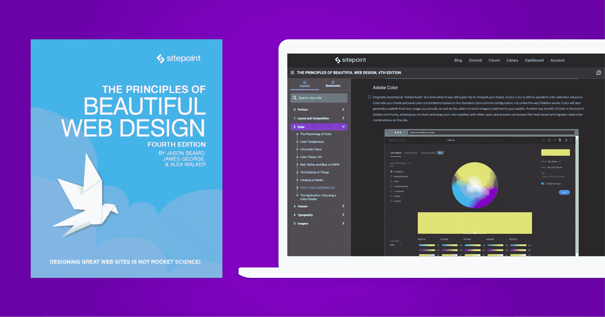

# 如何为您的设计系统创建调色板

> 原文：<https://www.sitepoint.com/color-palette-design-system/>

调色板是设计系统中最重要的方面之一。设计师可以使用它们来创建视觉层次，定义情感，并创建统一的外观和感觉。本文将讨论为你的设计系统创建一个调色板。我们还会提供一些关于选择颜色搭配的建议。我们开始吧！

## 什么是调色板？

调色板是设计中一起使用的一组颜色。调色板是一组颜色，它们很好地结合在一起，在设计中统一使用颜色，并在产品中保持颜色的一致性。

创建一个调色板有助于将所有东西联系在一起，并在你使用的颜色中创造和谐。设计师使用调色板来创建视觉层次，定义情感，并创建统一的外观和感觉。调色板通常由三到五种颜色组成，尽管它可以有更多的颜色。

### 为什么需要设计系统颜色？

声音调色板应该:

*   改善客户的用户体验
*   让你在竞争中脱颖而出
*   在你的设计中创造一致性、层次和对比
*   通过提供有序、标准化的颜色供选择，提高设计效率

为你的设计系统准备一个调色板是至关重要的，因为它有助于创造一致的品牌和视觉趣味。调色板还可以帮助创建视觉层次，定义情感，并提供统一的外观和感觉。

当你的所有设计元素都使用正确的颜色时，它们看起来会更专业、更精致。这种凝聚力是设计系统的最终目标，一个定义好的品牌颜色的调色板可以保持事物的一致性。

调色板可能会使你的作品更具美感，但也能帮助你更有效率。如果团队中的每个人都认同设计语言，不是更简单吗？

当与其他设计师或开发人员一起工作时，有一个定义好的调色板会很有帮助。他们可以很容易地看到在创建新的设计或添加到现有的设计时使用的颜色。想想如果颜色选择只有一个真实的来源，你的设计会有多大的可扩展性。

## 为设计系统创建调色板的 11 个步骤

让我们看看如何为你的设计系统创建一个调色板。创建调色板不一定是一个令人生畏的过程。为你的设计选择你想要的基调和氛围，然后，一切都会变得简单。

也就是说，你可能经常会发现自己不知道从哪里开始。我们都经历过。幸运的是，我们创建了这个 11 步指南来帮助你导航调色板设计。

### 1.识别你的颜色库存中的任何原色

构建一个有效的调色板利用了[最普遍的心智模型之一](https://sitepoint.com/10-mental-models-developers-can-use-to-get-unstuck/) : *利用你已经拥有的*(或者很容易得到的)*去得到未知的*(或者你没有的)。

在这种情况下，这些是你的基色。基色指的是用户界面中最常用的颜色，也是用来区分产品的颜色。

这样的颜色设定了设计的基调，传达了一个信息，或者引起了你的观众的情绪或心理反应。

原色的一些规则包括:

*   永远不要选择绝对的黑色或白色
*   你可以有一到三种原色
*   蓝色永远不会出错

你经常会在你产品的标志、营销和整体设计语言中发现这些颜色。

### 2.设计一个构建扩展调色板的系统

一旦你定义了你的原色，开发你的强调色就容易多了。您可以将强调色定义为基本色的变体。

通常的做法是将每种强调色定义为三种色调，以用于不同的情况:

*   光
*   黑暗
*   光线充足的；明亮的；（颜色）鲜艳夺目的；聪明的

你在界面中使用颜色向你的观众传达离散的事物。这就是设计师所说的突出重要信息的语义色彩的意思。例如，您可以选择:

*   蓝色(或另一种亮色)突出显示新功能，如消息
*   红色表示确认严重操作(如帐户停用)
*   或者绿色表示诸如成功交易的肯定消息

下面是一些[配色方案选项](https://www.sitepoint.com/principles-of-design-colour/)，供你下次构建扩展调色板时使用:

*   相邻或相似(选择一种原色，然后选择它旁边的颜色)
*   三元组(在色轮上画一个等边三角形)
*   阴影(您可以选择一种原色及其不同饱和度的变化)

### 3.想出一个命名约定

命名约定将帮助您将所有的设计人员和开发人员带到同一个页面上，并确保他们使用相同的设计语言。

当你为你的调色板选择一个命名惯例时，你被选择宠坏了。

您可以使用抽象名称，如 bx7300，但一些常见的方法包括选择实际的颜色名称(如蓝色)或编号名称，如 07000。

仅仅因为你可以给你的颜色起任何名字并不意味着你应该这样做。你最好有一个易于理解的标准化命名系统。

命名约定的一些规则是:

*   不要使用颜色等级命名法，如深蓝色
*   为每种颜色提供一个确切的名称
*   保持简单的命名约定

为你的调色板选择一个实用的名字永远不会错。这些名称给出了颜色的用途，如原色绿色。

### 4.对照库存颜色测试调色板

有了原色和强调色的概念，你就可以继续测试这些颜色的可及性。

当你这样做的时候，确保你的新颜色匹配，并替换或合并你在当前用户界面中使用的颜色。

### 5.定义调色板和使用指南

你现在拥有的只是调色板中的一组原色和强调色。你还没决定什么该去哪里。

下一个合乎逻辑的步骤是将调色板的每个方面分配给全局 UI 元素。这些可以包括:

*   背景
*   文本
*   容器
*   小跟班

### 6.在你的 CSS 颜色系统中实现调色板

你有一个调色板。现在你需要在你的 CSS 颜色系统中实现它。这将有助于确保在整个产品界面上应用一致的颜色。

如今，大多数设计师采用十六进制值的混合，也称为[十六进制码](https://www.sitepoint.com/javascript-generate-lighter-darker-color/)，来定义调色板。

通过 CSS 预处理器使用颜色变量列表，您可以轻松做到这一点。

```
/*Variable names should be intuitive*/

$primary-color: #bada55;
$secondary-color: #c0ffee;

/*Usage*/

.some-class {
 color: $primary-color; /*This will make the element's text color equal to bada55 */  }
```

将所有颜色设置为变量后，可以通过调用变量名在整个 CSS 文件中使用它们。这有一个额外的好处，如果需要的话，可以很容易地在全局范围内改变颜色。

### 7.测试新调色板在界面上的效果

你选择的新颜色对现有界面有什么影响？

毫无疑问，您已经在设计模型中尝试过调色板的大小，但是没有什么比实际使用更能找到改进点的了。

你更有可能找出颜色太不可读或太亮的地方，或者当你的按钮对比度不对时，当你摄取真实信息而不是掩盖 Lorem Ipsum 时。

只有一种方法可以找到答案，那就是测试您对现有界面所做的更改的效果。

创建一个开发环境，让你的调色板有一些真实的用途。回答以下问题会有所帮助:

*   这个新的调色板改进了界面吗？
*   这个新的调色板是否会恶化界面？
*   这些变化与现有颜色的融合程度如何？

### 8.确认新界面中颜色之间的对比

在向界面介绍了新的调色板之后，确保这个新的调色板为可访问性提供了足够的对比度。

我们可以通过检查 UI 的元素是否有足够的对比度分数来做到这一点，这是由 [Web 内容可访问性指南](https://www.w3.org/WAI/standards-guidelines/wcag/)规定的。

最简单的方法是在你选择的 UI 设计工具中使用插件。图玛的对比就是一个例子。 [Stark](https://www.getstark.co/) 是一个功能更加全面的可访问性设计平台，为 Figma、Adobe XD 和 Sketch 提供插件。它对免费计划进行对比检查。

### 9.向所有产品设计师介绍您的新调色板和用户界面

如果你自己一直在做这个项目，你必须把它介绍给其他产品设计师。

有几种方法可以做到这一点，但最重要的是尽早和经常地交流您的设计决策。

一个很好的方法是写一篇简短的博客文章或创建一个屏幕截图，介绍新的颜色，它们是如何被选择的，以及它们应该如何被使用。

在这个阶段，你的调色板已经成熟，可以介绍给设计过程的其他利益相关者，比如你的同事、团队成员、合作伙伴或客户。

### 10.邀请创造性的批评、反馈和改变建议

三个臭皮匠顶个诸葛亮，设计也不例外。当你选择调色板时，不要害怕从利益相关者那里得到想法和建议。

如果是你自己设计的调色板，确保你把它介绍给你的团队，并听取同事的建议。

### 11.最终确定调色板

恭喜你，你快完成了。然而，在你走之前，在你的调色板准备好之前，你必须做一些最后的润色。

您应该:

*   将此调色板添加到您的设计系统文档和样式指南中。
*   在设计系统中记录 CSS 处理器的变量(本地或其他)。

有一点要记住，选择调色板不是一门科学，任何试图向你推销单一配方的人都是在撒谎。

很多时候，你的眼睛将是法官，当你不能信任它时，你有你的团队成员进行咨询。

在定稿时，搜索任何不一致的地方，调整或者你可以做的改进。

## 理解色彩理论:更好调色板的关键

设计调色板不应该让任何人失眠。



如果你想超越实施，并学习设计协调美丽的调色板，传达你的品牌的情感基调，那么是时候拿起一些色彩理论。

在《美丽网页设计原则》的第二部分，我们教授了一个色彩理论的浓缩大师班，它会让你很快变得危险。了解:

*   色彩心理学
*   色温
*   色度值
*   色彩理论 101
*   红色、黄色和蓝色，或 CMYK
*   格局
*   创建调色板
*   颜色工具和资源
*   应用程序:选择调色板

## 分享这篇文章