# 颜色:事物的计划

> 原文：<https://www.sitepoint.com/color-the-scheme-of-things/>

从本系列关于颜色的上一篇文章继续，[红色、黄色和蓝色，或者 CMYK](https://www.sitepoint.com/rgb-or-cmyk/ "DesignFestival.com: Red, Yellow, and Blue, or CMYK") ，我们现在将深入了解配色方案——后面还有很多例子。

目前，我们已经对颜色有了足够的了解，可以谈论它们的价值、强度、心理联系、温度以及在传统色轮上的位置。这很好，但我们如何找到多种颜色一起工作呢？这就是配色方案派上用场的地方。配色方案是创建和谐有效的颜色组合的基本公式。现有六种经典配色方案:

*   单色的
*   类似的
*   补充的
*   分裂互补
*   三人组合的
*   四分体(也称为双互补)

为了使用这些经典的配色方案，我们必须从颜色开始。考虑你正在做的网站的主题，选择适合网站目的的基色。当然，这个选择可能不在你的掌握之中。有时，你不得不在公司的规则下工作，也许要遵循看似愚蠢和古怪的颜色方针。让我们假设你正在设计的网站是为一个骄傲自大的马戏团猴子家族设计的。这些马戏团的猴子仍然相信他们有皇家血统，所以他们要求我们在设计中加入帝王紫。傻猴子…但是你知道他们怎么说:“客户永远是对的。”

## 单色配色方案

当我们之前谈到颜色的价值时，我们谈到了色彩和阴影。单色配色方案——如图 1 所示的“单色猴子”——由一种基色和该基色的任意数量的色调或阴影组成。

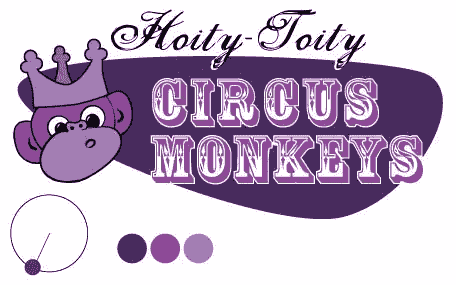
*图 1，《一只单色的猴子》*

### 单色配色方案示例

热粉色是一种超饱和的颜色，当搭配黑色和白色时，会产生强大的冲击力。这显然是印第安纳州的网络代理公司 [Solid Giant](http://www.solidgiant.com/) 所追求的单色配色方案，如图 2 所示，“Solid Giant 网站有效地对比了颜色”。这个单页滚动网站的每一部分都在有纹理的白色背景和粉色背景之间交替，粉色背景和主页上的“superawesome”一样亮。

 
*图 2，“立体巨人网站有效撞色”*

饱和单色设计的另一个例子可以在作者、演讲者和用户体验设计师 Aarron Walter 的个人网站上找到。网站的每个页面都有不同的单色配色方案。图 3 中你在 aaron 主页上看到的变暗的内容行，“Aarron Walter 的网站为每个页面提供了不同的配色方案”，这是巧妙使用 RGBA 透明度的结果。每行内容都有一个透明的黑色背景。当页面加载时，JavaScript 为每个块分配一个递增的 alpha(不透明度)值，为每个页面创建丰富的单色配色方案。

[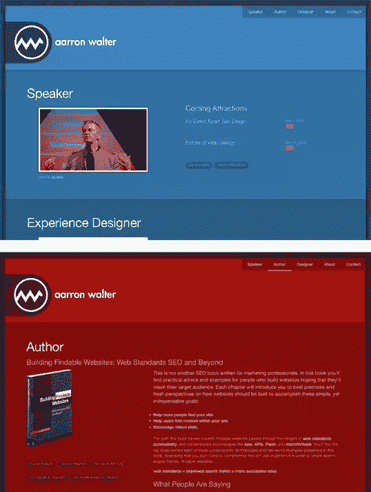](https://www.sitepoint.com/wp-content/uploads/2011/05/color-aarronwalter.jpg) 
*图 3，“Aarron Walter 的网站每个页面都有不同的配色方案”*

#### 更改配色方案

许多网站对内容的每个部分使用不同的配色方案。这种方法可以增加内容的丰富性和特色，但也可能产生一些身份问题。如果你打算在一个网站中使用多种配色方案，确保网站的徽标、菜单和整体布局保持一致，以避免混淆。

我咖啡中的艺术是一个 Tumblr 博客，由纪娜·波顿创建，由梅根·费舍尔设计，收录了世界各地的拿铁艺术。因此，毫不奇怪，该网站以美味的棕色咖啡的奶油色调为基础的单色配色方案为特色，如图 4 所示，“我的咖啡中的艺术——以直接取自网站主题的颜色为特色”。如果你知道你的网站的照片和内容会有很多相同的颜色，那么跟随 Meagan 的领导，围绕内容设计你的配色方案是一个很好的主意。

[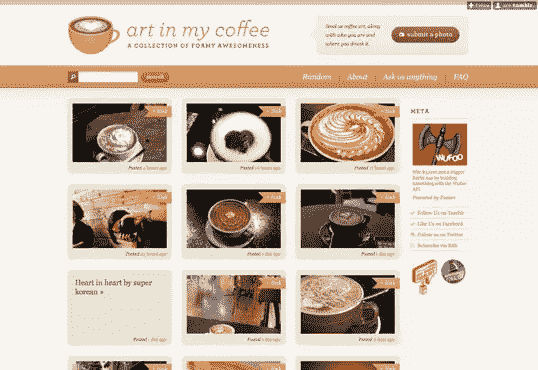](https://www.sitepoint.com/wp-content/uploads/2011/05/color-artinmycoffee.jpg) 
*图 4，“我的咖啡里的艺术——直接取材于网站主题的色彩”*

新西兰的[黑庄园葡萄园](http://blackestate.co.nz/)在图 5 中，“黑庄园葡萄酒——名副其实”展现了一种特殊的*单色*。是的，我刚刚创造了这个词。任何仅由黑色、白色和灰色阴影组成的颜色集都被称为非彩色配色方案。“无色”这个词的字面意思是“没有颜色”仅仅因为网站的整体方案没有颜色，并不意味着内容也必须是无色的。因为黑色的背景，大量使用“白色”空间，以及缺乏周围的颜色，充满活力的照片跃然纸上，给设计带来了生命和光明。

[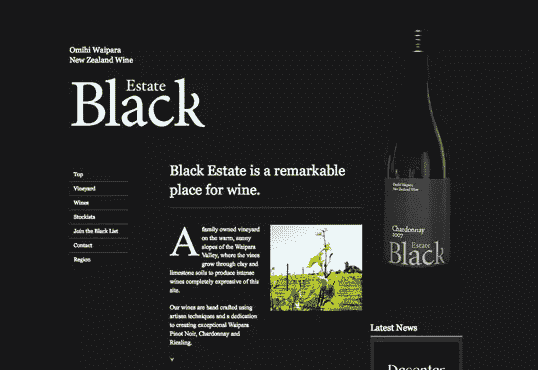](https://www.sitepoint.com/wp-content/uploads/2011/05/color-estateblack.jpg) 
*图 5，“黑色庄园葡萄酒——名副其实”*

## 类似的配色方案

类似的配色方案由色轮上彼此相邻的颜色组成。如果我们的色轮是一个美味的馅饼(嗯，馅饼！)，那么类似的配色方案将是相当大的切片。创造一个好的类比方案的关键是记住你的眼睛比你的胃口大。根据经验，避免使用超过三分之一的份额，否则你一定会让用户感到不适。回到图 6 所示的设计中我们的自大的猴子，“一个类似的猴子”，我们用他们的帝王紫和一些橙色调来温暖它。

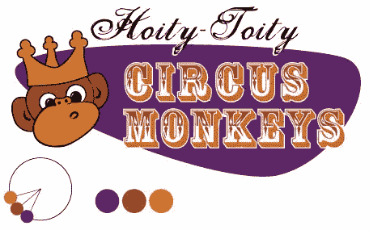
*图 6，《一只类比的猴子》*

### 类似的配色方案示例

Forrst 主页上有趣的插图加深了这个设计师/开发者社区的隐喻。当你窃笑公园管理员的海绵宝宝一样的腿或图 7 中的“登录”双关语“迷失在森林中”时，注意丰富的类似配色方案。从蓝绿色天空到橘黄色，这种设计的颜色包含在色轮饼的三分之一楔形中。

 
*图 7，《迷失在福瑞》*

[Blinksale](http://blinksale.com/) ，如图 8 所示，“Blinksale 的网站专业而不古板”，是一个托管的 web 应用程序，它创建、管理和发送 CSS 格式的纯文本发票。这也是一个很好的例子，说明了一个创造性的类似配色方案可以为一个商业网站做些什么。它粉碎了那些对企业网站应该是什么样子的先入为主的观念，并把它们扔进了从蓝绿色到黄色的冷色海洋。一定要注意色彩对比如何让他们的行动号召成为你首先看到的东西。右边截图的透视线也利用了连续性，不断引导你的视线回到注册按钮。

 
*图 8，“Blinksale 的网站专业而不古板”*

Blinksale 的主页设计得令人眼花缭乱，令人惊叹，而 Zappos 的主页(图 9，“Zappos 进入正题”)则直接进入正题。这是通过依赖蓝色和绿色的坚实的类似配色方案来实现的。页面顶部颜色鲜艳的搜索按钮非常显眼，因为它引入了与网站其他部分完全不同的色调。有人甚至会说它补充了页面上的蓝色…但这意味着什么呢？请继续阅读，寻找答案。

[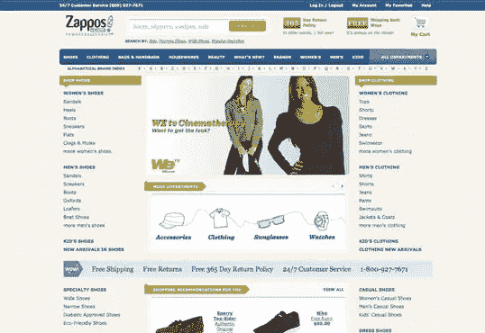](https://www.sitepoint.com/wp-content/uploads/2011/05/color-zappos.jpg) 
*图 9，“Zappos 进入正题”*

## 补色方案

互补色方案，就像我们更新的 hoy-toity 插图中的那个——如图 10 所示，“一只时髦的互补色猴子”——由色轮上彼此相对的颜色组成。将红紫色和黄绿色放在一起并不常见，但猴子们坚持让我在照片中保留一些它们的皇家紫色。嘘…这些客户是一群灵长类动物。

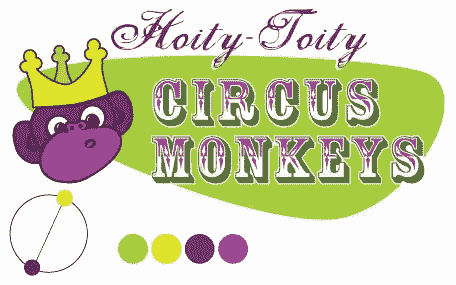
*图 10，《一只时髦的互补猴》*

### 补色方案示例

佛罗里达大学是我妻子的本科母校，该校的橙色和蓝色队色为互补色方案提供了强大的基础。有些人可能会对其体育网站上的互补配色方案的鲜明对比感到反感(见图 11，“佛罗里达大学体育网站使用大胆的互补颜色”)，但当颜色代表你正在设计的企业或实体时，你不会出错。

[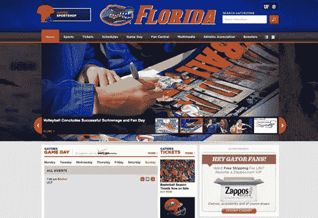](https://www.sitepoint.com/wp-content/uploads/2011/05/color-uflorida.jpg) 
*图 11，“佛罗里达大学田径网站使用大胆的补色”*

匹兹堡[萌芽基金春季计划网站](http://www.sproutfund.org/spring/)在图 12 中，“萌芽基金春季计划将互补色运用到更有机的效果”证明了互补色方案不必像用友的橙蓝那样大胆。通过降低饱和度，这种红色和绿色的设计看起来非常自然和朴实，有助于支持生物多样性的信息。精美的插画和艺术质感，真的让这个设计有了唱功。

[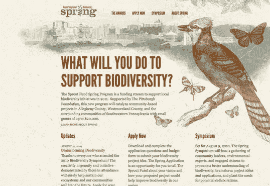](https://www.sitepoint.com/wp-content/uploads/2011/05/color-sproutfund.jpg) 
*图 12，“萌芽基金春季计划使用互补色以获得更有机的效果”*

我真的不确定为什么这么多音乐人坚持拥有全 Flash 网站，然后从不更新它们——但是我跑题了。不考虑发布平台，音乐家扎克·亨德里克斯的[网站是一个漂亮的补色方案的教科书示例，如图 13 所示，“扎克·亨德里克斯:补色的教科书示例”。选择互补色而不搭配冷色和暖色是不可能的，这个网站的设计者很清楚这一点。城市的天际线和明亮的圆形太阳在凉爽的蓝绿色海水的映衬下发出炽热的光芒。如果你想尝试这种确切的配色方案，秘密公式就在徽标的重叠圆圈中。值得称赞的是，对于我们这些试图通过 iPhone 或 iPad 访问该网站的人来说，有一个非 Flash 的备用方案。](http://zachhendricks.net/)

[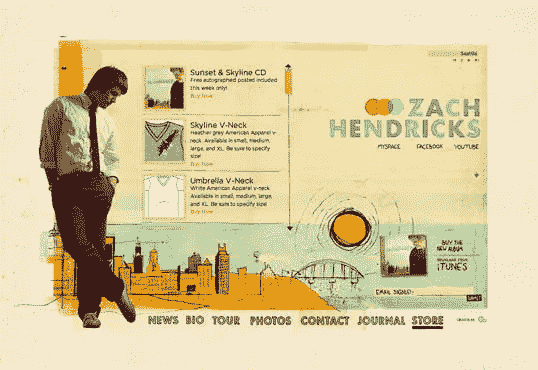](https://www.sitepoint.com/wp-content/uploads/2011/05/complementary-zachhendricks.jpg) 
*图 13，《扎克·亨德里克斯:补色的教科书范例》*

#### 常见的互补陷阱

由于互补色在许多方面彼此不同，当它们放在一起时，会产生一种被称为*同时对比*的效果:这是指每种颜色都使另一种颜色看起来更有活力，更突出。这实际上是互补色方案如此成功地将游客的目光转移到构图上的原因。然而，当在前景-背景关系中使用互补色时，会非常痛苦，如图 14 所示，“小心同时对比！”。

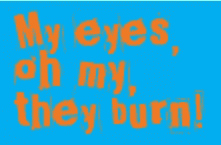

图 14，“当心同时对比！”

另一个常见的陷阱是选择色轮上不直接相对的颜色，但也没有足够接近的相似颜色。这些组合被称为*不调和*，因为颜色经常会相互冲突，导致观众不和谐。事实上，20 世纪 80 年代的时尚都是不和谐的颜色。如今看到不和谐的配色方案往往会勾起我对几何“设计师系列”Trapper Keeper 活页夹的美好回忆，我在学校时非常喜欢这些活页夹——图 15 中描绘了一个“不和谐的 Trapper Keeper 封面”。

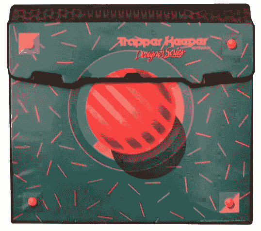
*图 15，《一个不和谐的捕兽者的看守罩》*

正如这个例子所示，如果有意使用，这个陷阱是可以利用的。不和谐的颜色是真正吸引儿童、青少年和青少年的惊人组合，所以在面向年轻人的网站或产品中使用它们是值得考虑的。它们也可以在更成熟的设计中有节制地使用，以产生比简单互补组合更大的强调。关于这种类型的配色方案的例子，请看图 16 中的[公牛+箭头](http://www.bullsandarrows.com/)，“公牛+箭头网站充分利用了冲突的颜色”。该网站有几个随机加载的背景图片，每个图片都有自己的配色方案。这张特别的图片将鲜红色和蓝绿色搭配在一起，这种搭配远远不足以给这个设计带来一种前卫的外观。

[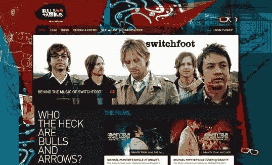](https://www.sitepoint.com/wp-content/uploads/2011/05/color-bullsarrows.jpg)

## 分裂互补、三元和四元

分割互补色、三色和四色配色方案听起来很专业，但它们只是基本互补色方案的简单变体。

要创建一个*分割补色*配色方案，使用与你的基色补色相邻的两种颜色。例如，以图 17 中最左边的配色方案为例，“分离-互补配色方案示例”。红色是这里的基色，所以我们不使用绿色来形成补色方案，而是使用与绿色相邻的两种颜色，黄绿色(黄绿色)和蓝绿色(蓝绿色)，来形成三色分割补色方案。注意，因为你用了两种不协调的颜色作为你的基本色，这种配色方案可能看起来幼稚和极端，但这可能正是你想要的效果。

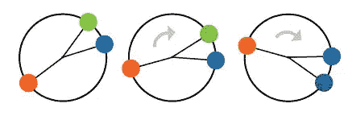
*图 17，“分色-补色方案示例”*

对于一个*三色*配色方案，我们只需将我们的分割补色在每一边多推出一个凹口，这样所有的颜色在色轮上都是等间距的。再次从红色开始，我们选择黄色而不是黄绿色，我们选择蓝色而不是蓝绿色。这将色轮分成三等份，因此三等份中的 *tri* 前缀。在这个例子中，也就是图 18 中最左边的方案，“三元配色方案例子”，我们用三原色(红、黄、蓝)组成我们的配色方案。如果您将方案顺时针旋转一格，您将得到黄绿色(黄绿色)、紫色(蓝紫色)和朱红色(红橙色)，如图 18“三元配色方案示例”中的中间示例所示。

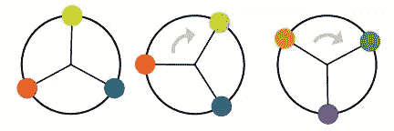
*图 18，“三元配色方案示例”*

知道三色配色方案涉及三种颜色，你可能已经从你对希腊语的广博知识中推断出(好吧，也许你没有)四色配色方案涉及四种颜色。四色配色方案将任何互补色方案与另一个互补色方案组合在一起。图 19 中最左边的例子“四色配色方案示例”是一个将橙色和蓝色与黄色和紫色结合起来的四色配色方案。

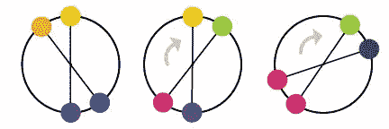
*图 19，“四色方案示例”*

佛罗里达州杰克逊维尔的 [River City Church](http://www.rccjax.com/) 的网站(如图 20 所示，“冒险的 River City Church”)是四色配色方案的一个很好的例子。请注意，除了黑色和白色之外，这个设计中正好有四种颜色。我们有橙色和蓝色的补色，搭配粉色和绿色。找到我上面描述的六种经典配色方案的纯粹范例是一项艰巨的任务。这是因为有时设计师会从头开始创造一个，或者是因为他们在这些主题中的一个上使用了一个微小的变化。在下面的“其他变体”一节中，我们将讨论几个选项。

[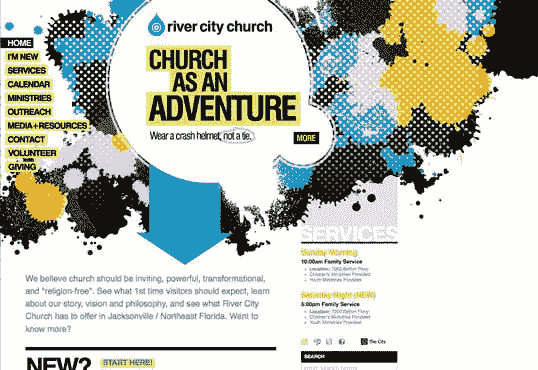](https://www.sitepoint.com/wp-content/uploads/2011/05/color-rivercity.jpg) 
*图 20，《分兵江城教堂》*

## 其他变体

虽然大多数设计师都知道标准的配色方案，但这些组合可能会让人感觉简单而缺乏创意。然而，如果你把色轮当成飞镖靶，随便选择什么颜色，你很可能会得到一些非常糟糕的组合——相信我，我已经试过了。与其冒这个险，还不如用其他方法来改变经典的配色方案，创造出一个全新的组合。一旦你掌握了单色、相似色和互补色的关系，试着尝试以下几种颜色:

不要仅仅使用基色的色调和阴影，试着融合纯灰色、黑色和白色。这将创造更多的对比，在单色配色方案中更“流行”。

**模拟调整** —向上调整单色方案中一种颜色的饱和度，向下调整其他颜色的饱和度。当放置在柔和的颜色中时，高度饱和的颜色会很突出。不应该猜测哪个是饱和色。

**单色-分色-补色** —如果你喜欢分色-补色方案，但又想增加一些深度，试着在设计中使用一些基色的色调和阴影。

显然，我只是编造了这些名称，但是您会注意到所有三个变体都与主要的传统方案相似。很容易调整传统的配色方案来增加更多的个性，但是记住你选择的配色方案是你建立网站调色板的基础。建立在坚实的基础上是很重要的，否则你设计的其他部分可能会垮掉。

下周我们将回到一个更短的帖子，看看调色板和如何创建它们；敬请关注。

## 美丽网页设计的原则

这篇文章来自杰森·比厄德的 [*《美丽网页设计的原则》*一书](https://www.sitepoint.com/premium/library "SitePoint.com: The Principles of Beautiful Web Design, 2nd Edition")(第二版现已出版！).请务必在设计节上关注这本书的更多文章。

## 分享这篇文章