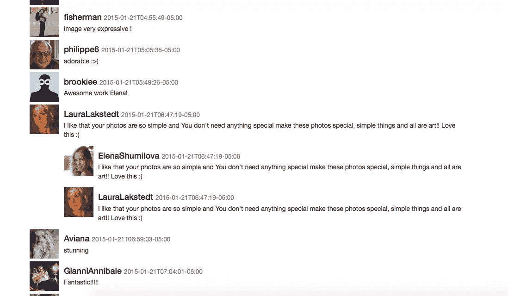
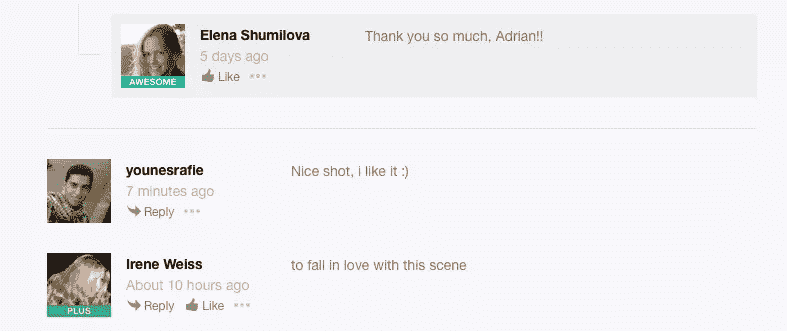
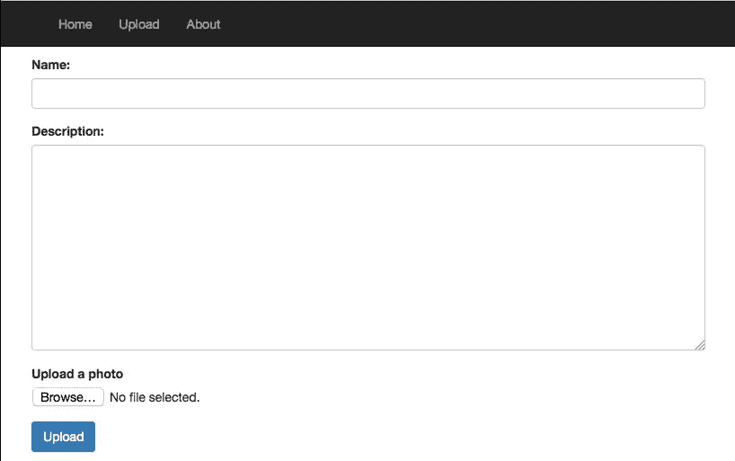
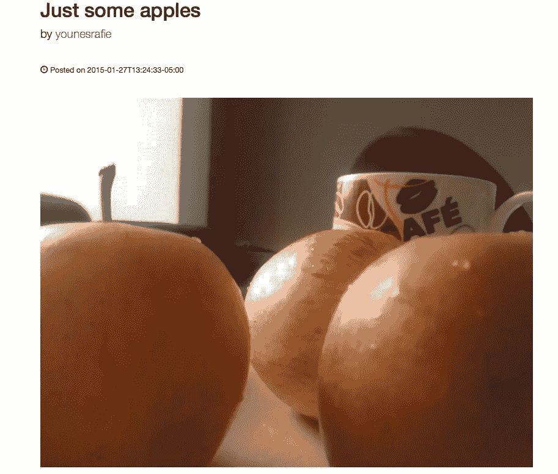

# 使用 500 像素 API 评论、投票和上传照片

> 原文：<https://www.sitepoint.com/commenting-upvoting-uploading-photos-500px-api/>

在本系列的第一部分中，我们使用 API 从 500px 获取最新的照片，并对它们进行过滤，我们用相关照片的列表构建了一个用户配置文件。在这一部分，我们将给予用户投票，收藏和评论照片的能力，最后，我们将给予用户上传自己的照片的能力。让我们开始吧。


## 批准

当试图访问一个 API 端点时，我们需要检查访问资源所需的[认证级别](https://github.com/500px/api-documentation/blob/master/endpoints/photo/POST_photos_id_vote.md#requires-authentication)。API 可能需要一个`consumer_key`或 [OAuth](http://oauth.net/core/1.0/#anchor9) 。

在第一部分中，我们在 500px 上注册了一个新的应用程序，并收到了我们的`consumer_key`和`consumer_secret`。我们使用 [Grant](https://grant-oauth.herokuapp.com/) app 获取有效的`token`和`token_secret`进行测试。

## 证明

指定您的`consumer_key`和`consumer_secret`后，您会收到一个`token`和一个`token_secret`。这些将给予你张贴和检索用户内容的权利。

```
// bootstrap/start.php

App::singleton('pxoauth', function(){
    $host = 'https://api.500px.com/v1/';
    $consumer_key = 'YOUR CONSUMER KEY';
    $consumer_secret = 'YOUR CONSUMER SECRET';
    $token = 'GRANT TOKEN';
    $token_secret = 'GRANT TOKEN SECRET';

    $oauth = new PxOAuth($host, $consumer_key, $consumer_secret, $token, $token_secret);

    return $oauth;
});
```

`PxOAuth`类包装了我们与 500px API 的通信。

```
// app/src/PxOAuth.php

class PxOAuth{

    public $host;
    public $client;
    private $consumer_key;
    private $consumer_secret;
    private $token;
    private $token_secret;

    public function __construct($host, $consumer_key, $consumer_secret, $token, $token_secret){
        $this->host = $host;
        $this->consumer_key = $consumer_key;
        $this->consumer_secret = $consumer_secret;
        $this->token = $token;
        $this->token_secret = $token_secret;

        $params = [
            'consumer_key'      => $this->consumer_key,
            'consumer_secret'   => $this->consumer_secret,
            'token'             => $this->token,
            'token_secret'      => $this->token_secret
        ];

        $oauth = new Oauth1($params);

        $this->client = new Client([ 'base_url' => $this->host, 'defaults' => ['auth' => 'oauth']]);
        $this->client->getEmitter()->attach($oauth);

        // if app is in debug mode, we do logging
        if( App::make('config')['app']['debug'] ) {
            $this->addLogger();
        }
    }

    private function addLogger(){
        $log = new Logger('guzzle');
        $log->pushHandler(new StreamHandler(__DIR__.'/../storage/logs/guzzle.log'));

        $subscriber = new LogSubscriber($log, Formatter::DEBUG);
        $this->client->getEmitter()->attach($subscriber);
    }
}//class
```

当处理 HTTP 请求时，拥有某种日志记录通常是有用的。如果应用程序处于调试模式，我们会添加日志记录。

## 照片投票

如果你使用 500 像素的网站，你可以看到用户有能力对照片进行投票，以提高他们的评级。我们可以检索为某张特定照片投了票的用户的[列表，你可以](https://github.com/500px/api-documentation/blob/master/endpoints/photo/GET_photos_id_votes.md)[对它投赞成票或反对票](https://github.com/500px/api-documentation/blob/master/endpoints/photo/POST_photos_id_vote.md)。

```
// app/routes.php

Route::post('/ajax/photo/vote', ['uses' => 'PXController@vote']);
```

```
// app/controllers/PXController.php

public function vote(){
    $photoId = Input::get("pid");
    $px = App::make('pxoauth');
    $url = "photos/{$photoId}/vote";
    try {
        $result = $px->client->post($url, ["body" => ['vote' => '1']]);
    }
    catch(RequestException $e){
        $response = $e->getResponse();

        if($response->getStatusCode() === 403){
            return (string) $response->getBody();
        }

        return ["status" => 500, "error" => "A serious bug occurred."];
    }

    return (string) $result->getBody();
}
```

```
// public/js/vote_favorite.js

$('body').on('click', '.thumb .vote', function(e){
    e.preventDefault();
    $this = $(this);
    var pid = $this.parents(".thumb").data("photo-id");

    $.ajax({
        url: "/ajax/photo/vote",
        type: "POST",
        dataType: "json",
        data: {
            pid: pid
        },
        success: function(data){
            if(data.hasOwnProperty("error")){
                alert(data.error);
            }
            else{
                $this.text(data.photo.votes_count);
                alert("Photo voted successfully");
            }
        }
    });
});
```

实现投票动作的最佳方式是通过 AJAX。我们将发送一个带有照片 ID 的 AJAX post 请求，并返回一个 JSON 响应，其中包含一条错误消息或一张刷新的照片。
检索照片 ID 后，我们向`photos/photo_id/vote`端点发送一个 post 请求和一个`vote`参数(0 或 1)。如果请求不成功，我们可以捕捉异常并测试`$response->getStatusCode()`。你可以访问[文档](https://github.com/500px/api-documentation/blob/master/endpoints/photo/POST_photos_id_vote.md#errors)来查看错误列表。

## 将照片标记为收藏

将照片标记为收藏夹几乎与向上投票相同，只是在正文中不传递任何额外的参数。更多细节可以看[文档](https://github.com/500px/api-documentation/blob/master/endpoints/photo/POST_photos_id_favorite.md)。

```
// app/routes.php

Route::post('/ajax/photo/favorite', ['uses' => 'PXController@favorite']);
```

```
// app/controllers/PXController.php

public function favorite(){
    $photoId = Input::get("pid");

    $px = App::make('pxoauth');
    $url = "photos/{$photoId}/favorite";

    try {
        $result = $px->client->post($url);
    }
    catch(RequestException $e){
        $response = $e->getResponse();

        if($response->getStatusCode() === 403){
            return (string) $response->getBody();
        }

        return ["status" => 500, "error" => "A serious bug occurred."];
    }

    return (string) $result->getBody();
}
```

```
// public/js/vote_favorite.js

$('body').on('click', '.thumb .favorite', function(e){
    e.preventDefault();
    $this = $(this);
    var pid = $this.parents(".thumb").data("photo-id");

    $.ajax({
        url: "/ajax/photo/favorite",
        type: "POST",
        dataType: "json",
        data: {
            pid: pid
        },
        success: function(data){
            if(data.hasOwnProperty("error")){
                alert(data.error);
            }
            else{
                $this.text(data.photo.favorites_count);
                alert("Photo favourited successfully");
            }
        }
    });
});
```

如果你已经投票或收藏了一张照片，你会得到一个错误提示(`Sorry, you have already voted for this Photo`)。如果照片对象中的`voted`或`favorited`属性被设置为`true`，可以通过禁用链接来避免这种情况。

## 评论

评论系统是强制性的，用户可以给出他们的意见。500px API 提供了处理注释的端点。我们将流程分为三个主要部分。

### 单张照片

在第一部分中，当用户点击一张照片时，我们打开了 500px 网站上的链接。现在，我们将实现我们自己的单一照片页面。

`photos/:photo_id`端点接受一个参数列表，并返回所选照片或未找到错误。

```
// app/routes.php

Route::get('/photo/{id}', ['uses' => 'PXController@show']);
```

```
// app/controllers/PXController.php

public function show($id){
    $px = App::make('pxoauth');

    try {
        $photo = $px->client->get("photos/{$id}?image_size=4")->json();

        return View::make('single', ['photo' => $photo['photo']]);
    }
    catch(RequestException $e){
        $response = $e->getResponse();

        if($response->getStatusCode() === 404){
            // handle 404: photo not found
        }
    }
}
```

```
// app/views/single.blade.php

...
<h1>{{ $photo['name'] }}</h1>
<p class="lead">
    by <a href="/user/{{ $photo['user']['id'] }}">{{ $photo['user']['username'] }}</a>
</p>
<hr>

<p><span class="glyphicon glyphicon-time"></span> Posted on {{ $photo['created_at'] }}</p>
<hr>


<hr>
@if($photo['description'])
    <p class="lead">{{ $photo['description'] }}</p>
@endif
<hr>
...
```

如果请求成功，我们将照片对象传递给视图，否则我们捕获异常并处理 404 错误。更多详情可以访问[文档](https://github.com/500px/api-documentation/blob/master/endpoints/photo/GET_photos_id.md)。

### 获取评论

检索注释有两种不同的方式。我们可以将`comments`参数传递给单幅照片端点(`photos/:id?comments`)，或者我们可以使用`photos/:id/comments`端点。
第二种方式允许我们检索嵌套的注释，这使我们更容易打印它们。API 将每个请求的注释数量限制为 20 个，您可以使用`page`参数获得完整的列表。

```
// app/controllers/PXController.php

public function show($id){
    $px = App::make('pxoauth');

    try {
        $photo = $px->client->get("photos/{$id}?image_size=4")->json();
        $comments = $px->client->get("photos/{$id}/comments?nested=true")->json();

        return View::make('single', ['photo' => $photo['photo'], 'comments' => $comments['comments']]);
    }
    catch(RequestException $e){
        $response = $e->getResponse();

        if($response->getStatusCode() === 404){
            // handle 404: photo not found
        }
    }
}
```

```
// app/views/single.blade.php

@foreach($comments as $comment)
    <div class="media">
        <a class="pull-left" href="#">
            
        </a>
        <div class="media-body">
            <h4 class="media-heading">{{ $comment['user']['username'] }}
                <small>{{ $comment['created_at'] }}</small>
            </h4>
            {{ $comment['body'] }}
            @if(count($comment['replies']))
                @foreach($comment['replies'] as $ncomment)
                    <div class="media">
                        <a class="pull-left" href="#">
                            
                        </a>
                        <div class="media-body">
                            <h4 class="media-heading">{{ $ncomment['user']['username'] }}
                                <small>{{ $comment['created_at'] }}</small>
                            </h4>
                            {{ $comment['body'] }}
                        </div>
                    </div>
                @endforeach
            @endif
        </div>
    </div>
@endforeach
```

嵌套的注释被插入到`replies`数组中，我们可以使用`total_pages`属性对注释进行分页。您可以访问[文档](https://github.com/500px/api-documentation/blob/master/endpoints/photo/GET_photos_id_comments.md)查看可用参数列表。



### 新评论

当用户查看照片时，他可以对照片进行评论，以表达他的情绪和观点。在本教程中，我们将不允许[回复评论](https://github.com/500px/api-documentation/blob/master/endpoints/comments/POST_comments_id_comments.md)，我们只能发布一个新的评论，但基本上是一样的。

```
// app/views/single.blade.php

<div class="well">
    <h4>Leave a Comment:</h4>
    {{ Form::open(['url' => '/photo/comment', 'method' => 'post']) }}
        <input type="hidden" name="pid" value="{{ $photo['id'] }}"/>
        <div class="form-group">
            <textarea name="comment" class="form-control" rows="3"></textarea>
        </div>
        <button type="submit" class="btn btn-primary">Submit</button>
    {{ Form::close() }}
</div>
```

```
// app/routes.php

Route::post('/photo/comment', ['uses' => 'PXController@comment']);
```

```
// app/controllers/PXController.php

public function comment(){
    $photoId = Input::get('pid');
    $comment = Input::get('comment');

    $px = App::make('pxoauth');
    $result = $px->client->post("photos/{$photoId}/comments", ['body' => ['body' => $comment]])->json();

    if($result['status'] != 200){
        // handle 400: Bad request.
    }

    return Redirect::back();
}
```

该方法检索照片 ID 和评论正文。然后，我们向只接受这两个参数的`photos/:photo_id/comments`端点发送一个请求，如果注释成功发送，则返回一个 200 状态代码。否则，我们处理 400 或 404 错误。您可以查看[文档](https://github.com/500px/api-documentation/blob/master/endpoints/photo/POST_photos_id_comments.md)了解更多详情。



## 上传新照片

当使用像 [Guzzle](https://github.com/guzzle/guzzle) 这样的软件包时，上传文件变成了一个直接的过程。API 接受许多参数，但是我们将只使用一个`name`、`description`和一个照片文件。您可以访问[文档](https://github.com/500px/api-documentation/blob/master/endpoints/photo/POST_photos_upload.md)获取完整的参数列表。

```
// app/routes.php

Route::get('/upload', ['uses' => 'PagesController@photoUpload']);

Route::post('/photo/upload', ['as' => 'photo.upload', 'uses' => 'PXController@upload']);
```

```
// app/views/upload.blade.php

<div class="row">
{{ Form::open(['route' => 'photo.upload', 'files' => true]) }}
    <div class="form-group">
        {{ Form::label('name', 'Name: ') }}
        {{ Form::text('name', null, ['class' => 'form-control']) }}
    </div>

    <div class="form-group">
        {{ Form::label('description', 'Description: ') }}
        {{ Form::textarea('description', null, ['class' => 'form-control']) }}
    </div>

    <div class="form-group">
        {{ Form::label('photo', 'Upload a photo') }}
        {{ Form::file('photo', null, ['class' => 'form-control']) }}
    </div>

    {{ Form::submit('Upload', ['class' => 'btn btn-primary']) }}
{{ Form::close() }}
</div>
```



```
// app/controllers/PXController.php

public function upload(){
    try {
        $px = App::make('pxoauth');
        $result = $px->client->post('photos/upload', [
            'body'  => [
                'name'          => Input::get('name'),
                'description'   => Input::get('description'),
                'file'          => fopen(Input::file('photo')->getPathname(), 'r'),
            ]
        ])->json();

        // you may want to pass a success message
        return Redirect::to("/photo/{$result['photo']['id']}");
    }
    catch(RequestException $e){
        $response = $e->getResponse();

        if($response->getStatusCode() === 422){
            // handle 422: Server error
        }
    }

}//upload
```

当你想通过 HTTP 上传一些数据时，你需要处理`multipart/form-data`头，读取文件内容，并将其添加到请求中。你可以在这里阅读更多关于用 Guzzle [发送文件的信息。](http://guzzle.readthedocs.org/en/latest/quickstart.html#uploading-data)

如果成功，API 会返回一个 200 状态码和新照片，否则如果文件格式不被支持，我们会得到一个 422 错误，等等。我们将用户重定向到新的照片页面。



## 结论

500px API 比我们在本教程中展示的功能更多。您可以查看其他 API hack 应用程序来了解什么是可能的，并且您可以查看 [Github 库](https://github.com/sitepoint-editors/500pxAPI_Test)来测试最终结果。请在下面的评论中告诉我你的想法。

## 分享这篇文章