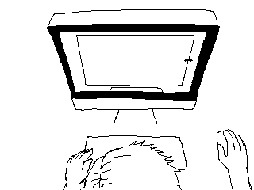
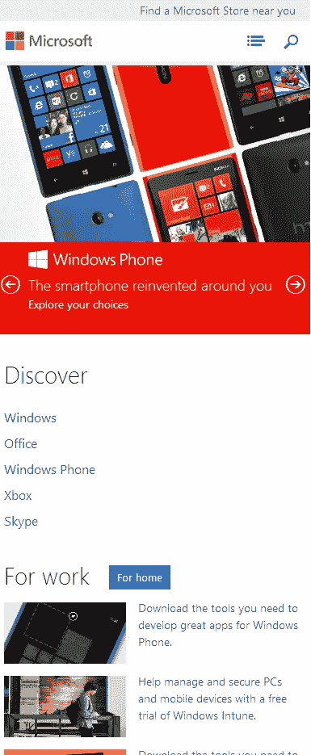
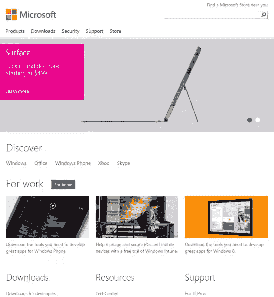
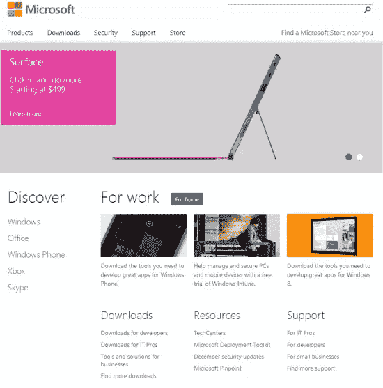
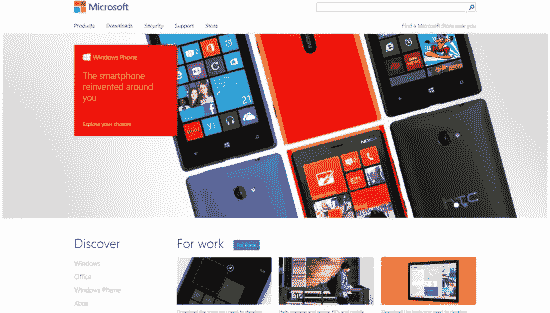
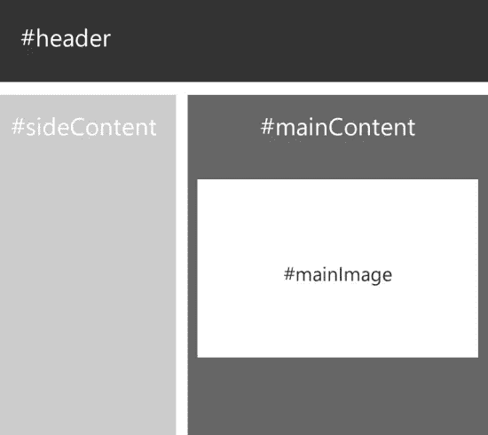
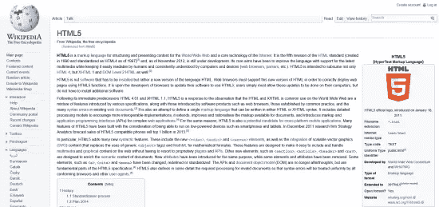
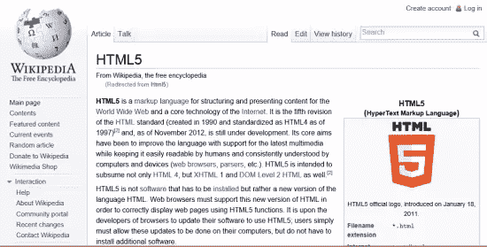
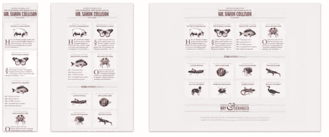
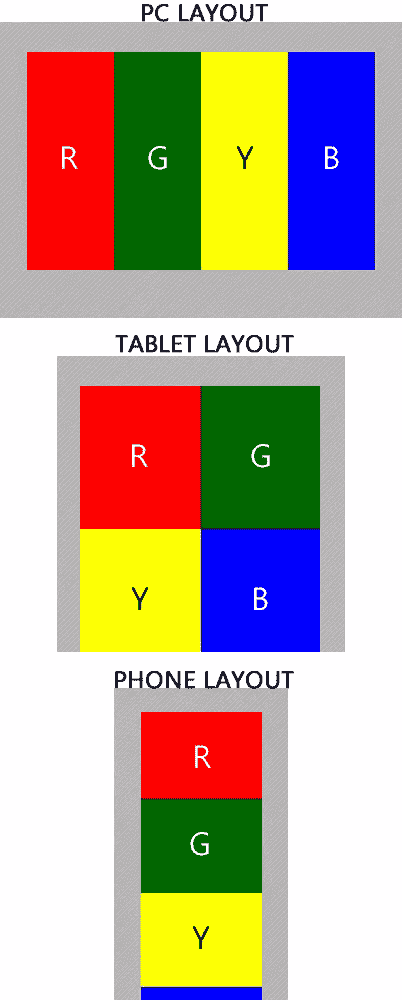

# 响应式网页设计中的常用技术

> 原文：<https://www.sitepoint.com/common-techniques-in-responsive-web-design/>

在以前的文章中，我谈到了[为什么 Web 已经为响应式设计做好了准备](https://www.sitepoint.com/why-the-web-is-ready-for-responsive-web-design/)以及网站所有者如何使用用户设备的上下文和屏幕空间为用户提供[上下文相关的体验](https://www.sitepoint.com/designing-experiences-for-responsive-web-sites/)跨越各种尺寸的屏幕，包括 PC、电话和控制台。

在本文中，我将深入探讨一些构建响应性站点布局和体验的最常见实践。我将描述基于屏幕空间灵活调整大小的站点布局的新兴和可用技术(称为“流体网格”)，以确保用户在使用任何屏幕尺寸时都能获得完整的体验。此外，我将展示如何呈现富媒体，尤其是图像，以及开发人员如何确保小屏幕设备上的访问者不会为高质量的媒体产生额外的带宽成本。

当你使用我描述的一些技术时，这里有一些方法来测试你的站点在不同设备分辨率下的外观:

1.  Benjamin Keen 有一个[响应式网页设计书签](http://www.benjaminkeen.com/open-source-projects/smaller-projects/responsive-design-bookmarklet/)，你可以将它添加到你选择的浏览器的收藏夹栏(或书签栏)中。你可以点击这个书签来测试你的网站在不同分辨率下的布局。
2.  如果你使用的是 Windows 8，你可以通过使用 [Windows 8 抓取模式](http://windows.microsoft.com/en-US/windows-8/snap-apps#1TC=t1)在 Internet Explorer 10 上测试你的页面布局。在 Windows 8 中，您可以在全屏(全模式)下使用 Internet Explorer 10，或者通过将浏览器停靠到 snap 模式来进行多任务处理，该模式模拟智能手机浏览器的布局特征。此外，您可以将浏览器停靠在填充模式下，在默认的 1366 x 768 像素的 Windows 8 屏幕上，它占据 1024 x 768 像素(px)的空间。这是一个很好的代理，显示了你的网站在 iPad 和传统的 4:3 屏幕上的外观。
3.  最后，你可能会做很多你在**图 1** 中看到的事情(图片由 Reddit.com 提供)。


**图一。响应式网页设计的基本测试**

## 媒体查询

传统上，开发人员依靠嗅出浏览器的用户代理字符串来识别用户是从 PC 还是移动设备访问网站。通常，这样做后，他们会将用户重定向到不同的子网站，这些子网站提供几乎相同的内容，但具有不同的布局和信息设计。例如，在过去，访问 MSN.com 的用户可以看到传统的 PC 体验，或者通过重定向到 http://m.msn.com 获得特定于硬件的移动体验。

但是重定向需要两个独立的工程努力。此外，这种方法还针对两种屏幕布局(320 像素宽的手机和 1024 像素宽的桌面)进行了*优化。*它没有智能地为中等尺寸设备(如平板电脑)的用户以及屏幕明显更大的用户提供良好的访问体验。**

CSS3 旨在帮助 Web 开发人员将*内容创建*(HTML 和 JavaScript 中的页面标记和功能)与该内容的表示分离开来，并通过引入媒体查询来完全在 CSS 中处理不同维度的布局。

媒体查询是开发人员编写 CSS3 样式表并为所有 UI 元素声明样式的一种方式，这些元素取决于屏幕大小、媒体类型和屏幕的其他物理方面。使用媒体查询，您可以通过向浏览器询问相关因素(如设备宽度、设备像素密度和设备方向)来为同一标记声明不同的样式。

但即使使用 CSS3，也很容易陷入为同一个网页标记构建三种不同的固定宽度布局的陷阱，以实现当今常见的屏幕尺寸(桌面、平板电脑和手机)。然而，这并不是真正的响应式网页设计，也不能为所有设备提供最佳体验。媒体询问是*提供真正响应的网页设计解决方案的一部分*；另一个是按比例缩放以填充可用屏幕的内容。我稍后会解决这个问题。

## “像素”是什么意思？

像素被用于网页设计和布局已经有一段时间了，传统上是指用户屏幕上能够显示红-蓝-绿点的一个点。基于像素的网页设计实际上已经成为网页布局的一种方式，用于声明网页各个元素的尺寸，也用于排版。这主要是因为大多数网站在标题、导航和其他页面 UI 元素中使用图像，并选择具有固定像素宽度的网站布局，其中图像看起来很棒。

然而，最近高像素密度屏幕和视网膜显示器的出现给这个术语增加了另一层含义。在当代网页设计中，一个像素(也就是我们刚刚讨论的硬件像素)不再是一个屏幕可以呈现的单个最小点。

在你的 iPhone4 上访问一个网站，它的 640 x 960 px 硬件屏幕会告诉你的浏览器它有 320 x 480 px。这可能是最好的，因为你不希望一个 640 像素宽的文本列适合一个只有 2 英寸宽的屏幕。但 iPhone 屏幕和其他高密度设备凸显的是，我们不再为硬件像素而开发。

W3C 将*参考像素*定义为在距离阅读器一臂距离处具有 96 ppi 密度的设备上 1 px 的视角。抛开复杂的定义不谈，这意味着当你为现代高质量屏幕设计时，你的媒体查询将响应参考像素，也称为 *CSS 像素*。CSS 像素的数量往往会少于硬件像素的数量，这是一件好事！(当心:硬件像素是大多数设备制造商用来宣传他们的高质量手机、平板电脑和视网膜显示器的东西——它们会把你的 CSS 引入歧途。)

这种硬件像素与 CSS 像素的比例称为*设备像素比例*。更高的设备像素比率仅仅意味着每个 CSS 像素被更多的硬件像素渲染，这使得你的文本和布局看起来更清晰。

维基百科有一个很棒的按像素密度排列的最近显示列表，其中包括设备像素比率。如有必要，您可以随时使用 CSS3 媒体查询来识别设备像素比率，如下所示:

```
/*Note that the below property device pixel ratio might need to be vendor-prefixed for some browsers*/
@media screen and (device-pixel-ratio: 1.5)
{
/*adjust your layout for 1.5 hardware pixels to each reference pixel*/
}
@media screen and (device-pixel-ratio: 2)
{
/*adjust your layout, font sizes etc. for 2 hardware pixels to each reference pixel*/
}
```

也有一些开源库让开发者跨浏览器使用 JavaScript 计算设备像素比率，比如[泰森·马塔尼克](http://matanich.com/)的[getdevicepixelrratio](http://github.com/tysonmatanich/GetDevicePixelRatio)。请注意，此结果仅在 JavaScript 中可用，但它可用于优化图像下载，以便高质量图像(文件较大)不会在非 tina 显示器上下载。

但是，*不建议你使用设备像素比例来定义你的页面和内容布局。*虽然参考像素与硬件像素的差异可能会令人困惑，但很容易理解为什么这对于为用户提供更好的体验至关重要。iPhone 3GS 和 iPhone 4 具有大致相同的物理屏幕大小和相同的使用模式，因此一个文本块应该具有大致相同的物理大小是理所当然的。

同样，仅仅因为你有一台 1920 x 1080 p 的高清电视，这并不意味着网站应该以这种原始分辨率呈现内容。用户坐在离电视几英尺远的地方，还使用不精确的输入机制(如操纵杆)与之交互，这就是为什么电视浏览器更喜欢将多个硬件像素打包到一个参考像素中。只要你为桌面浏览器设计了一个 960 像素宽的布局，这个网站看起来就相当于是可用的，不管你的电视是 1080 p 还是 720 p 的旧型号。

一般来说，你的文本内容在这些设备上会更好看。但是，您的图像内容可能看起来像素化和模糊。因此，从实用的角度来看，当您试图在高像素密度的屏幕上为用户提供高质量的摄影/图像数据时，设备像素比率最为重要。此外，你要确保你的品牌标识在用户的新手机上看起来很醒目。在本文的后面，我将讨论实现响应式图像的技术，并指出一些现有的 JavaScript 库可以解决这个问题。

随着我们继续，我将使用术语*像素*来表示*参考像素*，并根据需要明确调用硬件像素。

## 相应地缩放你的站点布局

基于网格的布局是网站设计的关键组成部分。你访问的大多数网站可以很容易地被形象化为一系列的矩形页面组件，如页眉、站点导航、内容、侧栏、页脚等等。

理想情况下，当我们设计响应式网站时，我们希望网格布局与用户的屏幕大小无关。这意味着我们希望我们的布局和内容尽可能地适应屏幕空间(在合理的范围内)，而不是提供两到三个固定宽度的布局。

### 移动优先设计

正如我在本系列的第一篇文章中指出的，超过 12%的网络流量来自移动设备。在智能手机普及率较高的国家，这一比例要高得多，预计未来几年随着亚洲、拉丁美洲和非洲智能手机普及率的提高，这一比例将显著上升。

此外，在网站设计中采用移动优先的方法是信息设计中的一个很好的练习。基本上，它可以帮助你优先考虑你想在网站的移动版本上提供的内容和功能，然后逐步地为更大的设备增强网站布局。通过这种方式，您可以确保您的用户在移动设备上获得宝贵的体验，而不仅仅是桌面体验的补充，并且您可以利用额外的可用空间来提供更具视觉吸引力的体验，以及导航到额外的“二级”内容。

### 案例研究:重新设计的 Microsoft.com

当你在手机上访问 microsoft.com 或缩小你的电脑浏览器宽度(屏幕宽度低于 540 像素)时，你会看到一个单一的英雄形象，这是一个触摸友好、视觉丰富的幻灯片演示的一部分，每次宣传一种产品。(参见**图 2。**)热门产品在“发现”部分突出显示。额外的导航在折叠下面或在默认情况下折叠的手风琴式菜单中，当用户点击列表图标时显示出来。类似地，默认情况下搜索框是隐藏的，以节省屏幕空间——用户需要点击搜索图标。这样，移动布局显示顶部的产品和链接，一个在另一个下面，只需要垂直平移。文件夹下的内容和产品链接按照从上到下的顺序排列。


**图二。为手机设计的 Microsoft.com**

一旦视口的宽度超过 540 px(此时我们可以假设用户不再在手机上查看网站，而是在平板电脑或低分辨率 PC 上查看)，您会注意到第一个布局变化(**图 3** )。默认情况下，搜索框现在是可见的，顶级导航也是如此，以前它隐藏在列表图标下。Discover 部分中的产品现在以单行显示，因为它们适合可用宽度。最重要的是，请注意，在这个过渡中，英雄图像总是占据屏幕的可用宽度。


**图三。超过 540 px 后的 Microsoft.com**

图 4**所示的下一个布局变化**发生在 640 px 或更高的宽度。像往常一样，英雄图像占据了所有可用的屏幕宽度。“For Work”部分中的各个项目并排排列。额外的实际面积还允许英雄图像的标题与图像和运动一起呈现，这非常引人注目。


**图 4。****640 px 或更高的布局变化**

最后一次布局更改发生在屏幕宽度为 900 px 或更高时(**图 5** )。Discover 菜单浮动到左侧，以利用可用的水平空间，这减少了垂直滚动的需要。


**图五。屏幕宽度为 900 像素或更高时的布局**

最后，也是最重要的一点，页面布局——尤其是英雄形象——*继续缩放并填充可用的水平空间*(直到 1600 px)，以最大化视觉养眼的影响(**图 6** )。事实上，所有屏幕宽度在 200 像素到 1600 像素之间的*都是如此——在英雄图像的两边从来没有任何浪费的空白。(同样，Discover 和 For Work 部分的相对布局不会改变，但图像也会按比例缩放。)*


**图六。在更高分辨率下最大化影响**

## 响应式布局技术

太好了，那么我们如何实现这种体验呢？通常，网站的自适应布局归结为两种技术:

*   确定布局需要更改的断点。
*   在断点之间，按比例缩放内容。

让我们独立地检查这些技术。

### 在断点之间按比例缩放内容

正如《microsoft.com》评测中指出的，对于 900 px 或更高的屏幕宽度，主页上的页眉、英雄图像、导航区和内容区的相对布局不会发生变化。这是很有价值的，因为当用户在 1280 x 720 的显示器上访问网站时，他们不会看到一个 900 像素宽的网站有超过 25%的屏幕空白在左右两边。

类似地，两个用户可能会访问该网站，一个使用 480 x 320 px 分辨率(CSS 像素)的 iPhone 4，另一个使用 640 x 360 px 分辨率的三星 Galaxy S3。对于任何宽度小于 512 像素的布局，microsoft.com 会按比例缩小布局，这样对于两个用户来说，整个移动浏览器都专注于网页内容，而不是空白，无论他们是以纵向还是横向模式查看网站。

有几种方法可以实现这一点，包括流体网格的 [CSS3 提案。然而，这还不被主流浏览器所支持。你可以在 Internet Explorer 10 上看到这一点(带有供应商前缀)，MSDN 有 CSS3 网格实现的例子](https://www.w3.org/TR/css3-grid-layout/)[在这里](http://msdn.microsoft.com/en-us/library/ie/hh673533(v=vs.85).aspx)和[在这里](http://msdn.microsoft.com/en-us/library/ie/jj553856(v=vs.85).aspx)。

与此同时，我们将使用基于百分比宽度的屡试不爽的方法来实现流体网格布局。考虑图 7 中**所示的简单示例，其设计要求如下:**

1.  横跨屏幕宽度的#header。
2.  横跨屏幕宽度 60%的#mainContent div。
3.  横跨 40%屏幕宽度的#sideContent div。
4.  #mainContent 和#sideContent 之间 20-px 固定间距。
5.  一个#mainImage img 元素，它占据了#mainContent 中的所有可用宽度，不包括其周围固定的 10 px 装订线。


**图 7。为流体网格设置**

该页面的标记如下所示:

```
<!doctype html>
	<html>
	<head>
	  <title>Proportional Grid page</title>
	  <style>
	    body {
	      /* Note the below properties for body are illustrative only.
	         Not needed for responsiveness */
	      font-size:40px;
	      text-align: center;
	      line-height: 100px;
	      vertical-align: middle;
	    }
	    #header
	    {
	      /* Note the below properties for body are illustrative only.
	         Not needed for responsiveness */
	      height: 150px;
	      border: solid 1px blue;
	    }
	    #mainContent {
	      width: 60%;
	      float: right;
	      /*This way the mainContent div is always 60% of the width of its 
              parent container, which in this case is the  tag that defaults to 
              100% page width anyway */
	      background: #999999;
	      }
	#imageContainer {
	    margin:10px;
	    width: auto;
	    /*This forces there to always be a fixed margin of 10px around the 
            image */
	}
	#mainImage {
	    width:100%;
	    /* the image grows proportionally with #mainContent, but still 
            maintains 10px of gutter */
	}
	#sideContentWrapper {
	    width: 40%;
	    float: left;
	}
	#sideContent {
	    margin-right: 20px;
	    /* sideContent always keeps 20px of right margin, relative to its 
            parent container, namely #sideContentWrapper. Otherwise it grows 
            proportionally. */
	    background: #cccccc;
	    min-height: 200px;
	    }
	  </style>
	</head>
	<body>
	  <div id="header">Header</div>
	  <div id="mainContent">
	    <div id="imageContainer">
	      
	    </div>
	    Main Content
	  </div>
	  <div id="sideContentWrapper">
	  <div id="sideContent">
	    Side Content
	  </div>
	  </div>
	</body>
	</html>
```

维基百科的页面也采用了类似的技术。你会注意到一篇文章的内容似乎总是适合可用的屏幕宽度。最有趣的是，侧边栏(左边的导航栏和右边带有 HTML5 标志的栏)有固定的像素宽度，似乎“粘”在屏幕的各自一边。带有文本内容的中心区域会根据屏幕大小而放大或缩小。**图 8** 和**图 9** 显示示例。请注意，边栏保持固定宽度，中间剩余文本内容的可用宽度按比例缩放。


**图 8。维基百科上一个 1920-px 宽的显示器**


**图九。800 像素宽显示器上的维基百科**

对于左侧有固定导航菜单的站点，这种效果可以通过以下代码轻松实现:

```
<!DOCTYPE html>
	<html>
	  <head><title>Fixed-width left navigation</title>
	  <style type="text/css">
	  body
	  {
	    /* Note the below properties for body are illustrative only.
	       Not needed for responsiveness */
	    font-size:40px;
	    text-align: center;
	    line-height: 198px;
	    vertical-align: middle;
	}
	 #mainContent
	 {
	    margin-left: 200px;
	    min-height: 200px;
	    background: #cccccc;
	}
	#leftNavigation
	{
	    width: 180px;
	    margin: 0 5px;
	    float: left;
	    border: solid 1px red;
	    min-height: 198px;
	}
	</style>
	</head>
	<body>
	<div id="leftNavigation">Navigation</div>
	<div id="mainContent">SomeContent</div>
	</body>
	</html>
```

### 基于断点更改页面布局

按比例缩放只是解决方案的一部分，因为我们不希望手机和其他小屏幕设备的所有内容都按比例缩小。在这里，我们可以使用 CSS3 媒体查询来逐步增强我们的网站体验，并随着屏幕尺寸的增大添加额外的列。类似地，对于小屏幕宽度，我们可以使用媒体查询来隐藏整个低优先级内容块。

MediaQueri.es 是一个很好的资源，可以用来浏览网站在断点处的布局变化。考虑图 10 中**所示的西蒙碰撞的例子。**


**图十。不同屏幕尺寸的西蒙碰撞**

我们可以使用 CSS3 媒体查询获得类似的体验。让我们来看看图 11 中的简单例子，这里我有四个 divs 红色、#绿色、#黄色和#蓝色。


**图 11。CSS 媒体查询示例**

下面是示例代码:

```
<!doctype html>
	<html>
	<head>
	<title>Break points with media queries</title>
	  <style type="text/css">
	    /* default styling info*/
	/* four columns of stacked one below the other in a phone layout */
	/* remember to plan and style your sites mobile-first */

	#mainContent
	{
	  margin: 40px;
	}

	#red, #yellow, #green, #blue
	{
	  height: 200px;
	}
	#red
	{
	  background: red;
	}
	#green
	{
	  background: green;
	}
	#yellow
	{
	  background: yellow;
	}
	#blue
	{
	  background: blue;
	}

	@media screen and (max-width:800px) and (min-width:540px)
	{
	  /* this is the breakpoint where we transition from the first layout, of 
          four side-by-side columns, to the square layout with 2X2 grid */

	  #red, #blue, #green, #yellow {
	    width:50%;
	    display: inline-block;
	  }
	}

	@media screen and (min-width:800px)
	{
	  /*custom styling info for smartphones small screens;
	    All columns are just displayed one below the other */

	  #red, #yellow, #green, #blue {
	    width: 25%;
	    display: inline-block;
	    white-space: nowrap;
	  }

	}

	  </style>
	</head>
	<body>
	  <div id="mainContent">
	    <div id="red"></div><div id="green"></div><div id="yellow"></div><div id="blue"></div>
	  </div>
	</body>
	</html>
```

不过，通常情况下，您不需要从头开始编写这样的样式表。毕竟，如果没有利用大量可用的开源框架，Web 开发算什么，对吗？现有的网格布局框架，如 [Gumby Framework](http://gumbyframework.com/) (构建在纳森·史密斯久经考验的 [960gs](http://960.gs/) 之上)和 [Skeleton Framework](http://www.getskeleton.com/) ，已经提供了开箱即用的支持，可以根据可用的屏幕宽度重新排列网格列的数量。另一个很好的起点，特别是对于维基百科风格的布局，是简单命名的 [CSS 网格](http://cssgrid.net/)。这为用户提供了标准的固定宽度的左侧导航栏，当屏幕分辨率转移到平板电脑和智能手机的分辨率时，它会消失，给你一个单列布局。

### 更多媒体查询

根据站点设计的需要，在做出 CSS 决定之前，您可能需要关于设备/视口的其他数据。媒体查询还允许您轮询浏览器的其他属性，例如:

*   装置[宽度](https://www.w3.org/TR/css3-mediaqueries/#device-width)和[高度](https://www.w3.org/TR/css3-mediaqueries/#device-height)。这是一组有用的属性，不仅可以获得浏览器可用的宽度，还可以获得设备的总宽度，*，这可以让您深入了解设备的外形。*
*   设备[宽度](https://www.w3.org/TR/css3-mediaqueries/#device-width)和[方向](https://www.w3.org/TR/css3-mediaqueries/#device-orientation)(纵向与横向)。
*   [浏览器长宽比](https://www.w3.org/TR/css3-mediaqueries/#aspect-ratio)和[设备长宽比](https://www.w3.org/TR/css3-mediaqueries/#device-aspect-ratio)。

而其他的定义[在这里](https://www.w3.org/TR/css3-mediaqueries/)。

前面，我们分解了响应式布局的两个组件，以检查它们是如何实现的。务必记住，真正的响应式布局是与器件无关的，也就是说，不是针对特定器件宽度优化的，因此是两种技术的结合。

## 图像和照片

图像在 Web 上用于照片内容和样式(用于背景纹理、自定义边框、阴影和图标)。图像让网络变得美丽，我们当然希望我们的网站看起来丰富多彩，吸引所有用户。然而，对图像最大的担忧可能与用户体验最重要的部分有关，即性能和页面加载时间。

### 图像的带宽影响

我们的网站以文本形式提供服务——HTML、CSS 和 JavaScript。通常，下载这些文件不会超过 50 千字节左右。图像和其他媒体通常是我们页面中最需要带宽的部分。一个新闻网站主页上的所有图片加起来可以有几兆字节的内容，浏览器在呈现页面时必须下载这些内容。此外，如果所有图像内容都来自单独的文件，则每个单独的图像文件请求都会导致额外的网络开销。对于通过 3G 网络访问你的网站的人来说，这不是一个很好的体验，尤其是如果你想提供一个华丽的 800 万像素全景背景的话。此外，您的用户的 320 x 480 px 手机不会公正地对待这种高质量的图像内容。那么，如何确保用户在他们的手机上获得快速响应的体验，然后在更大的设备上扩展到更丰富的媒体体验？

考虑以下技术，您可以将这些技术结合起来，为用户节省数百千字节(如果不是更多)的图像下载量，并提供更好的执行体验。

### 你能用 CSS 替换你的图片吗？

CSS3 可以帮助 Web 开发人员避免在很多常见场景中完全使用图像。过去，开发人员使用图像来实现简单的效果，如带有自定义字体、投影、圆角、渐变背景等的文本。

大多数现代浏览器(Internet Explorer 10、Google Chrome、Mozilla Firefox 和 Safari)支持以下 CSS3 功能，开发人员可以使用这些功能来减少用户访问网站时所需的图像下载次数。此外，对于较老的浏览器，这些技术中的一些会自然退化(例如，在 Internet Explorer 8 和更早的浏览器上，圆形边框只是让位于方形边框)，这样，您的站点在较老的浏览器上仍然是功能性的和可用的。

*   使用 [@font-face](http://www.css3.info/preview/web-fonts-with-font-face/) 自定义字体支持。使用 CSS3，您可以将自定义字体上传到您的站点(只要您拥有这样做的许可)，并在样式表中指向它们。您不需要创建图像来捕捉您的页面标题和页眉，也不需要为有影响力的标题和页眉嵌入自定义字体
*   背景-渐变。去很多顶级网站，你会注意到网站的背景通常是渐变颜色，这有助于页面看起来不那么“扁平”这可以通过 CSS3、[轻松实现，如这里的](http://ie.microsoft.com/testdrive/graphics/cssgradientbackgroundmaker/default.html)所示。
*   圆角。CSS3 允许你声明性地为一个 HTML 元素的四个角中的每一个指定一个[边框半径](http://ie.microsoft.com/testdrive/HTML5/BorderRadius/Default.html),避免依赖那些讨厌的 20 x 20 px 的圆形图像在你的站点设计上创建一个圆角框。
*   二维变换。CSS3 允许您声明二维转换，如 translate()、rotate()、skew()和其他转换来改变标记的外观。IETestDrive 在这里有一个很棒的[工作示例](http://ie.microsoft.com/testdrive/graphics/hands-on-css3/hands-on_2d-transforms.htm)。旋转等常见变换可能会减少图像下载的次数。
*   框阴影和文本阴影。现代浏览器支持[框阴影](http://ie.microsoft.com/testdrive/graphics/hands-on-css3/hands-on_box-shadow.htm)和[文本阴影](http://ie.microsoft.com/testdrive/graphics/hands-on-css3/hands-on_text-shadow.htm)，这允许网站开发者使他们的内容看起来更加三维，并突出重要的内容(如标题文本、图像、浮动菜单等)

除了标准实现之外，这些属性中的一些可能需要特定于浏览器的实现(使用供应商前缀)。HTML5Please 是一个方便的资源，用于确定您是否需要为您的 CSS3 使用额外的供应商前缀。

现在，公平地说，在旧浏览器上访问您的站点的用户将会看到一个功能性的但不太美观的站点内容版本。但是这里的权衡是要确保越来越多通过尖端移动设备和 3G 互联网访问你的网站的人有一个快速、响应的网站体验。

### 使用 JavaScript 为正确的上下文下载正确的图像大小

如果您的网站体验本质上依赖于图片，那么您需要一个能够在各种设备和网络条件下扩展的解决方案，以便在用户使用的设备环境中为他们提供令人信服的体验。这意味着在高质量的影院显示器上，您希望用高质量(即大文件大小)的图像让观众惊叹不已。与此同时，你不会想在一个 4 英寸的手机屏幕上通过 3G 数据连接向用户展示你的 1600 x 1200 像素的照片。

当 W3C 正在研究如何为给定的图片声明不同的图像源时，一些新兴的 JavaScript 技术可以帮助您立即开始。

#### 媒体查询监听器

现代浏览器支持[媒体查询监听器](http://ie.microsoft.com/testdrive/HTML5/CSS3MediaQueries/Default.html)。它们让开发人员使用 JavaScript 来验证是否满足某些媒体查询条件，并据此决定下载什么资源。

例如，假设您的网页上有一张有人上传的照片。作为开发人员，您需要做两件事:

*   决定显示高质量(大屏幕体验)或小屏幕体验的阈值(或断点)，并基于该决定，下载高质量资源集或低带宽资源集。在加载时包含以下脚本，以确保您的页面下载适当的资源集，并为用户提供正确的体验:

```
var mediaQueryList = window.matchMedia("(min-width:480px)");
	//NOTE: for IE10 you will have to use .msMatchMedia, the vendor-prefixed implementation
	 //instead
	isRegularScreen = mediaQueryList.matches;
	//this returns a Boolean which you can use to evaluate whether to use high-quality assets or
	//low-bandwidth assets

	if (isRegularScreen)
	{
	  //run script to download the high-quality images
	}
	else
	{
	  //the condition has failed, and user is on smartphone or snap-mode
	  //run script to download low-bandwidth images
	}
```

*   或者，添加一个事件侦听器来监视媒体大小的变化，以便当用户调整其浏览器窗口大小时，您可以运行不同的脚本集来根据需要获取高质量的资源。例如，用户可能首先在 Windows 8 上以 320 像素宽度的快照模式访问您的站点。稍后，用户可能会对你的内容感兴趣，并以全模式打开浏览器(甚至分享她在高清电视上看到的内容。)此时，您可能希望为您的媒体提供更好的体验:

```
mediaQueryList.addListener(mediaSizeChange);
	function mediaSizeChange(mediaQueryList)
	{
	  //Executed whenever the media query changes from true to false or vice versa
	  if(mediaQueryList.matches)
	  {
	    //run script to acquire high-quality assets;
	  }
	else{
	  //in this case the user has gone from a large screen to small screen
	  //by resizing their browser down
	  //if the high-quality images are already downloaded
	  //we could treat this as a no-op and just use the existing high-quality assets

	  //alternatively, if the smaller image shows a clipped version of the high-quality image
	  //trigger the download of low-bandwidth images

	  }
	}
```

#### 自定义 JS 库

当然，也有自定义库来帮助你。这些库以类似的方式工作，通过识别用户设备的大小和分辨率，然后通过网络即时传送源图像的缩小版本。以下是一些例子:

*   Filament Group 重新设计了波士顿环球报网站，使之具有响应性，它有一项技术[在这里可用](http://filamentgroup.com/lab/responsive_images_experimenting_with_context_aware_image_sizing/)，它要求你添加一些 JavaScript 文件到你的网站，并改变你的网站。htaccess 文件。然后，对于你的每个< img >标签，你提供一个普通大小的版本和一个高分辨率的版本，他们的插件会处理剩下的。

```

```

*   类似的技术在 AdaptiveImages.com 也有。这种技术的好处是，它不需要开发人员手动编码他们的标记以指向低分辨率和高分辨率图像，也不需要开发人员手动上传同一图像的两个不同版本。

Tyson Matanich 已经公开发布了 [Polyfill codebase](http://github.com/tysonmatanich/picturefill) ，这是 microsoft.com 在之前详述的适应性重新设计中使用的技术。泰森还在他的[博客文章](http://www.matanich.com/2012/11/06/picture-polyfill/)中阐明了 Polyfill 库中可用功能背后的基本原理。Tyson 和他的团队对 Polyfill 代码库进行了一些优化，包括以下内容(这些内容可以跨浏览器工作，甚至可以在 Internet Explorer 6 上工作):

1.  允许开发人员在 DOM 准备好之前指定应该加载哪些图像(页面内容必须有图像)。
2.  允许开发人员指定只有在页面的其余部分准备就绪后才加载哪些图像(例如，幻灯片中的图像将在 10 秒钟后切换)。
3.  允许开发者在浏览器调整大小时决定是否下载和交换新图片。

这篇博文详细介绍了 Polyfill API 中向开发者公开的所有优化。

## 文本

网站使用文本以两种主要方式向用户传达组织和内容，即主体文本和标题文本。考虑你的站点如何在不同的环境中扩展这些无疑是有价值的。

如果你的网站以文章、博客文章和用户消费的大量书面内容为特色，那么正文尤其有趣。您的移动用户希望在他们的桌面、电视和 320 像素宽的屏幕上阅读同一篇 500 字的文章，作为网站开发人员，您希望在可读性和方便性之间取得平衡(也就是说，不必滚动太多)。文章正文的宽度可以放大以匹配屏幕大小，但更重要的是，你可以提供更大的字体和更好的行距，以进一步提高大屏幕用户的可读性。

文本块通常在每行包含大约 66 个字符时可读性最好，所以如果你的站点真的依赖于长文章的可读性，为用户相应地优化类型确实可以改善他们的整体体验。

以下示例使用 CSS3 media query max-width 逐步提高段落文本的可读性:

```
/* pack content more tightly on mobile screens to reduce scrolling in really long articles */
	p {
	  font-size:0.6em;
	  line-height: 1em;
	  letter-spacing: -0.05em;
	}

	@media screen and (max-width:800px) and (min-width:400px)
	{
	  /* intermediate text density on tablet devices */
	  p
	  {
	    font-size:0.8em;
	    line-height: 1.2em;
	    letter-spacing: 0;
	  }
	}

	@media screen and (min-width:800px)
	{
	  /* text can be spaced out a little better on a larger screen */
	  p
	  {
	    font:1em 'Verdana', 'Arial', sans-serif;
	    line-height: 1.5em;
	    letter-spacing:0.05em;
	  }
	}
```

AListApart.com 有一个很好的例子，文章的类型[在这里](http://www.alistapart.com/d/responsive-web-design/ex/ex-article.html)。

此外，您的站点可能使用标题来分解内容，以便浏览站点页面的用户能够更容易地快速识别信息和功能的结构。网站经常使用有影响力的大字标题，并添加边距和填充。

HTML 中的标题(特别是

# 、

## 和类似的标签)通常是自动设计的，不仅使用大字体大小的属性，还使用宽敞的边距和填充，以确保它们突出并打断内容的流动。

使用类似的技术，您可以考虑根据可用设备的实际情况，缩小标题的文本大小、边距、填充和其他间距属性。您也可以使用可用的开源解决方案，如 [FitText](http://fittextjs.com/) 来实现这一点。

## 优化表单字段

如果您的站点要求用户填写表单，您可能需要确保尽可能减少触摸用户的交互。如果您有大量的文本输入，这一点尤其重要。

HTML5 扩展了<input>标签的类型属性，允许开发人员向文本框添加语义。例如，如果用户正在填写联系人表单，输入的电话号码可以标记为<input type="“tel”">，电子邮件地址字段可以标记为<input type="“email”">。

现代浏览器，尤其是触摸设备上的浏览器，将解析该属性，并相应地优化触摸屏键盘的布局。例如，当用户点击电话号码字段时，浏览器的触摸键盘将突出显示数字小键盘，当用户点击电子邮件地址字段时，触摸键盘将显示@键和. com 键，以最大限度地减少输入。这是一个小小的调整，对于通过触摸屏手机和平板电脑访问的用户来说，可以真正改善网站的整体填表体验。

## 包扎

在本文中，我介绍了应对响应式设计最常见场景的策略，比如处理网格布局、带宽敏感的图像缩放以及文本和表单字段的优化。值得注意的是，Web 开发社区仍在评估技术，以解决响应式设计领域新出现的挑战。例如，W3C 的 HTML 工作组正在评估竞争提案(即 [srcset 属性提案](https://www.w3.org/html/wg/drafts/srcset/w3c-srcset/)和[图片元素提案](http://picture.responsiveimages.org/))，以处理高质量显示器的图像选择和下载(例如，retina 显示屏笔记本电脑与其前身显示相同的参考像素大小，但使用更高的硬件像素计数)。

不过，这里描述的技术应该可以在所有现代浏览器上工作，并允许您确保访问您网站的用户无论来自什么设备都有很好的体验。如今，消费者有多种购买智能手机、平板电脑、个人电脑和游戏机的选择，硬件领域也在不断变化和发展。你要确保你的网站已经准备好处理来自 2013 年及以后热门新设备的流量。

* * *

本文是来自 Internet Explorer 团队的 HTML5 技术系列的一部分。通过 3 个月的免费浏览器堆栈跨浏览器测试@ [来尝试本文中的概念。即](http://modern.ie/)。

最初发布于:。经许可重新出版。

## 分享这篇文章