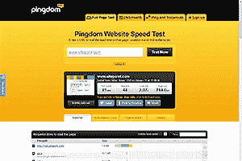
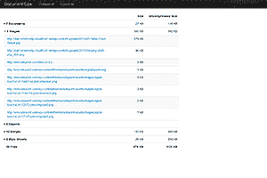
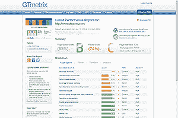
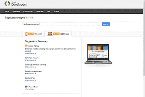
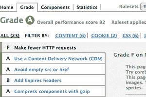
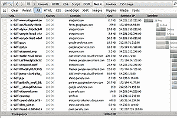
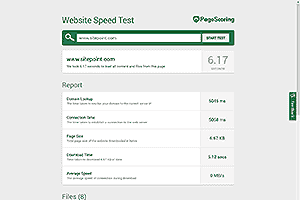
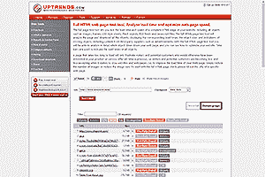
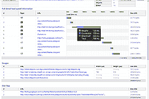
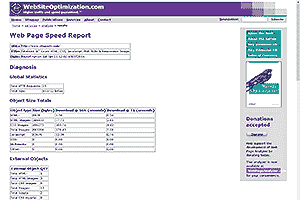

# 减轻页面重量的完整指南

> 原文：<https://www.sitepoint.com/complete-guide-reducing-page-weight/>

总页面权重在 2013 年增加了 32%,达到了可笑的 1.7Mb 和 96 个 HTTP 请求。这是一个平均数字。一半的网站会更大。网站肥胖已经成为一种流行病，我们网站开发者应该受到谴责。没有借口。

超重的网站会对你的底线产生负面影响:

1.  下载量越大，体验越慢。不是每个人都有 20Mb 的连接，这在发达的西方国家尤其如此，这些国家的铜基础设施老化。不管你的网站有多好:*用户不会等*。
2.  [移动网络接入增长迅速](/browser-trends-january-2014-yearly-review/),几乎达到四分之一的用户。在典型的 3G 连接中，一个 1.7MB 的页面几乎需要一分钟才能出现。当你的网站在这些设备上不能有效工作时，采用响应式网页设计技术还有意义吗？
3.  谷歌的页面速度算法会降低你的网站，损害搜索引擎优化的努力。
4.  代码越多，更新和维护的时间就越长。

我预测[页面权重今年会下降](/10-web-predictions-2014/)——我希望不会被证明是错的。幸运的是，有一些快速修复方法可以对站点性能产生立竿见影的效果。所有这些技术都是众所周知的，使用当今的技术，不需要花费大量的时间，并且可以在现有的代码基础上实现，而不需要重新开发。稍后我将继续学习更高级的技术，然后概述一些工具来帮助你衡量你的成功。

前三个实际上并没有使你的网站苗条，而是把它放在紧身胸衣和讨人喜欢的衣服里…

### 1.激活 GZIP 压缩

据[W3Techs.com](http://w3techs.com/technologies/details/ce-gzipcompression/all/all)称，几乎一半的网站不支持压缩。这通常是一个服务器设置，*应该*由你的网络主机启用，尽管你也可以自己配置。

### 2.鼓励浏览器缓存

如果浏览器可以轻松缓存文件，就不一定需要再次下载。简单的解决方案包括在 HTTP 报头中设置适当的 [Expires 报头](https://www.w3.org/Protocols/rfc2616/rfc2616-sec14.html#sec14.21)、 [Last-Modified](https://www.w3.org/Protocols/rfc2616/rfc2616-sec14.html#sec14.29) date 或者采用 [ETags](http://en.wikipedia.org/wiki/HTTP_ETag) 。

您可以配置您的服务器来自动处理这个问题，例如，这里有一个 Apache。将所有图像缓存一个月的 htaccess 设置:

```
<IfModule mod_expires.c>
ExpiresActive On

<FilesMatch "\.(jpg|jpeg|png|gif|svg)$">
ExpiresDefault "access plus 1 month"
</FilesMatch>

</IfModule>
```

### 3.使用内容交付网络(CDN)

浏览器为每个域设置了 4 到 8 个并发 HTTP 请求的限制。如果您的页面有 96 个从您的域加载的资产，在所有资产出现之前，最多需要 12 组并发请求。(实际上，文件大小不同，所以不会完全一样，但这种限制仍然适用。)

从另一个域请求静态文件有效地使浏览器可以发出的 HTTP 请求数量翻倍。此外，用户更有可能预先缓存该文件，因为它已经在其他地方的另一个站点上使用过。简单的选择是 JavaScript 库，比如 jQuery 和字体库，但是您也可以考虑专用的图像托管。

前三个选项有助于提高页面速度，但我们需要先检查您的代码，然后才能主动降低页面权重…

### 4.移除未使用的资产

网站在发展。如果您不再使用小部件，您可以移除相关的 CSS 和 JavaScript。如果它们包含在单独的文件中，这是一项简单的工作。如果没有，可能需要使用 Chrome 的 Audit 开发者工具、 [JSLint](http://www.jslint.com/) 、 [Dust-Me 选择器](https://addons.mozilla.org/firefox/addon/dust-me-selectors/)、 [CSS 用法](https://addons.mozilla.org/firefox/addon/css-usage/)、[unused-css.com](http://unused-css.com)等工具或者构建工具如 [grunt-uncss](https://github.com/addyosmani/grunt-uncss) 。

### 5.连接和缩小 CSS

理想情况下，你需要一个 CSS 文件(尽管如果你使用 [RWD 来支持旧版本的 IE](/support-old-browsers-responsive-web-design/) 可能需要两个)。虽然构建和维护单独的 CSS 文件可能是明智的，但是在产品服务器上托管之前，您应该将它们连接起来并删除不必要的空白。

像[萨斯](http://sass-lang.com/)、[少](https://lesscss.org/)和[手写笔](http://learnboost.github.io/stylus/)这样的预处理器可以为你做这些艰苦的工作。包括 [Grunt.js](http://gruntjs.com/) 或 [Gulp](http://gulpjs.com/) 在内的构建工具可以自动化你的工作流程，或者，如果你更喜欢 GUI， [Koala 提供了一个免费的跨平台应用](http://koala-app.com/)。

如果这听起来太费力，您可以在文本编辑器中或从命令行手动连接文件，例如在 Windows:

```
copy file1.css+file2.css file.css
```

或 Mac/Linux:

```
cat file1.css file2.css > file.css
```

生成的文件可以通过在线 CSS 迷你器运行，如[cssminifier.com](http://cssminifier.com/)、 [CSS 压缩器&迷你器](http://www.minifycss.com/css-compressor/)或 [CSS 压缩器](http://www.cssdrive.com/index.php/main/csscompressor/)。

最后，记得在`head`中加载所有的 CSS，这样浏览器就知道如何设计随后的 HTML，而不需要再次重绘页面。

### 6.连接和缩小 JavaScript

平均每个页面加载 18 个单独的脚本文件。虽然将 jQuery 这样的库作为单独的文件是可行的，但是您自己的 JavaScript 代码应该在生产服务器上进行连接和精简。同样，构建工具会有所帮助，或者你可以使用在线工具，比如 [YUI 压缩器](http://www.refresh-sf.com/yui/)、[闭包编译器](http://closure-compiler.appspot.com/home)或者我个人最喜欢的[JavaScript Compressor rater](http://compressorrater.thruhere.net/)，它会将你的代码传递给多个引擎，这样你就可以选择最好的。

不可否认，您需要稍微小心一点，因为如果您有糟糕的代码——甚至是缺少分号——JavaScript 压缩器可能会失败。然而，简单地连接文件将提供性能提升，因为您发出的 HTTP 请求更少了。

最后，最好在结束 HTML `body`标签之前加载 JavaScript。这确保了脚本不会阻止其他内容的加载，并且在下载和执行脚本之前页面内容是可读的。

### 7.使用正确的图像格式

使用错误的图像格式会使你的页面变大。总的来说:

1.  使用 JPG 拍摄照片
2.  其他的都用 PNG。

当您的小图形颜色集有限时，GIF 可能会压缩得更好，尽管这种情况很少见。一些图像也更适合作为矢量，但是我们将在后面的文章中讨论。

你需要一个像样的图形包来转换图像，但有很多免费的选项可用，有些如 [XnView](http://www.xnview.com/) 允许你批处理文件。记得玩设置:

*   JPG 是一种有损格式，质量介于 0(较差的较小文件)到 100(最佳的较大文件)之间。大多数图像在 30 到 70 之间看起来很好，但是实验找到最低的可接受值。
*   PNG 有 256 位和 24 位两种颜色。如果不需要透明，可以限制调色板，256 色版本可能压缩得更好。

### 8.调整大图像的大小

配备 300 万像素摄像头的入门级智能手机会产生太大的图像，无法在网页上显示。不幸的是，内容编辑会直接从他们的相机上传图像。一点教育和自动调整系统是值得推荐的。

图像尺寸不应超过其容器的最大尺寸。如果模板的最大水平间距为 800 像素，则图像不需要更大的宽度。也就是说，那些使用高密度/视网膜显示器的人可能会欣赏双倍 1600 像素宽度的图像，但这仍然小于典型的相机输出。

调整图像大小对页面重量有很大的影响。将图像尺寸缩小 50%会使总面积减少 75%,并且会大大减小文件大小。

### 9.进一步压缩图像

即使您已经切换到正确的格式并调整了尺寸，也可以使用分析和优化图形的工具来进一步缩小图像文件。其中包括 [OptiPNG](http://optipng.sourceforge.net/) 、 [PNGOUT](http://advsys.net/ken/utils.htm) 、 [jpegtran](http://jpegclub.org/jpegtran/) 和 [jpegoptim](http://jpegoptim.sourceforge.net/) 。大多数可以作为独立的可执行文件安装，或者集成到您的构建过程中。或者，在线工具如 [Smush.it](http://www.smushit.com/ysmush.it/) 可以在云中完成这项工作。

### 10.删除不必要的字体

网络字体革新了设计，减少了对图形文本的需求。但是，自定义字体是有成本的，可能会给页面增加几百千字节的空间。如果你使用了两到三种以上的字体，你可能会做过头。你的客户/老板可能喜欢糟糕的手写字体，但是，如果它只用于一个标题，值得下载一个 200KB 的字体文件吗？

我怀疑许多网站可以通过非开发者几个小时的努力减少 30-50%的权重。对于一般的站点来说，这可以节省 800 多 Kb，而且速度会明显加快。

## 你的网站还超重吗？一些更强硬的解决方案

但是，如果在遵循这些步骤后，你的页面仍然肥胖，你可以考虑更激烈的节食选择。

### 1.移除社交网络按钮

你的页面上有脸书、Twitter、Google+和 LinkedIn 的分享按钮吗？这是您提供给沮丧的最终用户的 580Kb 内容。其中大部分是必须由浏览器执行的 JavaScript，一些网络规定它必须在你的内容出现之前加载。

臃肿的社交窗口完全没有必要——你可以用几行 HTML 代码在页面上添加无脂肪的社交按钮。一点 JavaScript 可以逐步增强体验，并在桌面设备上显示一个弹出窗口。

虽然简单的按钮不会显示点击统计，但你可以通过谷歌分析中的[事件跟踪发现更多信息。](/google-analytics-track-javascript-ajax-events/)

### 2.检查所有第三方小部件

社交网络不是唯一的罪犯。向页面添加第三方小部件的隐藏成本远远超过了包含的标记。即使内容是从另一个域加载的，它也可能包含数百千字节的数据、JavaScript、CSS 和图像。

如果你必须使用一个小部件，考虑一个写得更好的。理想情况下，小部件 JavaScript 应该是轻量级的，加载在页面的末尾，但能够将内容放在指定的 HTML 容器中。或者…

### 3.考虑 lazy loading——或点播内容

假设你正在播放一个由专业提供商主持的视频。虽然只有当用户点击“播放”时视频才会被下载，但是无论用户是否播放视频，您都可能会加载视频 API 代码和其他相关资源。为什么不在用户请求时加载所有内容呢？

您还可以考虑在用户滚动页面时下载的点播图像和内容。我不喜欢这种技术；它可能会对可用性或 SEO 产生负面影响。但是，它对某些类型的网络应用程序很有用，例如图片库。

### 4.用 CSS3 效果替换图像

你是否正在切割图像以创建渐变、圆角边框和阴影？我希望不是——CSS3 让这些技术变得多余。

这些效果在 IE8 及以下版本中不起作用，但老歌正在消亡，用户不会意识到这一点，因为他们不会在多个浏览器中比较你的网站。你可以添加一些聪明的垫片，比如 [CSS3 PIE](http://css3pie.com/) ，但是我不建议你这么做:它们会让你的页面变得很大，让旧的浏览器慢如蜗牛。

CSS3 的效果通常会降级，所以你很少需要担心旧的浏览器。当你在构建适应不同屏幕尺寸的响应式设计时，像素完美总是徒劳的，而且是完全荒谬的。

不过需要注意的是:CSS 阴影和渐变在浏览器重绘过程中代价很高，尤其是当你显示许多添加了这些特性的元素时。因此，在承诺过度使用这些效果来替换图像之前，请谨慎使用这些效果并测试滚动性能和[重画](http://addyosmani.com/blog/devtools-visually-re-engineering-css-for-faster-paint-times/)。

### 5.用 CSS3 效果和动画替换 JavaScript

你的 JavaScript 是不是充斥着`$("#x").fade()`和`$("#y").slideDown()`效果？几年前这可能是必要的，但是 CSS3 [动画](/css3-animations-101/)、[过渡](/css3-transitions-101/)和[转换](/css3-transformations-101/)已经在很大程度上取代了 JavaScript 效果。原因是:

1.  CSS3 动画由浏览器本机处理；如果做得好，它通常会比 JavaScript 执行得更快、更流畅。
2.  CSS3 动画更容易编写，需要的代码也更少。
3.  CSS3 提供了 3D 转换，这在没有专门库的情况下，仅靠 JavaScript 是非常困难的——如果不是不可能的话。

有些情况下，您需要细粒度的 JavaScript 控制，但它们是罕见的例外。再说一次，特效在旧浏览器中不能工作，但应该会优雅地降级。

### 6.考虑可缩放矢量图形(SVG)

SVG 包含 XML 中定义为向量的点、线和形状。SVG 是响应式设计的理想选择，因为它们可以缩放到任意大小而不损失质量，并且文件大小通常小于位图。

SVG 并不适合所有情况。照片和复杂的图像将永远是更好的 JPG 或巴布亚新几内亚。然而，徽标、图表和图表通常是合适的。此外，可以使用 CSS 和 JavaScript 在客户端操作 SVG。

有一些工具可以将位图转换成矢量格式，但是从头开始会产生最好的结果。Illustrator、 [Inkscape](http://www.inkscape.org/) 和 SVG edit 等软件包提供了一个良好的开端，尽管[学习 XML 基础知识](/svg-drawing-basics/)会帮助你产生更简洁的代码。

### 7.用图标字体替换图像

你的网站上可能有很多小图标在使用，管理单个的图像文件并不有趣。幸运的是，[图标字体](/webfont-icons/)可以节省空间和理智。一个字体可以包含数百个基于矢量的图像，这些图像可以在所有浏览器中设置为任何颜色和缩放为任何大小(回到 IE6)。

你可以使用专用字体，或者为了节省带宽，使用诸如 [Fontello](http://fontello.com/) 、 [IcoMoon](http://icomoon.io/) 或 [Flaticon](http://www.flaticon.com/) 等工具来创建包含你需要的图标的字体包。

### 8.使用图像精灵

一旦 CSS3、SVG 和图标字体选项被拒绝，位图图像应该是最后的选择。经常使用的位图可以打包成一个单独的 sprite 文件，这样就可以在 CSS 中访问单独的图像

```
.sprite {
	width: 16px;
	height: 16px;
	background: url("sprite.png") 0 0 no-repeat;
}

.sprite.help { background-position: 0 -16px; }
.sprite.info { background-position: 0 -32px; }
.sprite.user { background-position: 0 -48px; }
```

优点:

1.  您需要一个 HTTP 请求来加载 sprite。
2.  单个精灵通常会产生比单个图像总重量更小的整体文件大小。
3.  加载精灵后，所有图像都会出现。

图像精灵可以在图形包中创建，也可以使用工具创建，例如[精灵-奶牛](http://www.spritecow.com/)和[即时精灵](http://instantsprite.com/)。你也可以在[你的工作流程](https://github.com/asciidisco/grunt-imagine)中加入精灵的制作。

### 9.使用数据 URIs

数据 URIs 对二进制和文本资产进行编码，就好像它们是外部资源一样。位图图像和 SVG 可以直接用 HTML、JavaScript 或更有用的 CSS 编码:

```
.bullet {
	background-image: url("data:image/png;base64,iVBORw0KGgoAAAANSUhEUgAAABAAAAAQAQMAAAAlPW0iAAAABlBMVEUAAAD///+l2Z/dAAAAM0lEQVR4nGP4/5/h/1+G/58ZDrAz3D/McH8yw83NDDeNGe4Ug9C9zwz3gVLMDA/A6P9/AFGGFyjOXZtQAAAAAElFTkSuQmCC");
}
```

这将减少 HTTP 请求的数量——尽管维护会更加困难，除非您能够以某种方式自动化这个过程。我只推荐那些不太可能改变的小而常用的图片。

工具如[DataURL.net](http://dataurl.net/)和[数据:URI 生成器](http://dopiaza.org/tools/datauri/)将为您将文件转换为数据 URIs。

### 10.使用网站评估工具

你不会知道你的节食是否成功，除非你监控你的页面权重和随之而来的下载速度的提高。浏览器开发者控制台和免费在线工具，如 [Google Page Speed Insights](http://developers.google.com/speed/pagespeed/insights/) 可以提供帮助。在我们在本系列的最后一部分讨论更激进的、类似抽脂的页面减肥技术之前，我的下一篇文章中会有一个全面的列表。

## 网站还是不够精瘦？一些更激烈的解决方案

网页减肥法很难。您可以实现快速修复。也许你已经采取了更强硬的措施，比如优化你的 CSS 和 JavaScript。但是，一旦你的老板/客户要求另一个闪亮的新部件、轻佻的社交网络按钮或古怪的字体，你所有的伟大工作都被扔掉了。

不幸的是，节食的好处往往有限。另一方面，剧烈的生活方式改变可以确保你的网站永远不会变得肥胖。下面的几个建议是有争议的，并不适合所有人，但至少，我希望这些建议能让你更加意识到页面权重的问题…

### 1.永远不要相信第三方代码

你会允许一个不知名的开发者自由访问你的网站代码吗？如果不是，为什么要信任第三方代码？向页面添加有用的小部件很容易，而且很少会危及安全性。也就是说，要经常检查他们正在引入哪些资源。比如社交网络按钮[可以增加半兆的内容](/social-sharing-hidden-costs/)，让你的页面变慢；没有他们你能行吗？

### 2.一个 JavaScript 库就足够了

也许你正在使用 jQuery。那很好——坚持下去。但是不要浏览原型或 YUI 插件库来寻找很酷的小部件和效果。

你还应该考虑更极端的选择:

1.  如果没有使用库中提供的所有特性，是否可以获得定制版本？
2.  有没有轻量级的替代方案，比如提供与核心 jQuery 方法同等 API 的 Zepto.js 或 T2 minified . js？
3.  需要一个库吗？如果它主要用于消除浏览器的不一致性，也许这些问题已经不存在了。你使用图书馆是因为它熟悉和舒适吗？

### 3.当心 CMS 模板

很少有内容管理系统会生成超重的页面… *但是之后你开始添加内容*。

一个免费的或商业的模板可以有财务意义。当现成的代码只需几美元就能完成您需要的一切时，为什么还要雇佣开发人员呢？对于简单的小册子网站来说，它们可能是理想的，但是有一个隐藏的成本。通用模板必须卖出数百份，如果不是数千份的话，才能收回开发成本。为了吸引买家，开发者捆绑了他们能捆绑的每一个功能；您可能只使用了其中的一小部分，但是它们仍然存在于页面代码中。

也许我运气不好，但是我体验过的 WordPress 主题经常超过 2Mb。我肯定有轻量级的选择，但找到一个是另一回事。

### 4.削减框架脂肪

样板框架，比如 Bootstrap 和 Foundation，对于原型开发或者作为新项目的起点非常有用。不幸的是，像通用模板一样，它们附带了 CSS、JavaScript 和其他你永远不需要的资源。HTML 也趋向于相当冗长，并且充斥着不具意义的类名。

就我个人而言，我更喜欢网页开发中类似乐高的模块化方法*(这是经典的乐高积木，而不是限制你构建一个特定事物的包)*。您从零开始，添加所需的组件。框架更像是大理石雕刻；在网站完成之前，你会切掉不需要的部分。这是应该发生的——但是把东西放进去更容易。

我不会说*“不要使用框架”*，但是要注意它们带来的额外负担。像 [grunt-uncss](https://github.com/addyosmani/grunt-uncss) 这样的工具可以帮助删除不必要的代码，但是从一开始就不添加框架代码可能更好。

### 5.拥抱渐进增强

术语*渐进式改进*已经失宠，但这本质上是你在一个移动优先的响应网站中所做的事情。本质上，您正在创建一个基本的可用体验，并根据浏览器的支持或要求进行增强。一个简单的例子:当触发桌面屏幕媒体查询时，您可以在 CSS 中引用一个大图像——大多数现代移动浏览器不会请求该文件。您可以使用条件 JavaScript 加载器和[网络 API](/use-network-information-api-improve-responsive-websites/) 进一步增强这一点。

渐进的增强很少招致显著的额外努力；这是一种开发方法，而不是一种技术。

### 6.采用构建过程

在部署之前，您应该确保已经做了一切工作来减少图像、CSS 和 JavaScript 文件。这可能是一个手动过程，但像 [Grunt.js](http://gruntjs.com/) 和 [Gulp.js](http://gulpjs.com/) 这样的自动化工具可以让它变得相当无痛。

### 7.了解你的代码

CSS 和 JavaScript 预处理程序，如 Sass、LESS、Stylus、CoffeeScript、TypeScript 和 Dart，可能已经彻底改变了您的生产力和工作流程。但是，源代码是从最终生成的代码中抽象出来的。预处理程序的输出和输入一样好，有可能无意中以编程方式添加了数千个多余的行。因此，要经常检查以确保输出是有效的。

### 8.考虑离线 AppCache

Web 应用程序能够使用 HTML AppCache 离线工作。可以使用 AppCache 来补充或增强浏览器对常用资产的缓存。

### 9.简化你的网站

在过去的几年中，网站和应用程序已经避开了复杂性，提供了一种简化的、以客户为中心的体验。但不是每个人都明白这一点，不可否认，简化可能比听起来更难。许多客户都想成为软件设计师，并添加琐碎的功能，因为他们:

1.  错误地认为更多的功能会吸引更多的顾客，
2.  考虑到他们从开发商那里获得了更高的性价比
3.  他们不知道任何更好的。

幸运的是，一点点用户测试可以帮助您识别从未使用过的选项，这些选项可以从产品中剔除，或者用更时尚、更轻量级的替代方案来替换。

### 10.改变你的发展生活方式

平均网页大小达到 1.7 兆应该怪谁？开发商。一个网站如何或为什么变得肥胖并不重要；一个开发商让它发生了。

当然，开发速度和成本削减是重要的——但如果结果是一个从来没有使用过的缓慢、笨重的产品，这就不重要了。你的客户/老板可能不理解技术问题，但是，如果你不以通俗的语言强调潜在的陷阱，你将永远不会成为一个有责任心的程序员，赢得你应得的尊重和奖励。

轻量级页面是高效编码实践的直接结果，应该是任何项目的重要考虑因素。不幸的是，完成这项工作通常会和内容、搜索引擎优化和可用性测试一起被扔进“以后再做”的垃圾箱。我的建议:

1.  当你使用 50Mbps 的高速连接时，很容易忘记带宽问题。限制连接或尝试在 3G 信号差的地区或繁忙的酒店 wifi 网络上加载您的网站。每天都有成千上万的用户体验到你的挫败感。
2.  考虑每个项目中的页面权重，质疑添加到页面中的每个资产。那个字体有必要吗？你能减少背景图片的尺寸吗？CSS3 动画会取代 JavaScript 库吗？等等。
3.  改变你的态度。网页肥胖是一种流行病，但显然很少有开发者关心。创建纤细的网页是一项有价值的技能，可以帮助你脱颖而出。

## 帮助您衡量成功的工具

除非你持续监控页面重量，否则你不会知道你的饮食进展如何。平均页面[现在超过 1.7Mb，仅在 2013 年就增长了 32%](/average-page-weights-increase-32-2013/)。如果您的开发人员正在秘密地狼吞虎咽地吃着令人发胖的小部件，下面的任何评估工具都会突出他们的贪吃。它们都是免费的，只需要几秒钟就可以运行——你*和*在做什么…

### [1。乒坛](http://tools.pingdom.com/)

Pingdom 是我最喜欢的在线工具之一。它揭示了你可能需要知道的一切:页面重量，下载速度，代码分析，性能等级，发展建议，甚至是记录你节食进展的历史时间表。如果你只用一个分析工具，Pingdom 应该是它。

### [2。火狐网络开发插件](https://addons.mozilla.org/firefox/addon/web-developer/)

Chris Pederick 的 Web Developer toolbar 在(Firefox)诞生之初就已经存在了。要使用它查看压缩和未压缩的页面尺寸，从**信息**菜单中选择**查看文件尺寸**。

请注意，Web Developer 是作为 Chrome 扩展提供的，但不幸的是，它没有这个特性。

### [3。GTmetrix ](http://gtmetrix.com/)

GTmetrix 显示了从谷歌的 [PageSpeed Insights](#pagespeed) 和 [YSlow](#yslow) 生成的汇总报告，以及页面总大小和请求数量等其他信息。在线工具比这两个系统都好，尽管你仍然可以单独使用它们。

### [4。Google PageSpeed Insights ](http://developers.google.com/speed/pagespeed/insights/)

PageSpeed Insights 不会显示总页面权重或下载速度统计数据，但它确实指出了桌面和移动设备可以改进的地方。网站被分配一个 100 分的分数，因此您可以快速评估改进的进展情况。

### [5。YSlow ](http://yslow.org/)

雅虎的 YSlow 是一个在线工具和插件，可用于大多数浏览器。像 PageSpeed Insights 一样，它对页面进行评估，并根据一系列因素给出介于 A(你已经尽了全力)和 F(你很失败)之间的分数。

### [6。浏览器开发者控制台](https://www.getfirebug.com/)

如果你不想使用任何新的东西，Firebug，Chrome Inspector，Firefox Web Developer 和 IE Developer 工具都提供了网络分析器和 profilers 来帮助评估你的页面大小。请注意，他们不一定会下载缓存资产，因此您可能需要在测试之前使用 Ctrl+F5 或清除缓存。

### 7.PageScoring 网站速度测试

如果你需要一个快速简单的工具，网站速度测试可以胜任。它集中在下载时间，但文件大小也显示，随着每个文件的下载时间，可以方便地隔离问题领域。

### [8。上升趋势速度测试](http://www.uptrends.com/aspx/free-html-site-page-load-check-tool.aspx)

除了通常的大小和下载速度测试，Uptrends 工具的独特之处在于它允许您从特定的地理位置测试响应能力。该报告还强调了每个资源来自哪个域，以帮助评估 CDN 的有效性。

### [9。页面速度工具](http://www.internetmarketingninjas.com/pagespeed/)

页面速度工具是很好的介绍，并强调文件大小，资产，资源组和下载速度。请注意，估计的加载时间似乎只是针对 HTML 源文件计算的，而不是针对所有文件。但是，通过检查附带的瀑布图，可以很好地估计总加载时间。

### 10。网页分析器

如果你能原谅它的年龄和过时的紫色和橙色设计，网页分析器提供了一系列的文件大小统计数据，以及对调制解调器的下载时间估计，一直追溯到 14.4K！

## 唷！

我希望你发现这份详尽的指南很有用，并且至少有一些解决方案有助于减肥。祝你的新减肥计划好运！

## 分享这篇文章