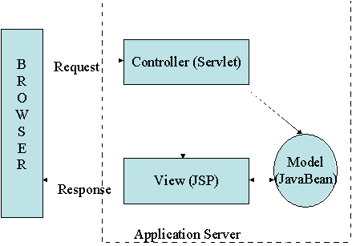
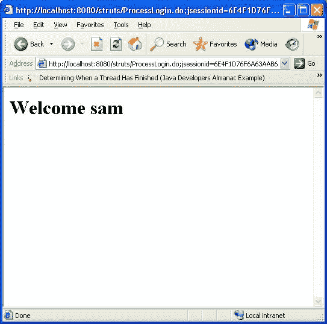
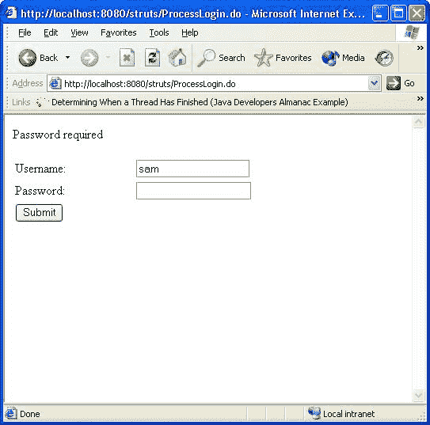

# 用 Struts 完成 MVC 难题

> 原文：<https://www.sitepoint.com/complete-mvc-puzzle-struts/>

MVC 模式是一个值得称赞的理想，但是那些在不止一个站点上实现过它的人可能会觉得他们在几个方面都在重新发明轮子。开源的 Apache Struts 框架让您可以继续构建您的站点，因为它提供了最好的 mag wheels。

在本文中，我们将对模型-视图-控制器(MVC)设计模式进行一次简短的探索，特别是，我们将看看它是如何使用 Struts 框架实现的。我们将从在理论层面上描述 MVC 模式开始，然后继续描述我们如何“推出我们自己的”MVC 框架。一旦我们了解了这一点，我们将描述 Struts 并展示这项技术如何帮助我们快速简单地构建基于 MVC 的 Web 应用程序。

##### 模型-视图-控制器模式

MVC 模式最初是在 Smalltalk 世界中构思的。我们现在将绕过这段历史，转而关注它在 Java Web 应用程序开发领域中的应用。

当 Java Servlets 第一次被构思出来时，程序员立刻意识到它们是一项伟大的技术。它们比现有的 Web 编程 CGI 方法更快、更灵活、更可靠、更强大。然而，开发基于 Servlet 的 Web 应用程序有一个很大的缺陷——持续需要`out.println("...")`类型的语句将 HTML 输出到用户的浏览器。这种方法容易出错，而且非常耗时(开发人员必须避开任何引号等)。被发送到浏览器)。这也使得修改网站的外观变得非常困难，因为外观和逻辑都被捆绑在一起。

这个问题的答案是 JavaServer Pages，它颠覆了 Servlets。这样，我们使用一系列的`<%...%>`标签在 HTML 中编写了业务逻辑代码。这使得我们的应用程序以 JSP 为中心，尽管不像以 Servlet 为中心的应用程序那样糟糕，但仍然很混乱，需要很多额外的代码来控制应用程序的流程。实际上，这在 JSP 的格式化代码中没有位置。显然是时候寻找另一种方式了。

人们很快意识到 JavaServer Pages 和 Servlets 可以很好地协同工作。毕竟，Servlets 非常擅长逻辑类型的编程、处理请求和处理控制流，而 JavaServer Pages 非常擅长格式化请求处理的结果，并通过浏览器收集用户输入。这种工作方式很快被称为模型 2(单独使用 JavaServer 页面或 Servlets 被称为模型 1)。

模式 2 不是特别创新或新颖；许多人很快意识到它遵循了 Smalltalk 时代开发的著名 MVC 模式。因此，Java 程序员倾向于互换使用术语 Model 2 和 MVC。

##### 什么是模型-视图-控制器？

既然我们对 MVC 在 Java Web 应用程序开发中的历史有所了解，那么更详细地描述模式本身似乎是明智的。在这一节中，我们将找出模型、视图和控制器实际上是什么，它们的职责是什么，以及我们如何自己实现一个简单的框架。让我们先来看看模型、视图和控制器是如何相互作用的:


图 1:模型 2/MVC 架构

从上图中可以看出，用户通过向控制器组件(通常由 Servlets 表示)提交请求来与它们进行交互。反过来，控制器组件实例化模型组件(通常由 JavaBeans 或其他类似技术表示)，并根据应用程序的逻辑操纵它们。一旦构建了模型，控制器就决定下一步向用户显示哪个视图(通常用 JavaServer Pages 表示)，这个视图与模型进行交互，向用户显示相关数据。视图还可以在提交给控制器之前修改模型的状态，以便流程重新开始。

为了更全面地理解组件之间的交互，考虑这样一个框架的简单示例是有用的。这个例子将关注一个简单的应用程序，它提交并记录用户的登录信息。不要忘记在这里下载本文的代码[。](https://www.sitepoint.com/examples/jspdownload/struts.zip)

##### 景色

对于这个应用程序的视图，我们将使用 2 个简单的 JSP。这些显示如下:

```
<html>  

    <head>  

        <title>Please Login</title>  

    </head>  

    <body>  

        <h1>Please enter your login information</h1>  

        <br/>  

        <form action="controller?action=login" method="post">  

            <table border="0">  

                <tr>  

                    <td>Username</td>  

                    <td><input type="text" name="username"/></td>  

                </tr>  

                <tr>  

                    <td>Password</td>  

                    <td><input type="password" name="password"/></td>  

                </tr>  

                <tr>  

                    <td>  

                        <input type="submit"/>  

                    </td>  

                    <td>  

                        &nbsp;  

                    </td>  

                </tr>  

            </table>  

        </form>  

    </body>  

</html>

The login.jsp page

这个登录页面只是让用户有机会输入他们的用户名和密码。这将其输入提交给控制器 Servlet(如下所示)，告诉它调用登录动作(这是表单发送的动作参数):

```
<jsp:useBean id="user" class="com.samjdalton.mvc.model.UserBean"  scope="session" />  

<html>  

    <head>  

        <title>Welcome</title>  

    </head>  

    <body>  

        <h1>Welcome <jsp:getProperty name="user" property="name"/></h1>  

    </body>  

</html>

The welcome.jsp page

welcome.jsp 页面使用用户在上一页提供的用户名向用户显示欢迎消息。如您所见，这只是使用了会话中的 JavaBean(如`useBean`标记所示)。)这个 bean 由控制器放在会话中，我们接下来会看到。

控制器

一个 Servlet(其代码如下所示)在我们的应用程序中实现控制器:

```

```
package com.samjdalton.mvc.controller;  

import com.samjdalton.mvc.controller.actions.LoginAction;  

import javax.servlet.http.HttpServlet;  

import javax.servlet.http.HttpServletRequest;  

import javax.servlet.http.HttpServletResponse;  

import javax.servlet.ServletException;  

import javax.servlet.RequestDispatcher;  

import java.io.IOException;  

public class Controller extends HttpServlet {  

    protected void doGet(HttpServletRequest httpServletRequest, HttpServletResponse httpServletResponse) throws ServletException, IOException {  

        doPost(httpServletRequest, httpServletResponse);  

    }  

    protected void doPost(HttpServletRequest httpServletRequest, HttpServletResponse httpServletResponse) throws ServletException, IOException {  

        // get the action property from the request  

        String theAction = httpServletRequest.getParameter("action");  

        Action action=null;  

        if (theAction.equalsIgnoreCase("login")) {  

             action = new LoginAction(httpServletRequest,httpServletResponse);  

        }  

        // execute the action, which returns the page to go to next  

        String page = action.execute(httpServletRequest,httpServletResponse);  

        RequestDispatcher rd = httpServletRequest.getRequestDispatcher(page);  

        // forward to the next page  

        rd.forward(httpServletRequest,httpServletResponse);  

    }  

}

Controller.class

这是一个非常简单的控制器，它仅仅使用一个请求参数(动作)来决定调用哪个动作。在这种情况下，页面将登录动作作为参数发送，并调用`LoginAction`。这个动作用一个方法 execute 实现了一个标准接口(动作),该方法将`Request`和`Response`对象作为其参数。action 类返回要调用的下一个页面(视图)的路径，用户被重定向到该页面。

我们示例中的`LoginAction`如下所示:

```

```
package com.samjdalton.mvc.controller.actions;  

import com.samjdalton.mvc.controller.Action;  

import com.samjdalton.mvc.model.UserBean;  

import javax.servlet.http.HttpServletRequest;  

import javax.servlet.http.HttpServletResponse;  

public class LoginAction implements Action {  

    public LoginAction(HttpServletRequest request, HttpServletResponse response) {  

    }  

    public String execute(HttpServletRequest req, HttpServletResponse res) {  

        // get the user name  

        String username = req.getParameter("username");  

        // create a UserBean  

        UserBean user = new UserBean(username);  

        // put it in the session  

        req.getSession().setAttribute("user", user);  

        // redirect to the welcome.jsp page  

        return "/welcome.jsp";  

    }  

}

LoginAction class

这个动作从请求中获取 username 参数，创建一个新的模型对象(`UserBean`)，将其放入`Session`，并指示流程中的下一个页面是 welcome.jsp。

##### 模型

我们的应用程序中的模型非常简单，只包含一个 JavaBean。如下所示:

```
package com.samjdalton.mvc.model;   

public class UserBean {   

    private String name;   

    public UserBean(){}   

    public UserBean(String name) {   

        this.setName(name);   

    }   

    public void setName(String name) {   

        this.name=name;   

    }   

    public String getName() {   

        return name;   

    }   

}

UserBean.class

实际应用

如您所见，这是一个非常简单的 Model 2 应用程序，可以大大扩展。例如，我们可以动态地配置动作；我们还可以将控制流外部化(这些操作可以询问配置管理器下一步要转到哪个页面)。

然而，有一个预先存在的框架提供了所有这些可配置性以及更多。这个框架叫做 Struts。

Struts 简介

Struts 项目是 Craig McClanahan 在 2000 年初构思的，目的是为开发基于 MVC 的 Java Web 应用程序提供一种标准方法。Struts 1.0 最终在 2001 年中期发布，现在是 Apache 基金会雅加达项目的一部分。Struts 在各种不同的项目中被广泛使用，跨越各种行业(我个人在从银行到航运的各种项目中使用过它！).

Struts 是一个高度可配置、高度可扩展的 MVC 框架，我们可以用它来开发几乎任何可以想象的 Java Web 应用程序。Struts 中提供了 MVC 框架的每个成员。让我们把注意力转向安装 Struts 的任务。

安装支柱

您可以在(断开的链接)获得最新的 Struts 发行版(在撰写本文时，这是 1.1)。一旦你下载了它，你应该解压应用程序。该发行版包含开发 Struts 应用程序所需的所有库。该发行版在 Webapps 目录中包含一个空白的 Struts Web 应用程序(struts-blank.war)。这特别有用，因为它包含了一个框架 Web 应用程序，您可以在此基础上创建自己的应用程序。

您可以将自己的代码放在 WEB-INF/classes 目录中，将自己的配置放在 WEB-INF/struts-config.xml 中，这样就可以了！您拥有了一个功能完整的 Struts 应用程序。您可以创建一个 war 文件，并简单地将它部署到您喜欢的 Web 容器中(例如，将它复制到 Tomcat 的 webapps 目录中)。

接下来，我们将看看 Struts 提供的组件。

视图层

大多数 Struts 应用程序的视图层由 JavaServer 页面组成。为了方便视图的开发，Struts 提供了一组 JSP 定制标记库。这些标记库允许我们轻松地提供完全国际化的用户界面，与 Struts 应用程序的模型组件进行交互。

绝大多数动态 Web 前端都是基于 HTML 表单的，这类应用程序的用户已经开始期待这些应用程序的某些行为，比如表单验证。对于标准 JSP，这是一个繁琐的过程，包括记录表单的内容，并在出错时用来自 JavaBean 的信息填充每个表单元素。Struts 使用 FormBeans 简化了这种表单处理和验证。这些与 Struts 标记库相结合，使得使用表单进行视图开发变得非常简单和自然。

下面是一个 Struts JSP 视图的示例:

```

```
<%@ taglib  uri="/WEB-INF/struts-html.tld" prefix="html" %>   

<html:html>   

<head></head>   

<body bgcolor="white">   

<html:errors/>   

<html:form action="/logon">   

<table border="0" width="100%">   

    <tr>   

        <td>   

            Username:   

        </td>   

        <td>   

            <html:text  property="username"/>   

        </td>   

    </tr>   

    <tr>   

        <td>   

           Password:   

        </td>   

        <td>   

            <html:password property="password"/>   

        </td>   

    </tr>   

    <tr>   

        <td>   

            <html:submit/>   

        </td>   

        <td>   

            &nbsp;   

        </td>   

    </tr>   

</table>   

</html:form>   

</body>   

</html:html>
```

正如您所看到的，这看起来和标准的 HTML 表单没有什么不同。页面中没有讨厌的 JSP 脚本，但是我们有一些非常丰富的功能。该页面导入了 Struts HTML 标记库，该标记库允许我们组装提供验证、错误处理和模型交互的表单。我们还看到了`<html:errors>`标签的使用，它显示了模型或控制器记录的任何错误。标签基于 ActionForm 对象创建一个 HTML 表单。我们可以看到，表单的动作被设置为`/logon`；标签使用该值来查找要在配置文件中使用的 ActionForm(见下文)。这种映射包括与表单对象相关的名称，以及它的存储范围(会话、页面、应用程序等)。).然后对象的属性被`<html:text>`和`<html:password>`标签用来填充表单。提交时，ActionForm 也会自动填充表单值。

似乎 ActionForms 代表了我们应用程序的模型，但是，实际上，它们应该被认为是应用程序控制器的一部分。尽管 ActionForm beans 可以表示我们模型的属性，但是它们不包含持久性逻辑，也不包含任何业务逻辑。ActionForms 用于在模型和视图之间传递模型信息。

由于 ActionForms 代表了我们的应用程序的控制器部分的一部分，现在让我们在控制器部分看看如何构建 ActionForms。

##### 模型层

看了 Struts 应用程序的视图层之后，我们现在可以考虑模型层了。

Struts 应用程序中的模型层可以使用任何基于 Java 的技术来实现，比如 EJB、Hibernate 或 JDO。通常，模型被表示为包含数据和业务逻辑的简单 JavaBeans。如前所述，`ActionForm`对象并不代表应用程序的真实模型，我们的模型层不应该直接代表 HTML 表单对象。应该尽可能地开发模型对象，使它们不了解使用它们的环境(Struts 或其他)。这使得我们可以更容易地在不同的环境和应用程序中重用它们。

出于本文的目的，我们将开发一个简单的基于 JavaBean 的模型层，其中不包含持久性机制。由于这将映射到我们的`ActionForm`对象，我们可以在未来简单地用更复杂的技术替换它。

##### 控制器层

现在我们已经了解了如何构建模型和查看 Struts 应用程序的各个部分，我们可以继续看控制器了。Struts 包括一个 Servlet，它实现了控制器的主要功能，即将传入的 URL 映射到一个 action 对象。这个 Servlet 被称为`ActionServlet`，它提供了以下功能:

1.  决定需要采取什么行动来满足用户的请求

2.  向视图提供视图数据

3.  决定接下来显示哪个视图

控制器的大部分工作被委托给一组简单的动作类。Struts 开发人员必须提供这些操作来实现应用程序的逻辑。为了创建动作，开发人员必须实现动作接口。该接口包含以下方法，其中放置了大部分逻辑:

```
public ActionForward execute(ActionMapping mapping,    

                     ActionForm form,    

                     HttpServletRequest request,    

                     HttpServletResponse response)    

throws Exception;

As you can see, the method takes an ActionForm as one of its parameters. The ActionServlet ensures that the correct form is passed to the method. As discussed earlier, ActionForms help us to transfer data from the Model layer to the View layer.

```

```
ActionForms are very simple objects; the code below represents the ActionForm that we would use for a simple HTML form:

```

```
import javax.servlet.http.HttpServletRequest;    

import javax.servlet.http.HttpServletResponse;    

import org.apache.struts.action.ActionForm;    

import org.apache.struts.action.ActionMapping;    

public class Login extends ActionForm {    

    protected String username;    

    protected String password;    

    public void setUsername(String username) {    

        this.username = username;    

    }    

    public String getUsername() {    

        return username;    

    }    

    public void setPassword(String password) {    

        this.password=password;    

    }    

    public String getPassword() {    

        return password;    

    }    

}
```

该动作还带有一个`ActionMapping` 对象。这是由`ActionServlet`自动处理的，并代表您的应用程序的配置。配置是使用一个 XML 文件实现的，这个文件通常称为 struts-config.xml，下一节将详细讨论这个文件。

动作也采用标准的请求和响应；您的应用程序可以查询这些信息，以获得完成工作所需的信息。一旦动作完成了它的处理，它就简单地询问 ActionMapping 它下一步应该去哪里，并将其返回给 ControllerServlet。

##### 将各层拉到一起

既然我们已经看了 Struts 应用程序中存在的层，我们可以检查它们是如何连接在一起形成一个完整的应用程序的。正如我们已经提到的，Struts 应用程序是使用一个名为 struts-config.xml 的 XML 文件配置的。

1.  要使用的控制器

2.  动作表单和它们映射到的 HTML 表单

3.  行动

4.  ActionMappings，确定应用程序中的控制流

struts-config.xml 文件中的每个元素都包含在`<struts-config>`元素中:

```
<?xml version="1.0" encoding="ISO-8859-1" ?>    

    <!DOCTYPE struts-config PUBLIC    

              "-//Apache Software Foundation//DTD Struts Configuration 1.2//EN"    

              "http://jakarta.apache.org/struts/dtds/struts-config_1_2.dtd">    

    <struts-config>
```

出于本文的目的，我们将不考虑控制器组件的配置，因为这对大多数应用程序来说是不必要的。

为了配置我们的`ActionForm`对象，我们将使用以下 XML 配置:

```
<form-beans>    

  <form-bean    

                name="logonForm"    

                type="com.samjdalton.struts.LogonForm"/>    

</form-beans>
```

正如我们所见，这声明了一个名为`logonForm`的表单，并表明`com.samjdalton.struts.LogonForm`类实现了这个表单。

接下来，我们宣布我们的`ActionMappings`。这是通过使用以下 XML 配置标记来实现的:

```
<action-mappings>    

            <action    

                path="/Login"    

                forward="/login.jsp"/>    

      <action    

                path="/Welcome"    

                forward="/welcome.jsp"/>    

      <action    

                path="/ProcessLogin"    

                type="com.samjdalton.struts.LoginAction"    

                name="logonForm"    

                scope="request"    

                validate="true"    

                input="/Login.do">    

                <forward    

                    name="success"    

                    path="/Welcome.do"/>    

                <forward    

                    name="failure"    

                    path="/Logon.do"/>    

            </action>      

</action-mappings>
```

这为我们的应用程序声明了三个动作。前两个(`/Login`和`/Welcome`)非常简单，因为它们只是转发到一个 JSP 页面。第三个更复杂。这个动作在表单提交时被调用。它创建由`logonForm`元素表示的`ActionForm`，并调用`LoginAction`类来处理信息。该元素还包含 2 个`<forward>`元素。这些定义了应用程序的控制流。应用程序通过它们的名称(成功或失败)来引用它们，并将控制权传递给相关的资源。

##### Struts 在运行

看了组成 Struts 应用程序的所有部分之后，我们现在可以组装一个简单的应用程序，它执行与本文中的原始应用程序相同的工作，即让用户登录并显示欢迎消息。

首先，我们将检查我们的视图。在这个应用程序中，视图由两个简单的 JSP 组成，第一个允许用户输入用户名和密码，如下所示:

```
<%@ taglib  uri="/WEB-INF/struts-html.tld" prefix="html" %>     

<html:html>     

<head></head>     

<body bgcolor="white">     

<html:errors/>     

<html:form action="/ProcessLogin">     

<table border="0" width="100%">     

    <tr>     

        <td>     

            Username:     

        </td>     

        <td>     

            <html:text  property="username"/>     

        </td>     

    </tr>     

    <tr>     

        <td>     

           Password:     

        </td>     

        <td>     

            <html:password property="password"/>     

        </td>     

    </tr>     

    <tr>     

        <td>     

            <html:submit/>     

        </td>     

        <td>     

            &nbsp;     

        </td>     

    </tr>     

</table>     

</html:form>     

</body>     

</html:html>
```

这与我们在讨论视图的前一节中检查的页面非常相似。它只是使用 Struts `<html>`标签定义了一个表单，并将其与名为`/ProcessLogin`的配置中定义的动作相关联。提交表单时，将创建适当的`ActionForm`，并调用适当的动作来处理输入。我们还可以看到使用了`<html:errors>`标签。这将自动显示由表格指示的任何验证错误(见下文)。

在我们看来，第二个 JSP 更简单。代码如下所示:

```
<%@ taglib  uri="/WEB-INF/struts-html.tld" prefix="html" %>     

<%@ taglib  uri="/WEB-INF/struts-bean.tld" prefix="bean" %>     

<html:html>     

   <h1>Welcome <bean:write name="loginForm" property="username" /></h1>     

</html:html>
```

该页面只显示名为`loginForm`的`ActionForm` bean 的属性(用户名)。这使用了 Struts `<bean>`标签库。

接下来，我们来看看控制器层。这实现为一个`ActionForm`类和一个`Action`类。`ActionForm`类非常简单，它映射到我们的模型(在本例中，是一个简单的 JavaBean 对象。)

```
package com.samjdalton.struts;     

import org.apache.struts.action.ActionForm;     

public class LoginForm extends ActionForm {     

    private LoginBean bean;     

    public LoginForm() {     

        this.bean=new LoginBean();     

    }     

    public LoginForm(LoginBean bean) {     

        this.bean = bean;     

    }     

    public void setUsername(String username) {     

        bean.setUsername(username);     

    }     

    public String getUsername() {     

        return bean.getUsername();     

    }     

    public void setPassword(String password) {     

        bean.setPassword(password);     

    }     

    public String getPassword() {     

        return bean.getPassword();     

    }     

}
```

我们的 action 类使用这个`ActionForm`从视图中获取信息，并更新模型。`Action`如下图所示:

```
package com.samjdalton.struts;     

import org.apache.struts.action.Action;     

import org.apache.struts.action.ActionForward;     

import org.apache.struts.action.ActionMapping;     

import org.apache.struts.action.ActionForm;     

public class LoginAction extends Action {     

    public ActionForward execute(ActionMapping actionMapping, ActionForm actionForm, javax.servlet.http.HttpServletRequest httpServletRequest, javax.servlet.http.HttpServletResponse httpServletResponse) throws Exception {     

        // check the username     

        LoginForm form = (LoginForm) actionForm;     

        if (form.getUsername().equalsIgnoreCase("sam") && form.getPassword().equals("password")) {     

            // we are in     

            return actionMapping.findForward("success");     

        } else {     

            // not allowed     

            return actionMapping.findForward("failure");     

        }     

    }     

public ActionErrors validate(ActionMapping actionMapping     

           HttpServletRequest httpServletRequest) {     

       ActionErrors errors = new ActionErrors();     

        if ( getUsername() == null || getUsername().length() < 1 ) {     

            errors.add("name",new ActionError("error.name.required"));     

        }     

        if ( getPassword() == null || getPassword().length() < 1 ) {     

            errors.add("pw",new ActionError("error.pw.required"));     

        }     

        return errors;     

}
```

如您所见，该操作检查用户是否输入了用户名`sam`和密码`password`。如果是这种情况，那么`Action`指示下一个要显示的视图由`ActionMapping`成功表示；否则，应显示失败操作映射。

`ActionForm`类还包含一个名为 validate 的方法。这个方法允许我们对表单的内容执行一些基本的验证，并通知用户任何错误(缺少字段等)。在我们的例子中，validate 方法检查用户名和密码是否都已填写。如果不是，则向用户发送一条或两条错误消息。这些消息包含在一个资源文件中(以帮助国际化)，这个资源文件是在配置文件中定义的，我们很快就会看到。

我们应用程序的模型是一个没有持久性的标准`JavaBean`对象，如下所示:

```
package com.samjdalton.struts;      

public class LoginBean {      

    private String username;      

    private String password;      

    public void setUsername(String username) {      

        this.username=username;      

    }      

    public String getUsername() {      

        return username;      

    }      

    public void setPassword(String password) {      

        this.password = password;      

    }      

    public String getPassword() {      

        return password;      

    }      

}
```

看到应用程序的代码元素后，我们可以看看应用程序的 struts-config.xml:

```
<?xml version="1.0" encoding="ISO-8859-1" ?>      

<!DOCTYPE struts-config PUBLIC      

"-//Apache Software Foundation//DTD Struts Configuration 1.2//EN"      

"http://jakarta.apache.org/struts/dtds/struts-config_1_2.dtd">      

<struts-config>      

    <form-beans>      

        <form-bean      

            name="loginForm"      

            type="com.samjdalton.struts.LoginForm"/>      

    </form-beans>      

    <action-mappings>      

        <action      

            path="/Login"      

            forward="/login.jsp"/>      

        <action      

            path="/Welcome"      

            forward="/welcome.jsp"      

            name="loginForm"      

            scope="request"/>      

        <action      

            path="/ProcessLogin"      

            type="com.samjdalton.struts.LoginAction"      

            name="loginForm"      

            scope="request"      

            validate="true"      

            input="/Login.do">      

            <forward      

                name="success"      

                path="/Welcome.do"/>      

            <forward      

                name="failure"      

                path="/Login.do"/>      

        </action>      

    </action-mappings>      

    <message-resources      

        parameter="ApplicationResources"      

        null="false" />      

</struts-config>
```

该文件的大部分内容与前面显示的示例相同，唯一增加的是一个`<message-resources>`标记。这个标签允许我们从应用程序代码中具体化字符串类型资源。这允许我们非常容易地国际化我们的应用程序。在上面的示例中，资源包含在名为`ApplicationResources.properties`的文件中，该文件必须存在于应用程序的类路径中(实现这一点的最简单的方法是将其放在 WEB-INF/classes 文件夹的根目录中)。

为了部署应用程序，请参阅本文的安装 Struts 一节。

部署后，可以通过以下 URL(对于 Tomcat)访问该应用程序:

```
http://localhost:8080/<war-file-name>/Login.do
```

以下是该应用程序的一些截图:

 
登录页面

 
欢迎页面

 
验证错误

##### 摘要

在本文中，我们研究了模型-视图-控制器模式，一个简单的“roll your own”实现，以及 Struts，它允许我们开发灵活且可扩展的基于 MVC 的 Web 应用程序。显然，Struts 的内容比我们希望在这样一篇文章中涵盖的内容要多，所以您应该参考下面的参考资料来获取更多信息。

##### 参考

*网站:*

雅加达 Struts 网站[http://jakara.apache.org/struts](http://jakara.apache.org/struts)

书籍:
雅加达 Struts 袖珍参考由查克卡瓦尼斯，布赖恩基顿。2003 年 5 月。http://www.amazon.com/exec/obidos/ASIN/0596005199/
T2

编程雅加达支柱。2002 年 11 月
[http://www.amazon.com/exec/obidos/tg/detail/-/0596003285](http://www.amazon.com/exec/obidos/tg/detail/-/0596003285)

Ted Husted，Cedric Dumoulin，George Franciscus 和 David 
 Winterfeldt 的 Struts in Action 克雷格·r·麦克拉纳汉的前言。二零零二年十一月。http://www.amazon.com/exec/obidos/ASIN/1930110502/
T2

## 分享这篇文章

```

```