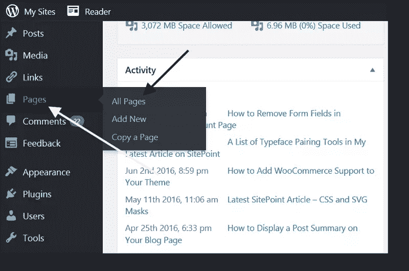
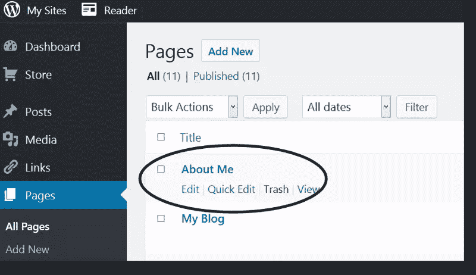
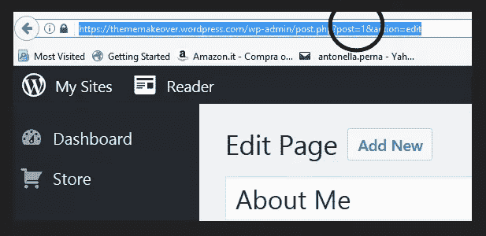

# 在 WordPress 中加载样式和脚本的条件标签

> 原文：<https://www.sitepoint.com/conditional-tags-load-styles-and-scripts-in-wordpress/>


本文是与 SiteGround 合作创作的系列文章的一部分。感谢您对使 SitePoint 成为可能的合作伙伴的支持。

如果你的 WordPress 网站只在一个特定的页面或者在有限的条件下需要一个特定的样式表或者 JavaScript 文件，就没有必要在网站的任何地方加载这些文件。

在这篇文章中，你将学习如何在你的网站需要的时候加载 CSS 样式和脚本。这样你的网站将会加载得更快，那些没有访问额外文件的用户也不会在他们的浏览器中下载不必要的字节。

## 为什么你应该用 WordPress 的方式添加样式和脚本

如果说 WordPress 开发中有反模式的话，那就是在 HTML 文档的`<head>`部分添加一个`<link>`和`<script>`标签来分别加载样式表和 JavaScript 文件，然后就结束了。

运行一个 WordPress 网站需要使用来自软件本身的样式表和 JavaScript 代码，一些插件和活动主题。

这意味着主题或插件的作者不知道特定的安装将运行哪种风格和脚本，也不知道这些资源需要的顺序。例如，让我们以 jQuery 库为例。WordPress 自身可以使用这个库来处理 Ajax 请求和其他任务，也可以被多个插件和活动主题使用。

如果插件和主题作者通过直接在 HTML 文档中添加适当的标签来包含他们需要的样式表和脚本，这可能会导致冲突、资源被多次加载和/或以错误的顺序加载。

这就是为什么您应该始终按照 WordPress.org 编码标准推荐的最佳实践来加载样式和脚本:

> 为了让一切工作和谐，主题和插件使用标准的 WordPress 方法加载脚本和样式表是很重要的。这将确保网站保持高效，没有不兼容的问题。
> 
> [包含 CSS & JavaScript](https://developer.wordpress.org/themes/basics/including-css-javascript/) —主题手册

### 如何使用 wp_enqueue_style 和 wp_enqueue_script

将自定义样式表包含到主题中的基本函数如下所示:

```
wp_enqueue_style( $handle, $src, $deps, $ver, $media );
```

只有前两个参数是必需的，其他都是可选的。

*   `$handle`参数是样式表的名称。你可以称之为`main`、`portfolio`等。，这取决于文件的用途。如果你包含一个 JavaScript 插件的样式表，只需使用插件的名称
*   `$src`代表样式表所在的 URL
*   `$deps`参数指定这个样式表是否依赖另一个样式表才能正常工作
*   `$ver`确定样式表的版本号
*   `$media`代表样式表的媒体类型，例如 all、screen、print 等。

举个例子，将一个名为`portfolio.css`的样式表添加到你的 WordPress 网站的代码可以是这样的:

```
wp_enqueue_style( 'portfolio', get_template_directory_uri() . '/css/portfolio.css',false,null,'screen');
```

要包含 JavaScript 文件，您应该使用:

```
wp_enqueue_script($handle, $src, $deps, $ver, $in_footer)
```

这些参数与`wp_enqueue_style`中的参数相似，除了最后一个参数，它根据您是否希望将`<script>`标签放在文档的`<footer>`或`<header>`部分来设置 true 或 false 值。

假设您想将`portfolio.js`添加到您的网站，下面是代码的样子:

```
wp_enqueue_script( 'portfolio', get_template_directory_uri() . '/js/portfolio.js', array ( 'jquery' ), null, true);
```

这段代码告诉 WordPress:

*   您想要使用位于活动主题目录下的`js`子文件夹中的`portfolio`文件
*   WordPress 需要在加载`portfolio.js`之前下载 jQuery，否则后者将无法正常工作(你不需要导入 jQuery，因为默认情况下它已经与 WordPress 捆绑在一起了
*   WordPress 需要在 HTML 文档的`<footer>`部分添加这个文件。

你很可能想要包含不止一个样式表或脚本文件，在这种情况下，将所有对`wp_enqueue_style()`和`wp_enqueue_script()`的调用包装在一个函数中，然后将这个函数与适当的 WordPress [动作挂钩](https://www.sitepoint.com/digging-deeper-wordpress-hooks-filters/)。

这里有一个例子。如果你正在开发一个 WordPress 主题，你可以把它添加到你的`functions.php`文件中。

```
function mytheme_styles_scripts() {
  //main stylesheet, style.css
  wp_enqueue_style( 'style', get_stylesheet_uri() );

  //stylesheet for portfolio section 
  //(different from the rest of the site)
  wp_enqueue_style( 'portfolio', get_template_directory_uri() . '/css/portfolio.css',false,null,'screen');

  //JS for portfolio section
  wp_enqueue_script( 'portfolio', get_template_directory_uri() . '/js/portfolio.js', array ( 'jquery' ), null, true);  
} 

//hook the function to wp_enqueue_scripts action hook
add_action( 'wp_enqueue_scripts', 'mytheme_styles_scripts' );
```

现在你可以放心，WordPress 会找到所有需要的样式表和脚本，并按正确的顺序下载它们。

## 样式表和脚本的有条件加载

上面的代码运行良好，并且遵循了 WordPress 的最佳实践。但是，WordPress 会在你的网站上到处下载`portfolio.css`和`portfolio.js`。如果你的访问者从不访问你的投资组合页面，这很不幸，但也有可能发生，浏览器会加载两个不必要的文件。

现在，让我们更进一步，确保 WordPress 只在访问者登陆你的文件夹部分时包含`portfolio.css`和`portfolio.js`。

## WordPress 条件标签

WordPress 提供了**条件标签**，结合常规的`if...else`语句，使得在特定条件下选择应用什么代码变得非常容易。

例如，如果您想只在网站的主页上执行一些代码，而在其他地方执行另一些代码，那么您可以编写如下代码:

```
if ( is_front_page() ):
  //your code here
else:
  //alternative code here
endif;
```

相反，如果你想在除了网站主页之外的任何地方执行一些代码，你可以写:

```
if ( !is_front_page() ):
  //your code here;
endif;
```

WordPress 提供了大量的条件标签，你可以在主题手册的[条件标签](https://developer.wordpress.org/themes/basics/conditional-tags/)章节查看完整的列表。

有一种方法，你可以利用条件标签来确保只有当访问者访问你网站的作品集页面时，WordPress 才会下载`porfolio.css`和`portfolio.js`。

让我们来看看你能做到这一点的一些方法。

### 使用页面 ID

您可以使用条件标签来检查用户是否在您网站上使用作品集页面 ID 的作品集页面上。

要了解页面 ID，请执行以下操作:

*   登录你的 WordPress 网站的管理面板
*   点击页面进入您网站上所有页面的列表

    
*   点击您感兴趣的页面标题，在编辑器
    中打开它
*   现在页面已经在编辑器中打开，请查看浏览器地址栏中的 URL。您应该会看到类似于`post=`加上一个数字的内容。那个号码就是页面 ID:

    

现在您已经知道了您的页面 ID，您可以使用条件标记来修改前面包含您的主题的样式表和脚本的代码，如下所示:

```
function mytheme_styles_scripts() {
  //main stylesheet, style.css
  wp_enqueue_style( 'style', get_stylesheet_uri() );

  //check we are on page with ID 1 
  if ( is_page('1') ):

    //if we are, load styles and script 
    //for portfolio page
    wp_enqueue_style( 'portfolio', get_template_directory_uri() . '/css/portfolio.css',false,null,'screen');

    //JS for portfolio section
    wp_enqueue_script( 'portfolio', get_template_directory_uri() . '/js/portfolio.js', array ( 'jquery' ), null, true);
  endif;  
} 

//hook the function to wp_enqueue_scripts action hook
add_action( 'wp_enqueue_scripts', 'mytheme_styles_scripts' );
```

### 使用页面标题

页面的条件标签也可以用于页面标题。如果你的投资组合页面的标题是 *My Portfolio* ，代码可能是这样的(为了简洁起见，我只添加了条件部分):

```
if ( is_page('My Portfolio') ): 
  //rest of the code here 

endif;
```

### 使用页面辅助信息

您可以在页面标签中使用条件标签，这是该页面的用户友好 URL。下面是它在实践中的样子:

```
if ( is_page('my-portfolio') ): 
  //rest of the code here 

endif;
```

## 结论

在这篇文章中，我讨论了如何在 WordPress 网站中有条件地包含样式表和脚本文件。有些情况下，额外的样式数量如此之少，以至于为它们创建一个专用的样式表没有多大意义。这只会产生一个 HTTP 请求，您的网站可能不需要这个请求。

然而，在适当的条件下，例如，一个页面或主题区域的设计与网站的其他部分不同，有选择地加载样式表和脚本遵循 WordPress 的最佳实践，并确保你的访问者的浏览器只下载显示请求内容所需的数据量。

你如何在你的 WordPress 网站中加入自定义脚本和样式？点击下面的评论框来分享。

## 分享这篇文章