# 将 Raspberry Pi 连接到 IBM Watson、Bluemix 和 Node-RED

> 原文：<https://www.sitepoint.com/connecting-a-raspberry-pi-to-ibm-watson-and-bluemix/>

IBM 最近通过向注册 Bluemix 平台试用的开发人员发送 Raspberry Pi 3 计算机，帮助激发了一批开发人员对物联网的热情。我一直渴望尝试一下 Bluemix 和 IBM Watson，并认为这是注册的最佳时机！我很幸运地成为获得 Raspberry Pi 3 的开发人员之一，因此，我做了我总是对新兴技术做的事情，我开始修补和写下我的经历。

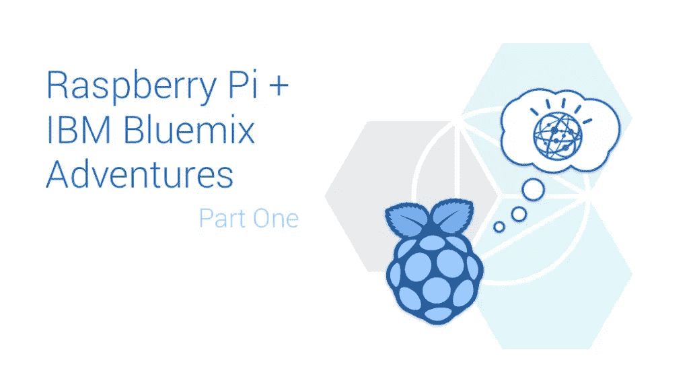

SitePoint/PatCat 的作品，徽标权利:IBM 和 Raspberry Pi 基金会

这是围绕将 Raspberry Pi 与 IBM Watson 和 Bluemix 相结合的系列文章的第一部分。本文重点介绍了将 Raspberry Pi 连接到 IBM 云服务的各种方法，以及当事情没有完全按照我的计划进行时我的提示。这很有趣，我强烈建议人们尝试一下 IBM Bluemix 和 Watson，尤其是如果你有一个备用的覆盆子 Pi 的话！

## 在我们的 Raspberry Pi 上设置 Watson IoT 的快速测试

为了在我们的 Raspberry Pi 上设置 IBM Watson 物联网平台，我们在 Pi 上运行以下命令:

首先，我们从 IBM 的 GitHub 下载 Watson 物联网平台安装程序:

```
curl -LO https://github.com/ibm-messaging/iot-raspberrypi/releases/download/1.0.2.1/iot_1.0-2_armhf.deb
```

然后，我们运行以下命令来安装它:

```
sudo dpkg -i iot_1.0-2_armhf.deb
```

安装完成后，它将自动在我们的设备上运行 IBM Watson 物联网平台服务。事实上，每次 Pi 启动时，服务都会自动运行。如果您不确定它是否正在运行并且想要确定，请运行以下命令:

```
service iot status
```

这应该会显示一个类似这样的响应:

```
● iot.service - LSB: IoT service
   Loaded: loaded (/etc/init.d/iot)
   Active: active (running) since Fri 2016-04-29 23:33:47 UTC; 15s ago
   CGroup: /system.slice/iot.service
           └─11960 /opt/iot/iot /dev/null
```

如果你看到上面的信息，你就可以走了！事实上，我们已经可以看到 Raspberry Pi 数据正在流向 IBM 的云。为此，请键入:

```
service iot getdeviceid
```

它将返回我们设备的 ID 和我们应该访问的 URL:

```
The device ID is abcdefghijkl
For Real-time visualization of the data, visit http://quickstart.internetofthings.ibmcloud.com/?deviceId=abcdefghijkl
```

如果我们前往`http://quickstart.internetofthings.ibmcloud.com/?deviceId=abcdefghijkl`(使用我们设备的 ID 而不是占位符)，我们应该看到一个来自 IBM 的非常整洁的可视化！在其中，我们可以看到我们的 Raspberry Pi 的 CPU 温度和来自云的其他统计数据。

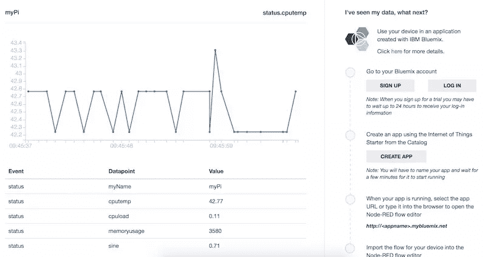

现在，让我们以不同的方式来处理它，并设置 IBM Bluemix 来处理我们的数据。

## 开始使用 Bluemix

要登录 Bluemix，请进入 IBM Bluemix 登录页面。如果你还没有帐户，你也可以在那里注册一个 IBM ID 和 BlueMix。

Bluemix 加载后，我们通过点击右上角的帐户图标来选择我们所在的地区:

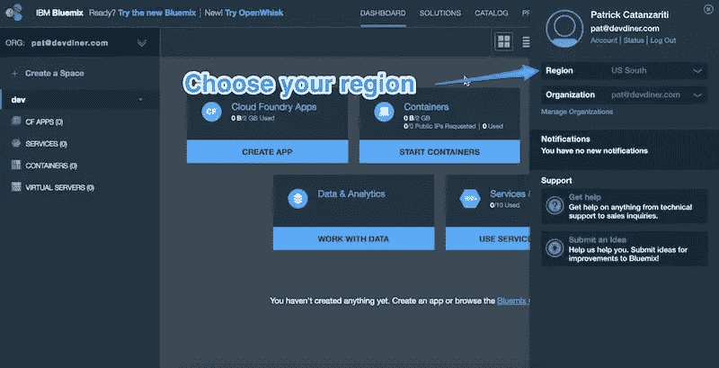

然后，如果 Bluemix 要求我们在该区域创建一个空间，我们会照做。我将我的空间命名为“dev”:

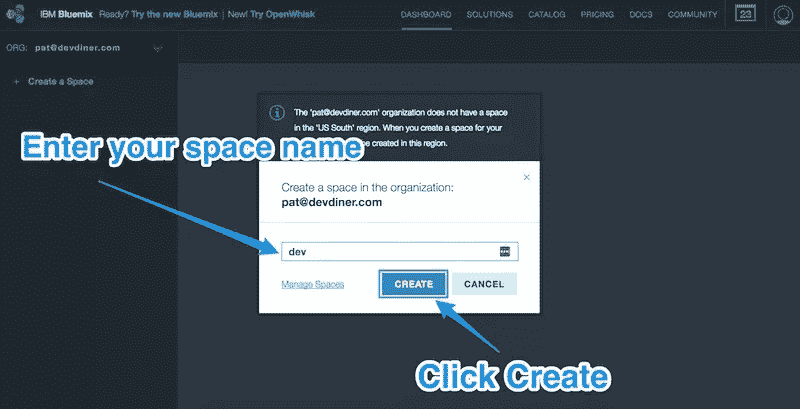

然后，我们点击“使用服务或 API”来为我们的应用程序找到一个好的初始服务。


在这个屏幕中，我们需要找到“物联网平台”服务。您可以点击左侧的“物联网”复选框来过滤选择，或者在搜索栏中键入“物联网平台”。然而，我们搜索它，一旦我们有了它，我们选择我们的应用程序。

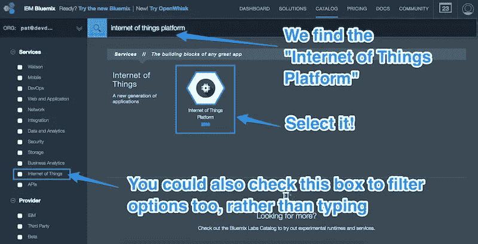

然后，我们在下一个屏幕上单击“创建”,如果您想要调整，可以更改“服务名称”。这实际上影响不大，所以对于我的例子，我就让它保持原样。如果您愿意，您可以将其命名为“Raspberry Pi 服务”:

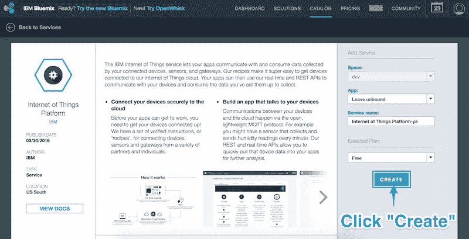

我们向下滚动出现的欢迎屏幕，选择“启动仪表板”:

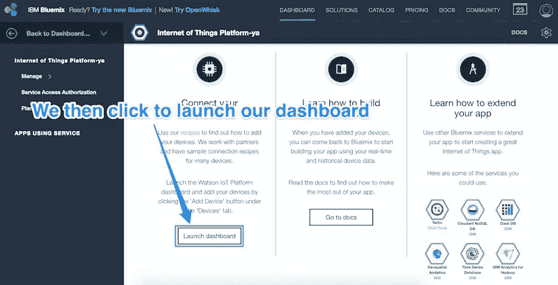

现在，我们可以通过点击“添加设备”将我们的 Raspberry Pi 添加到这项新服务中:

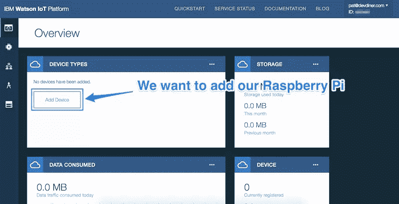

点击“创建设备类型”:

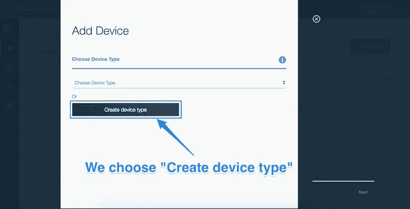

将出现另一个屏幕，询问我们是要创建设备类型还是网关类型。我们需要一种设备类型:

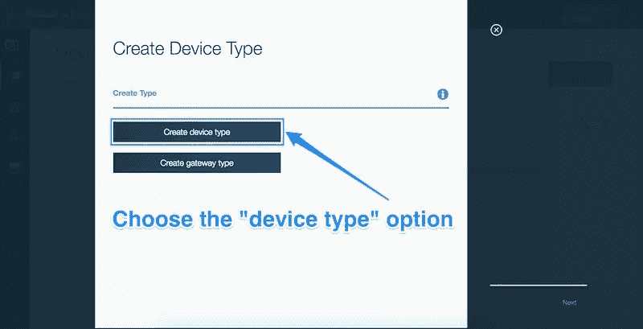

最后，我们命名我们的设备类型。第一个字段是设备类型名称，将在我们的 API 等中使用，所以保持小写并用破折号分隔。例如“我的个人信息”或“物联网样本设备”。在此之下，您可以编写一个更长、更易于阅读的描述:

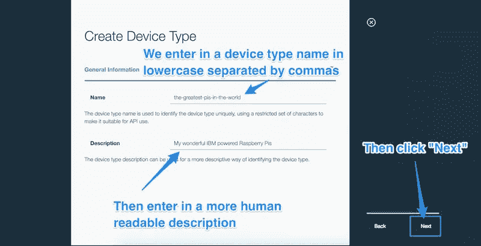

下一个屏幕为我们提供了设备模板的选项，提供了我们可以为每个设备定义其特征的字段。这很大程度上取决于您以及您希望在这种设备类型中记录什么设备数据。因为我使用这种设备类型来跟踪 Raspberry Pi，所以我只选择定义它们的“模型”(例如，Raspberry Pi 2、Raspberry Pi 3 等)。

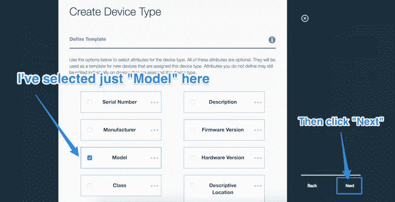

然后，我们设置默认的模型类型。我将这个设备模板的主模型类型设置为“Raspberry Pi 3 Model B”:

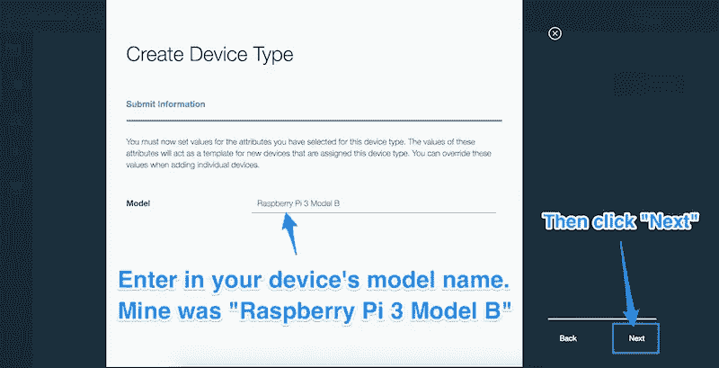

如果您愿意，可以添加 JSON 格式的自定义元数据，在这个简单的教程中，我们可以跳过这一步。

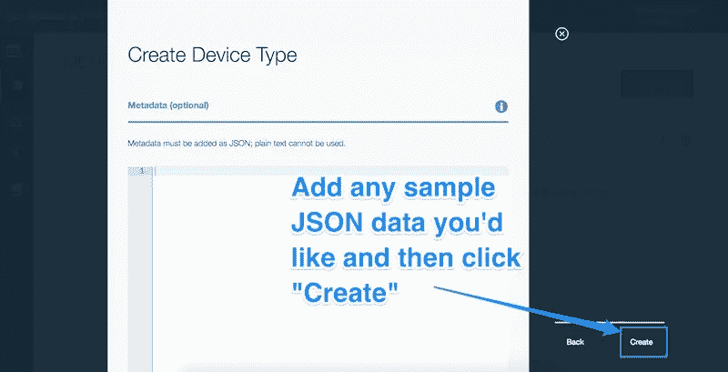

现在我们的设备类型可以使用了！我们应该会回到“添加设备”屏幕。这一次，我们应该选择新的设备类型。确认情况属实，然后单击“下一步”。

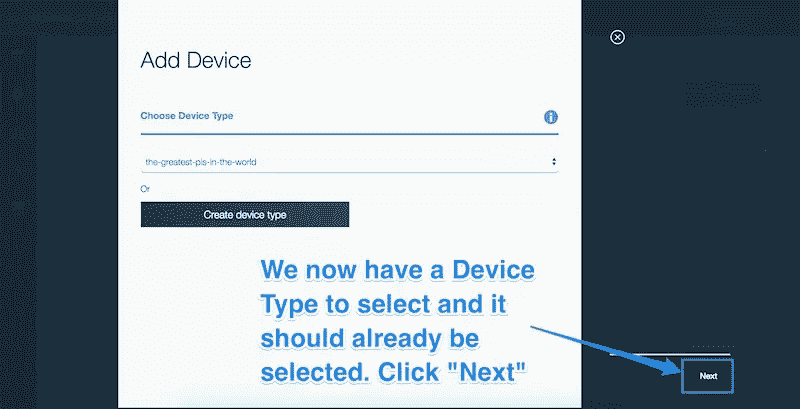

我们现在在 Bluemix 系统中为我们的 Raspberry Pi 设置我们的个人设备信息。我们给我们的设备一个唯一的 ID(与你系统中的其他设备都不一样)，比如“PiBrain”*(你可以随意选择你自己的名字或者用我的！)*。该型号应该是您之前设置的默认型号。如果您已经更改为不同的型号，请随意更改该值。所有这些值都正确无误后，我们单击“下一步”:

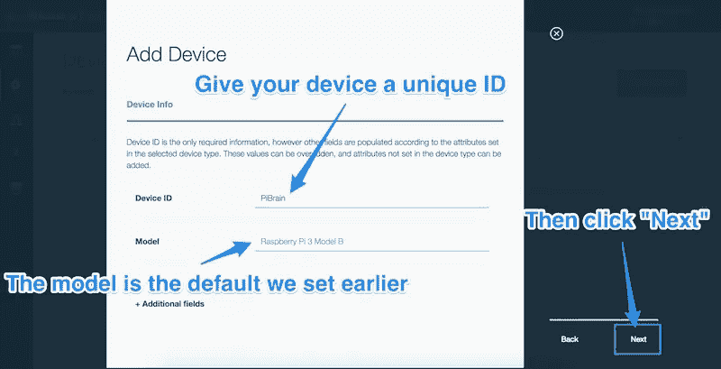

我们可以再次跳过元数据部分，除非您想要存储关于您的设备的特定数据。然后，我们设置我们的认证令牌。您可以定义一个自定义的或将其留空，以便系统自动为您生成一个。如果您想生成自己的令牌，请确保它遵循他们的指导原则— *“令牌长度必须在 8 到 36 个字符之间，并且应该混合使用大小写字母、数字和符号(允许使用连字符、下划线和句点)。令牌应该没有重复、字典单词、用户名和其他预定义的序列。*一个提示——如果你想自己生成一个密码，像 LastPass 中的随机密码生成器就很适合。

就我而言，我非常乐意他们为我制作一个:

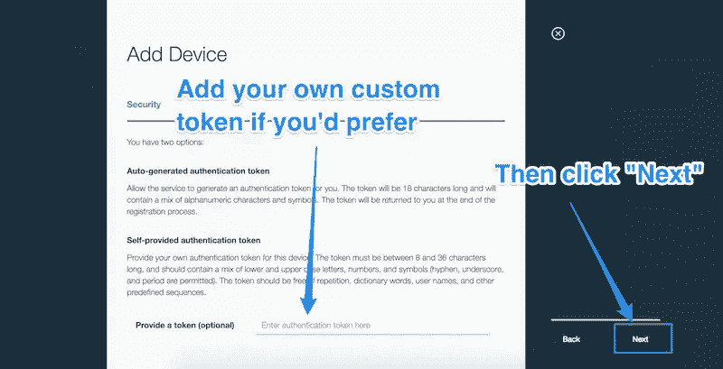

检查详细信息以确保它们是正确的，然后单击“添加”:

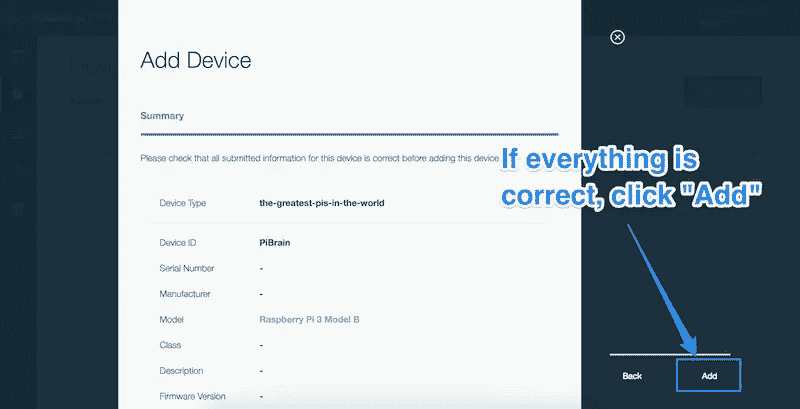

最后一个屏幕将显示设备的所有详细信息，包括生成的身份验证令牌(或您为其设置的令牌)。将所有这些细节复制到一个安全且容易找到的地方！特别要确保你把认证令牌保存在某个容易访问的地方，因为**如果不访问你的 Pi** ，你就再也不能得到这个值。一旦你明确地保存了所有这些值(你做得对吗？)，关闭这个弹出窗口。


## 在 Bluemix 中将我们的 Raspberry Pi 链接到我们的设备

现在我们想将我们的 Raspberry Pi 连接到我们刚刚在 Bluemix 中设置的设备上。为此，我们需要首先停止运行在 Pi 上的 Watson IoT 服务，该服务之前作为测试启动:

```
sudo service iot stop
```

然后，键入以下内容以打开您的 Raspberry Pi 的 Watson IoT 配置文件*(如果文件不存在，将在保存文件时创建)*:

```
sudo nano /etc/iotsample-raspberrypi/device.cfg
```

使用我们之前保存在某个安全地方的详细信息，应该是这样的:

```
Organization ID abcde
Device Type the-greatest-pis-in-the-world
Device ID PiBrain
Authentication Method token
Authentication Token YOURTOKENWOULDBEHERE
```

我们将它们输入到配置文件中，格式如下:

```
#Device configuration file
org = abcde
type = the-greatest-pis-in-the-world
id = PiBrain
auth-method = token
auth-token = YOURTOKENWOULDBEHERE
#End of Configuration file
```

最简单的方法可能是首先在一个简单的文本编辑器中进行设置，然后使用 *Ctrl + V* 将其全部复制并粘贴到编辑器中。

我们通过按下 *Ctrl + X* 来保存这些更改，然后在它询问我们是否想要“保存修改的缓冲区”时键入“Y”。保持文件名不变，写入同一个文件(确保它是`/etc/iotsample-raspberrypi/device.cfg`)。如果显示正确的文件名，请按回车键。

保存后，我们就可以设置 Node-RED 了！

## 在我们的树莓 Pi 上设置 Node-RED

为了做一些更高级的事情，我们将安装并运行 Node-RED，这是一个让您无需钻研太多代码就可以处理连接的设备和数据的环境。

让我们在 Raspberry Pi 的终端上输入以下内容，将 Raspberry Pi 上的所有内容更新到最新版本。Raspbian 的新版 Raspbian 已经和 Node-RED 和 Watson IoT 一起发布了。然而，我发现对它们进行更新以使它们正常工作是很重要的。因此，无论哪种方式，更新一切是安全的，或者从头安装它们，如果你还没有它们！

```
sudo apt-get update
```

也运行这个:

```
sudo apt-get dist-upgrade
```

*如果您在本指南中进一步运行 Node-RED，并且您看不到“Watson IoT”作为输入或输出，您需要运行`sudo apt-get dist-upgrade`。直到我这样做了，它才出现在我面前！*

如果你有一个 Raspberry Pi 3 或任何安装了 Raspbian Jessie 的 Raspberry Pi，你不需要安装 Node-RED，因为它应该已经在那里了(并且通过你刚才运行的最后一个命令更新到最新版本！).

如果您没有最新版本的 Raspbian，您可能需要安装 Node-RED。为此，您可以首先安装它的所有依赖项:

```
sudo apt-get install build-essential python-dev python-rpi.gpio
```

如果在尝试下一个命令后收到关于`sudo: npm: command not found`的错误，您将需要首先运行以下命令来安装 npm(我不需要在一个 Pi 上这样做，但是需要在另一个 Pi 上这样做):

```
sudo apt-get install npm
```

然后，通过 npm 安装 Node-RED 本身:

```
sudo npm install -g --unsafe-perm node-red
```

为了访问 IBM Watson IoT 节点，我们也运行以下命令:

```
sudo npm install -g node-red-contrib-ibm-watson-iot
```

*(对我来说，由于脚本引用了`node`而不是`nodejs`的错误，上面的命令不起作用并且失败了——我猜测这将在 Raspbian Jessie 上发生，如果是这样，你不需要担心，因为这已经为你安装在那个版本的 Raspbian 上了！).*

如果您想从您的计算机而不是 Pi 访问 Node-RED，您需要知道您的 Pi 的本地 IP 地址。您会发现，使用:

```
hostname -I
```

或者，如果你喜欢更多的细节:

```
ifconfig
```

如果全部安装成功，我们应该能够使用以下命令在您的 Pi 上运行 Node-RED:

```
node-red
```

当它运行时，我们应该看到如下输出:

```
Welcome to Node-RED
===================

30 Apr 02:32:27 - [info] Node-RED version: v0.13.4
30 Apr 02:32:27 - [info] Node.js  version: v0.10.29
30 Apr 02:32:27 - [info] Linux 4.1.18-v7+ arm LE
30 Apr 02:32:27 - [info] Loading palette nodes
30 Apr 02:32:33 - [info] Settings file  : /home/pi/.node-red/settings.js
30 Apr 02:32:33 - [info] User directory : /home/pi/.node-red
30 Apr 02:32:33 - [info] Flows file : /home/pi/.node-red/flows_raspberrypi.json
30 Apr 02:32:33 - [info] Server now running at http://127.0.0.1:1880/
30 Apr 02:32:33 - [info] Starting flows
30 Apr 02:32:33 - [info] Started flows
```

如果我们从我们的 Pi 上的`http://127.0.0.1:1880`或者从同一网络上的另一台计算机上的`http://{your-pi-ip-address}:1880`访问，我们应该看到 Node-RED 已经准备好并在等待。检查在界面中，在输入和输出下方，您会看到*沃森物联网*作为一个选项:

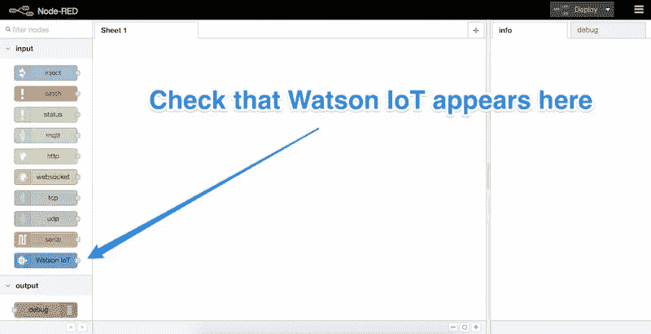

## 将 blue mix 与我们的树莓派联系起来

现在，我们已经在 Pi 上安装了 Node-RED Watson 物联网平台，在 Pi 上安装了 Node-RED，并且 Bluemix 设置就绪，正在等待我们的 Pi。剩下的就是通过 Node-RED 将我们的 Pi 链接到 Bluemix。

IBM 有一个样本节点集，我们可以使用它进行快速测试，我们需要做的就是导入它！将来自 IBM 的 JSON 链接复制到你的剪贴板。开始看起来应该有点像这样:

```
[{
	"id": "41e935d1.d2619c",
	"type": "inject",
	"z": "d100b337.680e88",
	"name": "",
	"topic": "",
	"payload": "",
	"payloadType": "date",
	"repeat": "5",
	"crontab": "",
	"once": true,
	"x": 205,
	"y": 178.5,
	"wires": [["8332d581.5c7d58"]]
}]
// ... actual JSON file continues past here!
```

然后进入*菜单>导入>剪贴板*节点-红色:

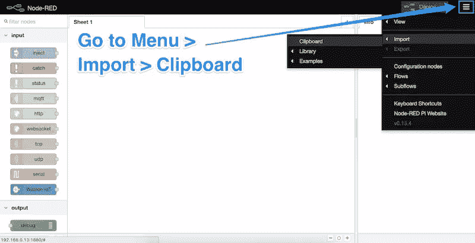

将 JSON 数据粘贴到文本区域，然后单击 OK:


导入的节点现在将跟随鼠标光标，单击将它们放置在节点红皮书上的某个整洁的位置:

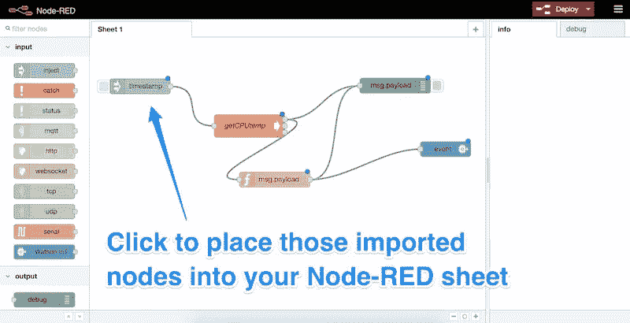

要设置 Node-RED 以便它可以将我们在 Bluemix 中设置的 Pi 链接到我们这里的 Pi，我们双击“event”节点:

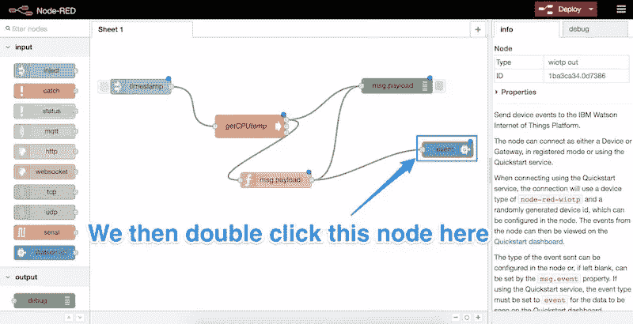

然后，我们在出现的弹出窗口中单击“已注册”,并单击“凭据”行旁边的铅笔图标:

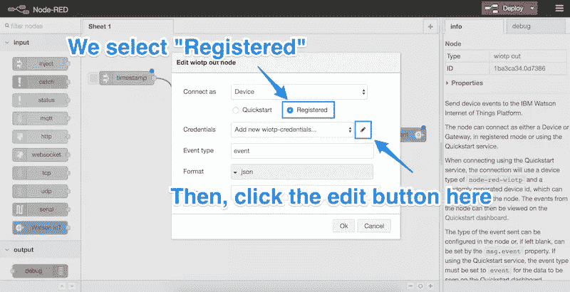

我们像之前在 Pi 的`device.cfg`文件中一样填充细节(我们不需要担心“Name”字段)。完成后，我们单击“添加”:

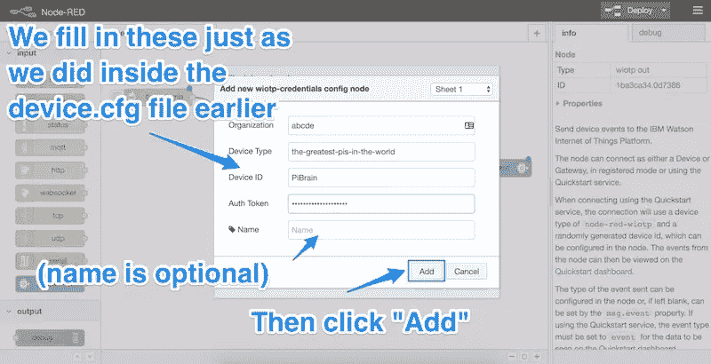

然后点击“确定”。

现在一切都应该为试运行做好准备了！单击右上角的“部署”按钮:

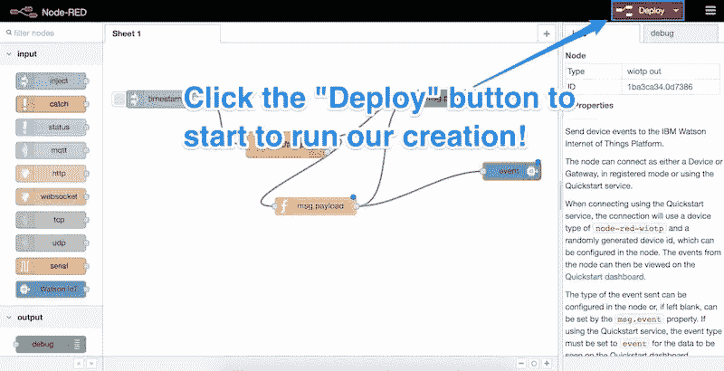

我们应该会看到一条消息，显示“成功部署”:

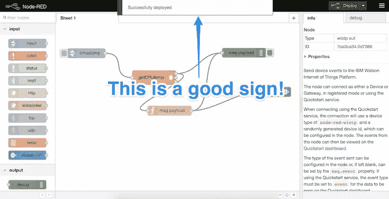

单击右侧的“Debug”选项卡，查看节点的输出。 *msg.payload* 触发一些控制台调试消息，这些消息以两种格式显示温度(一个字符串和一个 JSON 对象)。

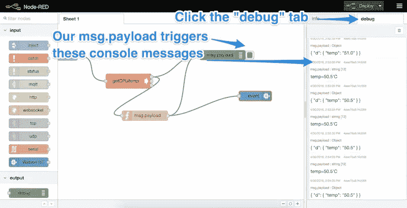

*注意:如果从* *事件*节点看到类似“错误发送消息:错误:客户端未连接”的错误，需要先运行`sudo service iot stop`停止其他 Watson 物联网服务。我们不希望它同时运行！我自己也犯过几次这样的错误！


## 在 Bluemix 的 Watson 物联网平台中看到您的价值

要查看您的 Raspberry Pi 值是否成功通过，请转到`https://{YOURORGANISATIONID}.internetofthings.ibmcloud.com/dashboard/#/overview`。

在这里，我们单击左侧菜单上的“设备”选项(菜单中的第二项):

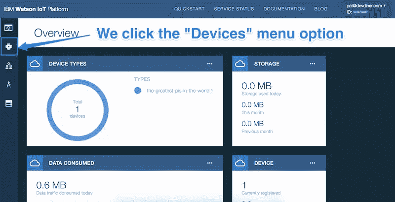

我们的 Raspberry Pi 设备应该在此处列出，单击它可查看更多详细信息:

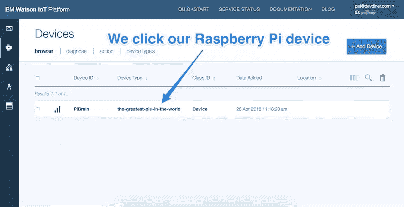

我们的数据应该会成功流入！

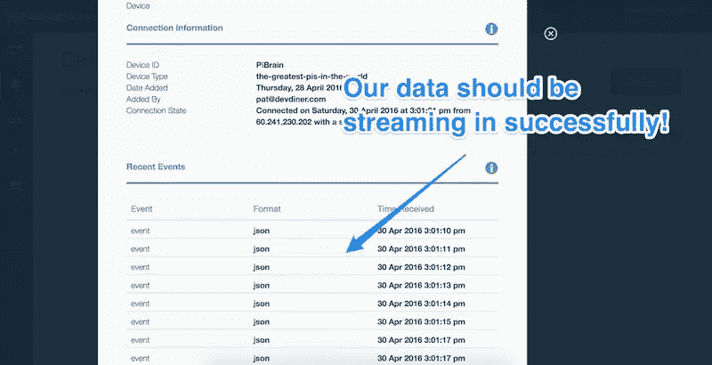

## 调整我们的节点-红色流

我们可以通过编辑每个节点中的设置来调整节点红色流的运行方式。例如，如果我们双击*时间戳*节点，我们可以改变它运行的频率:

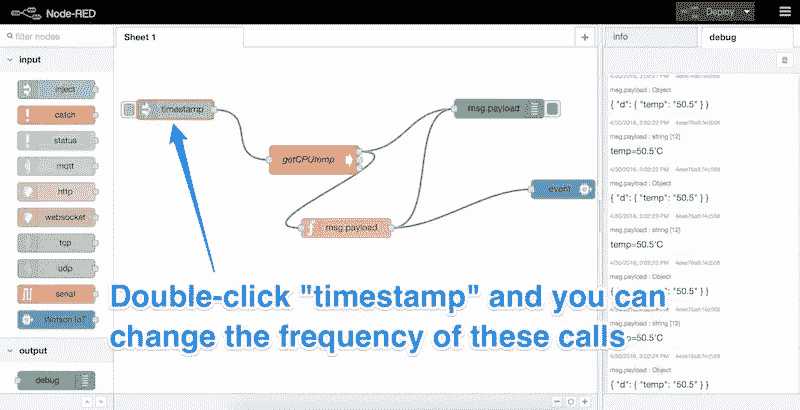

然后，我们可以将间隔更改为更少/更多。例如，下面我们将其更改为 30 秒:

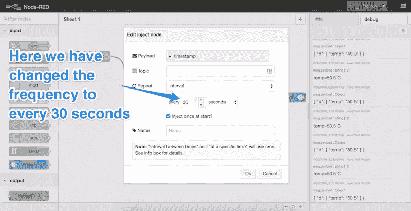

再次单击“部署”按钮，应用这些更改并稍微减慢速度:

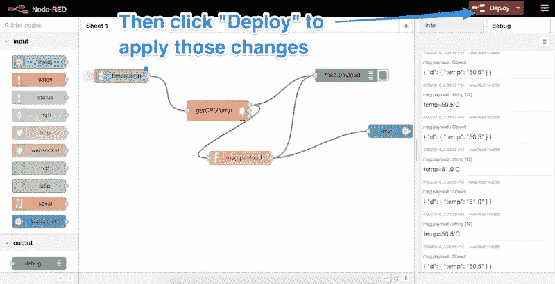

## 结论

我们现在可以通过多种方式将 Raspberry Pi 连接到 IBM 的物联网云服务，为我们的 Raspberry Pi 创新地使用 IBM Watson、数据分析和其他云服务奠定基础。我们可以使用 Node-RED 构建任意数量的特性和功能，这些特性和功能可以与云和各种 API 挂钩。在本系列的下一篇文章中，我们将进一步利用云和 IBM Bluemix，将文本添加到语音中，让我们的 Pi 发出声音！

## 分享这篇文章