# 使用 IFTTT 将 LIFX 灯泡连接到物联网

> 原文：<https://www.sitepoint.com/connecting-lifx-light-bulbs-iot-using-ifttt/>

你有没有希望你睡觉的时候灯会自己关掉？或者当你最喜欢的运动队得分时它们会变色？有了 LIFX 智能灯泡和 IFTTT，我们就离理想而神奇的联网灯泡现实很近了。

[LIFX 智能灯泡](http://www.lifx.com/)是节能的 LED 灯泡，可以改变颜色，并通过智能手机和智能手表进行控制。它们非常有趣，而且很容易在你的家庭 Wi-Fi 网络上设置。

为了给我们的灯一些自主权，我们将使用一项名为 [IFTTT](https://ifttt.com) (简称“If This Then That”)的服务，它允许你根据不同的互联网连接设备和/或服务来设置规则。这些规则可以触发像你的智能灯泡改变颜色这样的反应。

在本文中，我们将探讨如何设置 LIFX 智能灯泡，然后将它连接到 IFTTT。在 IFTTT 中，我们将设置我们的灯在 Jawbone UP24 处于睡眠模式时关闭。之后，我们将看看如何设置灯泡改变颜色，如果我们最喜欢的运动队正在比赛。

## 安装 LIFX 灯泡

首先，你需要确保你的灯泡连接到你的家庭网络。你需要运行 [iOS](https://itunes.apple.com/us/app/lifx/id657758311?mt=8) 或 [Android](https://play.google.com/store/apps/details?id=com.lifx.lifx) LIFX 应用来设置这个。

我用的是 Android，所以我安装了 LIFX Android 应用程序:

打开应用程序，点击“添加灯泡”来设置你的 LIFX 灯泡。确保你的 LIFX 灯泡打开，否则它可能不会出现！

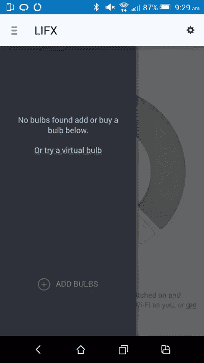

选择您的灯泡和您的家庭 Wi-Fi 连接，然后您会看到这个精彩的屏幕，允许您命名您的 LIFX 灯泡的位置，将其分配给一个组，并为其命名:

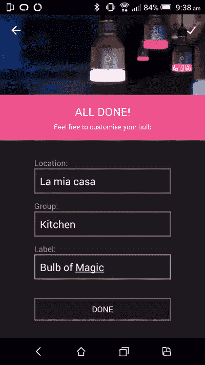

一旦它分配了所有这些设置，你会在 LIFX 菜单中看到你的新位置和组，里面有你的灯泡。如果您按下位置、组或单个 LIFX 灯泡旁边的电源按钮，灯将熄灭。如果它成功关闭，那么你就可以开始了！

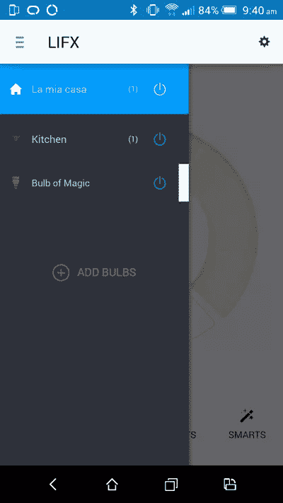

你可以点击菜单中的灯泡名称来打开你的灯泡的控制。在这里你可以改变灯光的颜色(不同色调的白色或全新的颜色，如左下方的“颜色”按钮上的紫色)。您还可以通过“效果”按钮设置闪光灯等效果。

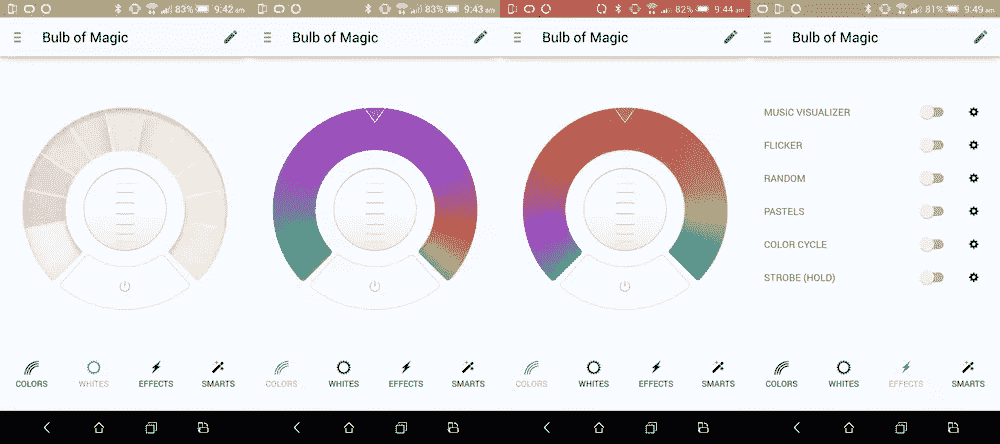

现在你已经对这些设置有了一些兴趣，让我们看看如何通过 IFTTT 将 LIFX 灯泡连接到其他 web 触发器。

## 将 LIFX 灯泡连接到 IFTTT

要创建新配方，请在 IFTTT 上创建一个帐户并登录。然后，点击右上角的用户名并选择“创建”。这将带您进入您的[新 IFTTT 食谱页面](https://ifttt.com/myrecipes/personal/new)。

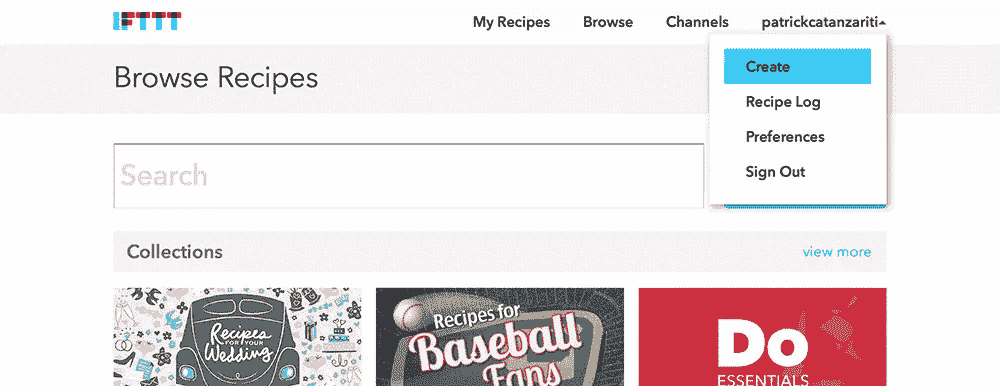

然后我们会看到一个屏幕，上面写着“ifthisthenthat ”,单击“this”链接开始我们的流程:

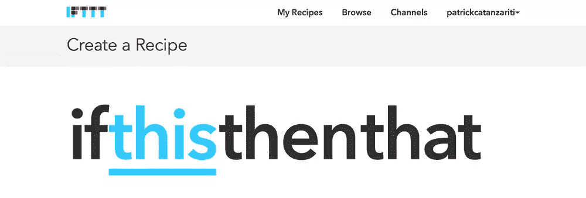

在“选择触发通道”部分，键入“向上”并选择出现的向上图标。

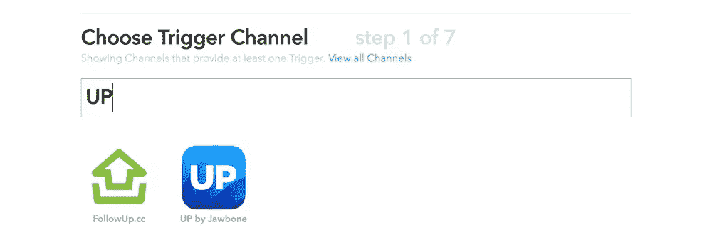

如果您是 IFTTT 的新手，并且之前没有将您的连接到该服务(很可能！)，屏幕上会显示一个按钮，上面写着“连接”。单击该按钮并按照提示授予 IFTTT 访问您的 UP 数据的权限。

设置完成后，在出现的触发选项中选择“启用睡眠模式”。

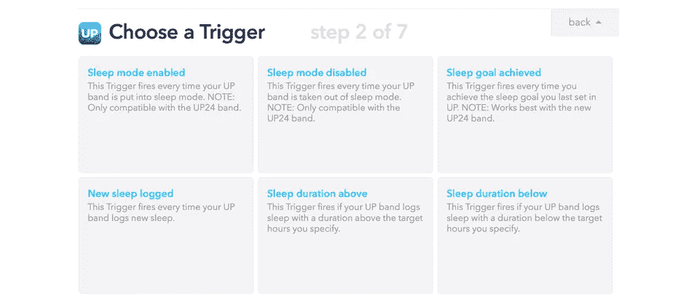

点击“创建触发器”完成。

现在，我们将有“如果启动睡眠模式，然后”等待着我们。点击“那个”来设置我们的 LIFX 智能灯泡。

在“选择动作通道”过滤器中键入“lifx ”,然后单击 LIFX 图标。你可能也需要连接 LIFX，点击“连接”按钮，按照提示让 IFTTT 访问你的 LIFX 账户。

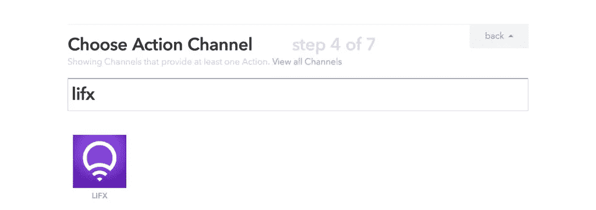

我们将到达“选择一个操作”部分，这里我们选择“关灯”。这将设置我们的灯关闭时，睡眠模式启用。

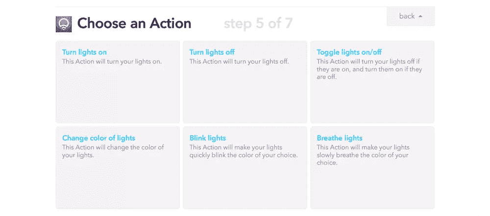

在 IFTTT 可以关闭我们的灯之前，它需要知道我们想要关闭哪些灯。你可以选择单个灯泡，也可以选择整个位置或整组灯泡。我选择了独立灯泡。

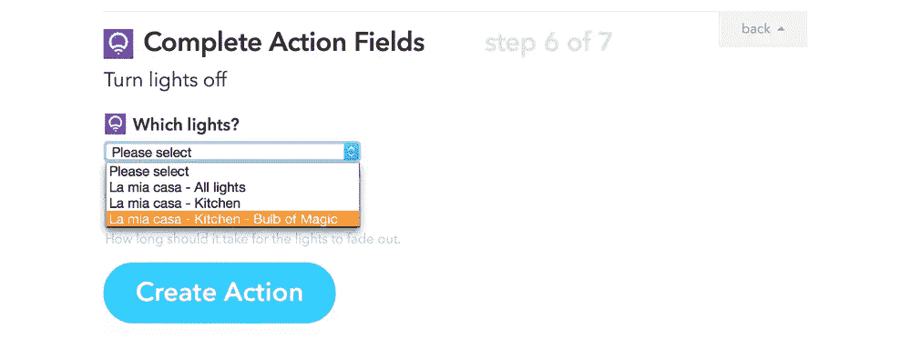

接下来，我们可以设置我们希望灯光逐渐减弱到关闭状态的时间。我个人喜欢在美妙的黑暗中直接入睡，所以我选择了“瞬间”。

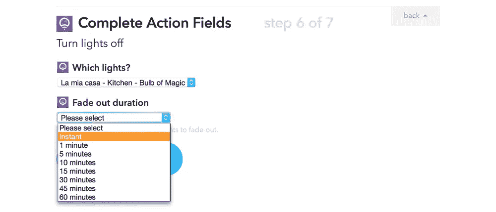

然后单击“创建操作”以完成此操作的设置。

现在你可以给你的 IFTTT 食谱起个名字，并设置你是否想让你的手机每次运行时都通知你。我建议不要把你的手机设置成在这里通知你，因为这是我们希望悄悄发生的事情，这样我们就可以休息了！对名称和通知设置满意后，单击“创建配方”。

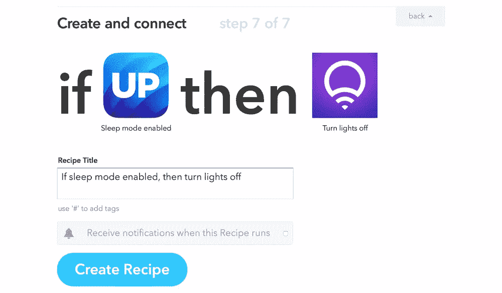

一旦它创建了你的食谱，它会引导你回到你的[我的食谱](https://ifttt.com/myrecipes/personal)页面，在那里你会看到你的新食谱已经准备好，等待被尝试！

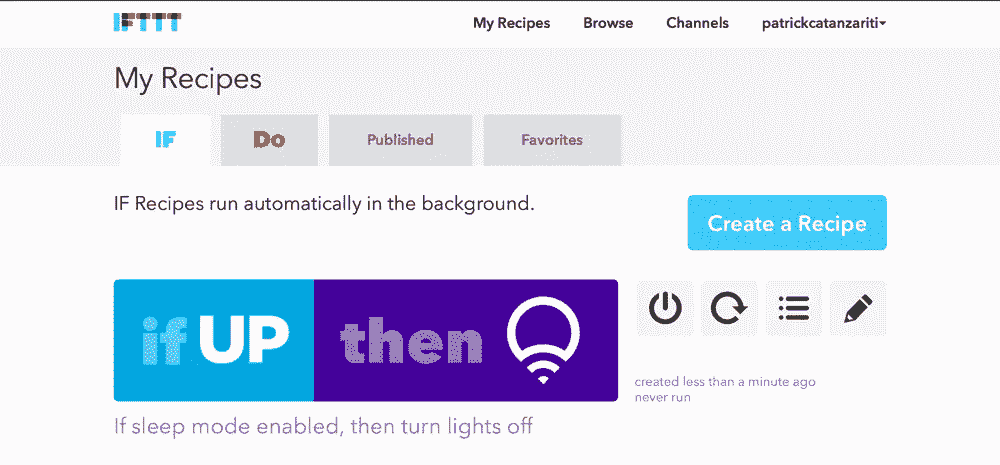

## 测试我们连接的灯泡

现在是有趣的部分。把你的下巴抬高 24 度，设置成睡眠模式。你的智能灯泡应该会自动关闭！

如果你想设置灯在你醒来时再次打开，你可以设置另一个食谱来做相反的事情。但对我来说，当我醒来时，外面通常是白天，所以我不想每天早上不必要的开灯。

## 将我们的灯泡连接到 ESPN

我们还可以使用 IFTTT 根据不同的触发器来改变灯泡的颜色。每当我们最喜爱的运动队比赛时，让我们探索触发我们的灯泡颜色变化！

像我们之前一样浏览并创建一个新配方，但是这次在“选择触发通道”部分，找到并选择 ESPN:

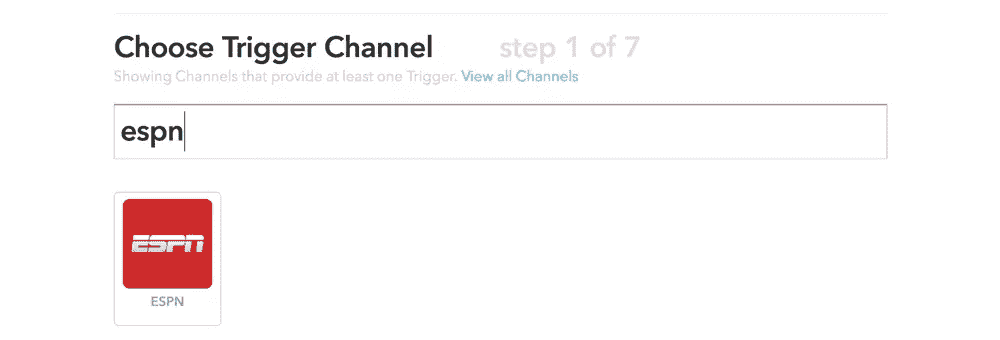

在下一个屏幕上，选择“新游戏开始”:

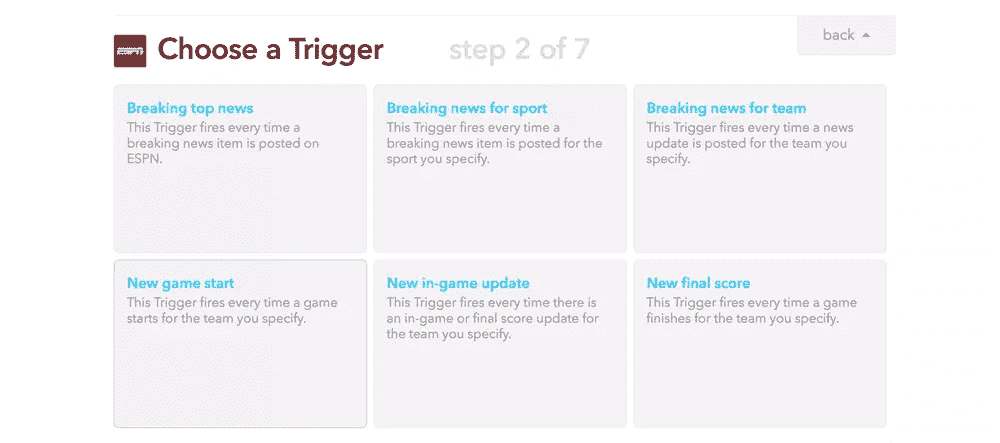

然后选择你想要触发动作的运动和团队。我选择了我最喜欢的 NBA 球队——菲尼克斯太阳队。

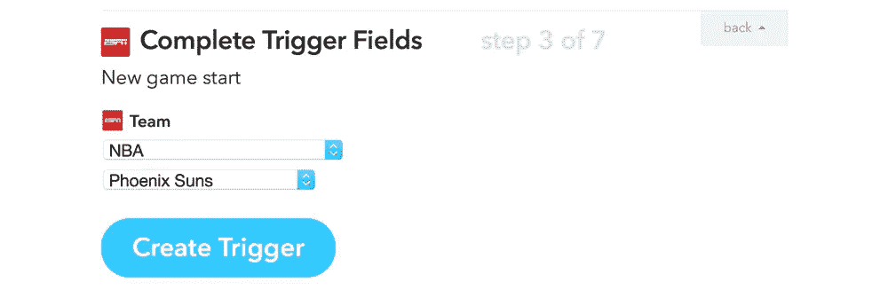

之后，再次选择 LIFX 作为动作通道，但是不要关掉我们的灯，选择“改变灯的颜色”。

我们在这方面的选择比关灯选项丰富得多！在这里，您可以选择您希望灯光改变为什么颜色，选择您希望它有多亮(或者保持它已经有的亮度)，如果它还没有打开，您是否希望这个动作打开灯光(我选择“否”，因为当我不在家时，凤凰可能会播放，我不想引起一个热切的凤凰太阳智能灯泡的巨额能源账单！)最后，过渡应该持续多长时间(我再次选择“即时”，因为我希望它立即发生)。当你对所有这些设置满意后，点击“创建操作”。

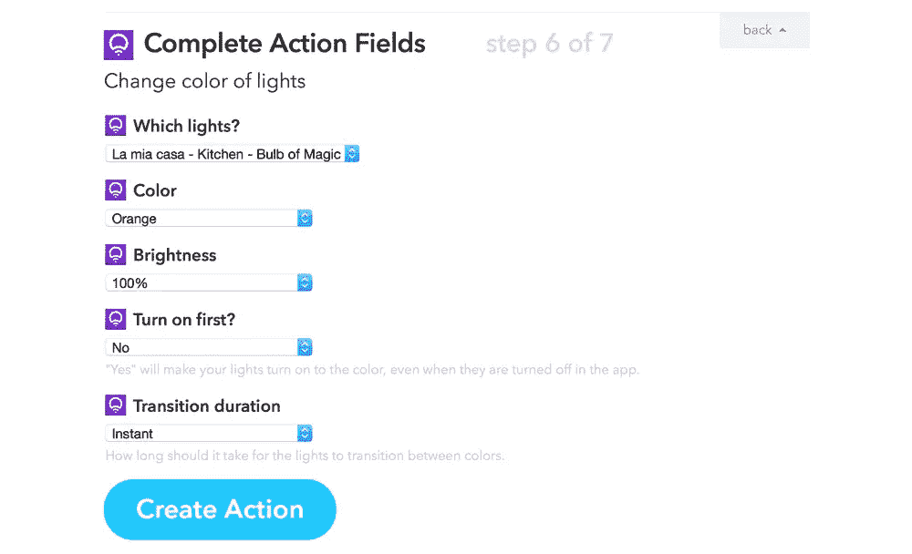

点击“创建食谱”完成它，当你的朋友过来和你一起观看下一场体育比赛时，给他们一个惊喜！

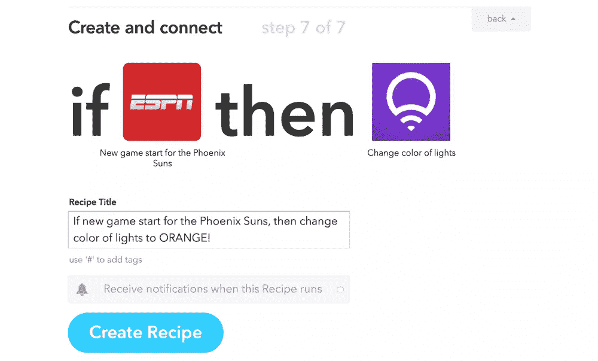

## 结论

并非所有物联网功能都需要大量编码！由于 IFTTT 等服务和 LIFX 智能灯泡等设备，即使非编码人员也可以轻松轻松地与支持互联网的设备建立愉快的交互！你有最喜欢的基于 IoT 的食谱吗？你有没有为你自己的 LIFX 智能灯泡想出一个好的替代触发器？请在评论中留言或在 Twitter ( [@thatpatrickguy](http://www.twitter.com/thatpatrickguy) )上联系我，我很乐意听到这些。

## 分享这篇文章