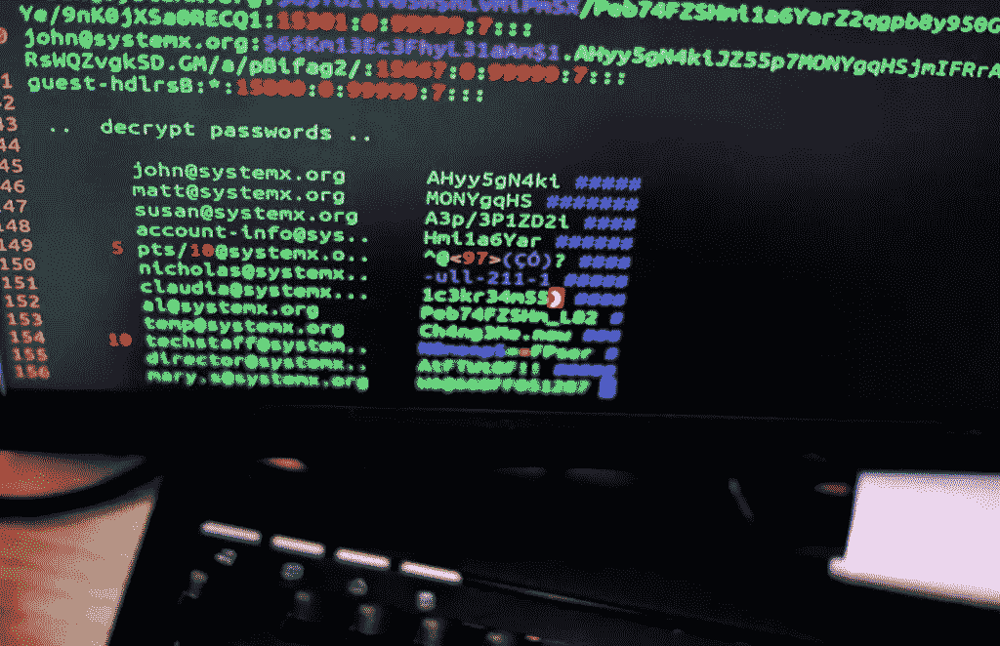

# 控制台战争–PHP CLI 库

> 原文：<https://www.sitepoint.com/console-wars-php-cli-libraries/>

我一直是控制台命令的狂热爱好者，我试图在我的大多数 PHP 项目中尽可能多地提供命令行界面(CLI)。

在本文中，我将简要比较三个 PHP 控制台命令库:

*   Symfony 控制台组件( [symfony/Console](https://github.com/symfony/Console)
*   Hoa 控制台([Hoa/控制台](https://github.com/hoaproject/Console))
*   Webmozart 控制台([web Mozart/控制台](https://github.com/webmozart/console))



## 起源故事

Symfony 控制台是最古老和最受欢迎的一个，在许多项目中使用(显然也是 Symfony 框架的一部分)。拥有数十个贡献者，成为很多开发者的首选。

Hoa 是一个模块化、可扩展和结构化的 PHP 库集，包括 **Hoa 控制台**。它的目标是成为工业界和研究界之间的桥梁，这使得这个项目非常有趣。

Webmozart 控制台是最新的项目，希望更简单，测试友好，并在 Symfony 控制台上添加新功能。

## 依赖性、规模和复杂性

Symfony 控制台只有建议的依赖关系，与依赖于一些 [Hoa 项目](http://hoa-project.net)库的 **Hoa 控制台**库相反。Webmozart 项目也直接依赖于 Symfony 控制台。

Hoa 控制台的 [LOC](http://en.wikipedia.org/wiki/Source_lines_of_code) (逻辑代码行数)最少~1397，其次是 Symfony 控制台~2226 和 Webmozart ~3126(无依赖)。

为了对这些项目的复杂性有一个大致的了解，下面是来自他们的 [PHPLOC](https://github.com/sebastianbergmann/phploc) 分析*的一些数据:

* * *

| 描述 | symphony | 手别碰-自动的(Hands Off-Automatic)ˌ(美)屋主协会(Home Owner Association) | 网络莫扎特 |
| :-- | --: | --: | --: |
| **圈复杂度** |  |  |  |
| 每个 LLOC 的平均复杂度 | Zero point three seven | Zero point three six | Zero point two six |
| 每类的平均复杂度 | Fourteen point seven three | Twenty-five point one four | Eight point eight four |
| 每种方法的平均复杂度 | Two point five five | Three point three eight | One point nine nine |
| **依赖关系** |  |  |  |
| 全局访问 | three | Twenty | one |
| 属性访问 | Eight hundred and seven | Two hundred and seventeen | One thousand two hundred and eighty-five |
| 方法调用 | One thousand one hundred and three | Three hundred and twenty-four | One thousand three hundred and twenty |

* * *

**仅在主源目录中执行分析，不包括测试文件夹(如果存在)。*

## 实际例子

### 描述

为了对每个库的功能有一个总体的了解，并查看运行中的代码，让我们编写一个业务特性来描述一个使用示例:

```
Feature: I want to output a message to several people.
	The message should be passed via the `--message` option and should be optional (default="Hello"),
	the message should be followed by two or more names,
	the message should be coloured with `--color=` (default="white") and/or in uppercase with `--up` (default=lowercase).
```

最终的控制台调用应该类似于:
`somemsg --message='Good Morning' Nicola Bruno --color=green --up`
，输出应该是:

```
GOOD MORNING NICOLA AND BRUNO
```

### 履行

首先，我们需要定义一个在每个控制台实现中使用的 PHP `Message`来处理这个例子。

下面是一些非常简单的代码:

```
class Message
{
    /**
     * Construct the class and initializes the properties.
     * 
     * @param        $names
     * @param string $message
     * @param bool   $uppercase
     */
    public function __construct($names, $message="Hello", $uppercase=false)
    {
        $this->names = implode(' and ', $names);
        $this->message = $message;
        $this->uppercase = $uppercase;
    }

    /**
     * Generates the output.
     * 
     * @return string
     */
    public function getMessage()
    {
        $output =  $this->message . ' ' . $this->names;
        if ($this->uppercase) {
            $output = strtoupper($output);
        }

        return $output;
    }
}
```

## Symfony 控制台

为了在 Symfony 中创建控制台命令，有必要:

*   创建命令类
    –配置参数和选项
    –编写逻辑
*   创建应用程序

### 创建命令

```
use Symfony\Component\Console\Command\Command;
use Symfony\Component\Console\Input\InputArgument;
use Symfony\Component\Console\Input\InputInterface;
use Symfony\Component\Console\Input\InputOption;
use Symfony\Component\Console\Output\OutputInterface;

class MessageCommand extends Command
{
    /**
     * Configures the argument and options
     */
    protected function configure()
    {
        $this
            ->setName('demo:msg')
            ->setDescription('Simple message delivery')
            ->addArgument('names', InputArgument::IS_ARRAY | InputArgument::REQUIRED, 'Who do you want to message?')
            ->addOption('message', null, InputOption::VALUE_REQUIRED, 'Set the message', 'Hello')
            ->addOption('up', null, InputOption::VALUE_NONE, 'Set the output in uppercase')
            ->addOption('color', null, InputOption::VALUE_REQUIRED, 'Which colors do you like?', 'white')
        ;
    }

    /**
     * Executes the logic and creates the output.
     * 
     * @param InputInterface $input
     * @param OutputInterface $output
     */
    protected function execute(InputInterface $input, OutputInterface $output)
    {
        $names = $input->getArgument('names');
        $message = $input->getOption('message');
        $uppercase = $input->getOption('up');
        $color = $input->getOption('color');

        $message = new Message($names, $message, $uppercase);
        $messageString = $message->getMessage();
        $coloredMsg = '<fg='.$color.'>'.$messageString.'</fg='.$color.'>';

        $output->writeln($coloredMsg);
    }
}
```

`configure`方法用于设置命令的参数和选项。

`addArgument`方法可以接收以下参数:
`addArgument($name, $mode, $description, $default)`

* * *

| 类型 | 名字 | 描述 |
| :-- | :-- | :-- |
| 线 | $name | 参数名称 |
| （同 Internationalorganizations）国际组织 | $mode | 参数模式:InputArgument::必选或 InputArgument::可选 |
| 线 | $描述 | 描述文本 |
| 混合的 | $默认 | 默认值(仅适用于 InputArgument::可选模式) |

* * *

`addOption`可以接收以下参数:
`addArgument($name, $shortcut, $mode, $description, $default)`

* * *

| 类型 | 名字 | 描述 |
| :-- | :-- | :-- |
| 线 | $name | 选项名称 |
| 线 | $快捷方式 | 快捷方式(可以为空) |
| （同 Internationalorganizations）国际组织 | $mode | 选项模式:InputOption::VALUE_*常量之一 |
| 线 | $描述 | 描述文本 |
| 混合的 | $默认 | 默认值(对于 InputOption::VALUE_REQUIRED 或 InputOption::VALUE_NONE，必须为 null) |

* * *

有三个选项可用于为输出着色:

*   使用预设标签(es: `$output->writeln('<info>foo</info>');`用于绿色输出)
*   使用`OutputFormatterStyle`类定义一个样式
*   设置标签名称中的颜色:

```
// red text on a cyan background
 $output->writeln('<fg=red;bg=cyan>foo</fg=red;bg=cyan>');
```

可用的前景色和背景色有:黑色、红色、绿色、黄色、蓝色、洋红色、青色和白色。可用选项有:粗体、下划线、闪烁、反转和隐藏。

更多信息请见 Symfony 官方文档。

**注意**:默认情况下，Windows 命令控制台不支持输出着色。你将需要(并且应该安装) [Git 工具](https://git-scm.com/downloads)或者另一个更高级的命令控制台。

### 创建应用程序

在配置和执行之后，我们差不多完成了。最后一步是创建一个 PHP 文件来运行命令。

```
//file myconsole.php

require __DIR__.'/vendor/autoload.php';

use MessageCommand;
use Symfony\Component\Console\Application;

$application = new Application();
$application->add(new MessageCommand());
$application->run();
```

控制台呼叫示例:

```
php myconsole.php demo:msg Nicola Bruno --message='Good Morning' --color=blue --up
```

Symfony 控制台也自动为输出助手提供`--help`参数。

## Hoa 控制台

Hoa 控制台遵循一种结构化程度较低的方法来配置控制台命令。

该过程由以下步骤组成:

*   解析命令
*   获取选项和输入
*   执行逻辑

### 解析命令

```
/**
 * $argv contains an array of all the arguments passed to the script,
 * the first argument is always the name of the PHP file.
 * the Hoa Parser->parse method accept a string in input, so it's necessary to convert the $argv array in a string without the first argument as below.
 */
unset($argv[0]);
$command = implode(' ', $argv);

$parser = new Hoa\Console\Parser();
$parser->parse($command);

//options definition
//['longname', TYPE, 'shortname']
$options = new Hoa\Console\GetOption(
    [
        ['up', Hoa\Console\GetOption::NO_ARGUMENT, 'u'],
        ['message', Hoa\Console\GetOption::REQUIRED_ARGUMENT, 'm'],
        ['color', Hoa\Console\GetOption::OPTIONAL_ARGUMENT, 'c']
    ],
    $parser
);
```

### 获取选项和输入

```
//definition of default values
$uppercase = false;
$message = "Hello";
$color = "white";

$names = $parser->getInputs();

//The following while with the switch will assign the values to the variables.
while (false !== $shortName = $options->getOption($value)) {
    switch ($shortName) {
        case 'u':
            $uppercase = true;
            break;
        case 'm':
            $message = $value;
            break;
        case 'c':
            $color = $value;
            break;
    }
}
```

### 执行逻辑

```
$message = new Message($names, $message, $uppercase);
$messageString = $message->getMessage();

Hoa\Console\Cursor::colorize('fg('.$color.')');
echo $messageString;
Hoa\Console\Cursor::colorize('fg(white)'); //reset the cursor to default white
```

为了给输出着色，可以改变`Cursor`的颜色。

Hoa 控制台支持多种颜色。
颜色可以通过名称(黑、红、绿、黄……)、数字(从 0 到 256 代表 264 种调色板)或十六进制代码#rrggbb 来设置，例如:


示例中的基本用法不提供自动助手输出，也不是很面向 OOP，但是扩展`Hoa\Console\Dispatcher\Kit`(需要`hoa/dispatcher`)可以增加更多的灵活性(更多信息在[官方文档](http://hoa-project.net/En/Literature/Hack/Console.html#Integrate_a_router_and_a_dispatcher))

可以使用以下命令调用该命令:

```
php message.php  -u --message=Hello --color=green Nicola Bruno
```

Hoa 控制台的优点之一是它提供了额外的 API 类来操作重要的元素，支持不同的终端配置文件:

*   `Cursor`(移动、清除、显示、着色……)
*   `Mouse`(听鼠标动作)
*   `Window`(设置大小，滚动，最小化，…)
*   带有`Readline`的终端行(历史，自动完成等)

## Webmozart 控制台

Webmozart 控制台命令创建工作流程包括:

*   配置参数和选项
*   编写逻辑
*   创建应用程序

Webmozart 的控制台遵循类似于 Symfony 控制台的方法，但是在配置和逻辑执行之间有明确的分离。

### 配置

```
use Webmozart\Console\Api\Args\Format\Argument;
use Webmozart\Console\Api\Args\Format\Option;
use Webmozart\Console\Config\DefaultApplicationConfig;

/**
 * Configuration of arguments and options
 */
class MsgApplicationConfig extends DefaultApplicationConfig
{
    protected function configure()
    {
        parent::configure();

        $this
            ->setName('msg')
            ->setVersion('0.1')
            ->beginCommand('msg')
                ->setDescription('Show a nice message')
                ->setHandler(new MsgCommandHandler())
                ->addArgument('names', Argument::MULTI_VALUED | Argument::REQUIRED, 'Who do you want to message?')
                ->addOption('message', null, Option::OPTIONAL_VALUE, 'Set the message', 'Hello')
                ->addOption('up', null, Option::NO_VALUE, 'Set the output in uppercase')
                ->addOption('color', null, Option::REQUIRED_VALUE, 'Which colors do you like?', 'white')
            ->end()
        ;
    }
}
```

### 逻辑

```
use Webmozart\Console\Api\Args\Args;
use Webmozart\Console\Api\IO\IO;

/**
 * Handling the command logic
 */
class MsgCommandHandler
{
    public function handle(Args $args, IO $io)
    {
        //gets the argument and option 
        $names = $args->getArgument('names');
        $message = $args->getOption('message');
        $uppercase = $args->getOption('up');
        $color = $args->getOption('color');

        $message = new Message($names, $message, $uppercase);
        $messageString = $message->getMessage();

        $coloredMsg = '<fg='.$color.'>'.$messageString.'</fg='.$color.'>';

        $io->writeLine($coloredMsg);
    }
}
```

配置和逻辑的严格分离允许更大的灵活性，以便于测试和项目随着额外的命令而增长。

Webmozart 控制台的其他优势包括:

*   子命令支持:

    ```
    php mycommand.php msg send --arg1 --arg2
    	 php mycommand.php msg receive --someoptions=somevalue
    ```

*   支持联机帮助页文档(如“git help remote”)

*   Symfony 控制台的适配器(使用 Symfony 的类，如 ProgressBar)

### 创建应用程序

运行该命令的应用程序文件类似于 Symfony 文件:

```
require 'vendor/autoload.php';
use Webmozart\Console\ConsoleApplication;

$cli = new ConsoleApplication(new MsgApplicationConfig());
$cli->run();
```

控制台呼叫:

```
php myconsole.php msg --message='Good Morning' Nicola Bruno --color=blue --up
```

## 最后的想法

上面介绍的每个控制台针对不同的使用类型和用户偏好提供不同的功能。

*   Symfony 控制台经过了良好的测试，非常健壮，具有良好的文档和功能，可以解决大多数常见的用例。
*   Hoa 控制台更加面向行业，非常适合操作终端环境(鼠标、光标、窗口等等)。
*   Webmozart 控制台是新的(很快会有一个稳定的版本)，但它对于处理倾向于增长到大规模的项目非常有用。

你经常使用它们吗？如果有，是哪一个？为什么？你认为每种方法的优点和缺点是什么？你有其他竞争者推荐吗？让我们知道！

## 分享这篇文章