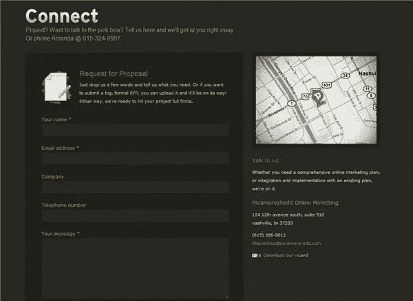
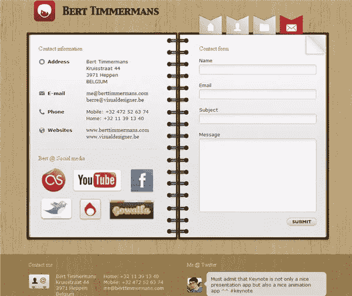
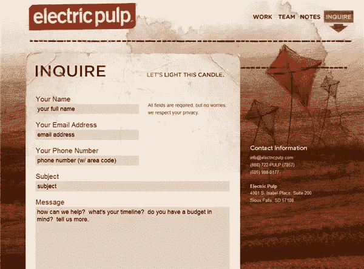
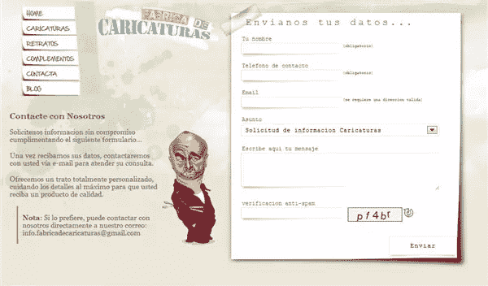
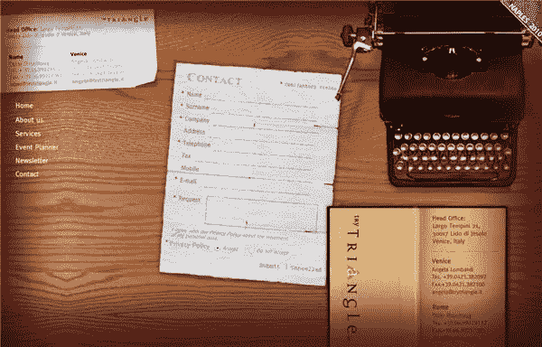
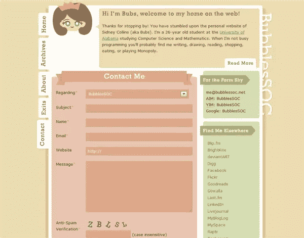
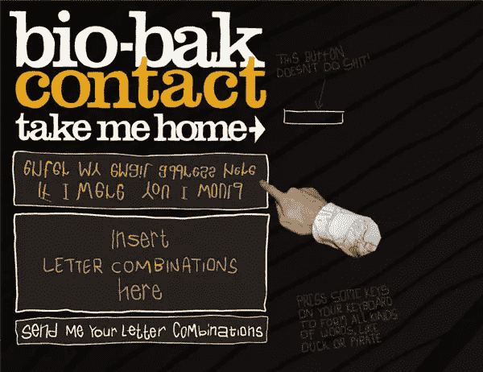
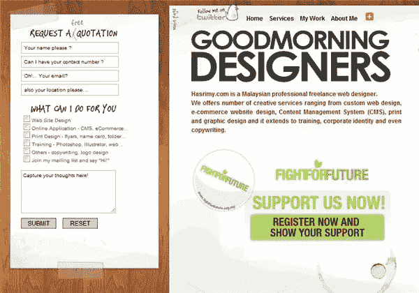

# 联系，连接，沟通:设计你的联系页面

> 原文：<https://www.sitepoint.com/contact-connect-communicate-designing-your-contact-page/>

当一个访问者来到你的网站，四处看看，你希望他们采取的一个行动就是联系你。他们可能会联系你获取更多信息，或者如果他们对你印象深刻，会雇佣你提供服务。一切按计划进行，你的联系页面将会是他们在你的网站上积极寻找的东西。那么什么信息应该出现在你的联系页面上，你应该通过你的网页表单从访问者那里得到什么信息呢？

让我们从最明显的开始。你应该在联系页面上留有电话号码和电子邮件地址。如果访问者希望与您见面，并且提供一种安全感，即您有一个真实的实际地址，则需要邮政地址。一些设计师将这种联系信息放在每一页的页脚，以及联系页面上。我认为应该尽可能地让访问者感到简单，如果他们能在他们访问的任何页面的页脚快速方便地找到他们想要的东西，那只会是一件好事。

谷歌和必应地图很容易嵌入到任何页面上，当然也让潜在客户在必要时更容易找到你。这些地图还允许您提供从他们所在的地方到您所在的地方的驾驶方向，这只是改善您的访客体验的另一个小元素。

如果你是一个网上交际花，别忘了添加按钮，让人们知道你在脸书、推特、Gowalla 或任何你选择的社交网络上的位置。

当创建一个让访问者联系您的表单时，确保您从他们那里收集了所有您需要的信息，例如他们的联系方式，他们联系您的目的。根据您提供的服务类型，您可能需要在联系人表单中添加额外的字段、复选框、单选按钮或下拉菜单。例如，如果有人询问你的设计服务的费用，你可以提供一个下拉框指定标志设计，网页设计，平面设计。

如果你没有一个联系页面，你就完全失去了一个和你的访问者交流的机会，并且你可能会失去客户。把它们放在一起并不困难，下面我收集了一些例子，如果你不知道从哪里开始，可以给你一些启发。

[帕拉摩尔·里德](http://paramoreredd.com/connect/)

[Lionways](http://www.lionways.com/en/contact/)

伯特木匠

[电动纸浆](http://electricpulp.com/contact/)

漫画制作

[三角形](http://www.trytriangle.it/)

[Bubblesoc](http://bubblessoc.net/contact/)

[底物](http://substrakt.co.uk/contact/#offices-marker1)

[生物烘焙](http://www.bio-bak.nl/)

[哈斯里米](http://www.hasrimy.com/)

你觉得这些联系页面怎么样？你认为联系方式应该不加修饰，很少或没有设计，还是你喜欢带有额外插图和定制的联系页面？

## 分享这篇文章