# 内容扩展:如何最大化你的内容

> 原文：<https://www.sitepoint.com/content-expansion-maximize-content/>

*本文最初发表于[增长无处不在](http://growtheverywhere.com/)。*

所以你创造了你认为是一个优秀的内容，但是没有流量进来。

营销专家谈论内容营销的重要性，以及它如何在他们的业务中产生巨大的变化。交通和线索似乎为他们蜂拥而至。Backlinko 每月有 90，000 名访客，这是一个更新的 SEO 博客，Derek Halpern 有超过 200，000 名电子邮件订户，这个数字还在增加。

这是人们不常谈论的一个元素:内容推广。

当人们谈论它时，他们说内容推广可能比内容本身更重要，但是没有人真正告诉你如何有效地做。我们都会制作大量不同的内容，所以我们应该加倍努力，扩大/重新利用这些内容，以实现最大化，对吗？

在本帖中，我们将带你了解如何在其他平台上推广你的内容以及重新利用它(本质上也是一种推广形式)。我们姑且称之为‘内容扩展’。

让我们直接开始吧。

## 通常会发生什么

典型的内容营销策略包括发布一篇博客文章，将其植入你的社交档案，也许还会发送几封电子邮件。

不觉得应该有更多吗？

首先，我从 Neil Patels 和 Derek Halperns 那里听到的一件事是创造真正的史诗内容。当内容是一流的时候，推广和再利用就容易多了！

假设你已经这样做了，那么是时候把你的注意力转向所有可供你重新利用的平台了。

记住:改变用途是一种推广形式，因为你正在进一步传播你的内容。

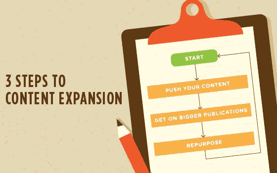

## 第一步:推送你的内容

例如，我的每一次[无处不在的成长访谈](http://www.growtheverywhere.com/)都会涉及几个领域:

*   **苹果 iTunes**——建立一个播客需要一点工作(设备、软件、编辑等)。)但是一旦进入心流，那就是小菜一碟。帕特·弗林在这里有一个关于如何建立播客[的精彩指南。](http://www.smartpassiveincome.com/how-to-start-a-podcast-podcasting-tutorial/)
*   **装订机**–同上。
*   **YouTube**–我把我所有的音频播客上传到 YouTube，以增加我的影响力。对我来说，这是另一个为我的播客获得更多订户并建立品牌知名度的机会。以下是我的“视频”在 YouTube 上的最终效果(注意橙色的号召按钮):
    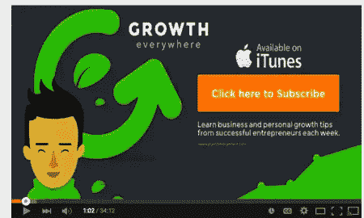
*   **脸书(有机)**——人们谈论脸书有机 reach 已死，但[事实并非如此](http://www.jonloomer.com/2015/02/03/facebook-organic-page-reach-is-not-dead/)。如果你在脸书上存在(或者如果你的观众在那里闲逛)，你应该直接在应用程序上发帖(这意味着不要使用社交媒体工具来发帖)。那样你会更有影响力。
*   **访客在其他网站上发表文章**—[找到了最适合你发表访客博客的地方](http://www.quicksprout.com/2014/05/05/how-to-find-the-best-places-to-guest-blog/)并建立了良好的关系后，询问你是否可以为他们的网站重新安排一些内容。例如，我能够在《企业家》上发表[我与加州新港](http://www.entrepreneur.com/article/247979)的采访，因为我根据他们的指导方针重写了这篇文章。如果它对你的观众有价值，为什么对相似的观众没有价值呢？这对双方都是双赢。
*   Soundcloud 是一个发展迅速的在线音频发布平台。如果你正在使用像 [LibSyn](http://www.libsyn.com/) 这样的播客托管服务，它将允许你自动发布到 SoundCloud。如果不是，手动发布也不错(特别是如果您正在增加发行版的话)。如果你认为 Soundcloud 不可行，那么截至 2015 年，他们拥有超过 1.75 亿的月用户。下面是他们成长的快照:
    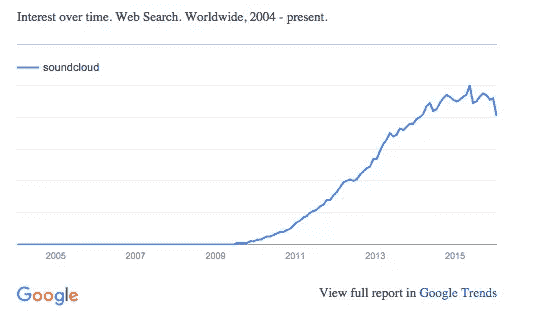
*   **Medium(重复的帖子是可以的)**–Medium 是一个不断发展的发布平台，它有一些简洁的工具来帮助扩大帖子的覆盖范围。截至 2014 年 3 月 19 日，Medium 每月拥有 1300 万独立用户。那没什么可嗤之以鼻的。有时我会将我的内容整合到媒体中。大多数 SEO 会说，联合内容可能不是一个好主意。对我来说，我说要看情况。考虑辛迪加时，最重要的是你如何[安全地做这件事，而不损害你的网站](http://searchengineland.com/syndicated-content-189097)。
*   **LinkedIn 发布平台(还是那句话……重复的帖子是可以的)**——职业社交网络 LinkedIn 随着不断扩张，开始更加认真地对待发布。我通常每周会在 LinkedIn 上发布一到两篇帖子。截至 2015 年，领英拥有 3.64 亿用户:
    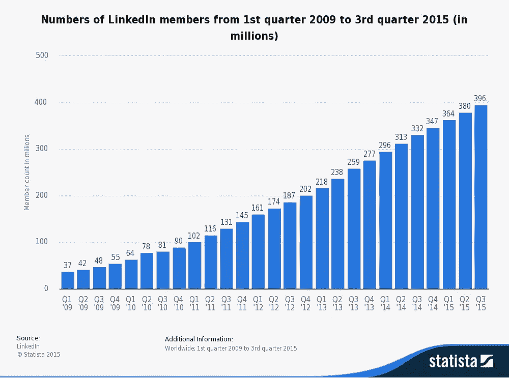

在 [Statista](http://www.statista.com/) 查找更多统计数据

*   Twitter——你还在用 Twitter，对吧？
*   **LinkedIn Groups**——我曾经认为 LinkedIn Groups 没有提供多少价值，但一次又一次，事实证明我错了:
    
*   其他网站上的客座博文–我有时会在更大的刊物上发表文章，比如 Entrepreneur.com。因为我的内容与他们的观众相关，所以[倾向于引起共鸣](http://www.entrepreneur.com/article/247979)。但是，较大的出版物对原创内容有严格的要求。这意味着我将不得不花一些时间重新起草我的内容，以适应他们的指导方针。但从长远来看，这是值得的。尼尔·帕特尔很好地分解了他从发表 300 多篇客座博文中学到的教训[。](http://www.quicksprout.com/2015/04/13/7-lessons-learned-by-publishing-300-guest-posts/)

虽然我在 YouTube 上花的时间不多，但我一个月只要推一下就有 4000+的浏览量。在 LinkedIn 上，只要重新发布相同的内容，我就能获得额外的 400 次访问:

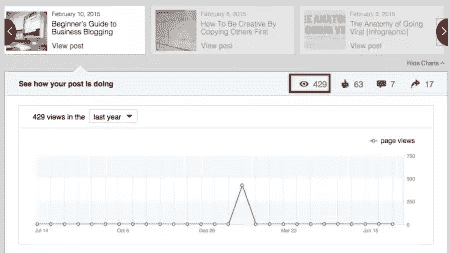

*当然*，这些数字并不惊人，但是当你继续在其他平台上添加这些数字时，它们就会增加。用几年的时间把它复合起来，然后你会看到一些严肃的数字。

但这还不是全部。像 Pinterest、Instagram 和 Periscope 这样的新平台一直在涌现。不进行起码的探索就把它们一笔勾销可能是一个巨大的错误。例如，Foundr 杂志的陈庭威[在短短 5 个月内将他的 Instagram 粉丝增加到了 11 万人。更令人印象深刻的是，他每个月都有 20，000 名搞笑粉丝点击他的个人主页—**45%转化为电子邮件订阅者**。](https://blog.gleam.io/foundr/)

## 第二步:出版更大的出版物

你有没有想过为《福布斯》、《赫芬顿邮报》或《快公司》这样的网站做贡献？青年企业家委员会是进入这些网站的快速通行证。他们甚至有为时间紧迫的企业家撰写文章的服务。你不需要担心如何撰写文章或者将文章提交给编辑。他们会帮你处理的。

准入标准是年收入超过 100 万美元、年费为 1000 美元的企业。你也可以和年轻的有前途的(40 岁以下)企业家联系。

但是如果你不完全符合 YEC 的模式，那也不是问题。以下是你获得更大出版物的方法:

### 建立发布目标列表

首先，确定你想出现在哪些出版物上。对于“无处不在的增长”,我的受众是企业家和营销人员，因此将目标定位于企业家、福布斯、快速公司和商业内幕等网站是有意义的。在营销方面，我为社交媒体审查者、HubSpot 等网站写文章是有意义的。

你的目标是找出你的观众在哪里。如果你不确定从哪里开始，Buzzsumo 是一个很好的工具，可以帮助你发现在你的领域获得大量份额的内容。以下是我输入“创业营销”时得到的结果:

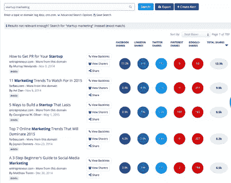

### 找出你独特的角度

接下来，你需要弄清楚你独特的角度是什么。是什么让你与众不同？你擅长什么？哪里能带来最大的价值？例如，[蒂姆·菲利斯](http://www.fourhourworkweek.com/)是一位杰出的面试官，因为他是一个如饥似渴的学习者。正因为如此，他可以和世界级的表演者谈论许多不同的话题，从阿诺德·施瓦辛格到天使投资人克里斯·萨卡。这就是为什么他的播客在 iTunes 中名列前茅(超过 1967 条评论，平均 4.5 星)。

保持独特和真实，人们会更容易接受你——尤其是当你试图在更大的出版物上发表时。

### 如何找到出版物编辑/作者

现在，当谈到捐款时，你必须接触到实际的决策者。我通常瞄准“总编辑”这个头衔。即使他们不是打电话给嘉宾贡献者的人，他们至少可以给你指出正确的方向。

首先，你可以试试谷歌:

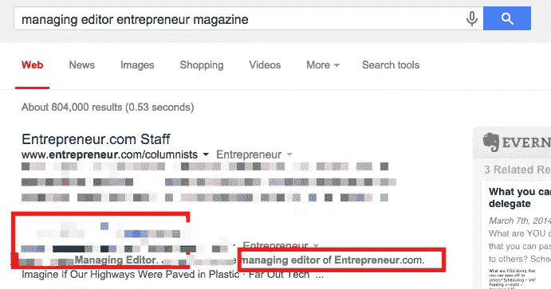

如果这不起作用，你可以试试 LinkedIn:

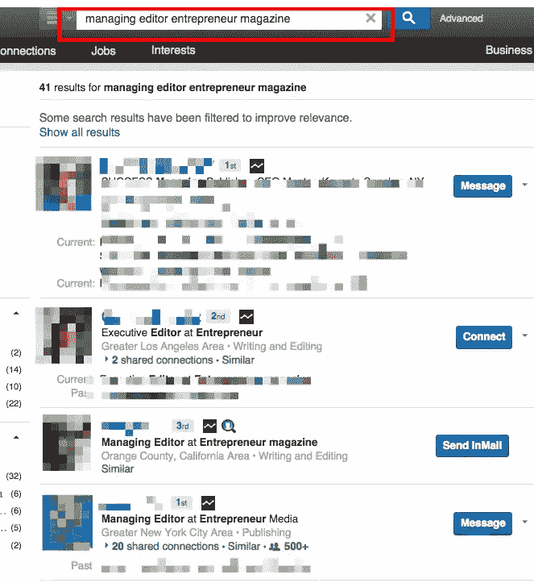

在那里，你可以使用像电子邮件猎人这样的工具或者谷歌他们的 Twitter 账号来联系他们。

E-mail Hunter 将从网络上的任何地方查找电子邮件地址:

### 研究个人

现在是时候坐下来研究你的目标感兴趣的话题了。通过谷歌搜索“[姓名][出版物]文章”，我可以快速浏览我的目标最近写的文章:

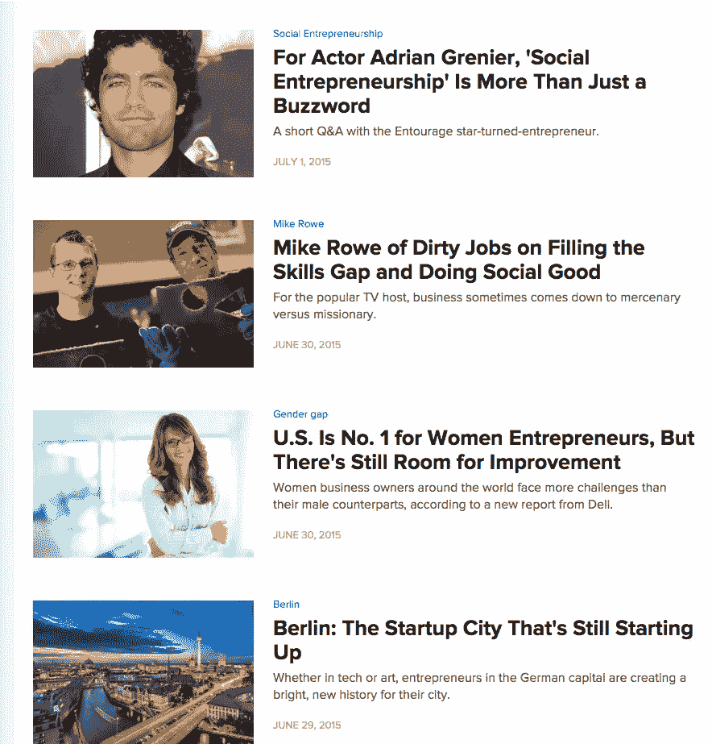

完美——看起来这正合我的胃口(创业)。一旦我知道我有合适的人选，我会把它们添加到一个电子表格中，在表格中有一栏注明与我的目标产生共鸣的主题。

### 想出一个标题列表

好了，现在是时候为每个类别准备一份 5 个想法的清单了。例如，如果你的目标读者是对创业感兴趣的编辑，你可以为这个类别创建 5 个标题。如果你的目标读者是对市场营销感兴趣的编辑，这将是另外 5 个关于这个类别的标题。冲洗并重复，直到每个主题有 5 分钟。

确保它们也是伟大的头条新闻。

如果你不确定如何写引人注目的标题，这里有一些资源:

*   [10 个行之有效的标题公式](http://www.copyblogger.com/10-sure-fire-headline-formulas-that-work/)
*   [如何写磁性标题](http://www.copyblogger.com/magnetic-headlines/)
*   [10 大吸引流量和读者的头条新闻](http://www.jeffbullas.com/2013/08/21/10-awesome-headlines-that-drive-traffic-and-attracts-readers/)

更重要的是，分析他们使用的标题类型，并根据他们的风格设计你的标题。

他们会感激的。

### 制作一个电子邮件模板

恭喜，你已经让他们打开了你的电子邮件！现在是时候用一个可靠的电子邮件模板来结束它们了。

这是一个可以立即滑动和部署的示例:

 *嗨【姓名】，*

你的超级粉丝。我特别喜欢[这篇文章:链接]，在那里你谈到了[他们谈了什么]。

我是[您的名字]，我想为[贵公司]写一篇关于[主题]的文章。

我为[插入类似的出版物链接]写过文章，我认为我的文章会引起你的读者的共鸣。

我为你准备了一些想法。

*   [标题 1]
*   [标题 2]
*   [标题 3]
*   [标题 4]
*   [标题 5]

想法？

真诚地，
【你的名字】

### 这里有一个更容易使用的:

 *嗨【姓名】，*

只是想让你知道，我们在这里写的一篇文章中提到了你:[链接]

让我知道你的想法！

真诚地，
【你的名字】

### 冲洗并重复

坚持这样做，我保证你会获得牵引力。一开始你可能会遭到一些忽视或拒绝，但关键是要继续努力。来自 Backlinko 的 Brian Dean 指出[他从内容推广电子邮件中获得了 11%的转化率](http://backlinko.com/skyscraper-technique)。

关于他是如何做到这一点的更多信息，请点击这里:

[https://www.youtube.com/embed/pqe7U4YOGOA?feature=oembed](https://www.youtube.com/embed/pqe7U4YOGOA?feature=oembed)

如果他们说不呢？记下 2-3 个月后的跟进，因为你会继续积累更多的经验。通过使用销售自动化工具，您可以让生活变得更加轻松。归根结底，*这只是一个数字游戏*。你一定会转化一些你可以为之写作的出版物。

### 额外提示:请求推荐

如果你认识的某个人正在为你想登上的出版物制作内容，请他们推荐给总编辑。热情的介绍大有帮助。这似乎是一个“咄”的提示，但大多数人忘记了做眼前的事情。

## 步骤#2A:如何真正推广你的内容

**建立一个影响者圈子**–GrooveHQ 从一份影响者名单开始，在 24 小时内从一篇博文中获得了 1000 多名订阅者。从收入角度来看，该帖子产生了约 3425 美元的收入。

那是他们刚刚起步的时候。他们现在每月的经常性收入超过 17 万美元。

向提到的人发推文/电子邮件——这是你在升职时能找到的最容易摘到的果子。人们喜欢听自己的故事，如果你的作品是可靠的，他们会很乐意分享。就我个人而言，我在这方面还没有做到最好，但是当我做到的时候，我会得到丰厚的回报。我已经雇了人来处理这件事(如果你有更紧急的事情要处理，你可能应该这么做)。

你可以用上面的副本给人们发电子邮件。下面再举一个简短的例子:

 *嗨【姓名】，*

只是想让你知道，我们在这里写的一篇文章中提到了你:[链接]

让我知道你的想法！

【你的名字】

这里有一个你可以使用的例子:
 *。@NAME 刚刚在我们的文章中提到了你【主题】
【链接】* 

(是的，句号是故意放在那里的)

**跟踪你的晋升**-衡量什么，管理什么。您可以通过谷歌电子表格跟踪您的推广，并从简单的指标开始，例如:

*   **外联次数**–外联尝试的总次数。
*   **份额**–您促销尝试的总份额。
*   **获得的链接**–从您的推广尝试中获得的链接总数(更难跟踪，因为链接需要时间来显示，所以建议您一个月后再来查看)。
*   **推广转化率**–(份额+链接)/推广次数

要想更自动化地跟踪和发送电子邮件，你可以使用销售自动化工具，比如 Outreach。

**播种到社区**–有许多很棒的社区，人们在那里在线分享内容。例如,《增长无处不在》的帖子通常会涉及营销、销售和创业方面的话题。

以下是我可以向其推送内容的几个社区:

*   [Growthhackers.com](http://www.growthhackers.com/)——创业营销社区。
*   [Inbound.org](http://www.inbound.org/)—集客营销社区。
*   [Closingcall.co](http://www.closingcall.co/)—销售社区。
*   Reddit–/r/Reddit.com/r/entrepreneur 或 Reddit.com/r/marketing.的初创公司

关于社区的说明:每个社区都是不同的，你不要太自我推销，否则他们会把你撕成碎片。尤其是 Reddit。

不确定从哪里开始？只要谷歌一下*'【你的利基】社区'*，你就会找到一些合适的候选人。例如，我输入“室内设计社区”，然后我看到了 [Houzz 讨论板](http://www.houzz.com/discussions):

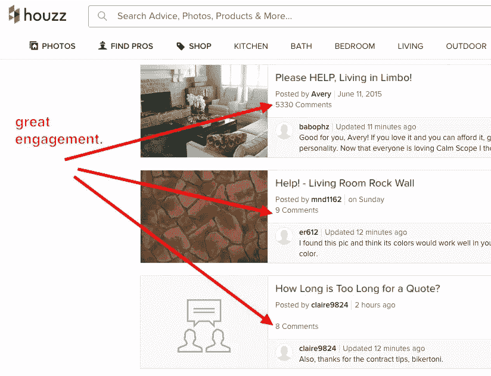

**奖励** : Moz 整理了一份关于内容放大的特别指南，我强烈推荐你看看:

[//fast.wistia.net/embed/iframe/ytyz1cskay#?secret=ritpKG58G9](//fast.wistia.net/embed/iframe/ytyz1cskay#?secret=ritpKG58G9)

### 促销工具

如果没有一些推荐的工具，这篇文章是不完整的。以下是一些有助于内容扩展的可靠工具:

[Moz](http://www.moz.com/) ， [Ahrefs](http://www.ahrefs.com/) ，[Majestic SEO](http://www.majesticseo.com/)——这三个 SEO 工具中的任何一个都可以很好地告诉你一个网站在链接获取方面做得如何，哪些页面最受欢迎等等。Moz 拥有 Followerwonk 和关键字难度工具等工具，可以帮助你了解重要的社交媒体统计数据/趋势以及值得一试的关键字。下面是一个简单的 Majestic SEO 教程:

[https://www.youtube.com/embed/oZqARf_YDDQ?feature=oembed](https://www.youtube.com/embed/oZqARf_YDDQ?feature=oembed)

SEM rush–SEM rush 是我们在探索网站运行的广告或网站排名的有机关键词时的首选工具。它还生成简单的每周报告，记录网站的每周增长情况。这里有一个关于 SEMrush 的教程:

[https://www.youtube.com/embed/lo5MpkitB8U?feature=oembed](https://www.youtube.com/embed/lo5MpkitB8U?feature=oembed)

[meet Edgar](http://www.meetedgar.com/)——如果你正在制作大量的内容，很难去想什么需要重新展示，什么时候安排。Edgar 允许你安排内容(你自己的或策划的)，设置它，然后忘记它。我建议每个月清理你的内容，以确保你与你的观众分享最新的内容。让我们来看看埃德加:

[https://www.youtube.com/embed/2Dex3uCIOF0?feature=oembed](https://www.youtube.com/embed/2Dex3uCIOF0?feature=oembed)

缓冲区(Buffer)–多年来，缓冲区一直是我们社交媒体工具箱中的一个重要组成部分，现在依然如此。您可以通过浏览器将帖子安排到多个渠道，然后查看一段时间内帖子的效果。节省大量时间，非常适合与 MeetEdgar 搭配使用。

[Outbrain](http://www.outbrain.com/) 、 [Taboola](http://www.taboola.com/) 、[stumble upon](http://www.stumbleupon.com/)——如果你真的想扩大你的内容覆盖范围，像 Outbrain 和 Taboola 这样的内容分发网络可以带来投资回报。这些是你在 CNN.com 和 ESPN.com 等网站下面看到的推荐帖子。Moz 有一个帖子报告说，花 2000 美元就能获得 1000 多条社交分享和 82 个链接。

[放火](http://www.startafire.com/)–放火让你可以通过你分享的每一个外部链接来推广你的内容。例如，当我们通过 Buffer 分享我们的内容时，每个链接都会自动转换为 Start A Fire 链接，该链接会在每个帖子的右下角添加一个徽章:

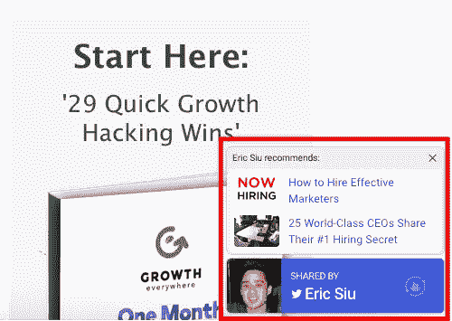

自从使用它以来，我们已经获得了 790 次浏览量和 109 次徽章点击，点击率为 13.7%。不用做任何额外的工作也不算太寒酸。

扎皮尔/[if TTT](http://www.ifttt.com/)–扎皮尔是我集成应用程序的首选工具。例如，如果一个线索来自我们的 WordPress 网站，它会立即被推送到我们在 HipChat 的销售渠道。我们制作了一个视频来展示我们是如何使用它的:

[https://www.youtube.com/embed/Z9ahZ1PSReg?feature=oembed](https://www.youtube.com/embed/Z9ahZ1PSReg?feature=oembed)

## 第三步:之后做什么

### 内容扩展

既然你已经把宝贵的时间花在了创造非凡的内容上，你没有理由不改变它的用途。例如，Buffer 停止发布内容一个月，转而专注于重新调整用途和刷新归档中的内容。他们的结果令人震惊:

以下是您如何调整内容用途的方法:

*   浏览你的分析，看看你在过去一年中表现最好的 10 篇文章。你可以将其中的哪些内容转换成幻灯片、视频或电子书？
*   在谷歌上搜索与你的作品相关的关键词，并把它们添加到你当前的内容中，让它更有史诗感。例如，如果我搜索“内容营销”并滚动到搜索结果页面的底部，我会看到几个相关的关键短语，我可以围绕这些短语构建更多内容:

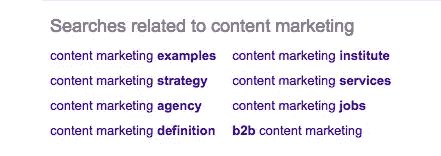

在你把原作变得更有史诗感之后，想想你可以如何改变它的用途。之后，遵循德里克·哈尔彭法则:[花 20%的时间创建一个帖子，80%的时间推广它](http://growtheverywhere.com/marketing/derek-halpern-email-subscribers/)。

以下是更多关于如何改变内容用途的想法:

### 信息图表

信息图是扩展你过去创建的内容的好方法。互联网企业家尼尔·帕特尔记录了他的 47 幅信息图:

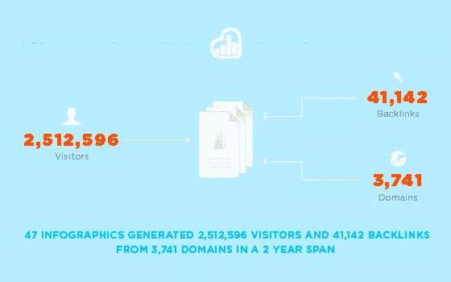

分析公司 KISSmetrics 在关键词“如何计算终身价值”方面排名第一。但是我们大多数人没有预算或时间去研究一个经过深思熟虑的信息图表。

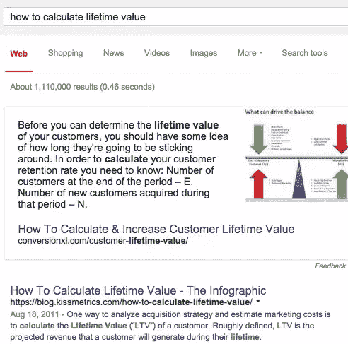

幸运的是，有几个选项可以根据预算快速制作信息图(比如 [Canva](http://www.canva.com/) 或 [Piktochart](http://www.piktochart.com/) )。

#### 幻灯片共享

拥有超过 6000 万月用户的 SlideShare 被称为内容营销的沉睡巨人。如果你经常演讲，在 SlideShare 上分享你的幻灯片是有意义的。你甚至可以把你以前做过的信息图切片，贴上去，以增加你的影响力。

#### 照片墙

Instagram 拥有超过 3 亿用户，如果使用得当，它可以成为一个重要的参与者。《Foundr》杂志的陈庭威每月从他的 Instagram 账户获得超过 8000 名电子邮件订户。他花了 5 个月的时间从 0 到 11 万粉丝:

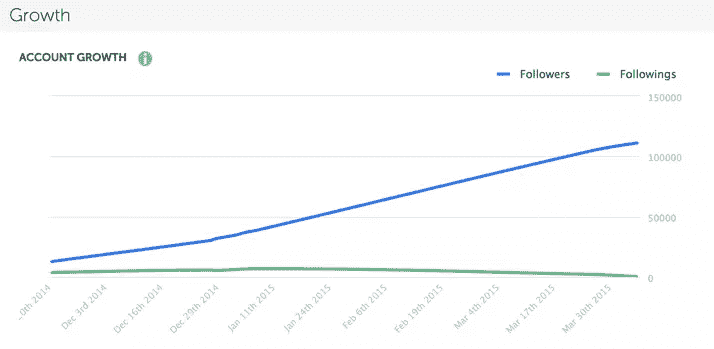

要详细了解他的 Instagram 增长战略，[点击这里](https://blog.gleam.io/foundr/)。对于你们这些懒惰的人(像我一样)，这里有一些关键的提示:

*   保持一致
*   使用像 Wordswag 这样的工具自动化你的图像
*   使用问题来推动参与
*   让用户标记他们的朋友
*   在 Instagram 上进行比赛
*   将#标签放在评论中，而不是描述中——因为你不想让它妨碍你的描述
*   在您的个人资料中设置一个令人难忘的重定向

#### 拼趣

视觉书签网站 Pinterest 预计在 2015 年拥有超过 4700 万月活跃用户。它不仅仅是一个供女性张贴结婚照的网站。弄清楚你的人口统计数据是否在那里，对你最有利。如果他们这样做了，那么是时候学习[如何在 Pinterest](https://blog.hubspot.com/blog/tabid/6307/bid/31147/The-Ultimate-Guide-to-Mastering-Pinterest-for-Marketing.aspx) 上营销了。如果你对自己的设计能力没有把握，你可以向尼尔·帕特尔学习[如何创作视觉上吸引人的内容](http://www.quicksprout.com/2015/03/20/the-ultimate-guide-to-creating-visually-appealing-content/?display=wide)。

#### 电子邮件

73%的营销人员同意电子邮件营销是他们业务的核心。2014 年，电子邮件营销被评为美国[最有效的留住客户的数字营销渠道](https://www.hubspot.com/marketing-statistics)。超过 59%的 B2B 营销人员认为电子邮件是最有效的创收渠道。有时候，人们(比如我自己)太专注于新的闪亮物体，以至于我们忘记了如何优化我们的电子邮件。每周文摘是向你的列表推广内容的好方法。

例如，我期待着希滕·沙阿的每周 SaaS 文摘。它非常简单，包含我感兴趣的内容:

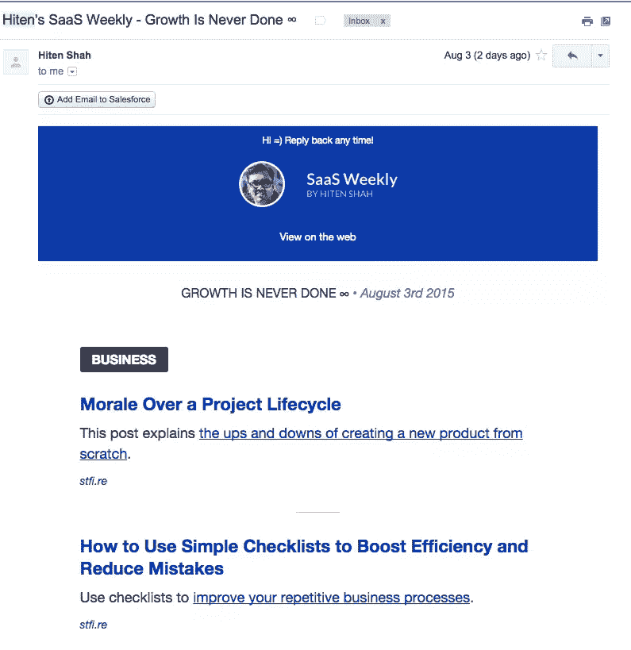

*有什么方法可以增强您的电子邮件营销来推广您的内容？*

#### Vimeo

YouTube 不是镇上唯一的节目。在线视频网站 Vimeo 拥有超过 1 亿用户和 40 万付费用户。我个人用它来举办我的课程和 T2 峰会。Vimeo 是关于建立社区的，观众往往都是追求质量的人。点击了解更多关于 [Vimeo 营销的信息。](http://unbounce.com/online-marketing/video-marketing-guide/)

#### Quora

问答网站 Quora 是一个分享知识的好地方。风险投资家(也是节目的前嘉宾)杰森·莱姆金在 Quora 上的浏览量已经超过 1000 万，并在软件即服务领域建立了一个非常强大的品牌，名为 [SaaStr](https://www.saastr.com/saastr-crosses-10-millions-views-on-quora/) 。

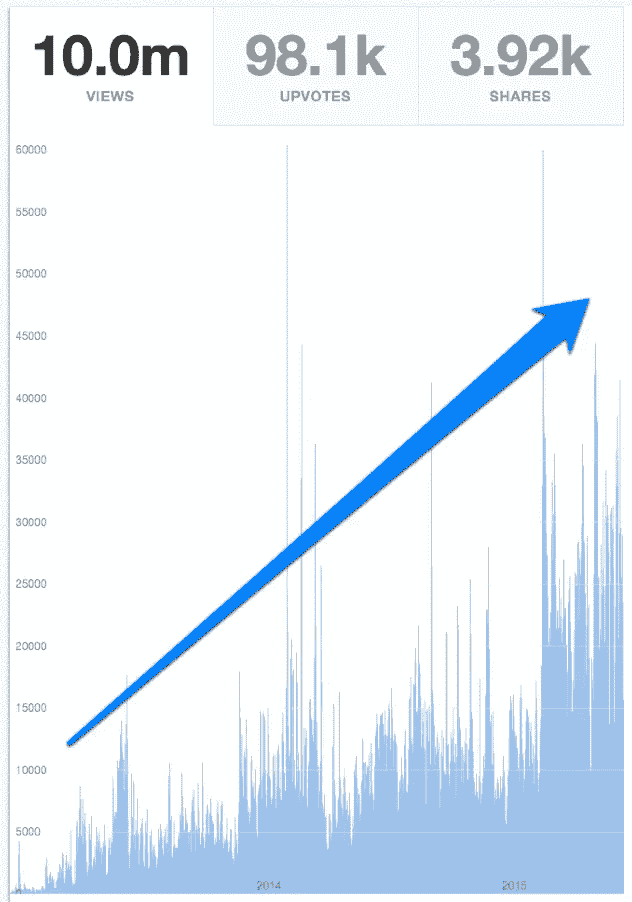

**他是这样做的:**

*   **成为先行者**——据我所知，Jason 是 Quora 上第一批就[获得牵引力](http://saastr.com/2013/01/24/how-youll-know-youve-got-first-traction-in-saas-the-moment-when-youve-got-something-special/)、[建立销售团队](http://saastr.com/2013/10/23/how-my-vp-sales-doubled-our-sales-in-90-days-no-it-wasnt-magic/)、[客户成功](http://saastr.com/2013/10/01/the-2-million-dollar-man-woman-how-to-think-about-scaling-your-customer-success-team/)、[高管生活](https://www.quora.com/When-should-a-CEO-of-a-startup-stop-doing-the-work-and-let-the-others-do-the-work/answer/Jason-M.-Lemkin)、招聘&留住人才等问题提供深刻答案的人之一。
*   保持一致——当我登录 Quora 时，我总是会看到 Jason 最近的一篇帖子。这都是关于一致性的(看看上面的图表就知道了)。他的“最佳”部分[也没有变小](http://www.saastr.com/the-best-of-saastr-our-top-100-posts-organized-by-topic-sales-marketing-customer-success-etc/)。
*   **分层数据**–在提供有用数据时，他毫不留情。他关于从[初始牵引到扩展](http://www.saastr.com/from-initial-traction-to-initial-scale-10m-in-arr-dont-get-killed-by-your-success/)的文章给了创业者非常具体的数字，他们需要达到这些数字才能真正达到下一个增长水平:
    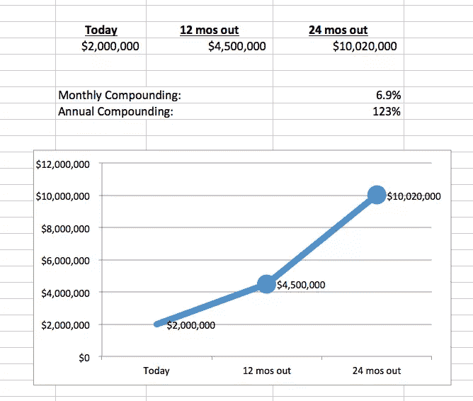
*   **不要害怕交叉发布或改变用途**——Jason 会习惯性地在回答中转贴一些相同的内容，因为这增加了价值。教训:不要害怕改变内容的用途。没有必要总是重新发明轮子。
*   **一旦你的社区建立起来，就为它做点什么**——SaaStr 年会最终诞生于他的所有努力。嘉宾包括 Box 首席执行官艾伦·列维、Slack 首席执行官斯图尔特·巴特菲尔德以及该领域的许多明星。与会者的质量非常好，我可以说这是我参加过的最好的会议之一…而且这只是第一次！

#### Google+讨论组

当然，谷歌可能已经放弃让 Google+成为脸书的竞争对手，但这并不意味着没有蓬勃发展的社区。例如，我的一个朋友向我推荐了“企业家、个体户”Google+群组，该群组经营着一个面向小企业的大型网站。一开始我对此表示怀疑，但订婚数字不会说谎:

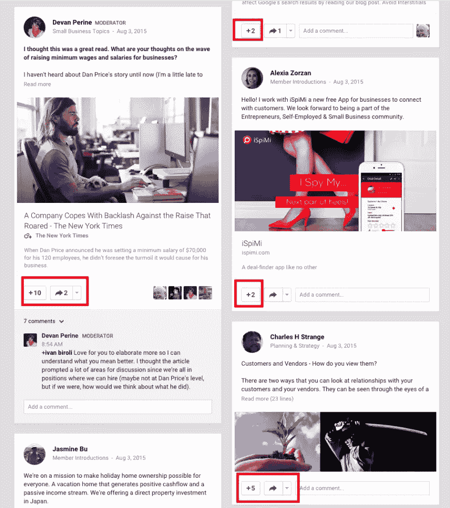

### 其他未开发的渠道

总是有新的平台出现。你需要在一周中抽出一些时间来策划如何增加你的流量。这里还有一些:

**Periscope**–直播流媒体社交媒体应用 [Periscope 拥有超过 380 年的每日消费内容](http://techcrunch.com/2015/05/28/periscope/)，在短短 10 天内点击量超过 100 万。德里克·哈尔彭(Derek Halpern)等营销人员最初认为 Periscope 很蠢，但现在认为它是[的下一件大事。这里有一个关于如何使用潜望镜的指南。](http://socialtriggers.com/how-to-use-periscope/)

每月有超过 1 亿人观看 Vine 视频。这里有一个[使用 Vine](http://content.photojojo.com/inspiration/websites/the-ultimate-guide-to-vine/) 的便捷指南。

据报道，消息应用 Snapchat 在 T2 拥有近 2 亿用户。这里有一份关于 Snapchat 的[营销人员指南。](http://marketingland.com/marketers-guide-snapchat-story-feature-117724)

**未开发的流量来源**–不太受欢迎的频道呢？那些大的被反复提及，它们很容易获得。但这也意味着他们可能会拥挤和昂贵。马特，一个喝醉了的家伙，[建立了一个完全无用的网站](http://www.hardcoreprawnlawn.com/)，每天吸引 3000 到 40000 的访问者。

看一看它。

确实如此。绝对的。没什么。

但是他能够进入通常的社交媒体泡沫之外的一个叫做[无用网络](http://www.theuselessweb.com/)的网站。他 90%的流量来自那个网站。

还有一点:在线并不是获得流量的唯一途径。一个非常成功的约会网站(4500 万美元/年)使用草坪标志来产生线下到线上的流量。所以要有创意。

### 调查你的听众

成功的内容扩展活动之后，工作还没有完成。之后都是迭代。你可以使用 SurveyMonkey 这样的工具来了解你的听众。例如，你可以让他们给你的具体内容打分，从 1 到 10 分不等，甚至可以问他们对哪些话题最感兴趣。

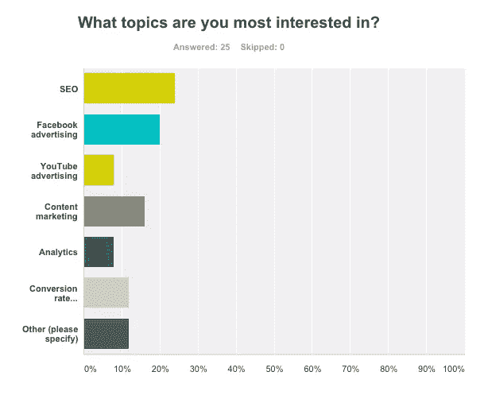

从那里，你会有一些数据，为你指出未来史诗内容想法的正确方向。

#### 其他资源:

[终极内容推广清单](http://jordanvh.com/portfolios/ultimate-content-promotion-checklist/)-一份简单、互动的内容推广清单，供您遵循。适应自己的需求。

[高级 SEO 活动蓝图](http://www.matthewbarby.com/seo-campaign-blueprint/)-内容和 SEO 齐头并进。如果你是做内容的，你就要理解 SEO 的细微差别。没有这张蓝图不要离开家。

【Nick Eubanks 如何使用 SEO 和内容快速建立一个每月 100，000 访问者的网站-不言自明。

广泛的关键词研究教程:

[//fast.wistia.net/embed/iframe/2821sn18f3#?secret=A38hboVnV1](//fast.wistia.net/embed/iframe/2821sn18f3#?secret=A38hboVnV1)

### 结论

我们都知道[内容营销有复合效应](http://tomtunguz.com/content-marketing-compounding-returns/)。让大多数内容与众不同的是常青树效应:

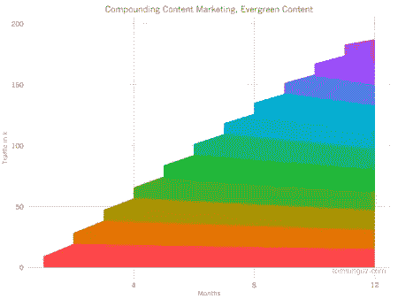

与时间效应相比:

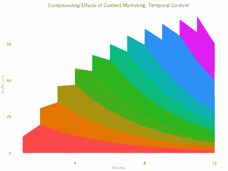

如果你能不断地扩展和重新利用你的内容，你就能创造出真正特别的东西。

## 分享这篇文章