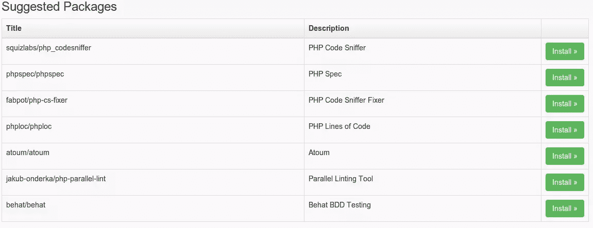
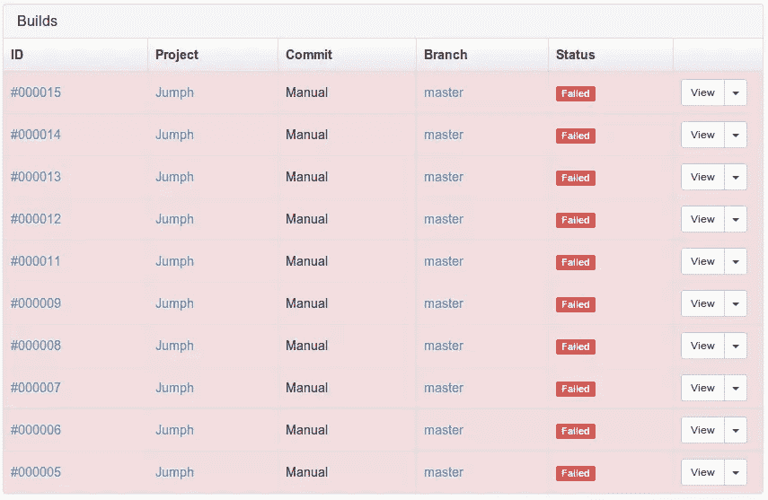
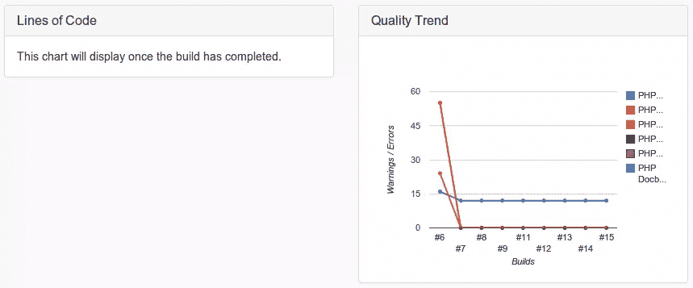
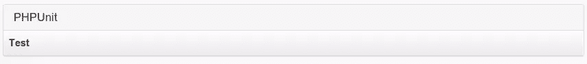
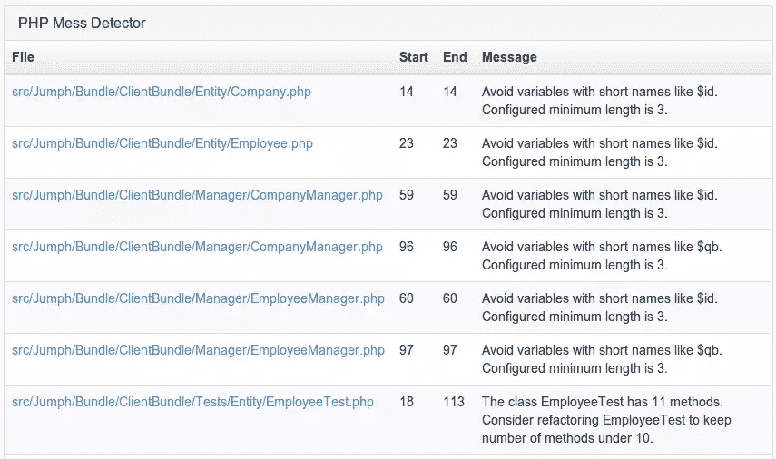
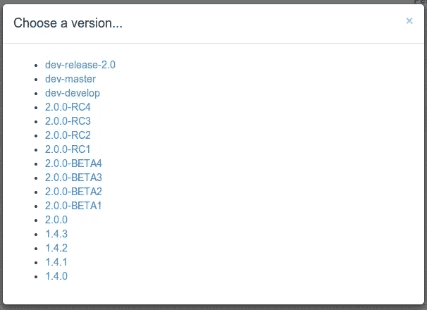

# 与 PHP-CI 的持续集成

> 原文：<https://www.sitepoint.com/continuous-integration-php-ci/>

创建应用程序是一回事。保持一定的质量水平完全是另一回事。现在，你可以找到很多工具来帮助你保持应用程序的质量。逐一运行这些工具可能非常耗时。为此，您可以安装所谓的持续集成(CI)服务。PHPCI 就是其中之一，在本文中，我们将深入研究它。

### 持续集成服务

持续集成服务是一个针对您的代码运行某些质量检查工具的应用程序。例如，配置项可以拉入您的 git 存储库。完成后，它运行单元测试，检查您的代码进行验证，并基于它生成报告。一般来说，配置项会在特定的时间间隔或每次推送时运行。最常见的情况是在创建合并请求之后。通过检查合并请求，代码在被合并之前被检查，确保您没有接受可能破坏功能的代码。因此，将 CI 集成到您的开发过程中可以确保不良代码被排除在您的主存储库之外，并且您可以在接受更改之前自动验证一切是否符合您的要求。

### 装置

安装有两种不同的方式。要么你[下载](https://github.com/Block8/PHPCI/releases)最新版本，要么你遵循[安装指南](https://github.com/Block8/PHPCI/wiki/Installing-PHPCI)。我决定按照安装指南并通过 Composer 安装它。运行`composer update`之后，您可以运行安装脚本。您将被询问数据库凭证和您的电子邮件地址。完成后，将使用给定的电子邮件地址创建一个用户。

您还需要设置一个 cronjob，以便自动运行构建。

### 设置

取决于你想做什么，你必须安装一些工具。登录后可以进入`admin` `manage plugins`安装任何需要的插件。通过安装一个插件，你正在用新的需求更新`composer.json`文件。所以在你安装完插件后，你需要运行`composer update`来安装这些插件。



### 添加项目

通过点击标题中的`add project`按钮，您可以创建一个新项目。你必须填写一张简单的表格，标明代码的位置。你可以选择不同种类的服务，比如 Github 和 Bitbucket，也可以选择你自己的远程或本地 URL。如果您的存储库中没有`phpci.yml`配置文件，那么您需要提供构建配置。在他的配置中，您定义项目需要如何设置，您想要运行哪些工具，以及如何完成构建。

每个构建过程包括 5 个阶段。

1.  设置。所有东西都被初始化的阶段
2.  测试。执行所有测试的阶段
3.  完成。无论成功还是失败，这一部分将一直运行
4.  成功。只有在成功的情况下才会运行
5.  失败。仅在失败时运行

我将使用[这个项目](https://github.com/jumph-io/Jumph)作为我们的项目。我们想忽略默认目录，如`app`和`vendor`。安装将通过 Composer 完成。该项目应该是 PSR2 兼容，有单元测试，并包含体面的文件块。我们还想通过运行 PHPMD、PHPCPD 和 PHPLoc 来检查整体质量是否良好。

PHPCI 能够处理测试数据库。然而，我们在例子中使用的项目没有任何功能测试，所以我们将省略 MySQL 连接。

让我们看看配置会是什么样子。

```
build_settings:
    ignore:
        - "vendor"
        - "bin"
        - "app"

setup:
    composer:
        action: "install"

test:
    php_unit:
        config:
            - "app/phpunit.xml.dist"
        coverage: "coverage"
        args: "--stderr"
    php_mess_detector:
        allow_failures: true
    php_code_sniffer:
        standard: "PSR2"
    php_cpd:
        allow_failures: true
    php_docblock_checker:
        allowed_warnings: 10
        skip_classes: true
    php_loc:
        directory: "src"
```

创建项目后，您必须确保 PHPCI 能够从 Github 检索项目。在本例中，我将 PHPCI 提供给我的 SSH 密钥添加到我的 Github 帐户中。完成后，您可以单击 build 按钮开始构建项目。

### 构建结果

当构建完成时，项目将获得一个与概览页面上的状态相匹配的颜色。您可以清楚地看到先前的构建、最近的提交和当前的分支。通过点击一个构建的 ID，您可以看到该构建的深入结果。



是时候仔细看看单个构建的结果了。在页面顶部附近，您应该能够看到两个小图表。一个将指示代码行，而另一个将显示质量趋势。质量趋势图包含了所有工具的概述，比如 PHPMD 和 PHPCPD。


*不幸的是，我无法让 PHPLoc 正常工作*

在图表下方，我们可以看到每个工具的深度结果。例如，我们可以看看单元测试。在这种情况下，我意识到他们应该成功的事实。在 PHPCI 中，情况也是如此。PHPCI 通过将表留空来表明这一点。



如果出现故障，PHPCI 将通过从工具中检索反馈来清楚地指出问题所在。在我的例子中，PHPMD 有一些他们认为可以改进的地方。PHPCI 显示了哪个文件和消息是什么。接下来，我可以点击文件直接进入我的 Github 库。



我使用的所有工具都以同样的方式反馈给我。空的表是成功的，被填充的表有一些改进。

## 结论

当然，PHPCI 可以做的不仅仅是上面描述的。如果你对它的所有特性都感兴趣，可以看看他们的[文档](https://github.com/Block8/PHPCI/wiki)。基本上，它可以使用任何你知道的 PHP QA 工具。

那么，我的最终结论是什么？我过去一直在使用许多工具。一年前，我确信没有单一的工具可以打败詹金斯。直到今天，我仍然相信 Jenkins 是最好的 CI 工具之一。Jenkins 能够运行各种项目，不仅仅是基于 PHP 的项目。对我来说，当你处理 JS、iOS 和 Java 应用时，这是一个巨大的优势。Jenkins 功能齐全，包含许多插件，能够创建关于项目质量的漂亮图表。它只是缺少一个漂亮的结构化设计和简单的配置。

我也喜欢与[审查员](https://scrutinizer-ci.com/)和[感官实验室洞察力](https://insight.sensiolabs.com/)结合的[崔维斯](https://travis-ci.org/)。他们可以一起给我很多关于代码的反馈，并运行各种检查。然而，如果你不使用开源项目，你必须为这三个服务付费以保证它们的运行。

那么，PHPCI 是这一系列工具中的一个好的补充吗？是的，我想是的。他们真的试图瞄准 PHP 社区，并提供一个单一的地方，运行各种检查。除此之外，它已经可以生成一些图表来快速概述您的项目质量。

别忘了，PHPCI 还不到一岁，这是你会注意到的。安装一个插件需要你运行`composer update`，也就是说你还是要登录你的服务器。此外，设计有时真的是关闭，尤其是当你安装一个软件包，你需要选择一个版本。



我想看一些关于某些主题的更有帮助的信息。很高兴知道您必须填写一个配置文件，但是如果它能够向您展示可能性或者至少添加一个到文档的链接，那将会非常有帮助。您甚至可能想知道为什么文档没有集成到工具本身中。

最让我沮丧的是，我在控制台中收到了类似于`Plugin Status: Success`和`Plugin Status: Failed`的消息，而构建给了我一个空表。


我认为这意味着它无法运行像 PHPUnit 这样的工具。但是它告诉你 PHPUnit 实际上是成功了还是失败了。一个成功也导致一个空表，所以你在 PHPCI 本身基本上没有反馈。如果它只是说“一切都好”这样的话就好了。继续前进！”或者至少给了我 PHPUnit 的结果。

最后，很高兴看到开发人员也在用定制工具扩展它。例如，他们创建了一个 [docblock 插件](https://github.com/Block8/php-docblock-checker)。目前，我认为它只检查文档块是否存在。如果他们能在未来检查所有的文档块以匹配即将到来的 [PSR-5](https://github.com/php-fig/fig-standards/pull/169) 标准，那就太好了。

如果你不想设置 Jenkins 或者你有一个私人项目，并且你只开发 PHP 项目，PHPCI 可能是你正在寻找的工具。就我个人而言，我会等待更长的时间，直到他们改进应用程序的设计，然后再将其用于实际项目。因为设计不清晰或者没有正确的描述，有时候感觉有点笨重。

您目前是否在使用 CI 工具？您认为 PHPCI 可以取代您当前的 CI 吗？我很乐意在下面的评论中听到你的意见。

## 分享这篇文章