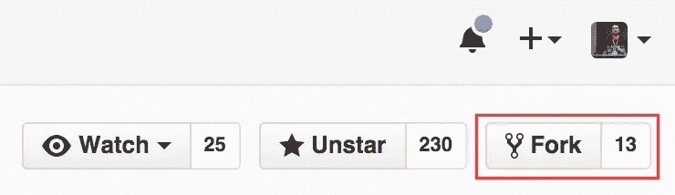
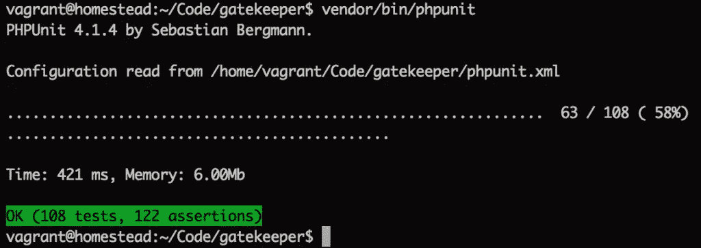
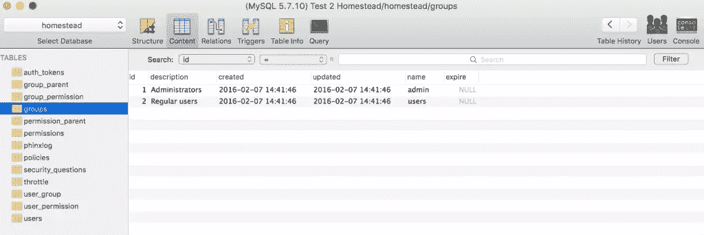
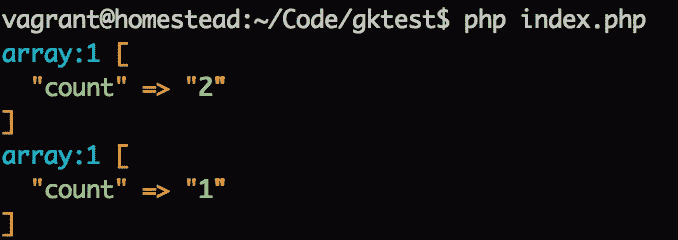
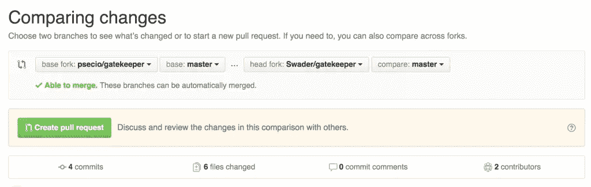
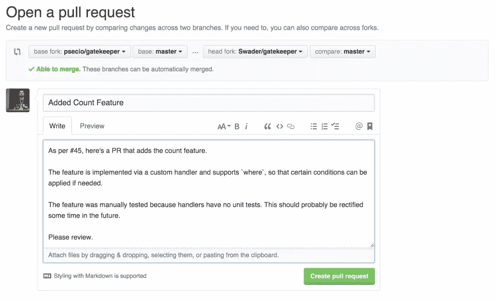

# 为开源做贡献:看门人案例研究

> 原文：<https://www.sitepoint.com/contributing-to-open-source-gatekeeper-case-study/>

GateKeeper 是一个非常漂亮的用户注册、认证和授权库，它使用自己的数据库来存储和查询用户记录。这意味着它与您的主应用程序完全分离(因此，本质上，您可以将 Postgre 或 Mongo 用于您的业务逻辑，而将 MySQL 等完全不同的引擎用于基本用户记录)，并且易于调整和扩展。


在我们关于[the skeleton no-framework project][nowf]的帖子中清楚地展示了该库的使用示例，这是一个完全由 Composer 包组成的示例应用程序，其行为就像一个框架驱动的应用程序，但完全没有任何框架耦合。

然而，这篇文章不是关于看门人本身的。这是关于为开源做贡献，并以正确的方式去做。

在本教程中，我们将用一个`count`特性来扩展 GateKeeper。目前，为了找出数据库中的用户总数，必须获取所有用户，然后对他们进行计数——要么这样做，要么编写一个查询来手动完成。但是，如果将它内置到适配器接口中可能会更好，这样它不仅是一个本机特性，而且也是未来添加的数据库引擎的一个要求。

## 第一步:询问主人

为开源做贡献的第一步是做尽职调查。这可以简单到向回购所有者询问该功能的状态，以确保它不是计划中的，而是实际上是可取的。回购中的一个问题往往就足够了，这在[这个案例](https://github.com/psecio/gatekeeper/issues/45)中显而易见。

## 步骤 2:派生、克隆、测试

*注意:如果您想跟进，请复制一个旧版本的 Gatekeeper，它还没有这个功能。[这个](https://github.com/psecio/gatekeeper/releases/tag/2.9.2)应该行。*

首先，让我们分叉回购，以便我们可以开始工作。



接下来，我们需要建立一个开发环境来处理这个包。自然地，我们用我们可信赖的[家园改良](https://www.sitepoint.com/quick-tip-get-homestead-vagrant-vm-running/)为此。一旦虚拟机设置完毕并登录，我们就可以克隆我们的分支，安装依赖项并运行测试:

```
git clone https://github.com/swader/gatekeeper
cd gatekeeper
composer install
vendor/bin/phpunit 
```

所有测试都应该是绿色的:



此时，最好为我们将要进行的所有更改创建一个单独的分支。

```
git checkout -b "feature-count" 
```

## 步骤 3:行动计划

Gatekeeper 目前只支持 MySQL——这让我们的工作变得简单了一点，但仍然很重要。尽管只支持单一类型的数据源(目前)，抽象和接口类仍然需要更新，因为它们的编写考虑到了未来与不同数据源的兼容性。

因此，我们需要修改:

*   `Gatekeeper/DataSource`–抽象数据源类
*   包含我们实际使用的方法的 MySQL 数据源
*   `DataSource/Stub`——升级用来编写其他数据源的存根，这样其他贡献者就知道他们也需要一个`count`方法

我们还需要创建一个新的`Count`处理程序，因为 Gatekeeper 使用神奇的静态调用来创建、查找、更新和删除实体，根据被调用方法的名称将它们转发给适当的处理程序。例如，参见`Gatekeeper/Gatekeeper.php`中的`__callStatic`魔法方法，以及它如何将方法调用委托给像`Handler/Create.php`或`Handler/FindBy.php`等处理程序。

## 第四步:做就是了

### 委派静态调用

为了为我们的定制`Count`处理程序准备基础，我们将静态调用委托给它，并向前传递参数和数据源。这都是通过简单地给`Gatekeeper::__callStatic`增加另一个`elseif`模块来完成的:

```
 } elseif ($action == 'count') {
            $action = new \Psecio\Gatekeeper\Handler\Count($name, $args, self::$datasource);
        } 
```

因为我们添加了一个新动作，所以我们也需要修改静态属性`$actions`:

```
 /**
     * Allowed actions
     * @var array
     */
    private static $actions = array(
        'find', 'delete', 'create', 'save', 'clone', 'count'
    ); 
```

### 计数处理程序

然后我们在文件`Psecio/Gatekeeper/Handler/Count.php`中创建处理程序:

```
<?php

namespace Psecio\Gatekeeper\Handler;

class Count extends \Psecio\Gatekeeper\Handler
{
    /**
     * Execute the object/record count handling
     *
     * @throws \Psecio\Gatekeeper\Exception\ModelNotFoundException If model type is not found
     * @return int Count of entities
     */
    public function execute()
    {
        $args = $this->getArguments();
        $name = $this->getName();

        $model = '\\Psecio\\Gatekeeper\\' . str_replace('count', '',
                $name) . 'Model';
        if (class_exists($model) === true) {
            $instance = new $model($this->getDb());

            $count = (!$args) ? $this->getDb()->count($instance) : $this->getDb()->count($instance,
                $args[0]);
            return (int)$count['count'];
        } else {
            throw new \Psecio\Gatekeeper\Exception\ModelNotFoundException(
                'Model type ' . $model . ' could not be found'
            );
        }
    }
} 
```

它几乎与`Create`处理程序相同，除了底部的不可到达的`return`语句(我已经删除了它)、主体中的小改动以及对类描述的小改动。

### 数据源和存根

接下来，让我们把容易的都解决掉。

在`Psecio/Gatekeeper/DataSource/Stub.php`中，我们添加了一个新的空白方法:

```
 /**
     * Return the number of entities in DB per condition or in general
     *
     * @param \Modler\Model $model Model instance
     * @param array $where
     * @return bool Success/fail of action
     * @internal param array $where "Where" data to locate record
     */
    public function count(\Modler\Model $model, array $where = array()){} 
```

然后，我们在摘要中添加一个类似的签名:

```
 /**
     * Return the number of entities in DB per condition or in general
     *
     * @param \Modler\Model $model Model instance
     * @param array $where
     * @return bool Success/fail of action
     * @internal param array $where "Where" data to locate record
     */
    public abstract function count(\Modler\Model $model, array $where = array()); 
```

所有这些都完成后，是时候编写负责计数的实际逻辑了。

### 关系型数据库

现在是时候改变`DataSource/MySQL.php`了。我们将在`find`方法下添加`count`方法:

```
 /**
     * Find count of entities by where conditions.
     * All where conditions applied with AND
     *
     * @param \Modler\Model $model Model instance
     * @param array $where Data to use in "where" statement
     * @return array Fetched data
     */
    public function count(\Modler\Model $model, array $where = array())
    {
        $properties = $model->getProperties();
        list($columns, $bind) = $this->setup($where);

        $update = array();
        foreach ($bind as $column => $name) {
            // See if we keep to transfer it over to a column name
            if (array_key_exists($column, $properties)) {
                $column = $properties[$column]['column'];
            }
            $update[] = $column.' = '.$name;
        }

        $sql = 'select count(*) as `count` from '.$model->getTableName();
        if (!empty($update)) {
            $sql .= ' where '.implode(' and ', $update);
        }

        $result = $this->fetch($sql, $where, true);
        return $result;
    } 
```

从上面类似的`find`方法中获取逻辑，我们的`count`方法执行以下操作:

1.  获取相关模型中定义的属性(例如，参见`UserModel::$properties`)
2.  将通过`$where`传入的值分成列和它们的值
3.  通过查看`properties`来构建查询的`WHERE`部分，查看其中是否有与被请求的名称不同的名称(例如，被请求的`FirstName`有一个与`first_name`相对应的数据库)
4.  构建整个查询
5.  在`true`上使用强制`single`模式执行(参见`fetch`方法),因为我们只期望返回一个值——一个指示计数的整数。
6.  返回计数。

## 第五步:测试

通常，会有一个单元测试阶段。这超出了本教程的范围，我鼓励你去看看本教程。如果有足够的兴趣看到为这个包开发的单元测试，我们当然会接受。请在评论中告诉我们。

### 实现实验版本

让我们做一个手工测试。首先，我们将提交并在网上推广我们的工作。

```
git add -A
git commit -m "Adding count feature"
git push origin feature-count 
```

这些变化现在将在我们的叉子，在线。然后，让我们继续在另一个文件夹中用下面的`composer.json`文件创建一个全新的项目:

```
{
    "require": {
        "psecio/gatekeeper": "dev-master"
    },
    "repositories": [
        {
            "type": "vcs",
            "url": "https://github.com/swader/gatekeeper"
        }
    ]
} 
```

使用 Composer 的[存储库](https://getcomposer.org/doc/05-repositories.md)特性，我们可以确保 Composer 获取我们的 Gatekeeper 副本而不是原始副本，同时仍然认为它拥有原始副本——这允许我们测试我们的更改，就像在使用 Gatekeeper 的真实项目中一样——在这一点上，可以说这是比单元测试更现实的测试场景。保存并退出该文件，然后运行:

```
composer require symfony/var-dumper --dev 
```

这将同时安装上面定义的定制包和 Symfony 的 VarDumper 以便于调试。在安装过程中，你可能会被要求提供 Github 令牌——如果是这种情况，只需按照说明进行操作。

瞧，如果我们现在看一下`Gatekeeper`主类内部，我们会看到我们的`count`更新都在那里。接下来，让我们通过执行`vendor/bin/setup.sh`并遵循说明来遵循典型的网关守护设备安装程序。如果你使用的是[宅地改良](https://www.sitepoint.com/quick-tip-get-homestead-vagrant-vm-running/)，只需输入默认值(`localhost`、`homestead`、`homestead`、`secret`)。

### 测试

现在让我们创建一个用于测试的`index.php`文件:

```
<?php

require_once 'vendor/autoload.php';

use Psecio\Gatekeeper\Gatekeeper;
Gatekeeper::init('./');

$groups = [
    'admin' => 'Administrators',
    'users' => 'Regular users'
];

foreach ($groups as $name => $description) {
    if (!Gatekeeper::findGroupByName($name)) {
        Gatekeeper::createGroup([
            'name' => $name,
            'description' => $description
        ]);
    }
} 
```

我们激活自动加载器，初始化 Gatekeeper(它使用我们文件夹根目录下的`.env`文件作为凭证)，并设置两个默认组。



然后，让我们继续测试各组的计数情况:

```
dump(Gatekeeper::countGroup());
dump(Gatekeeper::countGroup(['id' => 1])); 
```

果然有效。



现在来测试用户。

```
Gatekeeper::countUser(); 
```

这精确地产生了 0 的计数。现成应用程序的一个常见用例是在创建用户时查看数据库中是否没有用户，然后授予新用户 Admin 权限。系统的第一个用户通常被认为是它的所有者，所以设置超级用户帐户很方便。就这么办吧。

```
Gatekeeper::createUser([
    'username' => 'bruno-admin',
    'first_name' => 'Bruno',
    'last_name' => 'Skvorc',
    'email' => 'bruno.skvorc@sitepoint.com',
    'password' => '12345',
    'groups' => (Gatekeeper::countUser()) ? ['users'] : ['admin']
]);

Gatekeeper::createUser([
    'username' => 'reg-user',
    'first_name' => 'Reggie',
    'last_name' => 'User',
    'email' => 'reg@example.com',
    'password' => '12345',
    'groups' => (Gatekeeper::countUser()) ? ['users'] : ['admin']
]);

dump(Gatekeeper::findUserByUsername('bruno-admin')->groups[0]->name);
dump(Gatekeeper::findUserByUsername('reg-user')->groups[0]->name); 
```

果然输出准确——屏幕上打印的第一组是`admin`，第二组是`users`。

随着计数机制的正确实现，是时候提交一个 pull 请求了。

### 提交采购申请

首先，我们去我们自己的项目分支。然后，我们单击“New Pull Request”按钮。在下一个屏幕上，一切都应该是绿色的，用户界面应该显示“能够合并”:



单击“Create Pull Request”按钮后，我们应该添加一个尽可能详细的标题和描述，最好参考上面第 1 步中的问题。



就这样——点击“创建拉动式请求”按钮，事情就结束了——我们现在所能做的就是等待项目负责人的反馈。

## 结论

这是一个为相对流行的 PHP 包做贡献的案例研究。我希望它能作为一个有用的学习材料和一个基本的回馈指南，以及为你所用的东西添加功能的过程。

值得注意的是，虽然这是一个常见的过程，正如我之前提到的，但它并不常见，因为它没有单元测试。然而，原始库也没有测试处理程序，为处理程序和它们可以与之交互的数据创建一个模仿框架超出了本文的范围。同样，如果你对这一过程感到好奇，并希望我们深入探讨，请在下面的评论中让我们知道你喜欢这个按钮。

还应该注意的是，虽然这是一个非常简单的功能升级，但有时事情不会按照计划进行，并且这些更改不会在测试它们的新项目中立即生效。在这种情况下，例如，可以在测试项目的`vendor`文件夹中进行更改，直到一切正常，复制到开发项目，在线推送，然后重新安装到测试项目中，以确保一切仍然正常。

有自己的投稿故事分享吗？请告诉我们——我们很乐意探索它们！

## 分享这篇文章