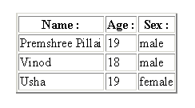

# 在 Internet Explorer 中使用表格数据控件

> 原文：<https://www.sitepoint.com/control-internet-explorer/>

**在网页中，可以使用“ActiveX 控件”和“Java 小程序”创建用于执行各种任务的对象实例。使用`<OBJECT>` HTML 标签将这些对象插入到网页中。每个对象都有一个 32 位的唯一标识符，它被插入到`<OBJECT>`标签的`CLASSID`属性中。**

##### 表格数据控制

“表格数据控件”是内置于 Microsoft Internet Explorer 中的 Microsoft ActiveX 控件。使用这个对象，可以从 ASCII(通常我们使用。txt 扩展名)文件转换成 HTML 元素。

例如，如果我们有一个包含 3 个字段(与数据库中的列同义)的文本文件，并且这些字段由一个字符分隔，那么可以将这些字段的值提取到一个 HTML 页面中。

如果我们有相对少量的数据，我们需要经常更新这些数据，并且我们需要客户端脚本，那么这个对象非常有用。在这种情况下，控件就像一个小型数据库。

表格数据控件在 Internet Explorer 4 及更高版本中可用。这个控件的唯一缺点是，它是一个 ActiveX 控件，只有 Internet Explorer 支持它(Netscape 需要一个插件)。

在下面的例子中，你会注意到我提到了特定的文件名。这些引用了包含在本教程代码档案中的文件，您可以从这里下载。

##### 履行

ActiveX 控件使用`<OBJECT>`标签初始化。表格数据控件的`CLASSID`(唯一标识符)为:

```
CLSID:333C7BC4-460F-11D0-BC04-0080C7055A83
```

因此，我们在网页中初始化该控件，如下所示:

```
<OBJECT ID="SomeID" CLASSID="CLSID:333C7BC4-460F-11D0-BC04-0080C7055A83"> 

..... 

..... 

..... 

</OBJECT>
```

像 applet 一样，任何对象都有许多参数，这些参数是使用`<PARAM>`标签指定的。表格数据控件大约有 7 个参数，但是在这里，我将只讨论其中比较重要的参数:

*   **`DataURL`**–包含数据的文件的路径，例如“data.txt”。
*   **`UseHeader`**–设置为`true`时，表示我们要用字段名来引用某个特定的字段。通常我们将其设置为`true`，但是在一些应用中，可能不需要字段名(标题)。默认值为`false`。
*   **`TextQualifier`** –一串文本开头和结尾的字符，用于限定该文本。比如这里的`~My name is Premshree~`，`TextQualifier`就是`~`。
*   **`FieldDelim`**–字段分隔符用于区分数据文件的不同数据字段。例如，考虑一个数据文件，其中有姓名、年龄和性别字段。这些字段的值将被写成`*SomeName*|*SomeAge*|*SomeSex*`。这里，使用的字段分隔符是“`|`”，我使用了“`*`”作为文本限定符。

因此，完整的初始化将如下所示:

```
<OBJECT ID="SomeID" CLASSID="CLSID:333C7BC4-460F-11D0-BC04-0080C7055A83"> 

  <PARAM NAME="DataURL" VALUE="YourDataFile.txt"> 

  <PARAM NAME="UseHeader" VALUE="TRUE"> 

  <PARAM NAME="TextQualifier" VALUE="~"> 

  <PARAM NAME="FieldDelim" VALUE="|"> 

</OBJECT>
```

参数名称不区分大小写。

`TextQualifier`和`FieldDelim`参数可以是任何字符。选择一个您不太可能在文本中使用的字符。

##### 例子

在这些例子中，我将使用文本限定符作为“`~`”，字段分隔符作为“`|`”。我使用。txt 扩展名，但是您可以使用任何您喜欢的扩展名。

首先，让我们考虑一个简单的例子，我将我的姓名和年龄存储在文本文件 data1.txt 中。事情是这样的:

```
name|age 

~Premshree Pillai~|~19~
```

现在，我将提取这些数据并显示在网页 data1.htm 中，如下所示:

```
<OBJECT ID="data1" CLASSID="CLSID:333C7BC4-460F-11D0-BC04-0080C7055A83"> 

  <PARAM NAME="DataURL" VALUE="data1.txt"> 

  <PARAM NAME="UseHeader" VALUE="TRUE"> 

  <PARAM NAME="TextQualifier" VALUE="~"> 

  <PARAM NAME="FieldDelim" VALUE="|"> 

</OBJECT> 

<SPAN DATASRC="#data1" DATAFLD="name"></SPAN> 

<SPAN DATASRC="#data1" DATAFLD="age"></SPAN>
```

输出将显示:`Premshree 19`

注意带有`SPAN`标签的属性。`DATASRC`指定要使用的数据源，它与我们已经初始化的对象的 ID 相同(这里，`data1`)。`DATAFLD`属性指定了我们想要显示的数据的字段。如你所见，数据文件 data1.txt 有两个字段“姓名”和“年龄”。将 `DATAFLD`指定为`name`将显示名称。

注意，使用上面的方法，您可以将数据从文本文件提取到任何 HTML 元素中；但是上面的方法效率很低，因为如果我们的数据文件包含不止一个条目，我们就不能直接提取所有的值。

在这些情况下，我们使用`<TABLE>` 标签。标签有一个特殊的属性，我们将在下面的例子中看到。

考虑一个简单的例子，我们在一个文本文件中存储三个人的姓名、年龄和性别。现在，我们希望提取这些数据，并以表格形式显示在 Web 页面上。

文本文件 data2.txt 如下所示:

```
name|age|sex 

~Premshree Pillai~|~19~|~male~ 

~Vinod~|~18~|~male~ 

~Usha~|~19~|~female~
```

现在，我们可以提取上述所有数据，并通过 data2.htm 以表格形式显示出来，如下所示:

```
<OBJECT ID="data2" CLASSID="CLSID:333C7BC4-460F-11D0-BC04-0080C7055A83"> 

  <PARAM NAME="DataURL" VALUE="data2.txt"> 

  <PARAM NAME="UseHeader" VALUE="TRUE"> 

  <PARAM NAME="TextQualifier" VALUE="~"> 

  <PARAM NAME="FieldDelim" VALUE="|"> 

</OBJECT> 

<TABLE DATASRC="#data2" BORDER="2"> 

<THEAD> 

  <TH>Name :</TH> 

  <TH>Age :</TH> 

  <TH>Sex :</TH> 

</THEAD> 

<TR> 

  <TD><SPAN DATAFLD="name"></SPAN></TD> 

  <TD><SPAN DATAFLD="age"></SPAN></TD> 

  <TD><SPAN DATAFLD="sex"></SPAN></TD> 

</TR> 

</TABLE>
```

输出将如下所示:



因此，我们只在 3 个不同的`<TD>` 标签(列)中指定了三个数据字段(`DATAFLD`)。网页自动显示所有 3 组值(3 行)。

我们可以向文本文件中添加任意多的内容，并且不需要对提取这些值的 HTML 代码进行任何修改。

##### 表格数据控件和 JavaScript

可以使用 JavaScript 操纵表格数据控件对象。在第一个例子中，`<SPAN>`元素显示了数据文件的第一个条目。现在，假设我们向文件中添加另一个条目；数据文件(data1.txt)现在看起来像这样:

```
name|age  

~Premshree Pillai~|~19~  

~Vinod~|~18~
```

现在，如果我们想看第二个条目(即 Vinod 18)，我们可以这样做:

```
<OBJECT ID="data1" CLASSID="CLSID:333C7BC4-460F-11D0-  

BC04-0080C7055A83">  

  <PARAM NAME="DataURL" VALUE="data1.txt">  

  <PARAM NAME="UseHeader" VALUE="TRUE">  

  <PARAM NAME="TextQualifier" VALUE="~">  

  <PARAM NAME="FieldDelim" VALUE="|">  

</OBJECT>  

<SCRIPT LANGUAGE="JavaScript">  

/* Get the complete data record set */  

var dataSet=data1.recordset;  

/* Go to next data */  

dataSet.moveNext();  

</SCRIPT>  

<SPAN DATASRC="#data1" DATAFLD="name"></SPAN>  

<SPAN DATASRC="#data1" DATAFLD="age"></SPAN>
```

现在，输出将是:Vinod 18

上面的脚本相当简单明了。最初，我们使用记录集方法将数据文件的全部数据存储在一个变量数据集中。`moveNext()`方法指向下一个数据项(下一行)。可以使用的一些其他方法有:

*   `moveFirst()` –指向第一个数据项(第一行)
*   `moveLast()` –指向最后一个数据项(最后一行)
*   这个属性用来检查我们是否到达了文件的末尾。

现在，我将用一个更动态的例子来结束这篇文章。我将创建一个 JavaScript Ticker，显示大量消息，每条消息都指向一个特定的 URL。在这里，ticker 将从一个文本文件(来自存档的 tickerData.txt)中读取它的消息和相应的 URL。为了全面理解这段代码，您必须熟悉动态 HTML 技术。

以下是 tickerData.txt 文件:

```
~message~|~messageURL~  

~SitePoint.com~|~http://www.sitepoint.com~  

~WebmasterBase~|http://www.webmasterbase.com~  

~BBC News~|http://www.bbc.co.uk~
```

以及 tickerStyle.css 文件:

```
.tickerStyle{font-family:verdana,arial,helvetica; color:#666699;   

font-weight:bold; font-size:8pt; background:#EEEEFF;   

border-right:#666699 solid 2px; border-left:#666699 solid 1px;   

border-top:#666699 solid 1px; border-bottom:#666699 solid 2px;   

padding:3px; width:400px; text-align:center; text-decoration:none}  

.tickerStyle:hover{font-family:verdana,arial,helvetica;   

color:#666699; font-weight:bold; font-size:8pt; background:#DDDDEE;   

border-right:#666699 solid 1px; border-left:#666699 solid 2px;   

border-top:#666699 solid 2px; border-bottom:#666699 solid 1px;   

padding:3px; width:400px; text-align:center; text-decoration:none}
```

最后，ticker.htm:

```
<html>  

<head>  

<title>JavaScript Ticker (using Tabular Data Control)</title>  

<link rel="stylesheet" href="tickerStyle.css">  

<script language="JavaScript">  

// JavaScript Ticker  

// - using Tabular Data Control  

// By Premshree Pillai  

/*   

  The Ticker function  

  objName : the ID of the object to be used as data source  

  maxMsgs : the number of messages in the data file  

  counter : to keep count of the messages  

  timeOut : delay (in milliseconds)  

*/  

function TDC_Ticker(objName, counter, maxMsgs, timeOut)  

{  

  try  

  {  

    eval('tickerSet=' + objName + '.recordset');  

    if(!tickerSet.EOF && counter<maxMsgs-1)  

    {  

      tickerSet.MoveNext();  

      counter++;  

    }  

    else  

    {  

      counter=0;  

      tickerSet.MoveFirst();  

    }  

    setTimeout("TDC_Ticker('"+objName+"','"+counter+"',  

'"+maxMsgs+"','"+timeOut+"')", timeOut);   

  }  

  catch(e)  

  {  

    alert('This Ticker works with IE 4+ only.');  

  }  

}  

</script>  

<!-- END JAVASCRIPT TICKER USING TABULAR DATA CONTROL -->  

</head>  

<body bgcolor="#FFFFFF">  

<!-- BEGIN TICKER PLACEMENT -->  

<center>  

<object id="ticker" classid="CLSID:333C7BC4-460F-11D0-BC04-0080C7055A83">  

  <param name="DataURL" value="tickerData.txt">  

  <param name="UseHeader" value="TRUE">  

  <param name="TextQualifier" value="~">  

  <param name="FieldDelim" value="|">  

</object>  

<a href="" datasrc="#ticker" datafld="messageURL" class="tickerStyle">  

  <span id="tickerDiv" datasrc="#ticker" datafld="message"></span>  

</a>  

<script language="JavaScript">  

var tickerMaxMsgs=3; // Maximum Messages in the Data File  

var tickerCount=tickerMaxMsgs;  

new TDC_Ticker('ticker',tickerCount,tickerMaxMsgs,2000); // Set the Ticker  

</script>  

</center>  

<!-- END TICKER PLACEMENT -->  

</body>  

</html>
```

## 分享这篇文章