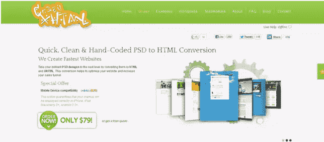
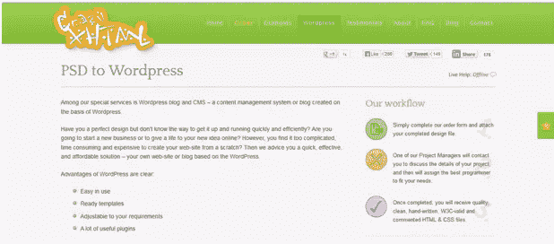

# 用 CrazyXhtml.com 把你的 PSD 文件转换成 HTML 代码

> 原文：<https://www.sitepoint.com/convert-psd-files-html-codes-crazyxhtml-com/>

这是我们在 CrazyXhtml.com 的好朋友赞助的帖子。希望它对一些设计师有用。

现在有很多工具可以让你轻松地创建网站，不需要任何编程知识。这些工具大部分都是免费的，可以让你在几分钟内建立并运行你的网站。但是仍然有人喜欢采取不同的方法。严肃的网站所有者通常不会为他们的网站使用默认模板。

他们首先雇佣一名设计师，并告诉他他们需要什么样的网站。设计师然后设计他们网站的图片，通常是用 Photoshop。然后，他们雇佣一个开发人员将图片、设计转换成一个功能齐全的网站。开发人员写下必要的代码并提交给客户。然后，客户将代码上传到在线主机上，网站就开始运行了。

我们建议您尝试使用[CrazyXhtml.com](http://craxyxhtml.com)进行 PSD 到 HTML 的转换。

CrazyXhtml.com 是一家位于捷克共和国布拉格的公司。他们创办了这家公司，因为他们想不出用自己的时间和精力做其他事情。他们由一群才华横溢的程序员组成，他们热衷于将设计编码成 HTML/CSS。

他们的专家非常了解当前的行业趋势和 HTML/CSS 技术。他们努力实现一切能让你的网站更快、更实用、更有趣的东西。他们手写所有的代码，不使用任何软件来自动生成代码。这种手写代码提高了准确性。

通过它们将设计转换成代码很简单，只需遵循以下三个步骤:

小心翼翼地填写他们的订单，并连同包含您设计的 zip 文件一起提交给他们。接受这些格式——<acronym>PSD</acronym>， <acronym>JPG</acronym> ， <acronym>GIF</acronym> ， <acronym>TIF</acronym> ， <acronym>PNG</acronym> ， <acronym>AI</acronym> ， <acronym>PDF</acronym> ， <acronym>CDR</acronym> ， <acronym>BMP</acronym> ， <acronym>INDD</acronym> ， <acronym>UFO</acronym> ， <acronym>EPS。</acronym>

T2 没必要预先付钱给他们。你可以事后付款。或者，如果你愿意，你可以预付 25%、50%或 100%的费用。他们会与你取得联系，并开始与你合作。

<acronym>3)</acronym> <acronym>很快你就会收到以 zip 格式存档的手写代码。</acronym>

如果您对代码有任何疑问或问题，您可以联系他们，他们会一直支持和帮助您，直到您完全满意为止。

如今，WordPress 是许多网站所有者在考虑网站创建时的必经之路。因此 CrazyXhtml.com 有一个独立的网页专门用于 WordPress。

很少有人知道 WordPress 不仅可以用作博客，还可以用作内容管理系统或 CMS。CrazyXhtml.com 兼顾了这两个方面。

他们的 PSD 到 WordPress 计划有以下特点:

*   主题和插件的安装
*   灵活方便地管理设置和主题选项
*   元盒集成简化了内容管理
*   为您轻松的现场操作提供培训和支持

所以去看看这个网站，在下面的评论中告诉我你的想法。

## 分享这篇文章