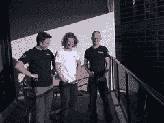
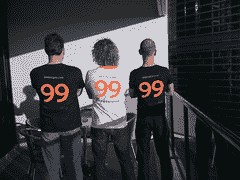

# 在 Web Directions South 的酷站点点 Schwag

> 原文：<https://www.sitepoint.com/cool-sitepoint-schwag-at-web-directions-south/>

如果你今年前往 [Web Directions South](http://south08.webdirections.org/) ，请务必留意 Team SitePoint。除了[出现在许多展板](https://www.sitepoint.com/learn-javascript-from-the-master-at-web-directions-south/)上，我们还会有很多人在人群中穿梭，分发大量免费的施瓦格——即一些“老忠实”[橙色](http://flickr.com/photos/gleddy/256029635/)和[蓝色 SitePoint t 恤](http://www.flickr.com/photos/chezzamonkey/418530357/)，以及一些全新的 99designs 白色 t 恤(还有一些限量版的黑色 t 恤)，如我们在酒店阳台上即兴举办的“让我成为超级模特”活动中的右图所示。

我们还准备了一大堆关于我们个人的书，并会很乐意分发给任何有兴趣听我们谈论一些我们目前提供的工作的人，所以请随意走上前去说声‘G’day。我们真的很喜欢与我们的读者和客户见面，我们一直在寻找有才华的人加入我们的团队。

我们挺过了围绕会议举行的众多社交活动中的第一个，即 Port80 meetup，并和悉尼的其他人一样对明天开始的会议感到兴奋。当然，如果你不能来，我们会通过这个博客为你提供会议亮点和会议总结。敬请期待！

## 分享这篇文章