# 使用 CodePen 和 JavaScript 可以做的 10 件很酷的事情

> 原文：<https://www.sitepoint.com/cool-things-codepen-javascript/>

嘿网民们！我在 [CodePen](http://codepen.io/) 工作，这是一个前端网页设计和开发的平台。你可以在 CodePen 上做的事情之一是创建 Pen，这是你创建的 HTML、CSS 和 JavaScript，你可以立即看到结果。Ty North 已经告诉了你一些使用 CodePen 的[理由，所以这一次，我想我会把重点放在一些你可以在 CodePen 上用 JavaScript 具体做的事情上。](https://www.sitepoint.com/9-reasons-should-using-codepen/)

## 1.快速添加您想要的任何库

每支笔都有自己的设置。在这里你可以设置你想要使用的外部 JavaScript。

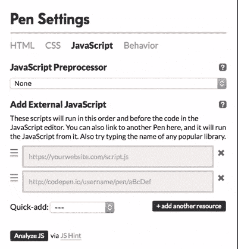

这就像从*快速添加*下拉菜单中选择一个库一样简单，或者更好，只需开始输入库，我们将提供匹配的选项。我们通过 typeahead 提供了数千个 CDN 托管的库。

## 2.在 ES2015 中写入

如果你像我一样，一步步进入【ES2015 新特性，你可以通过启用 Babel JavaScript 预处理器在 CodePen 上练习。

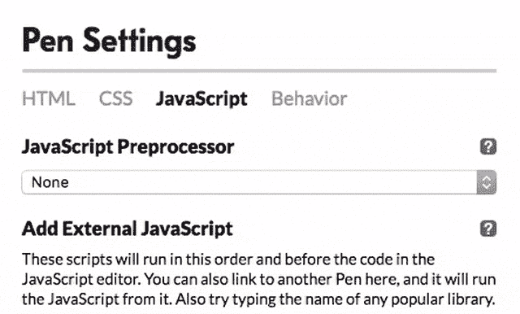

现在你可以使用 ES2015 的特性，Babel 会把它们处理成旧版本的 JavaScript，这样你写的东西在任何地方都可以用。

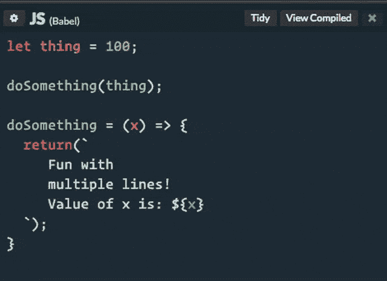

这里显示的是`let`关键字、一个箭头函数和模板文字。

您也可以使用 Babel 编写 ES2015 内容*而不使用*，但是您可能会遇到浏览器支持问题，就像您遇到任何其他前沿功能一样。

## 3.使用真实的控制台进行输出和调试

当然，你可以在 CodePen 上使用浏览器的 DevTools 控制台。但是你需要确保你将它的上下文设置为演示`<iframe>`，否则它将无法工作。

或者，您可以打开 CodePen 的内置控制台，它总是在正确的上下文中。

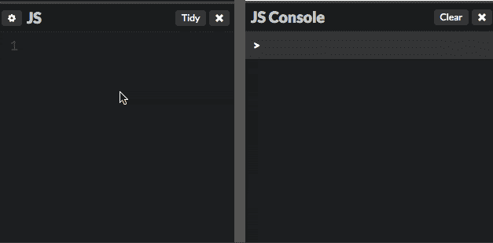

迷你小贴士！当您打开/关闭不同的代码面板时，您可能会注意到 URL 的变化。共有四个数字，分别代表 HTML、CSS、JS 和 Console(按此顺序)。所以 URL 参数:

```
?editors=0011 
```

代表 HTML 关闭，CSS 关闭，JavaScript 打开，控制台打开。传递一个`2`作为最后一个数字**可以最大化**控制台。通过这种方式，您可以共享一只笔，它的输出专门用于控制台。

## 4.使用反应和 JSX

令人惊叹的是，Babel 也支持 JSX 语法。通过添加 React 和 ReactDOM，您拥有了构建 React 的所有要素！

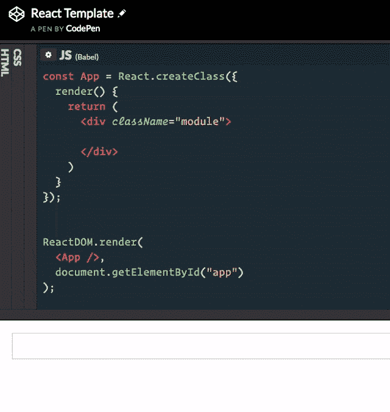

试试[打开这个模板](http://codepen.io/pen?template=yOmpBV)试试看。

除了 Babel，CodePen 还提供 CoffeeScript、TypeScript 和 LiveScript。TypeScript 也会处理 JSX！

## 5.包括其他笔作为资源

假设您想使用来自另一支笔的 JavaScript。你能做到的！只需在*外部 JavaScript* 中放下那支笔的网址，CodePen 就知道你的意思了。

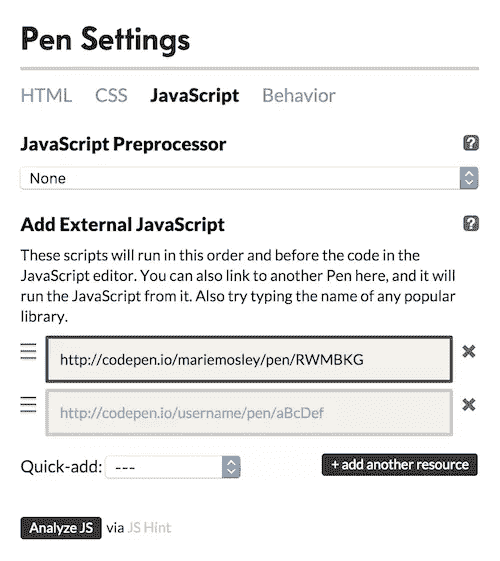

通过这种方式，您可以创建多个使用相同 JavaScript 的笔，因此可能更容易更新。这同样适用于 CSS。对于 HTML，您可以将笔的 URL 放在 HTML 本身的三个括号中，例如:

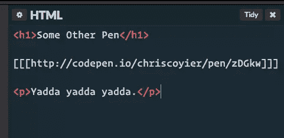

我们还有更强大的资产托管功能。

## 6.来自其他笔的 Ajax 内容

说到使用其他笔作为资源，您可以在特殊的 URL 访问来自笔的原始代码。例如，如果您只想从另一支笔访问 JavaScript，请将`.js`添加到 URL 的末尾，如下所示:

[http://codepen.io/SamyBencherif/pen/ONyQOQ.js](http://codepen.io/SamyBencherif/pen/ONyQOQ.js)

你可以用 Ajax 来实现它，并在其他地方使用它。或者卷起来，或者别的什么。这对于在另一支笔中存储数据很有用，这样就不会混淆您正在使用的那支笔中的 JavaScript。

您可以使用以下 URL 扩展名访问任何笔的原始代码:

|  | **如果一支笔是…** | **原始代码** | **预处理
代码** |
| **HTML** | Raw HTML | 。超文本标记语言 | 不适用的 |
| 降价 | 。减价 | 。超文本标记语言 |
| 微小的 | 。微小的 | 。超文本标记语言 |
| 低增生性急性髓细胞性白血病 | 。低增生性急性髓细胞性白血病 | 。超文本标记语言 |
| **CSS** | Raw CSS | 。钢性铸铁 | 不适用的 |
| 厚颜无耻 | 。厚颜无耻 | 。钢性铸铁 |
| SCSS | 。scss | 。钢性铸铁 |
| 较少的 | 。较少的 | 。钢性铸铁 |
| **JS** | Raw JS | 。射流研究… | 不适用的 |
| 咖啡脚本 | 。咖啡脚本 | 。射流研究… |
| 直播脚本 | 。直播脚本 | 。射流研究… |
| 以打字打的文件 | 。以打字打的文件 | 。射流研究… |
| 巴比伦式的城市 | 。巴别塔 | 。射流研究… |

## 7.教人们东西

从某种意义上说，人们可以从 CodePen 上的任何一支笔中学习。这是真正的代码，你不仅可以看，而且可以看到结果。有些人甚至制作专门用于教学的笔。本着教学的精神，我们的[博客功能](http://codepen.io/blogging)几乎完全用于技术写作。

但是 CodePen 有其他更直接的教学方式。比如[教授模式](https://blog.codepen.io/documentation/pro-features/professor-mode/)，可以让其他人实时看你写代码，也可以和你以及对方聊天。

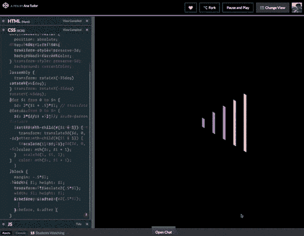

协作模式对教学也很有用:它允许多人同时在一支笔*上工作*，这意味着教学可以亲自进行。

## 8.在键入时查看代码中的主要错误

安(在我看来！)CodePen 的一个被低估的特性是，它会在编辑器中警告你代码中的错误。JavaScript 在这里也不例外。当 CodePen 检测到错误时，它会高亮显示该行并显示一个图标。单击图标显示错误消息，这可能有助于理解问题。

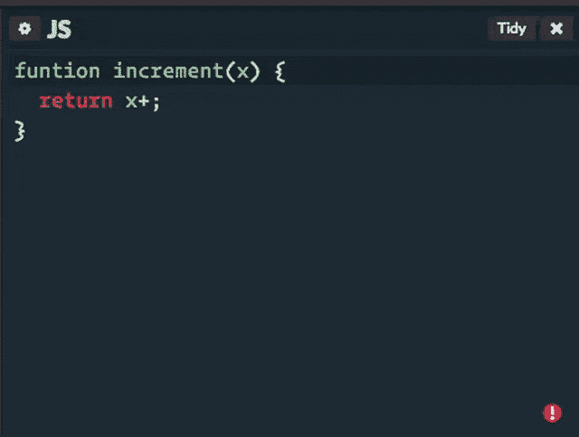

CodePen 甚至会试图阻止你执行无限循环(这是不好的，因为它们会锁定浏览器，可能会阻止你保存你的工作)。

## 9.Lint 您的 JavaScript

你可以让 CodePen 用流行的 [JS 提示](http://jshint.com/)检查你的 JavaScript。

一个帮助检测 JavaScript 代码中的错误和潜在问题的工具。

这可能会发现一些问题，这些问题不是我们自动检查的执行停止错误。

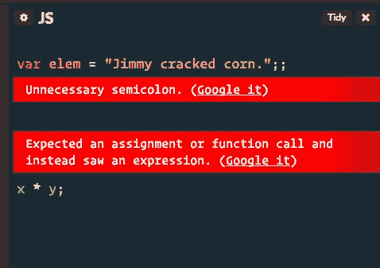

万一错误信息不够清楚，可以使用方便的 *Google it* 链接找到更多信息。

CodePen lints 你的*处理过的* JavaScript。因此，如果您使用的是预处理器，它将会处理林挺警告的代码。如果 JS Hint 发现了一些需要警告您的东西，它会翻到编译好的代码，向您展示。

如果 JS Hint 什么都没找到，它会告诉你的！

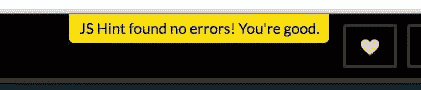

## 10.整理你的 JavaScript

一次点击将清理您的代码！它甚至对 JSX 很友好。

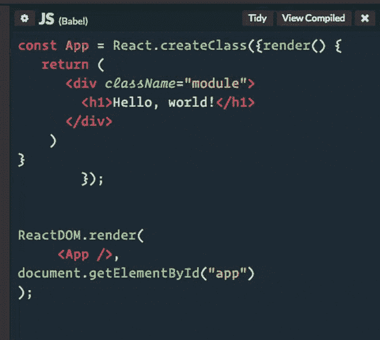

* * *

如果你对 CodePen 有任何喜欢的 JavaScript 特性或技巧，我很乐意听听！

## 分享这篇文章