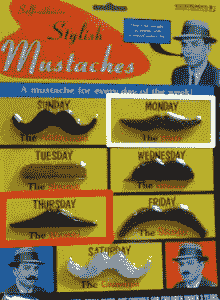

# 坐标(HTML 属性)

> 原文：<https://www.sitepoint.com/coords-html-attribute/>

## 描述

当链接包含在`object`元素中时，`coords`属性应用于链接(`a`元素)。它用于将链接放置在图片的顶部。如果你认为这听起来像一个图像地图，你就对了。您可以使用 a 元素的`coords`和`shape`属性来创建与结合地图使用一系列`area`元素相同的效果。尽管它们做的事情基本相同，但是比较这两种方法还是很有用的。首先来看图像，如下图。

如果我们使用客户端图像映射方法来实现这个结果，标记将如下所示:

```

<map name="Map" id="Map">
  <area shape="rect" coords="132,117,270,185" href="the-hero.html"
      alt="Monday's mustache - 'The Hero'"/>
  <area shape="poly" coords="136,238,137,301,3,306,3,242"
      href="the-weasel.html" alt="Thursday's mustache -
      'The Weasel'"/>
</map>
```

此示例代码由应用了 alt、coords 和 shape 属性的 area 元素组成。所有这些属性都适用于地图元素。

现在，让我们看看替代代码，其中坐标和形状属性改为应用于元素:

```
<object data="mustaches.png" alt="Mustaches" type="image/png"
    width="276" height="375" border="0" usemap="#Map2">
  <map name="Map2" id="Map2">
    <ul>
      <li><a href="the-hero.html" shape="rect"
          coords="132,117,270,185">Monday's mustache -
          'The Hero'</a></li>
      <li><a href="the-weasel.html" shape="poly"
          coords="136,238,137,301,3,306,3,242">Thursday's
          mustache - 'The Weasel'</a></li>
    </ul>
  </map>
</object>
```

在第二个例子中，链接被放置在一个`ul`中，而不是我们在第一个例子中用于区域的`alt`属性，文本被包含在链接中。这个想法是，用户将在浏览器中看到一个不支持 object 元素的链接列表。

## 例子

该
`coords`属性定义了矩形的左上和
右下坐标:

```
<a href="the-hero.html" shape="rect" *coords="132,117,270,185"*>
    Monday's mustache - 'The Hero'</a>
```

## 价值

可输入到`coords`属性的值如下:

*   对于矩形(`"rect"`),`coords`属性将取四个值: *x* 1、 *y* 1、 *x* 2 和 *y* 2。这些值定义矩形的左上角(边界将出现在图像左上角上下多少像素)和右下角(边界将出现在图像左上角上下多少像素)。
*   对于圆形(`"circ"`)，需要三个值: *x* 、 *y* 和 *r* 。 *x* 和 *y* 坐标告诉浏览器圆的中心点在哪里，而 *r* 值指定圆的半径。
*   多边形(`"poly"`)几乎总是使用 Dreamweaver 等所见即所得的 HTML 编辑器创建的，由一系列 *x* 、 *y* 坐标定义，每个坐标都与多边形轮廓上的一个点相关。

## 分享这篇文章