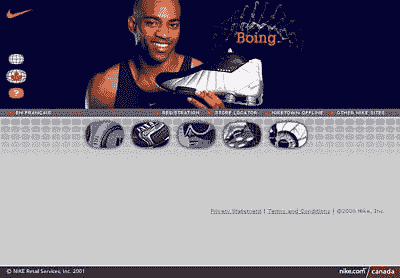
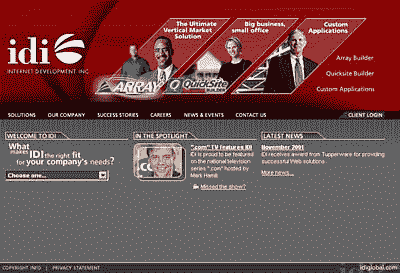
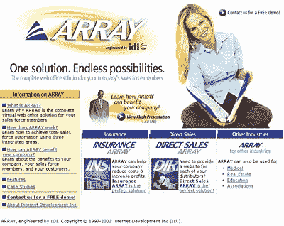
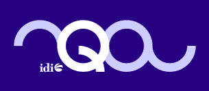

# 好的设计师抄袭，伟大的设计师偷窃

> 原文：<https://www.sitepoint.com/copy-great-designers-steal/>

巴勃罗·毕加索是第一位在卢浮宫展出的在世艺术家，他以一种独特的方式影响了艺术界。那么为什么他会说“好的艺术家临摹，伟大的艺术家偷窃”而闻名呢？

这是真的。毕加索真的说过，“好的艺术家临摹，伟大的艺术家偷窃。”或者至少，自从他 1973 年去世后，每个人都相信他说过这句话。

但是为什么呢？为什么像毕加索这样有独创性的人会说这样讽刺的话？他是什么意思？谷歌一下毕加索的引用，你会发现很多关于他真正意思的观点和解释。

那么，我在这里的目的是揭示一种可能的解释。这种解释涉及三个层次的设计，每一个层次都包括:

1.  涉及到复制或偷窃的某些方面，
2.  显示设计日益成熟，以及
3.  将毕加索的名言应用于现代平面设计。

##### 设计的三个层次

为了帮助你理解我的推理，我把这种解释分成三个层次。设计只有这三个层次吗？当然不是。它们只是帮助你提高设计成熟度的指南，与复制和窃取相关。

我包含了简短的案例研究，以有效地展示每个层次的主要概念——至少，这是我的意图。你来判断它们是否是有效的例子。

##### 第一级:复制，不要创造

我完全支持尽可能的原创，但是一个初学的网页设计师(或者任何设计师，就此而言)应该从复制其他优秀的设计开始。

网络文案大师格里·麦戈文对作家提出了同样的观点:

专业作家学到的最简单的技巧之一可以极大地简化写作准备过程:寻找你需要做的那种文章的模型，然后解剖它，分析它——并复制它。。。。新手作家经常犯两个错误:他们认为他们需要完全原创，他们认为他们需要等待“灵感”从优点来看:对于大多数类型的写作来说，原创性和灵感被高估了。

用“设计师”和“网页设计”代替格里引用的“作家”和“写作”的例子，信息是一样的:复制，不要创造。

令人惊讶的是，模仿有一个积极的副作用:传统性。建立在与其他网站相同的基础上——特别是布局和信息架构——通常会给最终用户带来直觉和熟悉感。毫无疑问，[BarnesAndNoble.com](http://www.bn.com)和[Amazon.com](http://www.amazon.com)有相似的导航结构。

此外，如果你的职业生涯和我一样，你很难享受米开朗基罗花费四年时间完成西斯廷教堂天花板时所享受的奢华。通常，我们只有四个月的时间，更有可能是四周。因此，在网页设计这样的商业艺术环境中，考虑到我们面临的时间和预算限制，复制几乎是强制性的。

***案例分析***

来源:

结果是:

两年前创建的 IDI 公司网站非常恰当地体现了一级设计。当时我们中的大多数人——包括我自己，艺术总监——只有不到两年的网页设计经验。我们需要一个完美的资源作为我们网站布局的基础。

经过几个小时的搜索，我们发现耐克的加拿大网站是最合适的。这种设计风格在技术上很吸引人。布局架构简单，但很强大。唯一缺少的是吸引访问者的附加文本。

所以我们采用了耐克的设计并运用它。你不必费力就能看到改编后的结果接近原始源。

##### 第二级:偷自己的东西

简单地说，你可以偷窃的最好来源之一就是你自己。

想想吧。您的硬盘上可能有一个文件夹，其中包含几十个从未使用或完成的设计。你创造的设计获得了客户的成功。更重要的是，你独特的设计风格可能是你的许多客户的卖点。

为什么不利用一些你已经创作的伟大作品，这些作品要么没有被使用，要么从未完全完成？或者更好的是，重塑一些在建立你的个人风格方面非常成功的作品？

***案例分析***

来源:

结果是:

阵列网站的最终设计是废弃设计用法的结果。QuicksiteBuilder 布局是几年前创建的，但从未通过编译阶段(请注意 comp 图形上的填充文本和橡皮球水印)。

我选择使用未使用的 QuicksiteBuilder comp design 中的元素来创建布局，而不是从 ARRAY 网站的零开始(该网站已投入生产)。QuicksiteBuilder 和 ARRAY 是类似的产品，因此“偷”是理想的解决方案。这个女人的照片、标题和副标题以及三个专栏的突出都是个人剽窃的直接结果。

##### 第三级:从离散来源窃取

我的一个好的设计朋友，杰西·班尼特，在留言板上用阿尔伯特·爱因斯坦的一句话来装饰他的签名:“创造力的秘密是知道如何隐藏你的来源。”

也许“隐藏”你的资源的最简单的方法就是使用已经隐藏的资源。

“毕加索并不意味着伟大的艺术家会窃取那些原创来源众所周知的流行设计，”《苹果观察家》和《金融苹果迷》的作者韦斯·乔治说。

“毕加索的意思是，伟大的艺术家在丢失、被忽略和被遗忘的想法的巨大垃圾堆中翻找稀有的珠宝，然后将这些凋谢的宝石融入他们自己的个人艺术遗产中……毕加索暗示，伟大的艺术家不会因为偷窃而被抓住，因为他们将自己的东西彻底转化为自己的形象，以至于每个人最终都认为伟大的想法首先是他们的。”

第三级需要在杂志、书籍、网站、历史文物、文化作品和其他丰富的设计资源中进行艰难的搜索，以找到韦斯所说的那些未被使用和遗忘的想法。

***案例分析***

来源:

结果是:

最近，我被要求设计一件 t 恤的标志，该 t 恤将提供给 IDI 的质量保证部门。

上面显示的徽标设计是从 MasterClips 的矢量剪贴画集合中“窃取”的。当我翻阅目录时，不知何故，我看到了红色的剪贴画。虽然是几年前创作的，但环形设计有一种时髦的 X 世代感觉——这正是我想要的，因为 QA 部门的大多数人都是 X 世代。

其他人使用这张剪贴画的可能性非常小。而目标观众——或任何其他人——熟悉这样一部作品的机会就更渺茫了。翻译？偷窃的绝佳来源。

##### 一个警告

如果没有在复制众所周知的资料时要小心的警告，这篇文章是不完整的。如果我用一句话来总结这个警告，这将是我的金玉良言:复制灵感，而不是结果。

例如，自从推出 iMac 以来，苹果的设计一直受到非常流畅和视觉上有形的外观和感觉的启发，再加上“少即是多”的态度。

苹果设计背后的灵感的完美再现导致了类似于[MailFrontier.com](http://www.mailfrontier.com)的东西

在光谱的另一端，一个可怕的公然复制苹果设计的结果导致类似于[uSight.com](http://www.usight.com)的东西

简而言之，要注意你复制什么，以及如何复制。花点时间让设计成为你自己的，否则你将成为 Pirated-Sites.com 最新的设计窃贼。

##### 文献学

毕加索资源
[http://www.picasso.com/links](http://www.picasso.com/links)

毕加索语录
[http://painting.about.com/library/blpicassoquotes.htm
](http://painting.about.com/library/blpicassoquotes.htm)

针对苹果的盗版，这是文化的事情，韦斯乔治
[http://www . MAC observer . com/columns/Apple trader/99/August/990823 . html](http://www.macobserver.com/columns/appletrader/99/august/990823.html)

《网页内容风格指南》，格里·麦戈文
[http://www.gerrymcgovern.com/guide_write_08.htm](http://www.gerrymcgovern.com/guide_write_08.htm)

MasterClips 矢量剪贴画
[http://www.masterclips.com](http://www.masterclips.com)

阵
[http://www.webofficesolutions.com](http://www.webofficesolutions.com)

Pirated-Sites.com
[http://www.pirated-sites.com](http://www.pirated-sites.com)

## 分享这篇文章