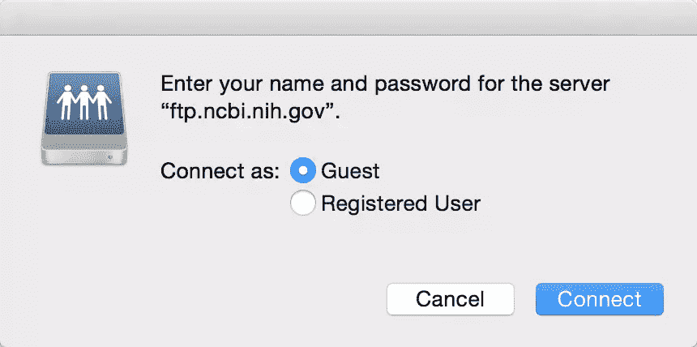
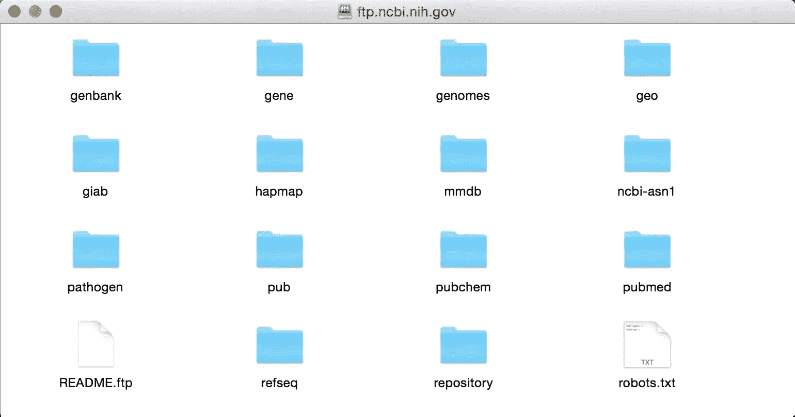

# 用 Ruby 计算真实单词

> 原文：<https://www.sitepoint.com/counting-real-words-with-ruby/>


。

等一下，你的意思是这篇博文只是关于统计文档中的字数吗？首先，它足够简单，其次，这可以由任何文字处理器在飞行中完成。

你是对的，因为它是关于计算单词的。然而，这篇博文的目的是展示 Ruby 在计算我们确定的单词时，在满足我们的需求方面有多么灵活。这与我们使用的文字处理器相反，文字处理器可能无法基于这样的标准进行计数。

让我进一步澄清这一点。当文字处理器计算字数时，它以空白作为分隔符。因此，在此之后出现的单词将被视为新单词，并包括在单词计数中。

如果你有一个号码，一封独立的信，一个电子邮件地址，等等。？你考虑过那些话吗？我不知道。文字处理器不会给你选择过滤已计算的单词。

例如，在我用 Microsoft Word 做的一个小实验中，当我输入以下文本时:

```
Ruby 1 2 3 " email@email.com
```

字数是 **6** ！

那么，我们所说的*单词*到底是什么意思呢？在[牛津词典网站](http://www.oxforddictionaries.com/us/definition/american_english/word)上定义，一个词是:

> 演讲或写作中的一个独特的有意义的成分，和其他成分一起(有时单独)构成一个句子，书写或印刷时通常两边都有一个空格。

看这个定义，上面这段文字的字数应该算到 **1** 而不是 6。这种情况下我们该怎么办？Ruby 的强大功能和灵活性可以扭转乾坤。

让我们深入教程，看看我们如何告诉 Ruby 在实践中什么是单词，什么不是单词。

## OMIM<sup>–在线人类孟德尔遗传</sup>

20 世纪 60 年代早期，维克多·a·麦克库西克博士创建了一个数据库，作为孟德尔遗传特征和疾病的目录。当时，它被称为人类的孟德尔遗传(MIM)。在线版本[](http://www.omim.org/about)，是人类基因和遗传[表型](https://en.wikipedia.org/wiki/Phenotype)的综合概要，每天更新，免费提供。它创建于 1985 年，从 1987 年开始在互联网上提供。OMIM 文本包含关于所有已知的孟德尔疾病和超过 15，000 个基因的信息。

好吧，这些有价值的数据就是我们将在本教程中使用的！

## 获取 OMIM <sup>文件</sup>

在此步骤中，我们将下载 OMIM 文本文件，该文件可通过以下步骤获得:

1.  去这个匿名的 ftp 地址:[ftp://ftp.ncbi.nih.gov](ftp://ftp.ncbi.nih.gov)。您应该会看到一个如下所示的对话框:



选择*旁边的*客人*连接为:*，然后点击*连接*按钮，此时会看到以下目录:



我们需要的文本文件是 **omim.txt.Z** 文件(66.3 MB)，可以在 **/repository/OMIM/ARCHIVE** 目录下找到。

解压文件得到 **omim.txt** (151.2 MB)。

## 计算单词的数量

有了我们想要处理的文本文件，让我们编写一个 Ruby 脚本，它将返回单词数(传统的计数方法)。执行此任务的脚本可以编写如下:

```
text = File.open('omim.txt', 'r')
number_of_words = 0
text.each_line(){ |line| number_of_words = number_of_words + line.split.size }
puts number_of_words
```

你应该得到这个大数字:`22451516`

## 只计算你认为的单词

在这一节中，我将演示一些场景，告诉 Ruby 在计数时什么应该被认为是单词，什么不应该被认为是单词。

### 场景 1:不要把独立的数字当成单词

如前所述，Microsoft Word 将 6 作为字数返回给:`Ruby 1 2 3 " email@email.com`

因此，它认为这些数字是单词。让我们用 Ruby 来解决这个问题。正则表达式非常方便地向 Ruby 解释我们所说的独立数字的含义。我在我的另一篇博客文章中稍微讨论了一下正则表达式:[寻找基因序列](https://www.sitepoint.com/ruby-medicine-hunting-gene-sequence/)。

让我们一步一步来。我们要做的第一件事是指定字符串的开始和结束(*即*为了被认为是一个单词，我们想要看到的部分)。在这种情况下，我们可以用`\A`和`\Z`分别指代字符串的开头和结尾。

之后，我们希望指定一个数字的前面可以有一个减号(-)或加号(+)。这个可以写成`[- +]`。

我们可以在正则表达式中使用的一个很好的符号是问号符号`?`。问号符号只是告诉我们将前一个字符的*零个*或*一个*。例如，如果我们写:`[- +]?`，这意味着值的前面可以有`-`、`+`，或者什么都没有。

我们现在想告诉正则表达式有*零*或*更多的*数值。这个可以写成`[0-9]*`。因此，我们的值在 0-9 的范围内，星号`*`表示匹配零个或多个前面的字符。因此，如果我们现在没有任何数值，那也没关系。我们还可以使用 01、6、9、54、565346 等值。

由于我们可以有浮点数，我们可能会在一些值中遇到一个点`.`(*即*，5.43)。将`\.?`添加到正则表达式中表示`.`是可选的，但是如果它出现(前面的零个或多个字符)，就会被考虑在内。

最后，由于`.`后面会跟一个值，我们可以用:`[0-9]+`。这里的`+`符号表示前面字符的*多了一个*或*(但**不是**零)。*

检查是否有数值的最后一个正则表达式如下:`\A[-+]?[0-9]*\.?[0-9]+\Z`

### 场景 2:不要把独立的字母当成单词

我们想看的下一个场景是文档中有独立字母的情况(*即*，A，b，c，D)。

这可以简单地用这个正则表达式来实现:`^[a-zA-Z]$`。插入符号`^`表示行首，美元符号`$`表示行尾。

### 场景 3:不要把电子邮件地址当成单词

这可能有点棘手，但是，让我们一步一步来。

我给你介绍一下`\w+`。`\w+`告诉我们匹配*一个*或*多个*字字符。这相当于`[a-zA-Z0-9_]+`，匹配字母、数字和下划线的任意组合。我们需要这一点，因为电子邮件的一部分可能包含这样的模式。

上面的模式后面可以跟任何字符。在正则表达式中，点`.`表示*任意字符*。因此，告诉正则表达式它可以包含任何单词字符或破折号`-`，后跟零个或多个字符，就写成了`[\w+\-].?`。

检查我们是否有电子邮件地址的正则表达式的整个部分是:

```
\A([\w+\-].?)+@[a-z0-9\-]+(\.[a-z]+)*\.[a-z]+\Z
```

## 放在一起

现在让我们看看我们的 Ruby 脚本是如何运行的，包括上面的三个场景:

```
text = File.open('omim.txt', 'r')
number_of_words = 0
standalone_number = /\A[-+]?[0-9]*\.?[0-9]+\Z/
standalone_letter = /^[a-zA-Z]$/
email_address = /\A([\w+\-].?)+@[a-z0-9\-]+(\.[a-z]+)*\.[a-z]+\Z/
text.each_line(){ |line| number_of_words = number_of_words + line.split.count {|word|  word !~ standalone_number && word !~ standalone_letter && word !~  email_address }}
puts number_of_words
```

运行脚本(需要一些时间)，我们的字数是:`21636153`

。

你有没有注意到计算单词和使用我们的 Ruby 脚本之间的区别？差了 815363 个字！哇！

例外太多了吗，意思是，一些合法的词被砍掉了吗？提炼上面的正则表达式，让脚本为你和你认为的单词工作。

祝你好运！

## 分享这篇文章