# 在 photoshop 中制作皮革文本效果

> 原文：<https://www.sitepoint.com/craft-leathery-text-effect-photoshop/>

如果你想让你的信息真正与众不同，没有比制作你自己的定制字体更直接有效的方法了。现代观众被信息包围，结果他们的注意力范围急剧缩小。自定义排版可以将你的价值主张从更典型的广告“噪音”中分离出来，它允许你将你的字体外观与你的信息内容进行主题整合。例如，如果你的产品涉及皮革，那么没有比缝制皮革更好的方式来强化你的信息，体现你产品的吸引力。

所以今天，我们要在 Photoshop 中创建一个悬挂的皮革文本效果。在本教程中，我将带你通过使用一些有趣的技术、模式和工具来创建这个文本效果。让我们开始吧。

**资源:**
[皮革质地](http://www.graphicsoulz.com/premium-item/5-high-quality-leather-textures-free/)

**最终结果:**
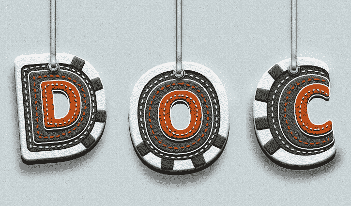

**( [下载完成的，分层的 PSD 文件](https://www.dropbox.com/s/h013ede640uz47u/Leather%20Text.zip)。)**

**第一步:**
打开 Photoshop 新建一个文件，宽度 800px，高度 600px。
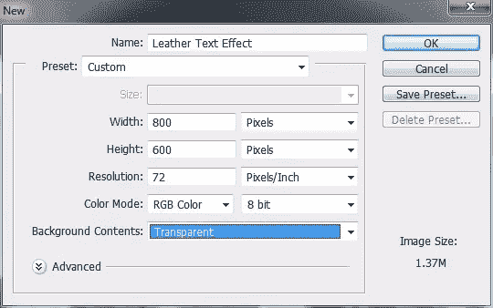

**第二步:**
首先新建一个图层，然后使用油漆桶工具填充颜色#c8d4d7。点击“滤镜”>“噪点”，给背景添加一点“噪点”。添加 2%的噪声。
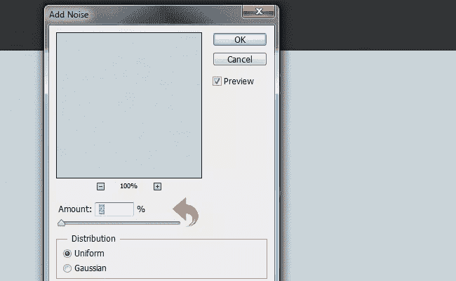

噪点之后，选择背景层，点击“图层”>“图层样式”>“图案叠加”，一个淡淡的，微妙的图案。
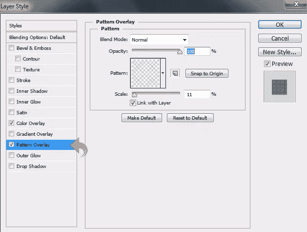

**第三步:**
现在，让我们从课文开始。首先，选择文本工具，使用#ffffff 颜色添加第一个字母。使用“编辑”>“自由变换”将其旋转一点。

第四步:
选择我们上面创建的文本层，点击“图层样式”添加一些斜面&浮雕和阴影。使用下面的设置。

**第五步:**
打开白色皮革纹理粘贴到文字上，然后点击【图层】>【创建剪贴蒙版】。
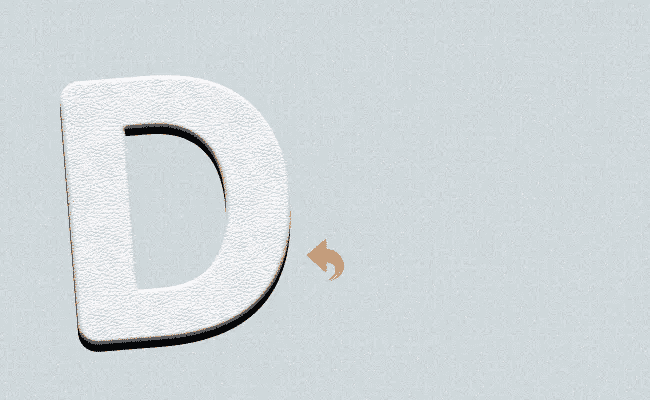

**第六步:**
选择圆角矩形工具，创建一个非常小的矩形。使用自由变换(“编辑”>“自由变换”或 Cmd/Ctrl+“T”)旋转小矩形。然后，选择矩形图层，点击“图层样式”，再次添加斜面&浮雕。使用下面显示的设置。

**第七步:**
打开带蓝色的皮革纹理，粘贴到上面我们创建的小矩形上。缩小比例，点击“图层”>“创建剪贴蒙版”。
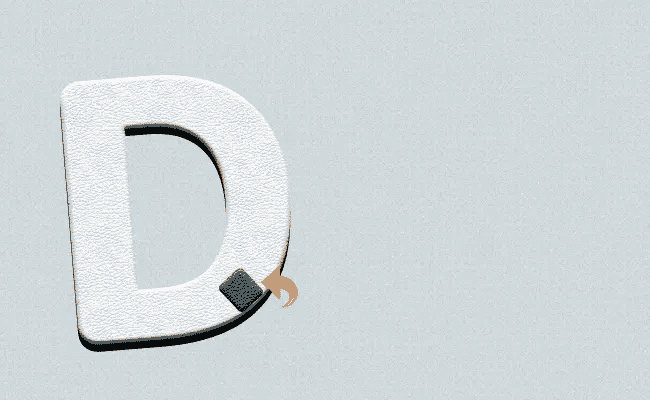

步骤 8:
现在，重复同样的过程，创建三个小矩形，使用上面相同的设置添加纹理和斜面&浮雕。
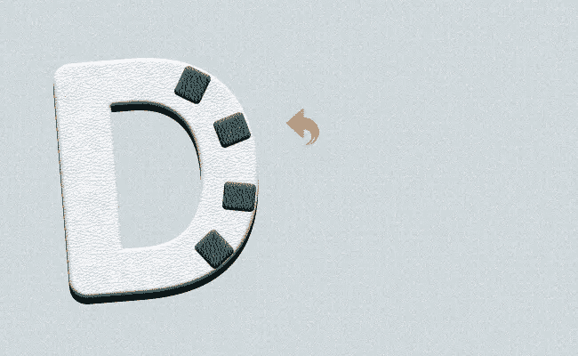

**第九步:**
选择文字工具，再添加一个字母；这次应该比上一次小。把它放在中间，然后点击“图层样式”添加一些笔触和内部阴影。使用下列值。

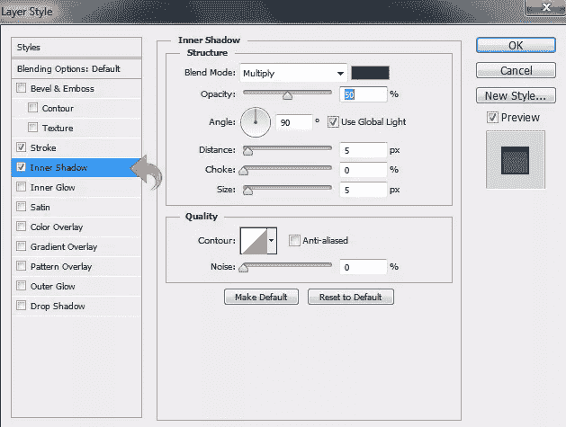

**第十步:**
现在，打开蓝色皮革纹理，粘贴到文字上，点击【图层】>【创建剪贴蒙版】。
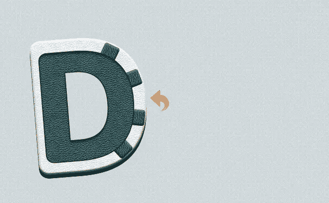

**步骤 11:**
再次选择文字工具，中间再添加一个“D”。现在，点击“图层样式”添加斜面&浮雕，描边和阴影。将下面显示的设置用于所有三种效果。
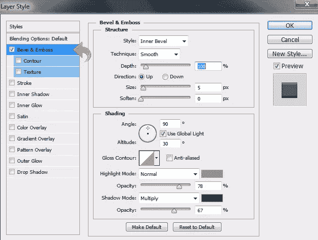

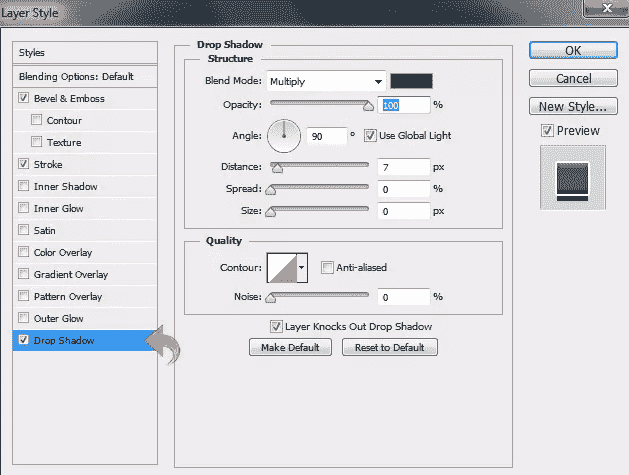

**第十二步:**
打开棕色皮革纹理。现在，使用自由变换工具将其缩小并粘贴到文本上。然后，点击【图层】>“创建剪贴蒙版”

步骤 13:
重复同样的过程，使用文字工具添加另一个字母。然后，点击“图层样式”添加斜面&浮雕、描边和阴影。对上一步的效果使用相同的设置，但是调整斜面&浮雕设置以匹配下图。
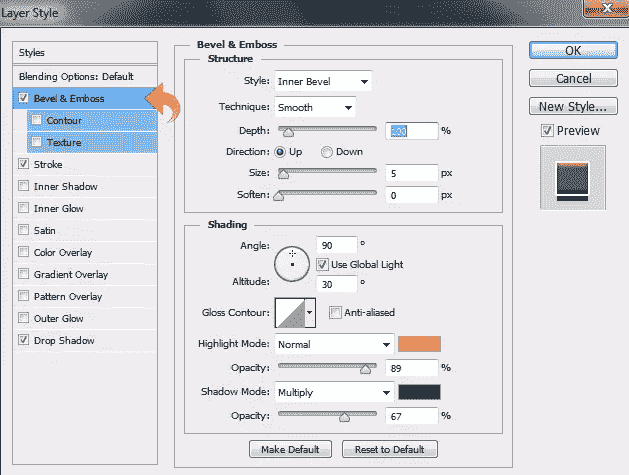

**步骤 14:**
现在，取棕色皮革纹理粘贴到字母上，缩小，点击“图层”>“创建剪贴蒙版”。我们需要调整这个的颜色，所以选择皮革层，点击“图层”>“图层样式”>“颜色叠加”。使用颜色#ff7200，混合模式设置为“叠加”。
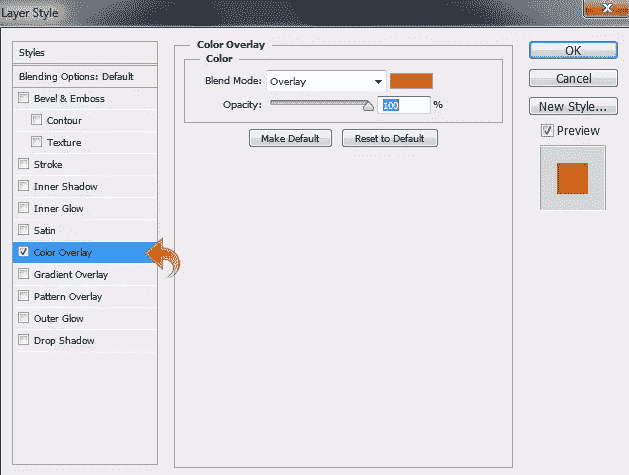

第十五步:
现在，让我们从缝针开始。我们先把前景色设置为#f8f8f8。选择一个硬的圆形笔刷，然后点击笔刷面板来调整它的大小和间距，使其看起来像缝线。在这之后，创建一个新的层，选择钢笔工具，并创建一个文本上的路径。最后右击它，选择“笔画路径”。
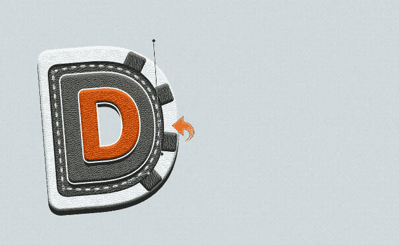

选择上面有缝线的图层，点击“图层样式”,使用下面的设置添加一些阴影。
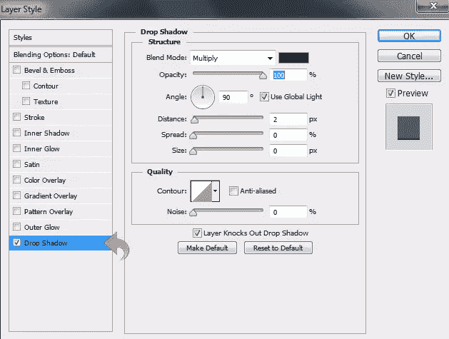

**步骤 16:**
重复同样的过程，在调整大小和颜色的同时创造更多的针脚。继续添加一些阴影，设置和上面一样。
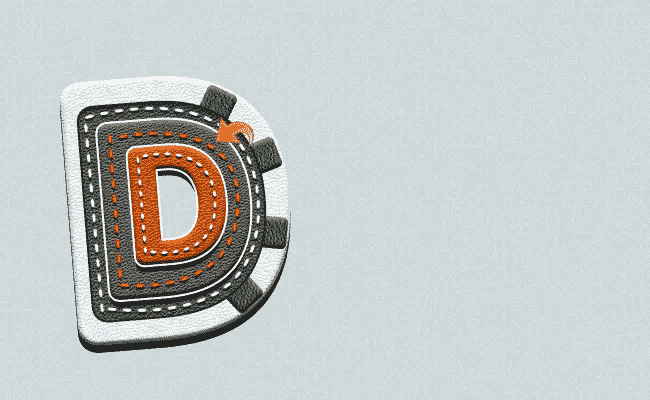

**第 17 步:**
现在我们就从挂皮表带开始。选择硬圆形笔刷，使用颜色#4b4b4b 创建一条垂直线。然后，点击“滤镜”>“模糊”>“高斯模糊”。
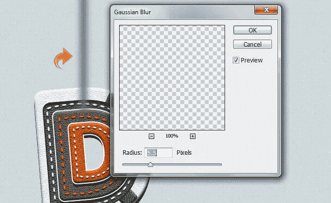

**步骤 18:**
对于嵌入的金属环，选择硬圆刷，使用颜色#363636 涂抹。然后，选择橡皮擦工具擦除中间创建一个环。然后，点击图层面板中的“图层样式”,使用以下设置添加斜面&浮雕、描边和阴影。
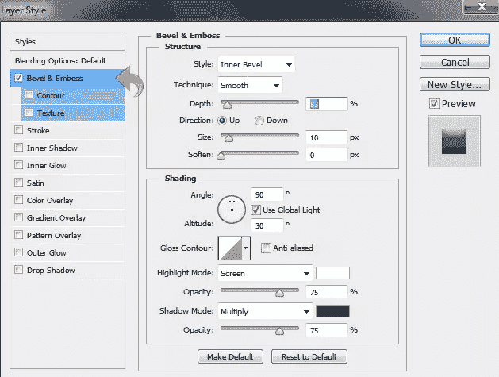

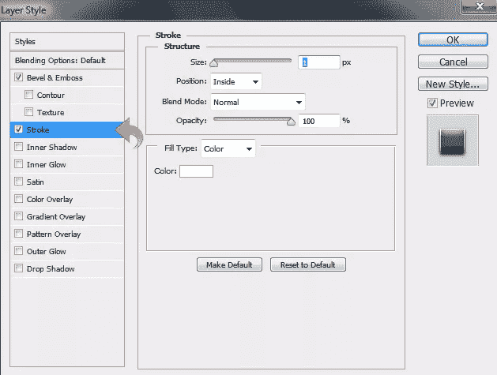

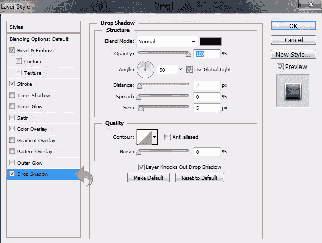

根据需要重复相同的过程来创建新的环，这次使用颜色#9d9d9d。现在，只需从第一个环复制图层样式，并粘贴到新的环层。

**步骤 19:**
新建一个图层，选择硬圆笔刷使用颜色#d8d8d8 创建一条垂直线。然后，选择图层，点击“图层样式”，用下面的值添加斜面&浮雕和阴影。
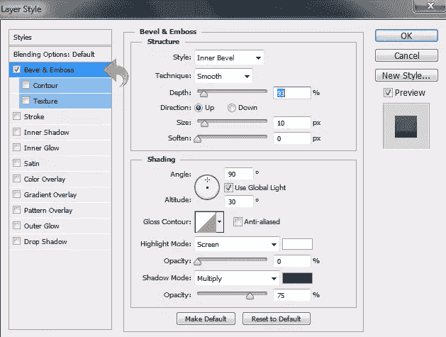

**步骤 20:**
选择上面的图层，点击【滤镜】>【噪波】>【添加噪波】。现在，完成它，使用一些燃烧和道奇微妙地挂在皮带，我们的皮带完成。
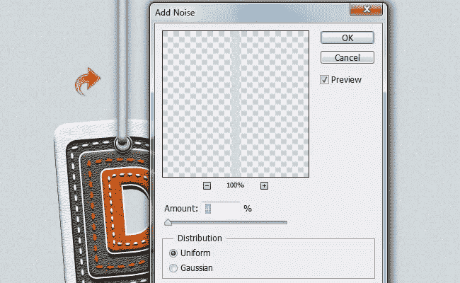

**步骤 21:**
现在，让我们给文字添加最后的阴影。选择文字工具，添加另一个字母，这一次使用颜色#949494。然后，右键点击图层，选择“栅格化图层”。将这一层放在背景层的上面。现在，点击“滤镜”>“模糊”>“高斯模糊”。
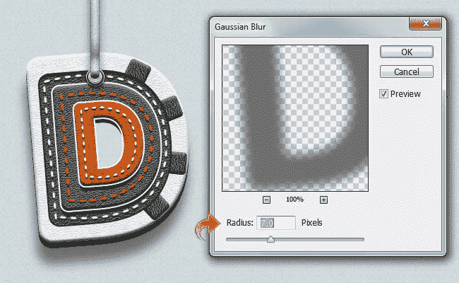

再次点击“过滤器”，但这一次通过选择“过滤器”>“噪音”>“添加噪音”来添加一些噪音。
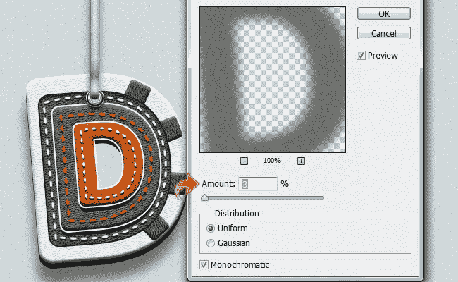

**第 22 步:**
简单重复同样的过程添加额外的文字。
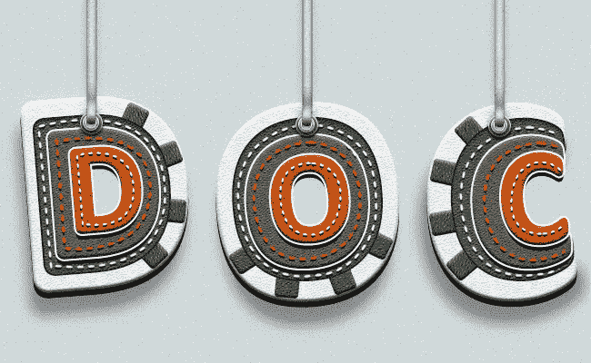

我们完了！我希望你喜欢皮革文本教程。我会带更多回来；让我知道你的想法。

## 分享这篇文章