# 如何打造完美的 404 页面

> 原文：<https://www.sitepoint.com/craft-perfect-404-page/>

摄影:rustman

如果你从来没有访问过 404 网页，你可能从来没有使用过互联网。

这个概念很简单:如果客户端计算机请求一个服务器无法解析的 URL，服务器会以“404 Not Found”响应，或者换句话说“*是的，我在这里，但我找不到你请求的项目*”。

虽然 404 是作为 HTTP 协议的简单必需品而诞生的，但是许多用户体验设计甚至是某种亚文化已经围绕它成长起来了。

创建一个完美的 404 错误页面需要遵循一些规则:

## 设计

错误的页面设计不应该分散用户对网站吸引用户的唯一动机的注意力。大多数人认为它是最讨厌的一页(坏了)。它应该首先被设计来帮助你的访问者，并在这个过程中避免他们转向另一个网站。

作为一个次要目标，404 也可以提供一个机会来建立你的品牌，同时给你的用户留下一个积极的，有希望持久的印象。一般来说，通常是那些最初有负面经历(比如迷路)的人，但他们后来得到了帮助，成为你最大的支持者。

颜色、图像比例的使用应该是适当的，以避免访问坏链接/错误页面的不愉快感觉。众所周知，设计良好的网页可以建立品牌。

## 社交媒体链接

在 404 页面上提供社交媒体链接是一个既能解决用户问题又能同时聚集更多用户的好方法。该网站的官方脸书、Twitter、Pinterest、StumbleUpon、Tumblr 和其他页面链接可用于社交媒体互动。

这也引入了众包用户支持的可能性。通常——尤其是在一夜之间——一个迷路或迷失方向的用户甚至在官方社交渠道运营商有时间做出反应之前就可以得到其他用户的帮助。

## 主要链接

每个用户都应该知道网站的一些重要链接，这有助于更多用户的参与。

然而，现在不是展示整个网站地图的时候。如果用户迷路了，不要让他们过滤几十个链接来找到他们要找的东西。最多保留 6 或 7 个选项。

在大多数情况下，这些可能包括但不限于:

*   主页
*   最近的帖子
*   搜索
*   关于
*   接触

这当然是一个优先考虑(甚至预先填充)你的网站搜索功能的机会。在较小的网站上，大部分的流量流向两三个受欢迎的帖子，在你的 404 页面上链接这些帖子是值得的。

## 提供在线联系表格

用户也可以通过提供一个内嵌的联系表单得到一些指示。应提供表格，输入他们正在搜索的内容和他们在搜索时发现的细节(断开的链接，错误页面等)。)错误页面。

实时聊天帮助也是一个值得考虑的因素——特别是如果流失的用户会严重影响你网站的销售。

这可以帮助访问者找到他们想要的和我们错过的。记住要保持简单的形式，这样可以方便访问者传递信息。

## 音频/视频/流程图幽默

还可以在错误页面上提供自动播放音频/视频，以进一步指导或描述组织。幽默作为解释的一部分，也可以用一些有趣的动画来加以考虑。

这是一个在用户意想不到的时候给他们惊喜和娱乐的机会，同时也解决了他们的问题。

下面，我列出了一些我最喜欢的网络 404 错误页面设计。只需检查它们，用一些有创意的、信息丰富的设计让你的网站的错误页面变得精彩。

有些真的很有趣，因为它们提供了有用的信息和链接，这使得它们非常棒。你也可以指出哪些在设计或信息方面确实需要改进。

### 克雷格列表

Craigslist 提供了一个简单的错误页面，带有主页链接和一些基本的设计。

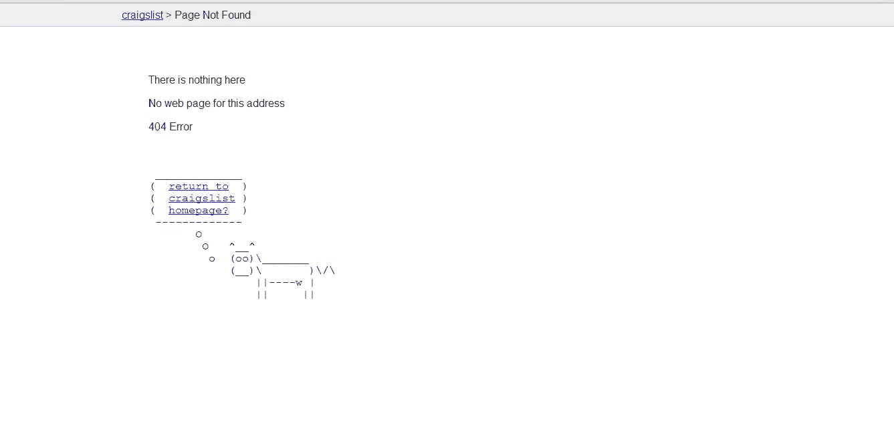

### 尼基·布朗

一些重要的链接在这个页面上提供了一个新的概念，给出了重定向到一些好音乐的秘密链接。这可以帮助用户在访问页面时有更多的时间。

### [立方体草图](http://www.cubeecraft.com/character404.html)

在这里，下载图片链接，显示了一个优秀的设计公式。同样的做法也反映了网站的主要动机，即玩具和模型。

[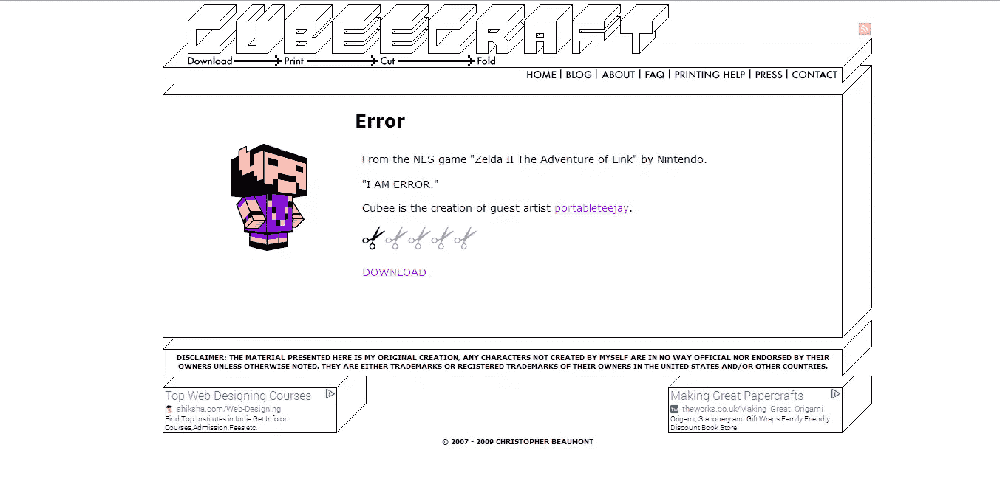](http://www.cubeecraft.com/character404.html)

### [项目-euh](http://www.project-euh.com/404/?)

这提供了一个动画链接，这是一个独特的方式来表示 404 页，通过它每个设计部分重定向到另一个互动链接，其中包括游戏，互动文本和鼠标光标效果，声音效果等。

[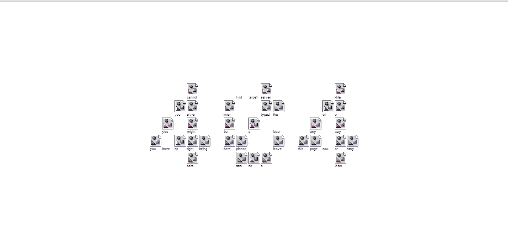](http://www.project-euh.com/404/?)

### [Technorati](http://technorati.com/404)

带有最新帖子提要的简单错误页面，这有助于吸引用户关注其他相关帖子。

[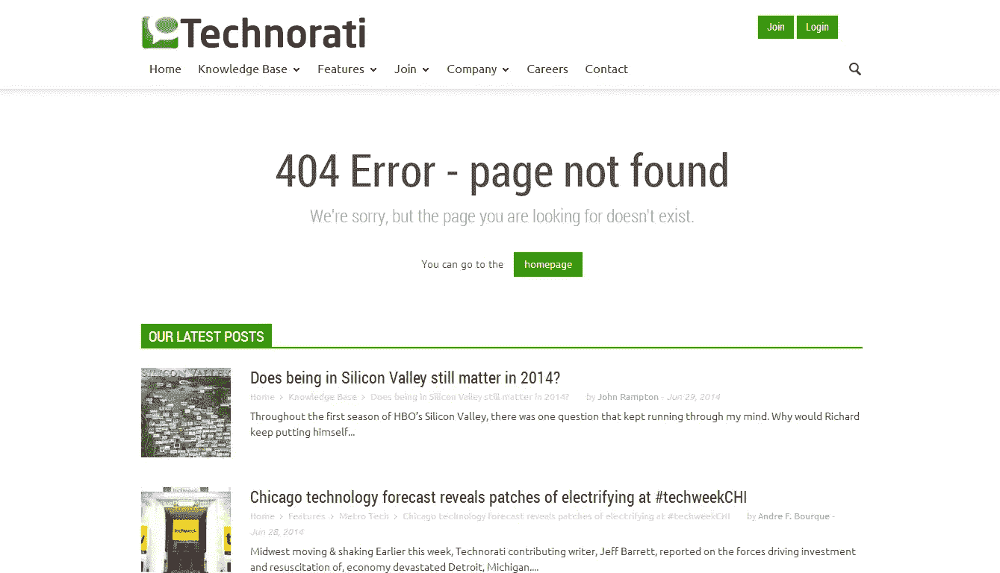](http://technorati.com/404)

### 顶点

这是另一种表示 404 页面的方式，它看起来不同于其他页面，但是他们肯定错过了很多东西。

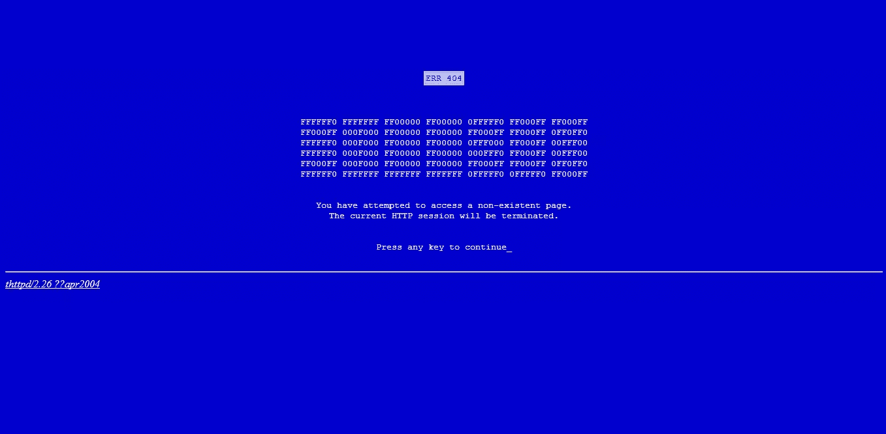

### 扩展广播

如果您没有找到您要查找的内容，请填写此错误页面上的表格。这是一种与访问者互动的极好方式，也可以进一步帮助他们通过 Twitter 和脸书 feeds 获得一些社交信息。

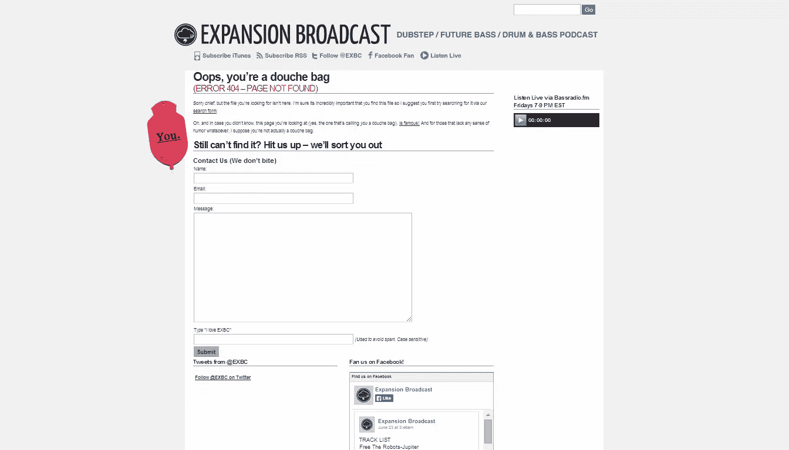

### [减员](http://attrition.org/404)

简单的设计，简单的消息，说明一些有用的信息/错误信息的网页要求。

[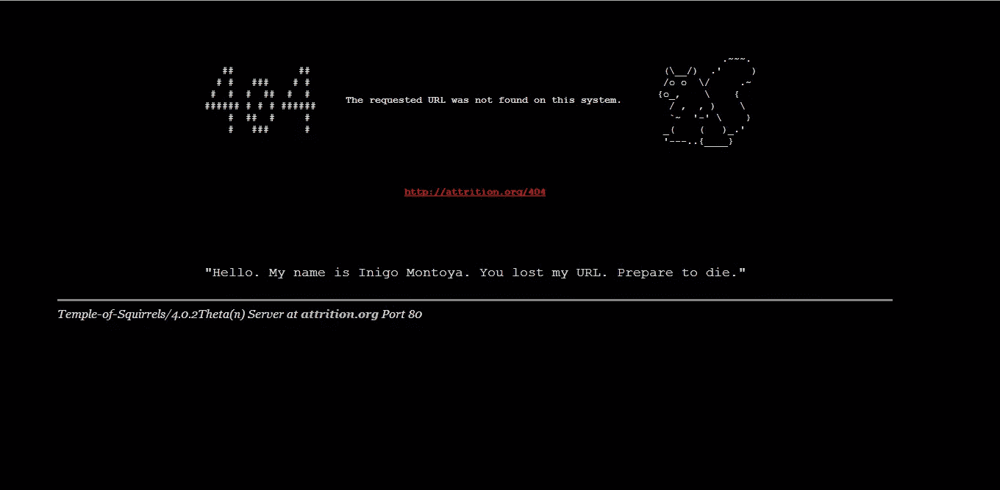](http://attrition.org/404)

### [橙色外套](http://www.orangecoat.com/dear-happy-internet-traveler)

另一种优秀的表现方式是用流图引导访问者进行下一步。

[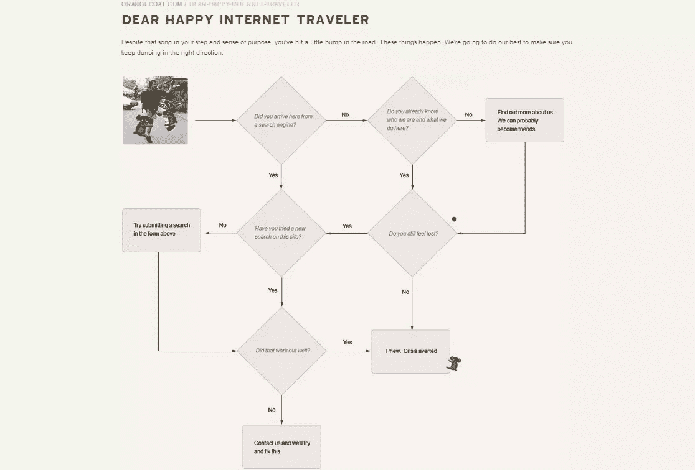](http://www.orangecoat.com/dear-happy-internet-traveler)

### [迪士尼](http://disney.go.com/error/pagenotfound)

访问此页面的访问者可以找到一些有用的信息，包括重要的常见问题解答、反馈、下载链接等。

[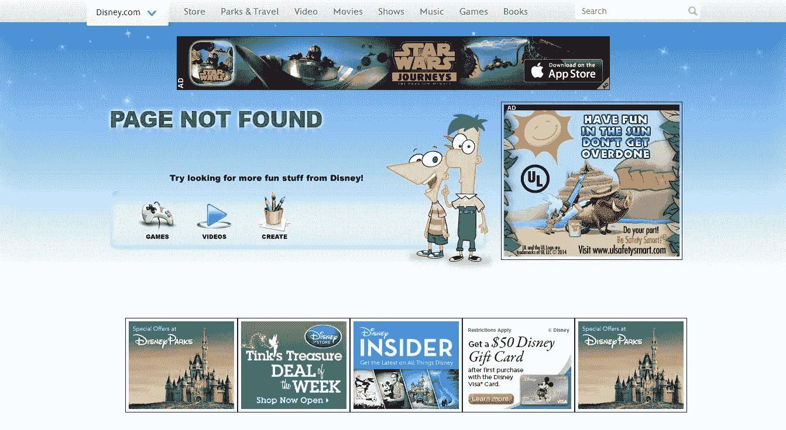](http://disney.go.com/error/pagenotfound)

### [设计 Zillas](http://www.designzillas.com/404)

用一些好的设计、官方社交媒体链接和联系信息来表现 404 页面的好方法。

### [成对地](http://www.twingly.com/errors/500.html?aspxerrorpath=/404)

他们展示了一个熟悉的角色“忍者”来传达他们的信息和电子邮件。这里的设计看起来不错。

[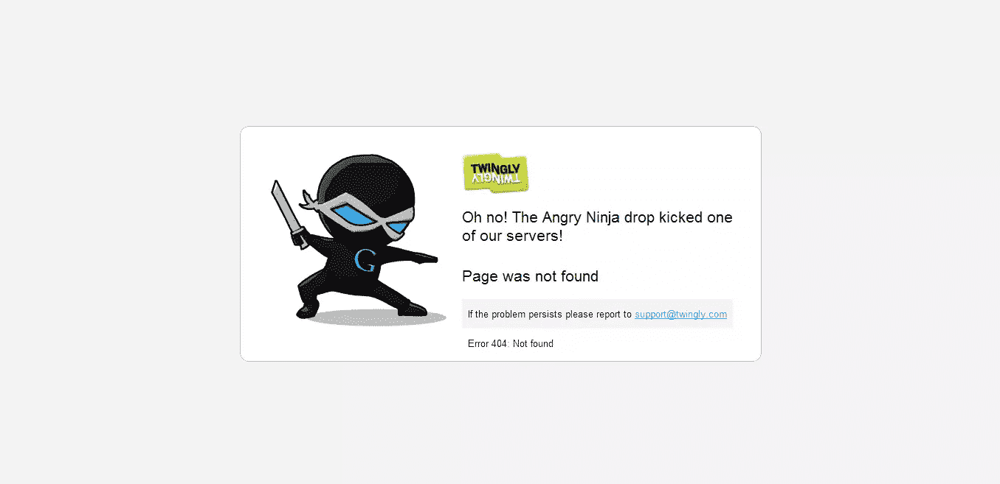](http://www.twingly.com/errors/500.html?aspxerrorpath=/404)

### [webo 组](http://www.webogroup.com/404/)

简单的 404 错误页面设计。

[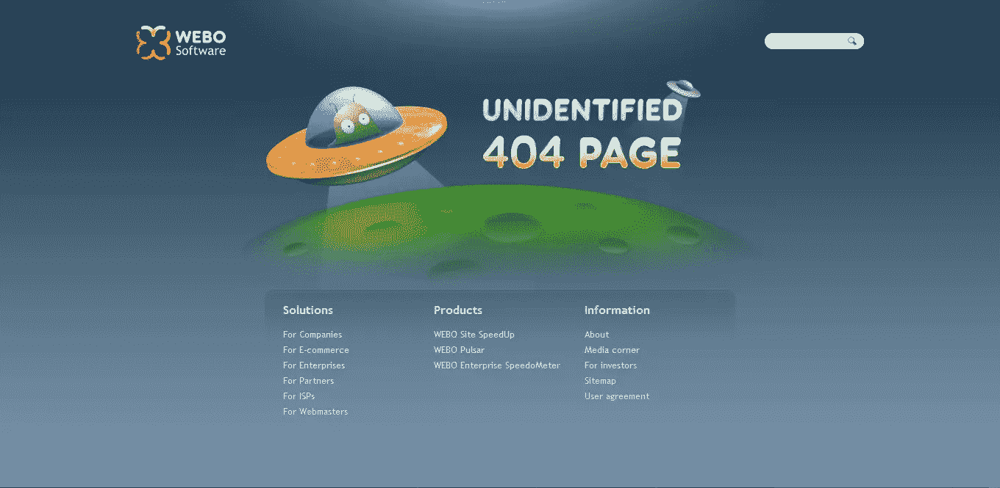](http://www.webogroup.com/404/)

### [狮鹫科技](http://griffintechnology.com/404)

另一个基本设计与联系网站管理员和支持团队的链接。

[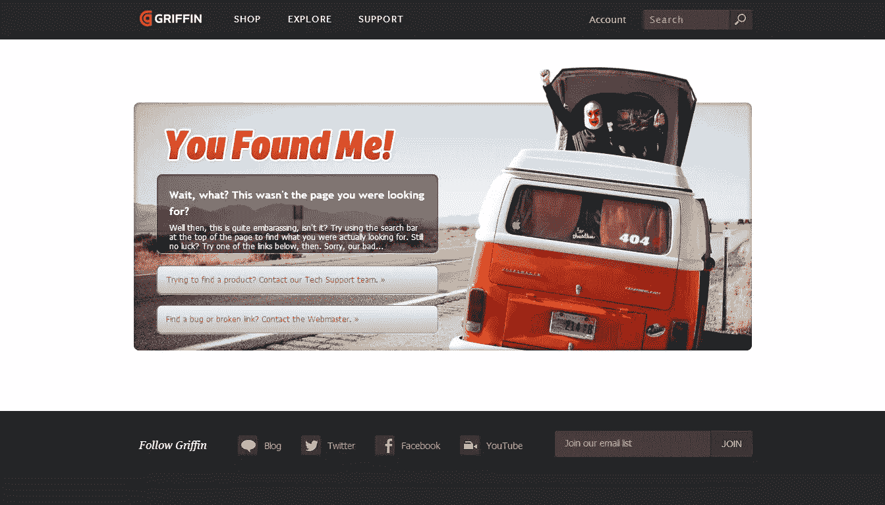](http://griffintechnology.com/404)

### [小吃](http://www.nosh.com/404)

另一个错误页面提供了一些独特的想法和视频，以阻止用户离开网站。天哪，视频不存在，是展示他们幽默一面的方式还是他们真的错过了？网站上还提供了一些重要的信息和链接，如为 *iPhone* 或 *Android* 、*注册*下载免费应用。

[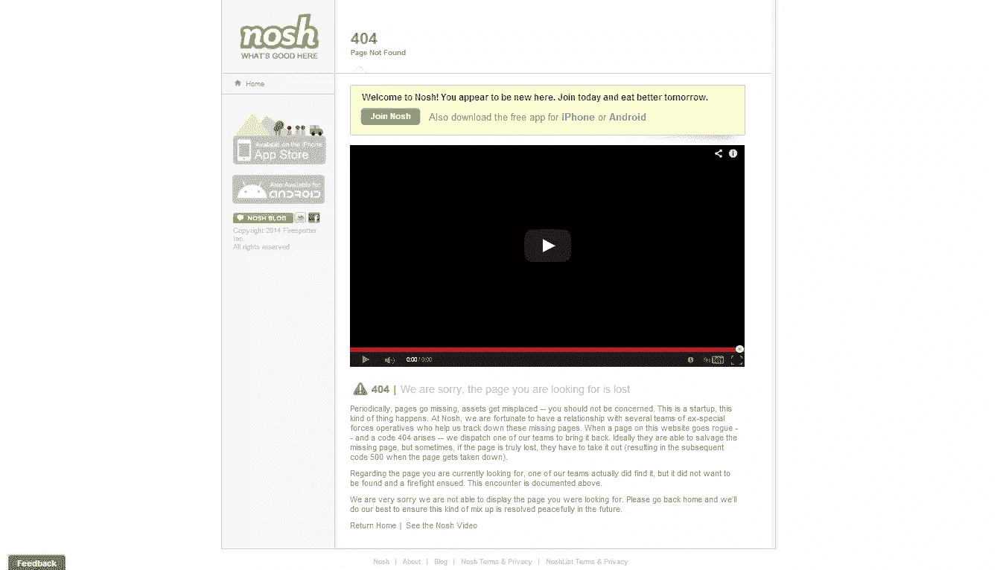](http://www.nosh.com/404)

### [YepLike](http://yeplike.com/error)

如果与其他一些设计相比，这无疑是一个令人惊叹的设计。

[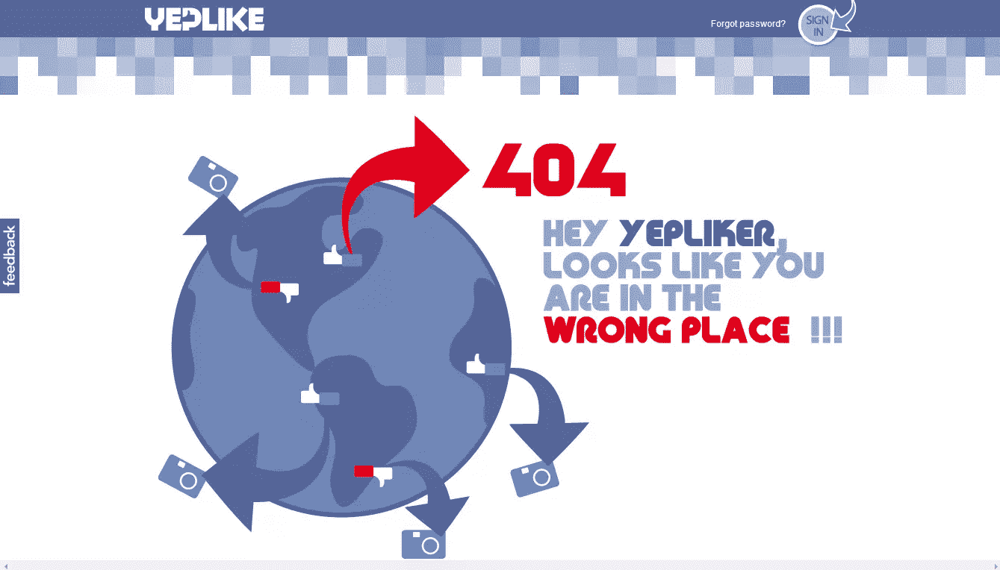](http://yeplike.com/error)

### [特伦特](http://trentwalton.com/404)

这个错误页面在信息方面并不好，但是他们表现随机图像的方式非常好。

[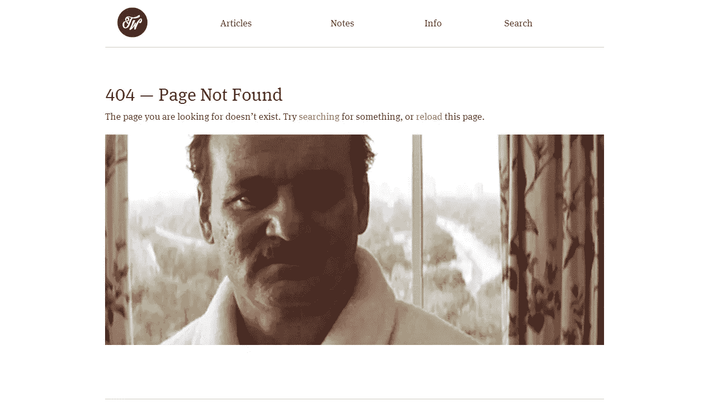](http://trentwalton.com/404)

### [漫威](http://marvel.com/news/story/404)

他们提供了一个高级搜索选项，这将有助于更深入地搜索您的查询。在一个地方还为访问者提供了一些重要的链接。

[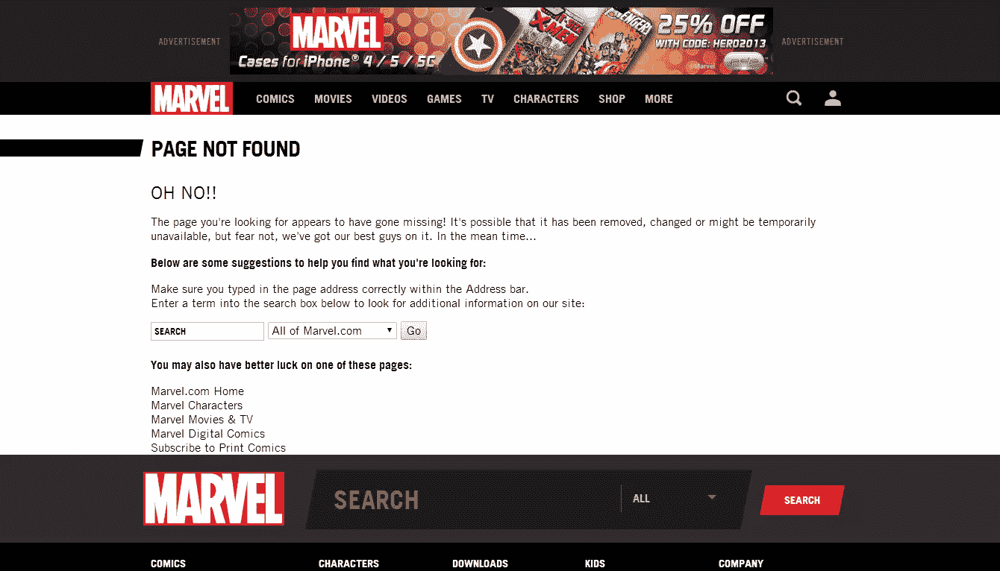](http://marvel.com/news/story/404)

### [Mozilla](http://www.mozilla.org/en-US/404)

Mozilla 错误页面为访问者提供了一些关于主页和 [bug 追踪器](https://bugzilla.mozilla.org/enter_bug.cgi?product=www.mozilla.org)链接的提示。

[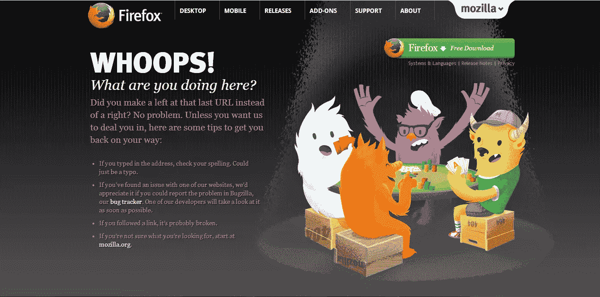](http://www.mozilla.org/en-US/404)

### technet

好的。事实是，在你点击 404 之前，网上的 404 页面并不能真正帮助你找到你想在网上找的东西。取而代之的是，他们向你展示了一个古代(1980 年代早期)文字冒险游戏《Zork》的现场版。试着朝北(“n”)爬上树，看看它的行动。

至少对我来说，这可能比我最初寻找的东西更有吸引力。

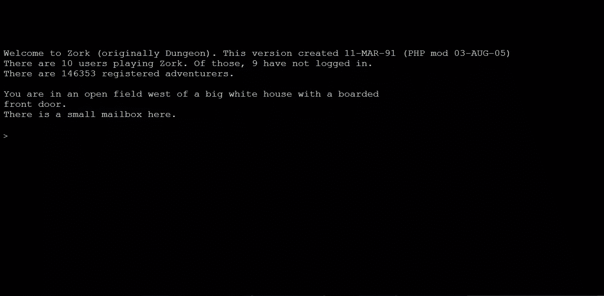

### 鲇鱼

Limpfish 的设计非常简单，内容中有一些幽默的空间，点击后会重定向到主页。但是，他们肯定错过了一些重要的社交媒体链接。

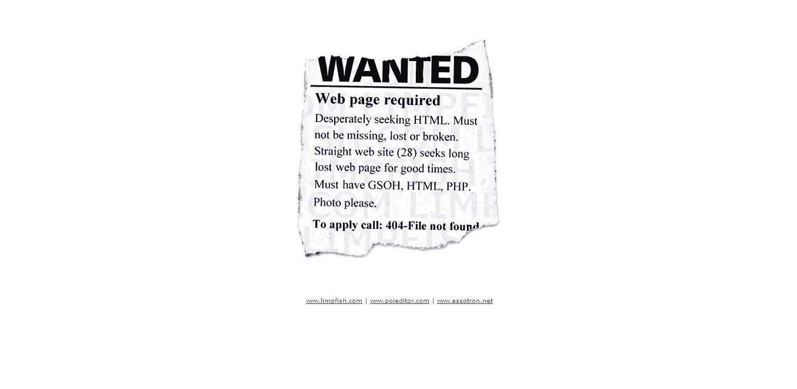

### [星巴克](http://www.starbucks.com/static/error/index.html)

他们的错误页面允许用户通过一些链接阅读信息——主页、网站地图和反馈页面。简洁的文字和基本的设计让页面看起来很不错。

[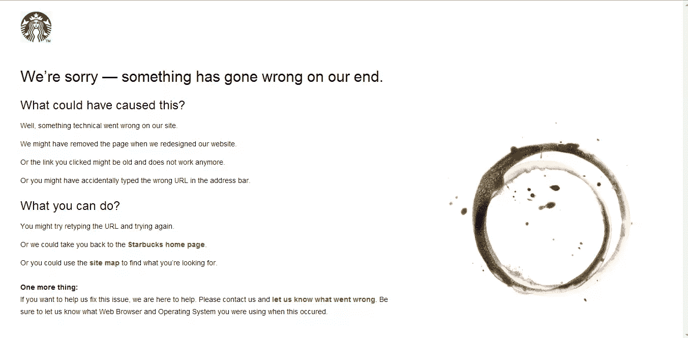](http://www.starbucks.com/static/error/index.html)

### 海因茨

亨氏通过在他们的 404 页面上提供受欢迎的产品和一些其他重要的链接来保持简单。他们也通过很好地放置他们产品的形象来设计它。

[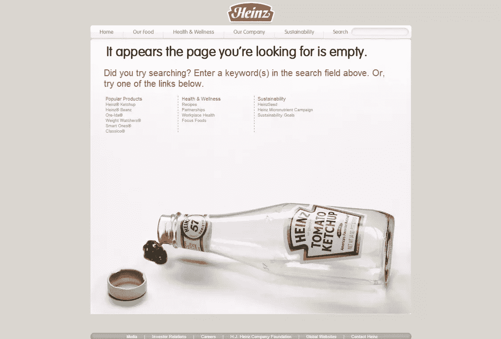](http://www.heinz.com/error.aspx)

### [灵感钻头](http://www.inspirationbit.com/404)

他们在 404 错误页面上显示了一些智慧，提供了流行的、推荐的、最喜欢的内容。访问者至少会点击这些链接中的任何一个，即使搜索查询与之前不同。你可能还会注意到，这些链接在每一页上都有社交媒体图标。

[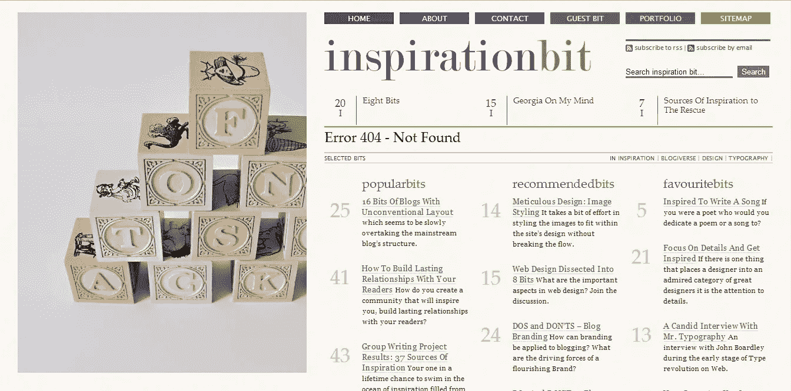](http://www.inspirationbit.com/404)

### [Realmac 软件](http://realmacsoftware.com/rapidweaver/404)

我敢打赌，你读到这一页就笑得停不下来了。他们还提供了官方 twitter、flickr 和 vimeo 账户的一些重要链接。

[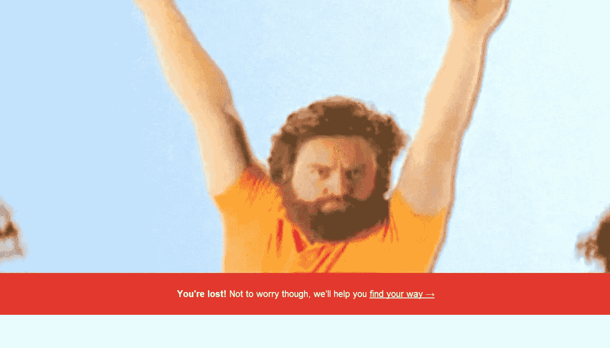](http://realmacsoftware.com/rapidweaver/404)

真正的 Mac 软件

### [本土明星选手](http://www.homestarrunner.com/random_garbag)

准备好聆听一些声音。这个 404 页面旨在展示网站想要传达的内容——简单的卡通设计和一些带有幽默的文字。

[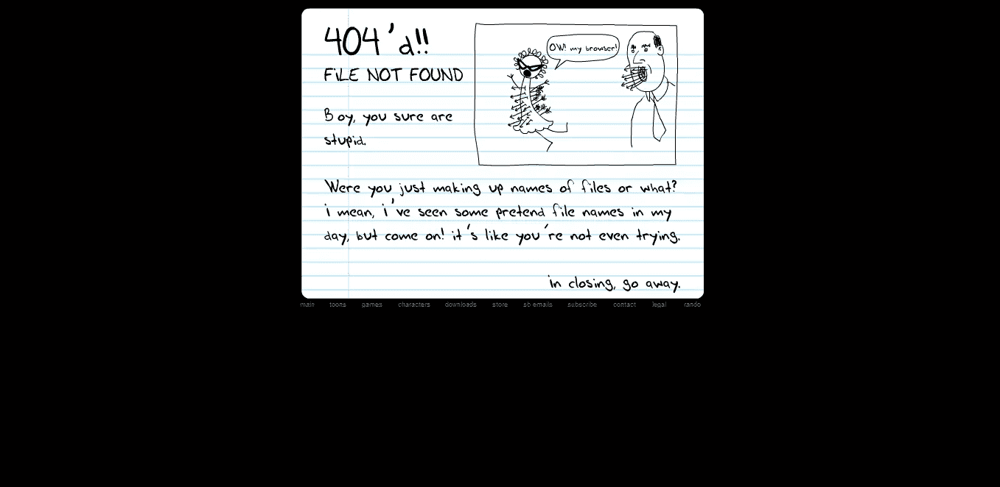](http://www.homestarrunner.com/random_garbag)

### [今晚学习](http://www.studytonight.com/404)

Studytonight 展示了一个吸引用户的好方法，那就是使用一个文字写得非常好的角色。还给出了一些主要环节。

[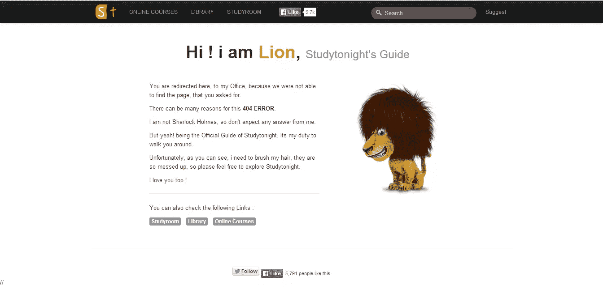](http://www.studytonight.com/404)

## 还有其他的吗？

我喜欢 *nickybrown* 、 *nosh* 和 *project-euh* 404 页面，你呢？

如果你看到了任何其他的设计或者为你自己的网站设计了一个你认为值得一提的设计，请在评论区提出来。

## 分享这篇文章