# 如何在 Adobe Illustrator 中优化和导出 SVG

> 原文：<https://www.sitepoint.com/crash-course-optimizing-and-exporting-svgs-in-adobe-illustrator/>

当您开始使用 SVG 时，了解如何为呈现 SVG 文件的浏览器创建、导出和优化 SVG 文件是非常重要的。

但是，在我们开始之前，你需要明白一件事。SVG 文件的优化从创建开始，一直持续到导出。像任何 HTML 网页一样，在完成一个糟糕的 SVG 文件后，很难修复它。

当然，您可以在导出后使用优化工具，但这种自动化方法可能会以各种意想不到的方式破坏您的文件。拥有良好的手动 SVG 优化概念的扎实工作知识将从一开始就对您有好处。

这正是你今天要学的。

## 在 Illustrator 中创建 SVG

当您在 Illustrator 中创建用于 SVG 导出的图形时，您需要执行一些必要的步骤和注意事项，以使最终输出正确地优化为 web。现在就让我们来探索一下。

### 设定正确的色彩空间

illustrator——与大多数矢量插图软件一样——最初是为印刷制作而设计的，因此其色彩空间默认设置为 CMYK。RGB 更适合网络和屏幕使用，并且比 CMYK 具有更宽的色域(颜色范围)。因此，当你创建新文档时，确保颜色模式设置为 RGB——如下图所示。

### 给你的画一个合适的结构

SVG 文件不同于常规的位图图像——像素网格。它是一个有特定结构的文本文档。

像 HTML 文档一样，您可以分别选择和操作单个元素。为此，你需要用他们的名字作为参考。我发现在 Illustrator 中进行可视化编辑时创建这些标签总是比以后容易得多。

因此，在制作图形元素时，为每个图形元素取一个有意义的名称是很重要的。以下是在 Illustrator 中创建图形时需要了解的内容:

*   Illustrator **图层**和**图层组**的名称被用作 SVG 组的 id

*   Illustrator **符号**名称用作 SVG 符号的 id

*   Illustrator **图形样式**名称被用作 CSS 类

在下图中，您可以看到 Illustrator 文件中的名称如何反映到导出的 SVG 中。

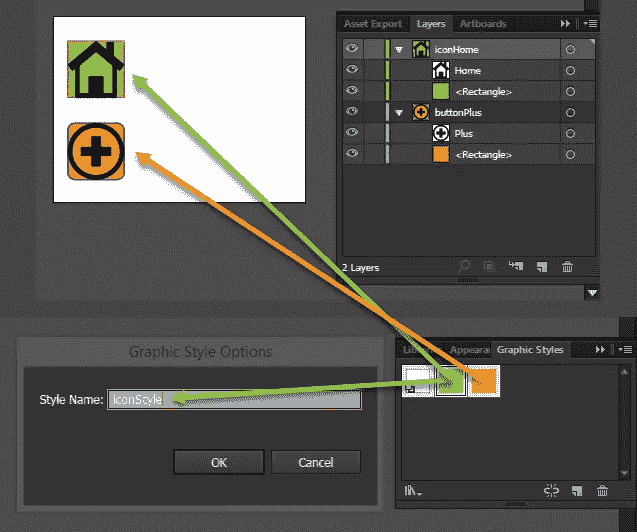

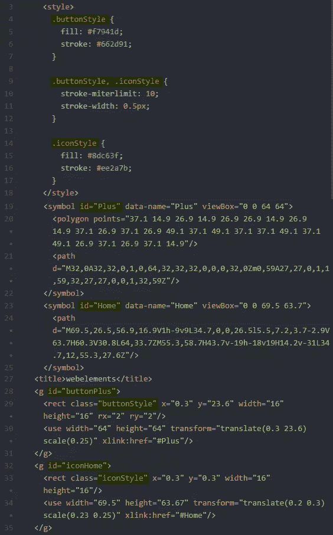

### 尽可能简化你的形状

SVG 图形中的形状用坐标点来描述。图形包含的点越多，文件就越大，编辑和维护就越困难。创建小而高效的文件让你以后的生活更轻松。

要解决这个问题，您需要使用尽可能少的点数来创建您需要的形状。这可以通过几种方式实现。

#### 尽可能使用主要 SVG 形状，而不是 SVG 路径

使用像`line`、`rect`和`circle`这样的简单元素有一些显著的优势。

首先，简单的形状对人类来说可读性更强——不言而喻，当我们在 SVG 代码中看到圆形时，它就是圆形，但是路径的代码可以是任何东西，直到我们看到它被渲染。

其次，简单的形状几乎总是产生较小的文件和较少的代码，这使得它们更容易维护和编辑。你也可以用它们的直接属性来控制它们，比如`x`、`y`、`cx`、`cy`，而不是像路径那样用点坐标。

为了理解我的意思，在下图中你可以看到一个简单的圆形，一次定义为 SVG 圆形元素，一次定义为 SVG 路径。虽然它们的渲染是一样的，但是很明显 SVG 的形状更小，功能更丰富。请注意，有些图形编辑器(例如 Fireworks 的 SVG 导出扩展)会在导出时自动将 SVG 形状转换为路径。显然，要努力避免这种情况。

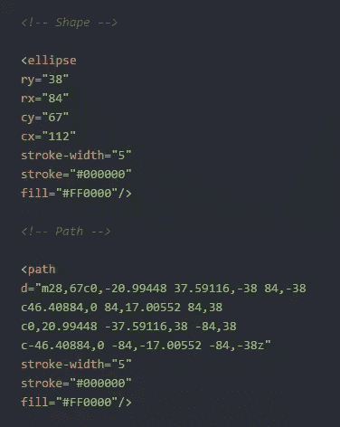

#### 简化您的路径

路径只不过是一组坐标点。简化路径意味着删除它的一些点，这将导致更少的路径数据和更小的文件大小。为此你可以使用 **`Object > Path > Simplify…`** 命令或 **`Warp Tool`** 。在这两种情况下，要点是最大限度地减少路径的点，而不损失视觉外观的质量。

在下面的图像中，您可以看到 Illustrator 的简化过程如何将路径点从 32 个减少到 23 个(约 25%)，以及这如何反映到代码中。减少了路径数据，同时视觉质量仍然保持在良好的水平。

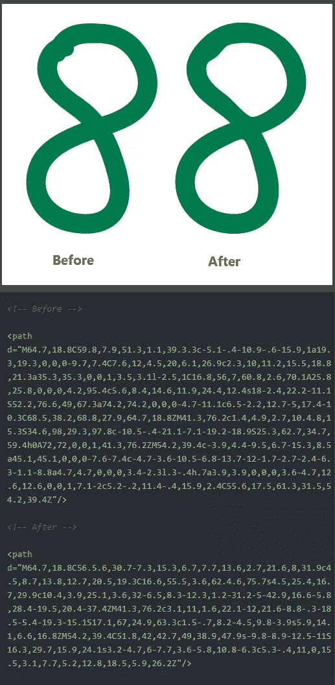

#### 决定是否将文本转换为路径

在 SVG 图形中，文本是一个独立的元素，因此可以搜索、访问和轻松地重新编辑。这是一个有价值的品质。然而，如果你想保证你的文本在任何地方看起来都和你设计的完全一样，你的最终用户需要有正确的字体。这意味着选择一种普通的字体——这会限制你的创造力——或者提供一种网络字体。

如果精确的文本渲染比可编辑性更重要，例如，在一个徽标中，您可以使用 **`Type > Create Outlines`** 命令或通过在“导出”面板中设置此选项将其转换为路径，稍后您将会看到。

请记住，将大量文本转换为路径，文件大小可能会大幅增加*——因此在转换之前请仔细考虑。*

 *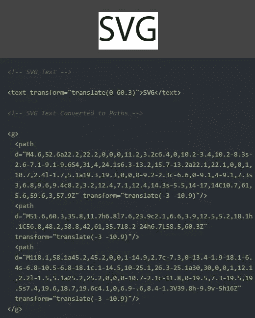

#### 优先使用“SVG 滤镜”而不是 Illustrator 或 Photoshop 滤镜效果

Illustrator 提供了一组在浏览器中实时应用的 **SVG 滤镜**(**`Effect > SVG Filters`**)。虽然 **Illustrator 或 Photoshop Effects** 总是永久地“烘焙”到嵌入在 SVG 中的光栅图像中，但 SVG 滤镜可以随时通过几次击键来更改或删除。

您也可以创建可重复使用的过滤器和/或通过**应用 SVG 过滤器**对话框编辑它们。

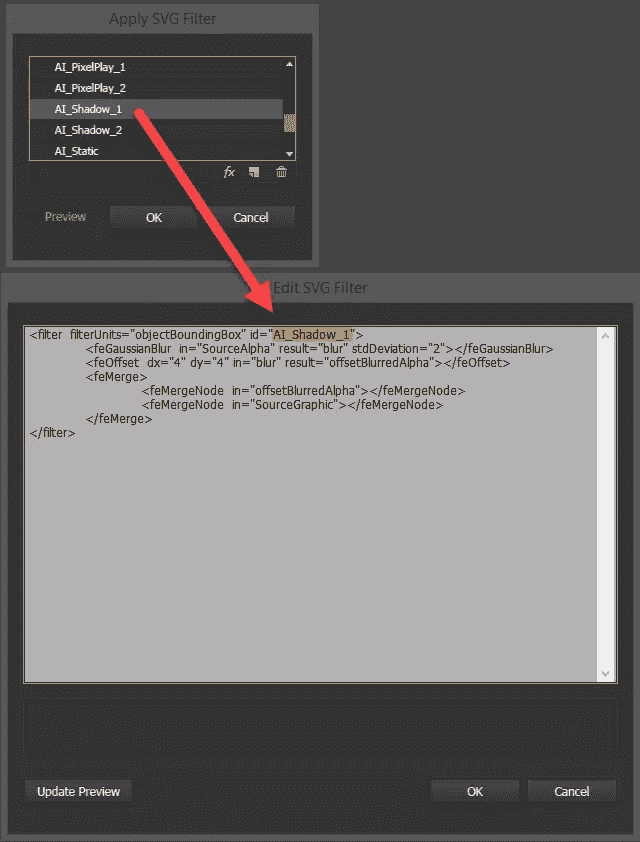

#### 使画板适合绘图

如果您希望 SVG 以可预测的方式显示，最好总是在绘图之前修剪画板。画板尺寸是导出的 SVG 视口的尺寸，画板中的任何空白都将作为视口内的空白生成。

根据情况你可以使用 **`Object > Artboards > Fit to Artwork Bounds`** 或 **`Object > Artboards > Fit to Selected Art`** 命令。

在下面的图片中，左边的星星将被导出并带有周围的空白，而右边的星星将被导出并带有适当的尺寸。

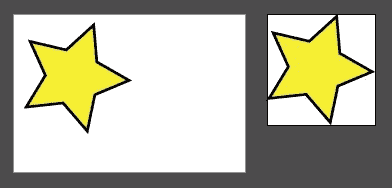

## 在 Illustrator 中导出 SVG

从 2015.2 版开始，Illustrator CC 附带了一个为 web 优化的 SVG 文件创建的新导出面板。在本节中，我们将了解如何使用它。

注意:对于那些使用旧版 Illustrator 的人来说，这里有一个[合适的教程](http://creativedroplets.com/export-svg-for-the-web-with-illustrator-cc/)。

当您的图形准备好进行制作时，选择**文件>导出>导出为…** 命令，然后选择 SVG 作为文件类型的选项，并点击**导出**按钮。您应该会看到以下面板:

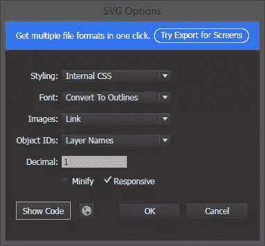

让我们更详细地研究一下这些选项。

#### 式样

有三种方式来设计您的 SVG，它们出现在第一个下拉列表中。

1.  第一种是使用内部 CSS(即`<style>`块)，这通常被认为是遵循[关注点分离原则](https://en.wikipedia.org/wiki/Separation_of_concerns#HTML.2C_CSS.2C_JavaScript)的最佳选择。
2.  第二种方法是使用内联 CSS 样式(即`<circle style="fill:red; stroke-opacity:1" ...="">).</circle>`
3.  第三种方法是使用 SVG 表示属性<circle fill="red" stroke-opacity="1" ...="">。</circle>

在下图中，您可以看到这三个选项之间的区别。

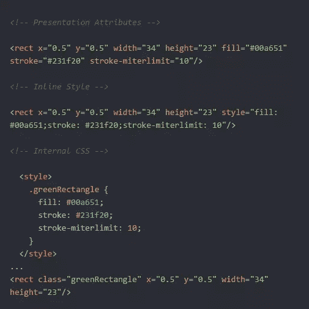

#### 字体

如果您想将文字转换成轮廓，您可以在这里指示 Illustrator 这样做。如果您想保持文本的可编辑性，那么选择 SVG 选项。轮廓文本使您可以完全直观地控制您的排版，但代价很大——文件尺寸过大，文本失去了可编辑性和可搜索性。

注意: [SVG 字体将从 SVG 2](https://github.com/w3c/svgwg/wiki/SVG-2-new-features#removed) 中移除，并且被认为是一个不推荐使用的特性，浏览器中的支持将被移除。

#### 形象

在这里，您可以选择如何处理 SVG 中的任何光栅图像。您可以选择将它们保存为外部文件，或者将它们作为[data uri](https://en.wikipedia.org/wiki/Data_URI_scheme)嵌入到 SVG 中。通常**链接**是一个有用的选择，因为它使父 SVG 文件显著变小，因此在代码编辑器中更易于管理。

然而， **Embed** 选项确实有一个巨大的、压倒一切的优势:嵌入的图像永远不会与它们的“父 SVG”分离。使用链接资源的 SVG 将在第一次下载、上传或移动没有“子图像”的 SVG 时显示缺失图像图标。

如果您需要 SVG 的可移植性，请记住这一点。

一般来说，如果你能在你的 SVG 中尽可能简单地 ***避免使用基于像素的图形，你就能避免未来的许多麻烦。***

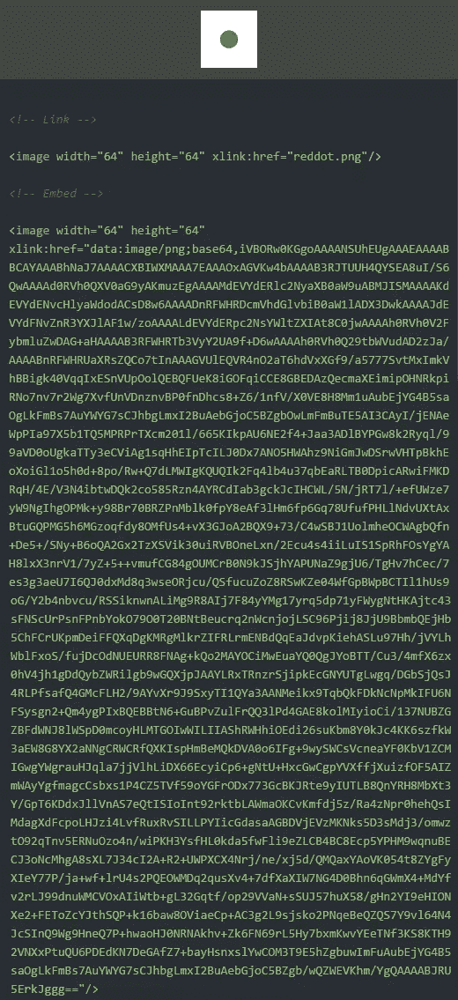

#### 对象 id

一般来说，最好的选择是选择**图层名称**，因为这将为您的单个 SVG 元素提供有意义的名称。**最小**使用随机字母数字，**唯一**使用大随机字符组合。

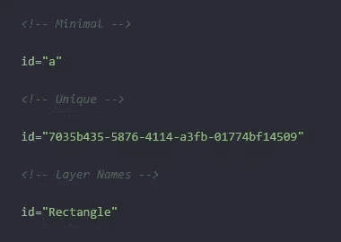

#### 小数

此选项定义了您的坐标将在小数点后填充多少个小数位。数字越大意味着路径越精确，而数字越小，产生的代码越少，文件越小。

从下图中可以看出，具有 5 个小数位的路径远远大于具有 1 个小数位的路径，但在视觉上是相同的。

请记住，我们在这里谈论的是像素的百分之一和千分之一。只有当您的图形非常小或需要惊人的精度时，才需要更高的值。在大多数情况下，坚持小数点后 1 位的值是最好的选择。

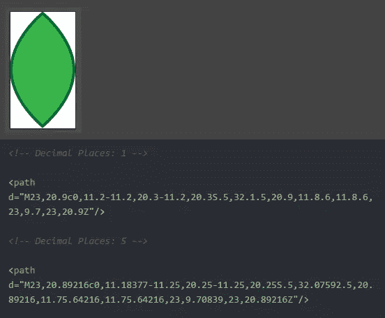

#### 使变小

仅当您要导出图形的最终版本用于制作，并且您确定该文件不会再被编辑时，才选中此选项。

#### 应答的

理论上，这个选项从 SVG 文档中删除了`width`和`height`属性——使它更具响应性。然而，在大多数情况下，这不足以让您的 SVG *真正对所有浏览器做出响应，尤其是对 IE。我们将在后续教程中探索解决这个问题的方法。*

**提示**:保持您的原始`.ai`文件作为您的源文件，然后从该父文件导出具有不同设置的 SVG 副本，这总是一个好主意。

当您选择 **`Export As…`** 命令时，在出现的导出对话框中您可能会注意到一个名为 **`Use Artboards`** 的附加选项。当您使用多个画板时(例如，当您创建一组图标时)，并且您希望将每个画板导出为一个单独的 SVG 文件时，它会变得非常有用。

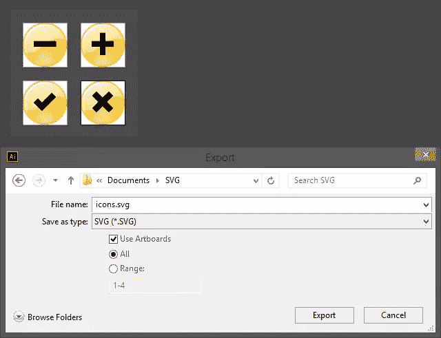

正如您在上面看到的，在 SVG 的创建和导出过程中会发生很多优化。然而，你可能想用一些专门的工具来进一步优化你的文件，比如 [SVGO](https://github.com/svg/svgo) 或者它的网络图形化版本 [SVGOMG](https://jakearchibald.github.io/svgomg/) 。

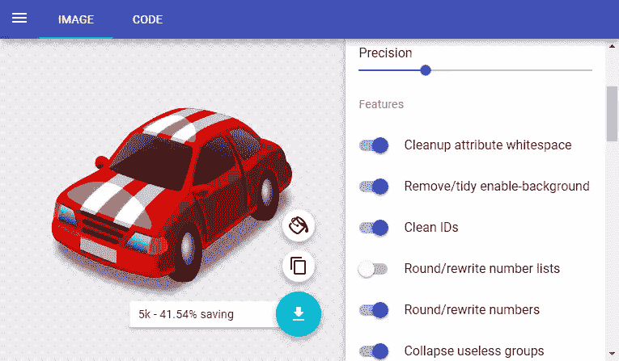

请注意，在使用这些工具时，您确实需要小心。它们很容易破坏文档的功能。我的建议是尽可能使用手动优化，只有在必要时才谨慎使用自动优化工具。

## 结论

我不认为我会冒险宣布 SVG 是 web 矢量图形的未来。很难看到 SVG 不会随着时间的推移继续获得更多的能力。如果你还没有开始学习，现在就开始学习将是一个很好且明智的投资。

我们有 [SVG 2](https://www.w3.org/TR/SVG2/) 出现在地平线上，有许多[强大的新功能](https://github.com/w3c/svgwg/wiki/SVG-2-new-features)可以和威尔一起玩。激动人心的时刻即将到来。

## 分享这篇文章*