# 使用 Photoshop CS6 创建丰富、详细的 3D 排版

> 原文：<https://www.sitepoint.com/create-3d-typography-with-photoshop-cs6/>

Photoshop 一直是创造前沿图像的绝佳工具。您可以将图像合并在一起，创建数码作品、哑光画、校正图像，或者从头开始创建任何类型的作品。在 Photoshop 的上一版本中集成了 3D 功能，但在 Photoshop CS6 中，3D 菜单已经被彻底改造了。创建像 3D 排版这样的东西甚至更容易，而且你比以前有更多的控制权。

要开始构建 3D 排版，请选择笔画宽度相当大的字样。通常，无衬线字体效果最好，如果有加粗字体，那就更好了。我选择了 DINPro，并键入单词“Create”。为 3D 目的创建文本时，颜色最好是大约 50%的灰色，而不是黑色或白色，因为中性色更容易创建光和阴影。如果你用黑色创建它，那么 3D 版本也将是黑色的，使得阴影和高光更难看到和控制。

[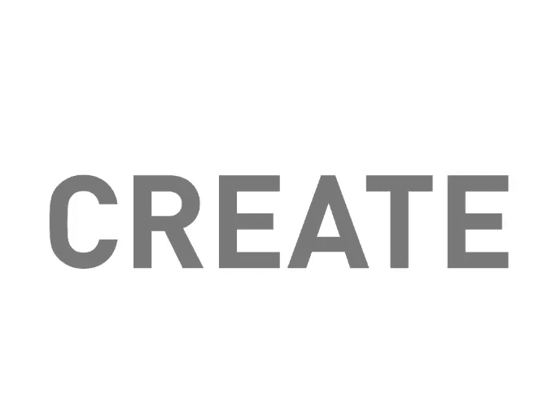](https://www.sitepoint.com/wp-content/uploads/2012/07/Screen-shot-2012-07-16-at-8.47.29-PM.png)

要将平面层转换为 3D 层，只需进入“3D”>“从所选层新建 3D 挤出”下面是您首次进入 3D 模式时默认视图的截图。左上角的窗口让您可以鸟瞰 3D 文本。

[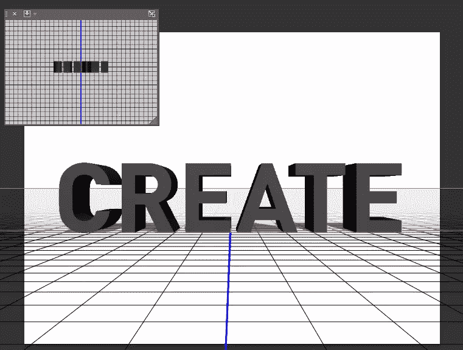](https://www.sitepoint.com/wp-content/uploads/2012/07/Screen-shot-2012-07-16-at-9.18.39-PM.png)

默认工具允许您在 3D 工作空间内平移文本。这样可以让你调整整体设计的角度。如果您按住 Option/Alt 键，您将能够顺时针或逆时针旋转 3D 对象。你可以在下面的例子中看到，我旋转了文本，使其以一个小角度设置。

[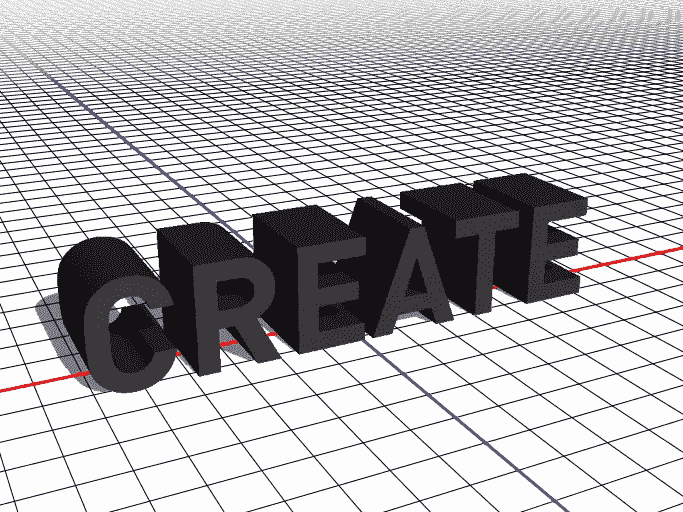](https://www.sitepoint.com/wp-content/uploads/2012/07/Screen-shot-2012-07-16-at-9.26.41-PM.png)

下面是一个 3D 面板的截图，在这里你可以插入所有的设置来创建你的 3D 文本。下面面板中的不同部分控制膨胀材质，膨胀材质是构成 3D 对象侧面的材质。如果您的对象上有倒角边，倒角材质就是构成倒角边的材质。在底部，你可以看到灯光和摄像机的位置。

[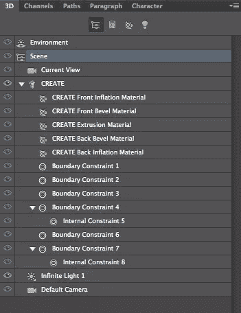](https://www.sitepoint.com/wp-content/uploads/2012/07/Screen-shot-2012-07-16-at-9.34.19-PM.png)

仍然参考上面的图像，面板顶部的四个图标将不同的部分分成几个部分。第一个图标显示所有场景元素，第二个图标显示所有斜面和挤出，第三个图标显示所有材质(如纹理)，第四个图标显示所有灯光。

如果您双击旁边带有“T”符号的创建层，一组选项和控件将出现在属性面板中。挤压深度滑块决定了 3D 形状的深度。请注意，您还可以在右下角的样本选项中改变文本的颜色。

[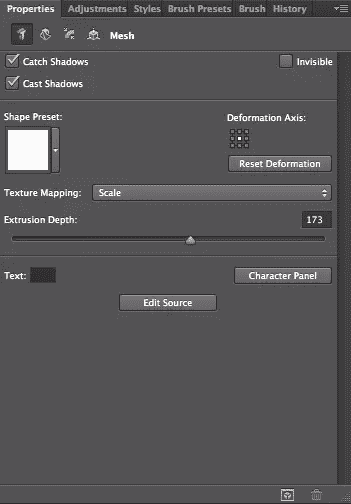](https://www.sitepoint.com/wp-content/uploads/2012/07/Screen-shot-2012-07-16-at-9.44.46-PM.png)

“形状预设”选项将允许您确定文本的整体形状。预设包括圆形正面、整体扭曲形状、凹面、卷曲 q 等等。

[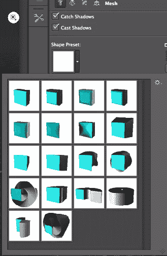](https://www.sitepoint.com/wp-content/uploads/2012/07/Screen-shot-2012-07-17-at-12.01.44-AM.png)

您可以控制文本在变形部分(第二个图标)中变细或弯曲的方式。您也可以在这里确定挤出深度，前两个选项——扭曲和锥化——正如它们所说的那样；他们扭曲你的文本，使其从前到后或从后到前逐渐变细。“弯曲”将文本垂直和水平向内折叠。“剪切”实际上会剪切挤出，或使挤出成角度。

[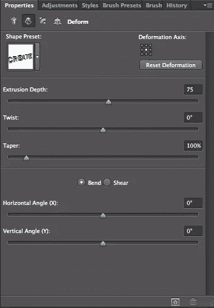](https://www.sitepoint.com/wp-content/uploads/2012/07/Screen-shot-2012-07-17-at-12.26.36-AM.png)

下面，我将弯曲选项的水平角度设置为 90°，给出了下面的例子。

[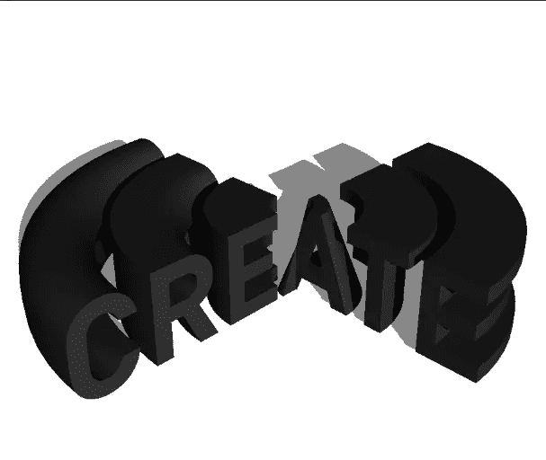](https://www.sitepoint.com/wp-content/uploads/2012/07/Screen-shot-2012-07-17-at-12.39.09-AM.png)

第三个选项是“Cap”，它将决定每个字母在正面和背面的封口方式。您可以在此处的斜面设置中添加复杂的细节层次。您可以控制斜面的轮廓、宽度以及斜面的强度或刚度。在这里，您可以为 3D 排版创建自定义斜面和圆角边缘。

[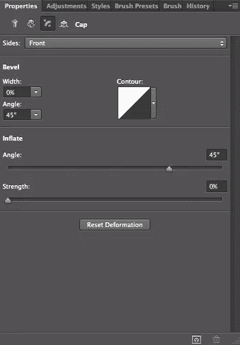](https://www.sitepoint.com/wp-content/uploads/2012/07/Screen-shot-2012-07-17-at-12.27.15-AM.png)

通过设置宽度为 50%,轮廓为圆锥，我能够快速地在外边缘创建一个明显的斜面。

[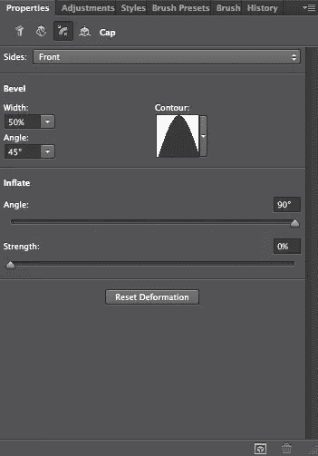](https://www.sitepoint.com/wp-content/uploads/2012/07/Screen-shot-2012-07-17-at-12.45.03-AM.png)

[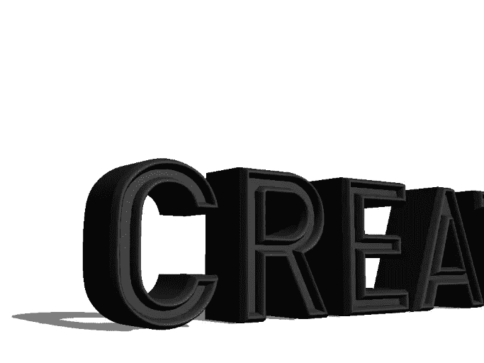](https://www.sitepoint.com/wp-content/uploads/2012/07/Screen-shot-2012-07-17-at-12.45.18-AM.png)

如果我们回到主面板，你会看到代表每一面材料的不同菜单。这会将每个部分分解成易于管理的小块，因此对象的每一面都可以有不同的材质。如果有的话，你甚至可以控制物体上构成斜面的材质。双击前斜面材质，在属性面板中；你将有几个选择。

[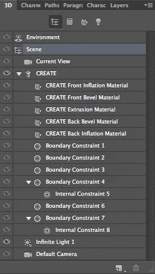](https://www.sitepoint.com/wp-content/uploads/2012/07/Screen-shot-2012-07-20-at-11.28.43-PM.png)

[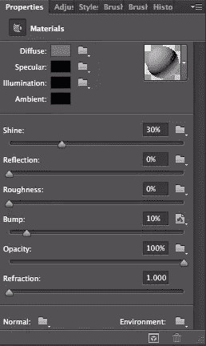](https://www.sitepoint.com/wp-content/uploads/2012/07/Screen-shot-2012-07-21-at-4.34.24-PM.png)

在上面的面板中，你可以看到所有不同的选项来创建你的纹理并控制它对周围环境的反应。前四个选项对 3D 文本的整体外观有重要影响。“漫反射”决定了所选曲面的整体颜色。镜面反射决定了对象上高光的颜色。照明决定了“照亮”对象的灯光。环境控制环境中的环境照明。

不同的滑块决定了曲面本身的物理属性。“光泽”赋予曲面光滑的外观，而“反射”控制当前选定曲面中反射的周围区域颜色的数量。粗糙度和凹凸赋予表面纹理和不均匀的外观，不透明度决定表面的透明(或不透明)程度，就像层或画笔的不透明度一样。折射决定了有多少光线被折射，例如您在玻璃物体中看到的折射。右上角的预览球提供了活动纹理的预览。在这里，您可以从许多预设中进行选择，也可以创建自己的预设。

单击漫射选项旁边的拾色器，然后选择橙金色。设置光泽和反射为 100%，粗糙度和凹凸为 0%，不透明度为 100%，折射设置为 2.0。

[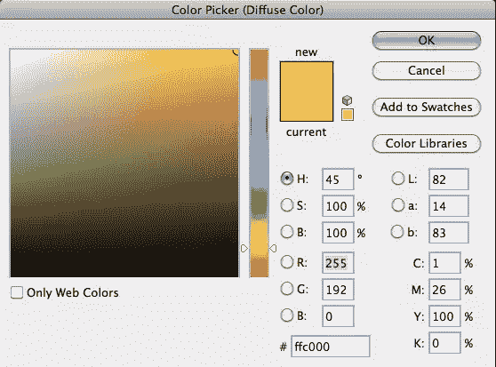](https://www.sitepoint.com/wp-content/uploads/2012/07/Screen-shot-2012-07-21-at-8.43.16-PM.png)

在 3D 面板中，双击“创建拉伸”材质，然后在“属性”面板中，将“漫反射”色样设置为天蓝色。保留其他的默认值，凹凸光泽，反射和折射，并将凹凸和粗糙度降低到 0。对于不透明度，将其设置为 30%左右，使其具有玻璃的外观。

[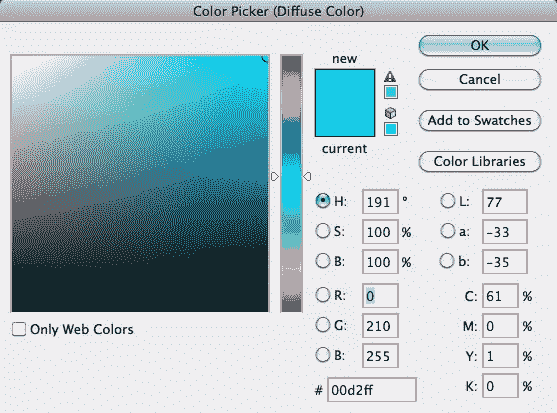](https://www.sitepoint.com/wp-content/uploads/2012/07/Screen-shot-2012-07-22-at-12.35.27-AM.png)

[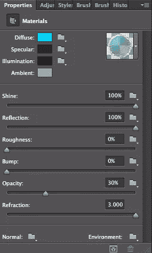](https://www.sitepoint.com/wp-content/uploads/2012/07/Screen-shot-2012-07-22-at-12.35.53-AM.png)

[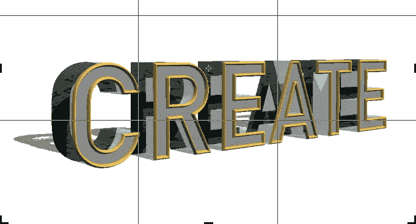](https://www.sitepoint.com/wp-content/uploads/2012/07/Screen-shot-2012-07-22-at-12.59.41-AM.png)

对前充气材料和后充气材料使用相同的设置。这将给出玻璃的外观，在前沿有一个金色的斜面。如果您想创建或使用不同的颜色，请随意。

[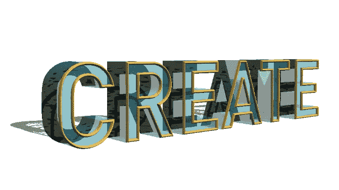](https://www.sitepoint.com/wp-content/uploads/2012/07/Screen-shot-2012-07-22-at-1.11.05-AM.png)

双击 3D 面板底部名为“无限光”的菜单项。在属性面板中，会出现不同的选项，您可以在其中选择不同的照明选项，例如彩色灯光，并且您可以将光源从无限光更改为光点(类似于激光)，或者您可以将其更改为聚光灯。您可以在画布上单击并拖动鼠标来旋转和定位光源。

[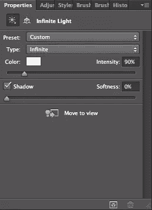](https://www.sitepoint.com/wp-content/uploads/2012/07/Screen-shot-2012-07-22-at-1.22.49-AM.png)

[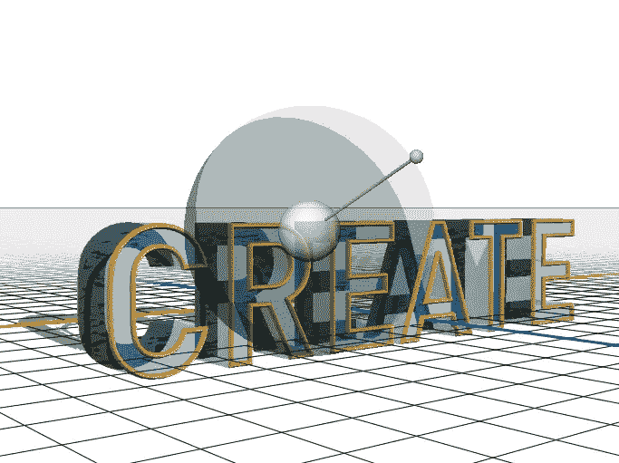](https://www.sitepoint.com/wp-content/uploads/2012/07/Screen-shot-2012-07-22-at-1.20.25-AM.png)

“属性”面板中左下方的图标用于渲染 3D 场景。单击此图标可查看 3D 设置的全部效果。这可能需要一些时间来完全渲染，但很高兴看到它的所有细节。下面是我们的 3D 文本完全渲染后的样子。注意玻璃和细节层次，还有反射和阴影。

[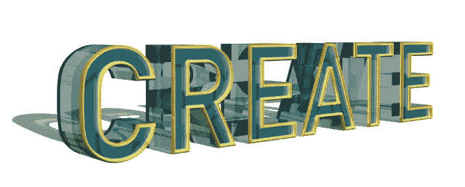](https://www.sitepoint.com/wp-content/uploads/2012/07/Screen-shot-2012-07-22-at-2.09.19-AM.png)

### 结论

Photoshop CS6 的 3D 界面进行了彻底的革新。使用新配置，可以比以往更快地创建、操纵和渲染具有复杂细节和控制级别的 3D 对象。界面更加用户友好和直观，因此您可以更专注于创建您的 3D 场景，而不是试图找到软件本身。

## 分享这篇文章