# 在 Photoshop 中创建品牌文字项链

> 原文：<https://www.sitepoint.com/create-a-branded-text-necklace-in-photoshop/>

我们都很清楚版式在网页设计中的重要性。它应该引人注目，独一无二，以帮助你的设计从众多网络竞争者中脱颖而出。有无穷的可能性；你所需要的只是你的想象力和合适的工具来帮助你把它变成现实。毫无疑问，Photoshop 在这方面是一个很棒的工具。它有巨大的潜力，但我们需要不断打磨我们的 Photoshop 技能。

所以，今天我将向你展示如何在 Photoshop 中创建一个品牌文字项链效果。我们将学习如何使用和操作各种图层样式技术，以及不同的过滤器和工具，以达到预期的效果。希望你能在途中学到一些有用的技巧。开始设计吧！

**最终结果:**

### 第一步

在 Photoshop 中创建一个宽度为 1000 像素、高度为 700 像素的新文档。

[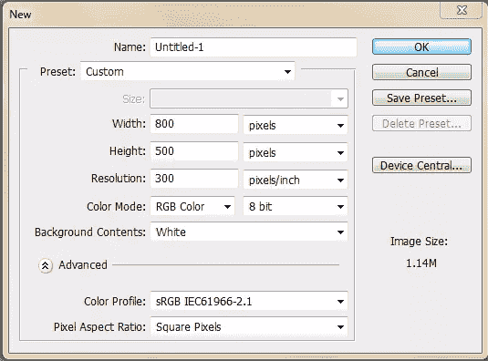](https://www.sitepoint.com/wp-content/uploads/2012/10/1.jpg)

### 第二步

使用油漆桶工具给背景填充颜色#313131。

### 第三步

设置#46d400 为前景色，选择文字工具在新图层上输入文字。我们将在这里使用“包豪斯 93”字体。

### 第四步

通过“图层”>“复制图层”来复制文本图层现在双击原始文本层打开图层样式窗口。对其应用以下设置。

[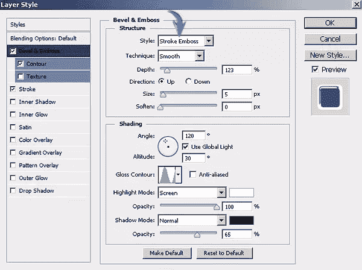](https://www.sitepoint.com/wp-content/uploads/2012/10/4.jpg)

[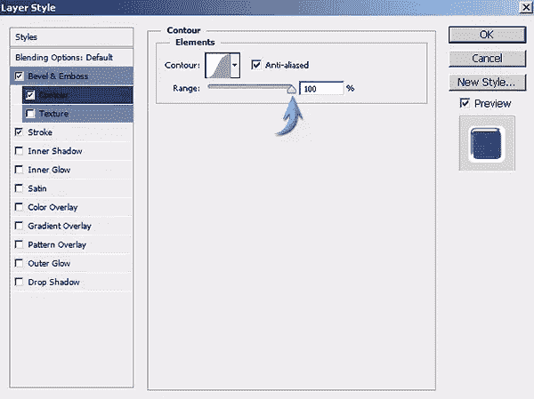](https://www.sitepoint.com/wp-content/uploads/2012/10/4b.jpg)

[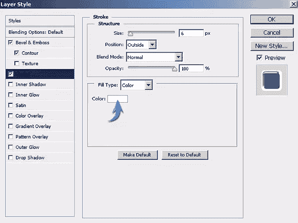](https://www.sitepoint.com/wp-content/uploads/2012/10/4c.jpg)

[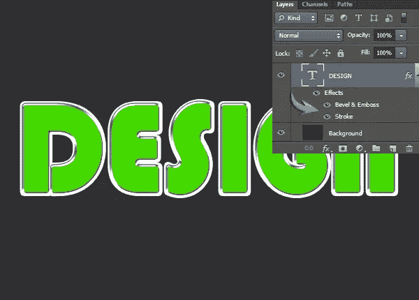](https://www.sitepoint.com/wp-content/uploads/2012/10/4d.jpg)

### 第五步

现在，双击复制的文字层，并应用以下图层样式设置。

[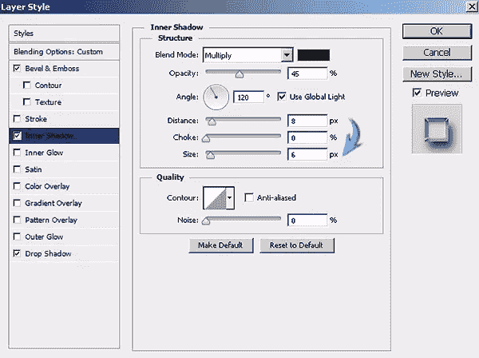](https://www.sitepoint.com/wp-content/uploads/2012/10/5b.jpg)

[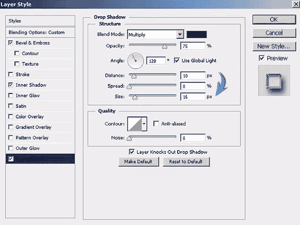](https://www.sitepoint.com/wp-content/uploads/2012/10/5c.jpg)

### 第六步

接下来，按 Ctrl + <click on="" any="" of="" the="" text="" layers="">在文本周围进行选择。现在创建一个新层，然后选择“选择”>“修改”>“合同”将所选内容缩小 10 像素。</click>

设置#81a601 为前景色，使用油漆桶工具填充选区。将该层标记为文本内部。

### 第七步

在内部文字图层上应用以下图层样式设置。

[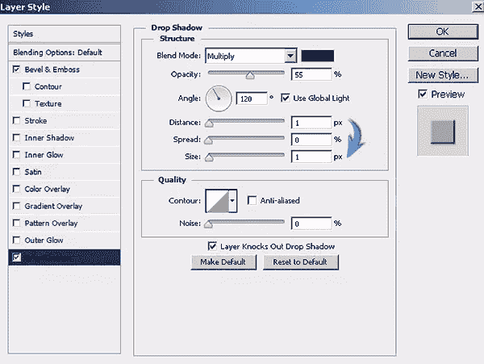](https://www.sitepoint.com/wp-content/uploads/2012/10/7b.jpg)

### 第八步

接下来，我们将在文本上创建高光。设置纯白为前景色，使用椭圆工具或钢笔工具(工具模式:形状)制作如下图所示的形状。改变这一层的混合模式为“叠加”，并减少其不透明度为 75%。

[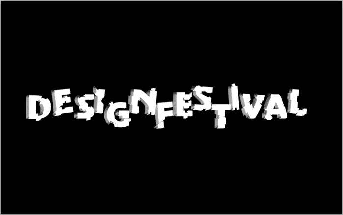](https://www.sitepoint.com/wp-content/uploads/2012/10/8.jpg)

为了将高亮显示限定在字母“D”上，点击椭圆层，然后按 Ctrl + <click on="" the="" text="" layer="">在它周围进行选择。之后，点击图层面板底部的“添加图层蒙版”图标。</click>

[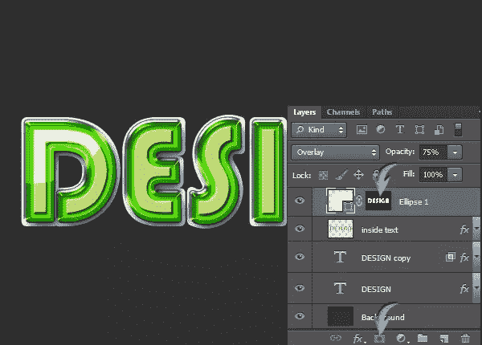](https://www.sitepoint.com/wp-content/uploads/2012/10/8b.jpg)

### 第九步

用同样的方法突出其余的字母。

### 第十步

接下来，我们将创建链，给人一种我们的文本受它们支持的视觉印象。选择钢笔工具(工具模式:形状)以纯白色绘制如下所示的形状。

复制这一层，进入“编辑”>“变换”>“水平翻转”如下图排列。之后，选择两层，右键点击这些层，从菜单中选择“合并形状”。

继续复制和合并这些形状，直到你得到如下所示的两条链。

### 步骤 11

双击链合并层，并应用以下图层样式设置。

### 步骤 12

复制链条层，如下图所示向右侧拖动，使用颜色叠加将它们变成黑色。

### 第十三步

现在进入“滤镜”>“模糊”>“高斯模糊”使用以下值为链阴影添加模糊。

[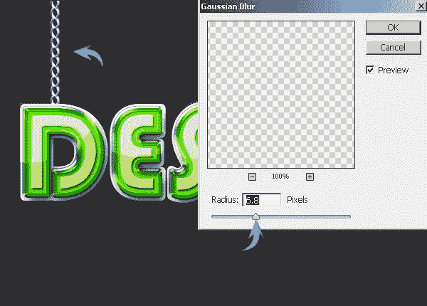](https://www.sitepoint.com/wp-content/uploads/2012/10/13.jpg)

减少这一层的不透明度为 55%。

### 步骤 14

接下来，要为文本本身形成阴影，复制文本层，并通过将它们拖向“删除层”图标来移除其效果，该图标位于“层”面板的底部。将这一层放在原始文本层的下面。一旦你完成了，使用颜色叠加使文字变成纯黑色，就像我们在第 12 步中对链条所做的那样。

[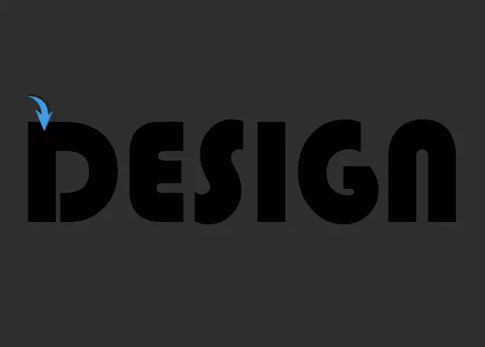](https://www.sitepoint.com/wp-content/uploads/2012/10/14.jpg)

### 第十五步

现在转到“滤镜”>“模糊”>“运动模糊”，应用下面的设置给阴影下面的样子。

[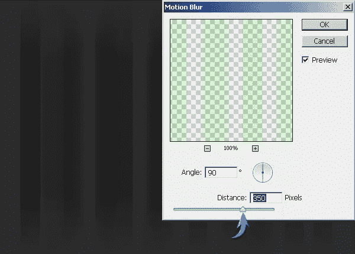](https://www.sitepoint.com/wp-content/uploads/2012/10/15.jpg)

### 第十六步

按 Ctrl+ "T "激活自由变换工具。现在，将阴影层 25⁰向右倾斜，如下图所示。

使用圆形橡皮擦工具清除文本上方的阴影。

### 步骤 17

要更好地混合阴影，进入“滤镜”>“模糊”>“高斯模糊”使用 4.5 像素的模糊半径。

[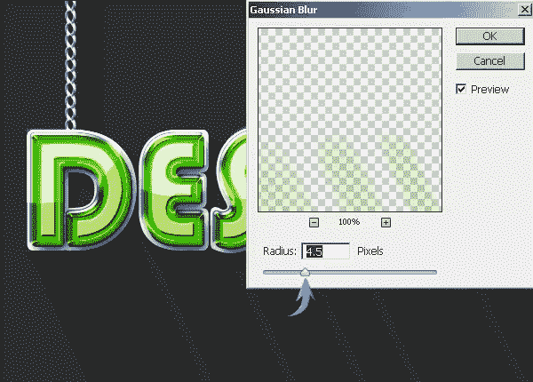](https://www.sitepoint.com/wp-content/uploads/2012/10/17.jpg)

### 步骤 18

接下来，我们将赋予背景一些纹理。为此，请设置默认的黑白颜色。在背景层上面新建一层，然后点击“滤镜”>“渲染”>“云”

[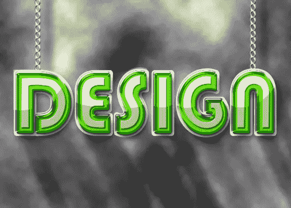](https://www.sitepoint.com/wp-content/uploads/2012/10/18.jpg)

### 步骤 19

现在，点击云层，进入“滤镜”>“噪波”>“添加噪波”在此使用以下设置。

[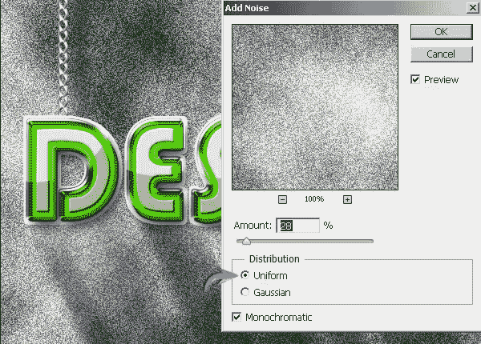](https://www.sitepoint.com/wp-content/uploads/2012/10/19.jpg)

将这个纹理图层的混合模式改为“叠加”，不透明度降低到 30%。

[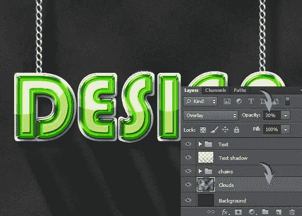](https://www.sitepoint.com/wp-content/uploads/2012/10/19b.jpg)

### 步骤 20

我们差不多完成了。然而，我们需要调整照明。光源应该在左上角附近。因此，选择渐变工具，从顶部属性栏中选择黑白径向渐变，并将其从画布的左上角拖到右下角，放在纹理层上方的新层上。

[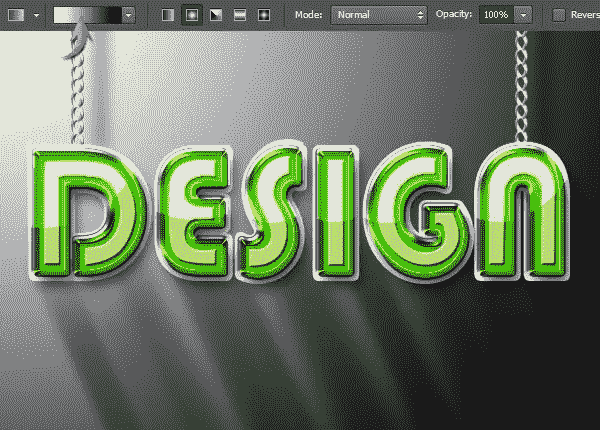](https://www.sitepoint.com/wp-content/uploads/2012/10/20.jpg)

将渐变图层的混合模式改为“柔光”，不透明度降低到 45%。

### 步骤 21

在渐变图层上新建一个图层，使用纯黑的圆形软笔刷工具绘制文字，如下图所示。

[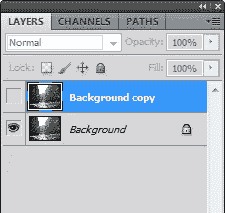](https://www.sitepoint.com/wp-content/uploads/2012/10/21.jpg)

将该层向右下方拖动一点。改变其混合模式为“乘”，减少不透明度为 40%。

就是这样。我们的文字效果都做好了。我希望你们喜欢它。请分享你的想法！

## 分享这篇文章