# 设计一个干净、直观的天气应用程序用户界面

> 原文：<https://www.sitepoint.com/create-a-clean-intuitive-weather-app-user-interface/>

如果你正在设计一个移动应用程序界面，你会知道在漂亮的设计作品和可用性之间创造一个平衡有多难。每当你在一个应用程序的用户界面上工作时，你设计工作的交互方面会给你留下许多不同的目标来处理。有才华的界面设计师必须做的不仅仅是让他们的作品漂亮；他们的界面必须是直观的和功能性的。

所以，今天我们要在 Photoshop 中创建一个干净直观的天气应用 UI。我们将平衡美学和功能，我们将使用一些有趣的模式和混合选项来实现我们的两个目标。

**资源:**

[图标](http://www.smashingmagazine.com/2011/12/29/freebie-free-vector-web-icons-91-icons/)

模式

现在，让我们来看看我们的最终结果:([下载完成，分层 PSD 文件。](https://www.dropbox.com/s/qyehjbj2zsv2f9i/clean-weather-app-ui.zip))

[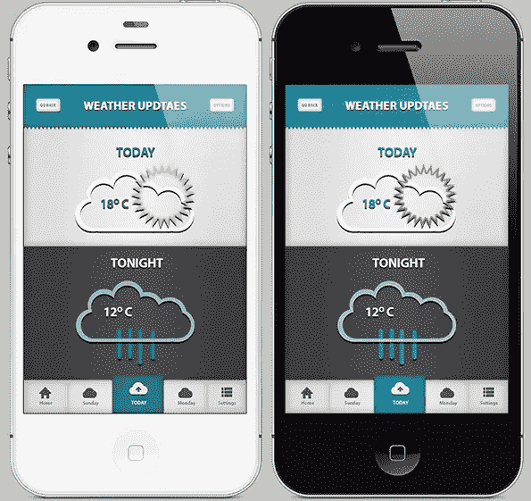](https://www.sitepoint.com/wp-content/uploads/2013/01/Final-result7.jpg)

### 第一步

打开 Photoshop，新建一个宽 665 像素、高 980 像素的文件。

[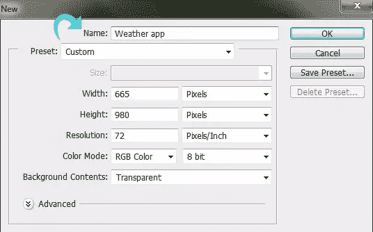](https://www.sitepoint.com/wp-content/uploads/2013/01/Step-19.jpg)

### 第二步

选择油漆桶工具，并用颜色# b4b4b4 填充背景。

[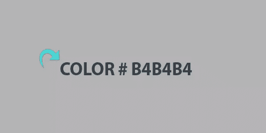](https://www.sitepoint.com/wp-content/uploads/2013/01/Step-22.jpg)

### 第三步

对于顶部区域，创建一个新层，点击矩形选框工具选择一个矩形区域。然后，用颜色#f5f5f5 填充。

[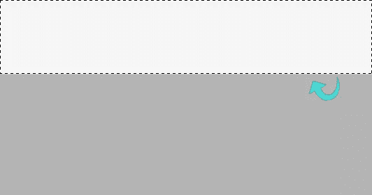](https://www.sitepoint.com/wp-content/uploads/2013/01/Step-32.jpg)

### 第四步

现在，点击“图层样式”,使用以下设置添加内阴影、颜色叠加、渐变和图案。

[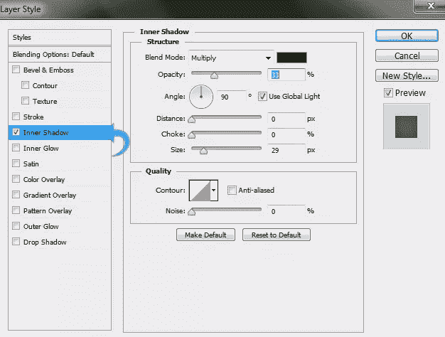](https://www.sitepoint.com/wp-content/uploads/2013/01/Step-4a.jpg)

[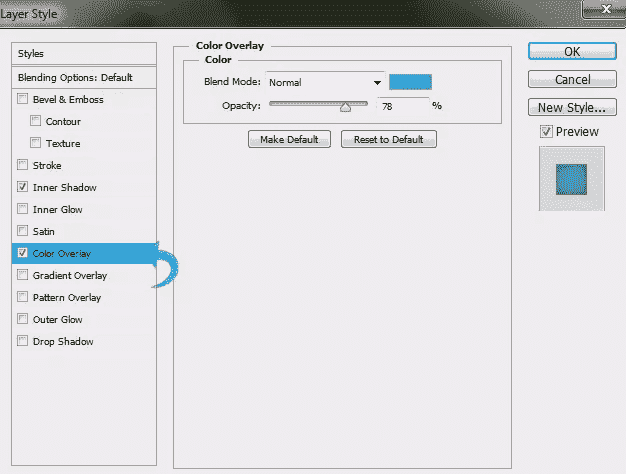](https://www.sitepoint.com/wp-content/uploads/2013/01/Step-4b.jpg)

[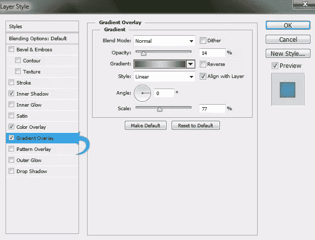](https://www.sitepoint.com/wp-content/uploads/2013/01/Step-4c.jpg)

[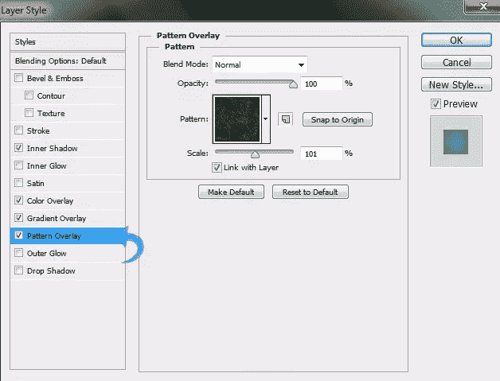](https://www.sitepoint.com/wp-content/uploads/2013/01/Step-4d.jpg)

现在，选择橡皮擦工具，在笔刷面板中调整笔刷大小和形状。然后，用它在长条上画出波纹图案。

[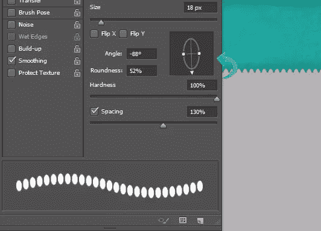](https://www.sitepoint.com/wp-content/uploads/2013/01/Step-4e.jpg)

### 第五步

选择文本工具并使用颜色#f0f1f1 添加标题。

### 第六步

选择标题层，点击“图层样式”添加渐变和阴影。使用以下设置。

[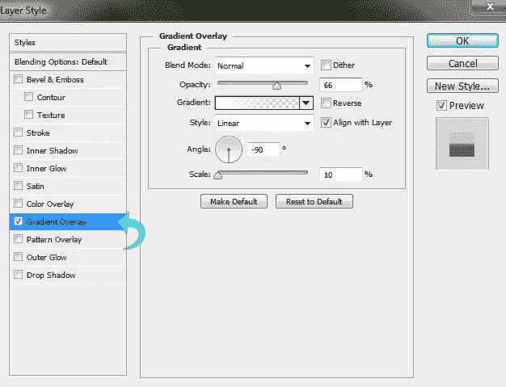](https://www.sitepoint.com/wp-content/uploads/2013/01/Step-6a.jpg)

[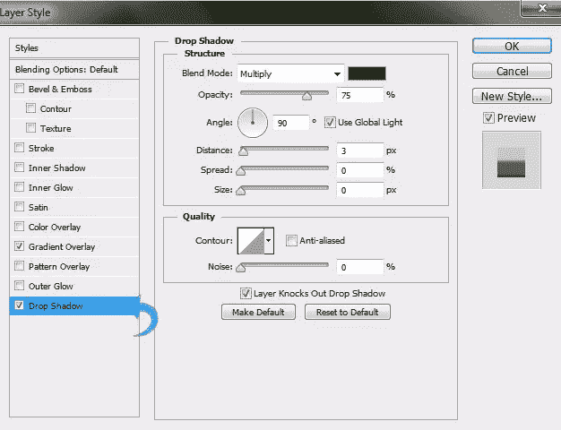](https://www.sitepoint.com/wp-content/uploads/2013/01/Step-6b.jpg)

### 第七步

选择圆角矩形工具，使用颜色#f3f3f3 创建一个小矩形。现在，点击“图层样式”添加内阴影和投影。使用下面的设置。

[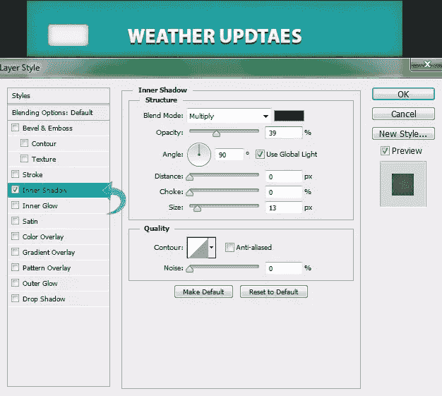](https://www.sitepoint.com/wp-content/uploads/2013/01/Step-7a1.jpg)

[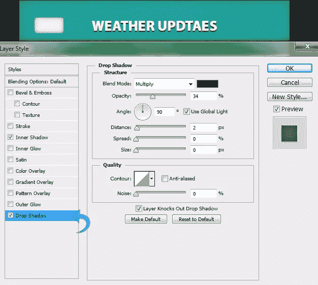](https://www.sitepoint.com/wp-content/uploads/2013/01/Step-7b1.jpg)

### 第八步

现在，添加文本到按钮，复制它，并在你的标题的另一边创建一个类似的按钮。

[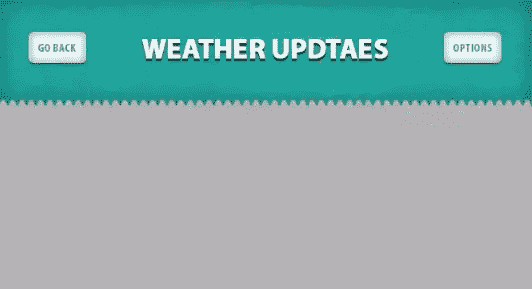](https://www.sitepoint.com/wp-content/uploads/2013/01/Step-82.jpg)

### 第九步

创建一个新层，并把它放在顶层。现在，使用颜色#f1f1f1 创建一个大矩形。

[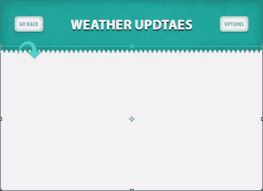](https://www.sitepoint.com/wp-content/uploads/2013/01/Step-92.jpg)

### 第十步

选择新建的图层，点击“图层样式”,使用以下设置添加内阴影、渐变和图案。

[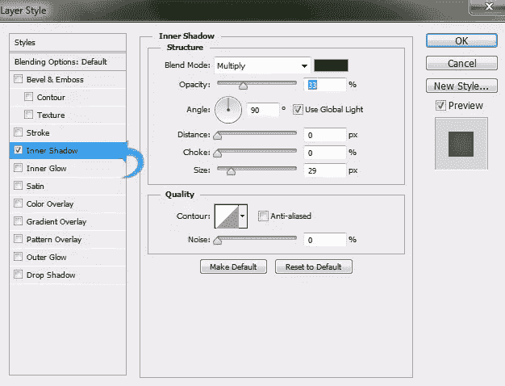](https://www.sitepoint.com/wp-content/uploads/2013/01/Step-10a.jpg)

[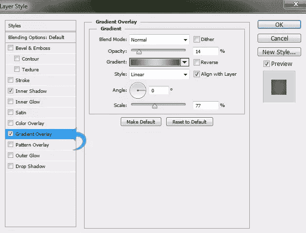](https://www.sitepoint.com/wp-content/uploads/2013/01/Step-10b.jpg)

[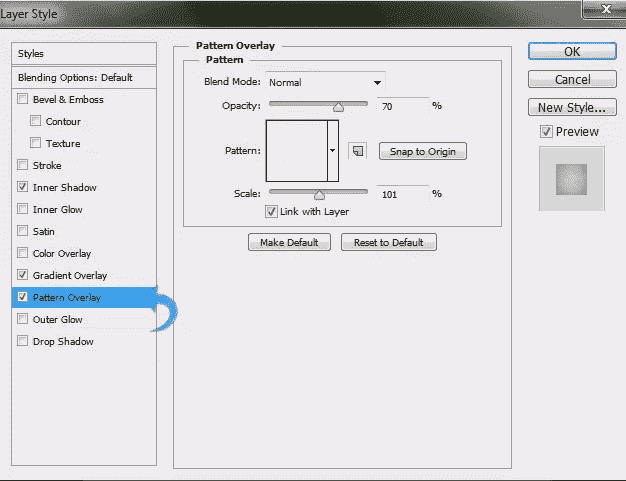](https://www.sitepoint.com/wp-content/uploads/2013/01/Step-10c.jpg)

### 步骤 11

重复同样的过程，用同样的样式创建另一个矩形，但是将填充颜色改为#545454。

### 步骤 12

选择钢笔工具使用#ffffff 颜色创建我们的云。然后，点击“图层样式”,使用下面的设置添加阴影。

[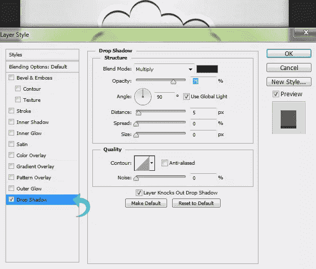](https://www.sitepoint.com/wp-content/uploads/2013/01/Step-122.jpg)

### 第十三步

选择多边形工具，设置边数为 25，创建太阳。现在，减少填充到 0%,并添加如下所示的笔画和阴影。

[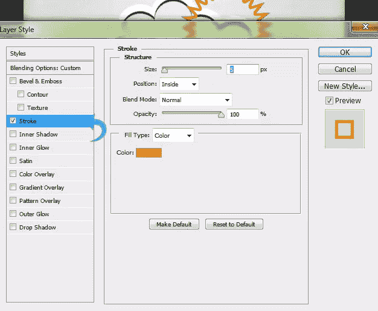](https://www.sitepoint.com/wp-content/uploads/2013/01/Step-13a.jpg)

[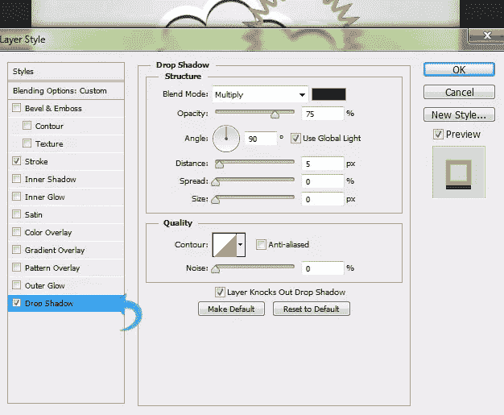](https://www.sitepoint.com/wp-content/uploads/2013/01/Step-13b.jpg)

### 步骤 14

现在，使用颜色#20a79e 添加文本，并添加一个微妙的阴影。

[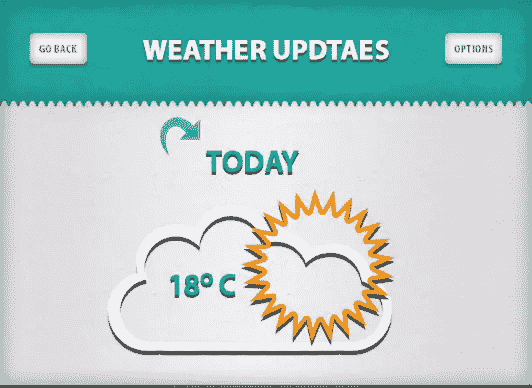](https://www.sitepoint.com/wp-content/uploads/2013/01/Step-142.jpg)

### 第十五步

现在，使用之前使用的相同技术创建第二个云。这次把云的颜色改成#94d2d4。创建一个新层，选择一个硬的圆形笔刷，使用颜色#1fa1a6 创建雨。

[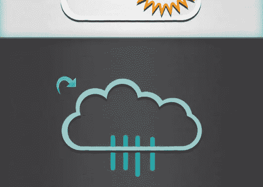](https://www.sitepoint.com/wp-content/uploads/2013/01/Step-152.jpg)

### 第十六步

点击“图层样式”,给雨添加一个阴影。使用下面的设置。

[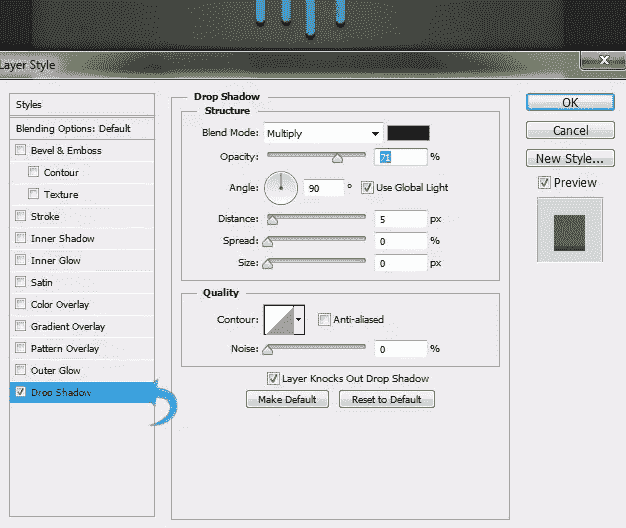](https://www.sitepoint.com/wp-content/uploads/2013/01/Step-161.jpg)

### 步骤 17

选择文本工具，使用与上面相同的方法添加文本。这一次，保持文本颜色#ffffff。

[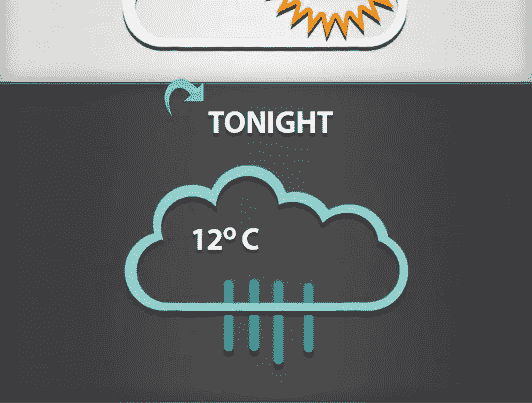](https://www.sitepoint.com/wp-content/uploads/2013/01/Step-172.jpg)

### 步骤 18

对于导航，使用颜色#f1f1f1 创建一个矩形，并添加内部阴影和渐变。

[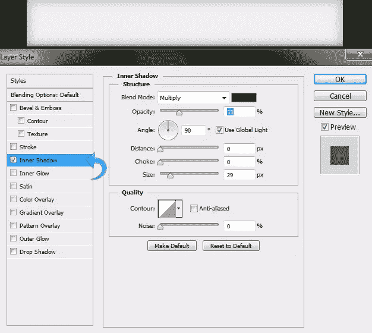](https://www.sitepoint.com/wp-content/uploads/2013/01/Step-18a.jpg)

[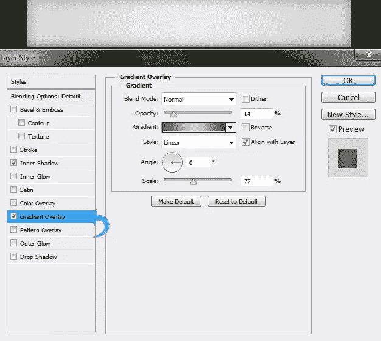](https://www.sitepoint.com/wp-content/uploads/2013/01/Step-18b.jpg)

### 步骤 19

对于主按钮，创建一个小矩形，简单地复制顶部背景的图层样式(右键单击图层，选择“复制图层样式”)，然后将图层样式粘贴到这个新的矩形上。

[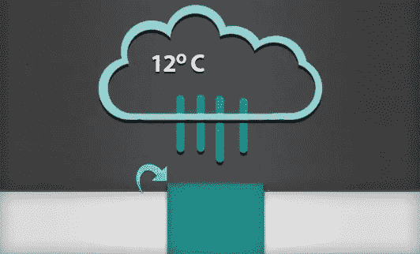](https://www.sitepoint.com/wp-content/uploads/2013/01/Step-191.jpg)

### 步骤 20

选择 1 像素的线条工具，使用#f1f1f1 颜色创建两个分隔线。然后，在分割线上添加一个微妙的阴影。

### 步骤 21

现在，给导航添加一些图标和文本，我们就完成了。

[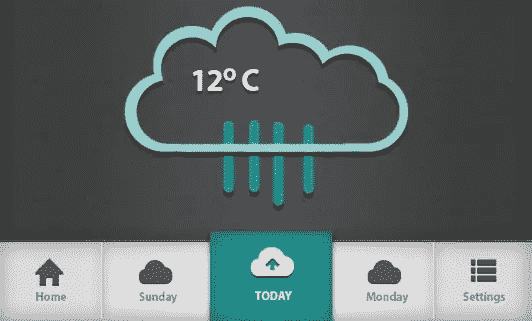](https://www.sitepoint.com/wp-content/uploads/2013/01/Step-211.jpg)

我们干净、直观的天气应用程序设计已经就绪。我希望你喜欢这个教程。你也可以通过学习必要的编程语言，将这种设计开发成功能齐全的应用程序。你可以在[BuildMobile.com](https://www.sitepoint.com)、[Learnable.com](https://learnable.com/)和[SitePoint.com](https://www.sitepoint.com/)找到很多有用的编程教程和课程。

我会带着一些更有趣的教程回来。在那之前，玩得开心！

## 分享这篇文章