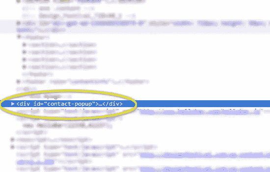

# 在几分钟内创建定制的打印样式表

> 原文：<https://www.sitepoint.com/create-a-customized-print-stylesheet-in-minutes/>

你以前见过这种情况:你设计了一个漂亮的布局，有人带着一份打印出来的文件走进你的办公室，你畏缩在你的努力工作被打印机可怕地歪曲的地方。

网页设计的印刷版本很少是你所期望的。他们需要一些额外的调整和一些阶段。但是，一旦掌握了窍门，就不难理解如何设置打印视图以使内容按预期输出。

在本文中，我将向您展示如何设置一个样式表来打印网站上的内容。我将使用一个 WordPress 站点作为起点，因为它是一个如此受欢迎的框架，但是只要你应用相同的原则，这将适用于任何站点。

> *快速提示:没有简单的方法可以让网页打印完美。你必须跳进去，研究你想要裁剪的每一个元素。我首先找到一页并打印出来，看看我从什么开始。然后，我根据我需要什么和需要改变什么来分解每个元素或结构部分。这需要时间，但是值得。*

### 需要印刷版吗？

在建立一个印刷版本的网站之前，我问自己的第一件事是我是否需要一个。我身上一丝不苟的设计师倾向于介入，在大多数情况下我倾向于“是”。但是，通常不需要打印样式表，这取决于网站的性质和目的。

另外，当人们从你的网站上打印一页时，他们的目标是什么？通常，他们只是想要你的内容，仅此而已——他们不想要所有的图形、漂亮的布局、标题、侧边栏等等。(而且，他们可能不想在不重要的元素上使用昂贵的墨水。)所以，考虑一下实际需要的是什么。

### 打印注意事项

我总是将我的文本转换成黑色，这样打印机就知道不需要阴影(这是一个很大的墨水节省)。我还将字体大小从像素转换为磅。如果你试图匹配字体大小，这可能有点困难，但这里有一个巧妙的图表，可以帮助你快速地从*像素*转换到*像素*，假设你有一个 16px 的基本字体大小:

*   像素= >点数
*   6px => 5pt
*   7px => 5pt
*   8px => 6pt
*   9px => 7pt
*   10px = > 8 磅
*   11px => 8pt
*   12px => 9pt
*   13px => 10pt
*   14px => 11pt
*   15px => 11pt
*   16px => 12pt
*   17px => 13pt
*   18px => 14pt
*   19px => 14pt
*   20px => 15pt
*   21px => 16pt
*   22px => 17pt
*   23px => 17pt
*   24px => 18pt

### 瞄准你的内容

WordPress 通常有一个类似这样的内置结构:

1.  页眉
2.  内容
3.  评论
4.  补充报道
5.  页脚

每个页面都有这些结构元素，你可以很容易地用 CSS 定位它们。即使您的站点没有这种精确的结构，关键是根据您的目的简单地定制您的打印样式表。

使用#header 来定位 CSS 中的每个结构。如果是一个类，则为 header。

最后，也可能是最重要的，我们将使用 *@media print* CSS 来定义某些 CSS 样式何时被正确应用。

例如，要从打印样式中删除所有内容，您可以在 style.css 中执行如下简单的操作:

[sourcecode language="css"]

@媒体印刷{

# header { display:none；}
#内容{显示:无；}
#评论{显示:无；}
#侧边栏{display:无；}
#页脚{显示:无；}

。站点描述{显示:无；}
。网站标题{显示:无；}

}

[/sourcecode]

这适用于 WordPress 的 Twenty 主题，给了我一个很好的、干净的空白开始。

如果您正在努力删除一个掉队的元素，最简单的方法是在浏览器中右键单击该元素，并在源文档中找到它。Chrome 有“检查元素”功能，可以直接跳转到该元素的代码，很容易找到有问题的元素。查找 id 或类定义，然后相应地定位它。

在这个例子中，我们可能有这个掉队者出现在我们的指纹中。在这里你可以看到 ID:

我们现在可以用下面的 CSS 来定位这个元素:

[sourcecode language="css"]

#联系人弹出窗口{ display:none；}

[/sourcecode]

### 分页符

假设您有多页要打印，打印机会将内容分成几页。你可以告诉浏览器在某些地方避免分页。你可以在[W3.org 页面](https://www.w3.org/TR/CSS21/page.html#page-breaks)阅读 CSS 中关于分页符的所有内容。简而言之，您的选择如下:

*   之前分页:always | avoid 始终/避免在项目前分页
*   后分页:always | avoid 始终/避免在项目后分页
*   page-break-inside:always | avoid-始终/避免在项目中间分页

请记住，分页符仅适用于块内容。一个常见的例子是列表，您可能希望创建列表块，然后防止在列表中间出现分页符。文本是个例外，你可以*将它定义为一个块，然后使用分页符来改变它的打印方式，但是通常文本应该是流动的，你可以让浏览器决定将它放在哪里。*

### 样本案例

现在我们有了一张白纸，让我们开始添加我们实际上想要在打印时显示的结构块。内容部分是一个显而易见的候选项，所以让我们将它添加回来，并将段落字体大小转换为磅值:

[sourcecode language="css"]

@ media print {
# content p {
} font-size:11pt；
颜色:黑色；
}

#content img {
显示:block
分页符后:避免；
分页符:避免；
}

#content ul，li {
显示:block
分页符内:避免；
}

# header { display:none；}
#评论{显示:无；}
#侧边栏{display:无；}
#页脚{显示:无；}

。站点描述{显示:无；}
。网站标题{显示:无；}

}

[/sourcecode]

我去掉了*显示:无；*内容 CSS 并将我们的段落文本从 14px 转换为 11pt。您可以浏览页面的每个元素，并使用这种方法定制每个元素以便打印。

### 包裹

从网络到印刷可能会令人沮丧，但是 *@media print* 媒体查询允许我们非常有针对性地了解哪些元素是如何印刷的以及它们是如何印刷的。

没有真正的捷径。如果你想让你的网站看起来更好，你可能需要在每个元素的层次上创建一个单独的 CSS 定义，直到它完美为止。

打印样式表是你标准设计过程的一部分，还是你认为它们是一个精心设计的网站的额外的、很好的补充？

## 分享这篇文章